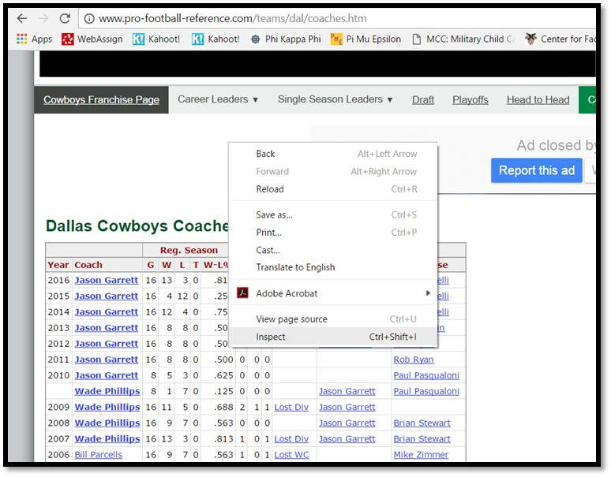

```{r setup, include=FALSE}
knitr::opts_chunk$set(echo = TRUE)
```


## Welcome {.build}

A Quote from the charter: <br><br>

"WG 33 supports methodologically sound work that will **advance the community's analytic capabilities** for the complex and uncertain operating environments faced today.""

## Today's Overview
 
Digital Data Collection Techniques  

* Traditional Collection
* Google Docs
* Data Scraping  
* Super Data Scraping  


## Acknowledgements {.build}

> 1. <a href="http://www.usma.edu/math/_layouts/wpFacultyBios/DisplayBio.aspx?ID=ebdd74e5-07fe-4bd0-b30d-ff96f904ce6e&List=1ebd54dc-d44d-4834-8add-2da90afb21f5"> COL Joe Lindquist </a>  <br>
  Academy Professor    <br>
  Mentor <br>
> 2. <a href="https://www.facebook.com/jill.finkbeinerturner"> Jill Turner </a>  
  Wife    <br>
  Biggest Fan   <br>


## 'Old School' Web Scraping

Lets look at some interesting <a href="http://www.pro-football-reference.com/teams/dal/coaches.htm">data</a>.


## 'Newer School' Web Scraping

<a href="https://docs.google.com/spreadsheets/d/1o_2wPqMA0tlPzDnHVHZebtz6B3c_iu9ledWE0aouwMY/edit?usp=sharing">Google Docs</a>


## Problem of Extention {.smaller}

* Dallas Cowboys
* NY Giants
* Philadelphia Eagles
* Washington Redskins


## Enter R Vest

* Hadley Wickham
* <a href="https://github.com/hadley?tab=repositories"> Github Repository</a>
* <a href="hadley.nz"> Professional Webpage </a>
* <a href="https://twitter.com/hadleywickham"> @hadleywickham </a>  


## R Vest How To

Install the package

```{r, eval=FALSE}
install.packages("rvest")
```

Call the package

```{r, eval=TRUE, warning=FALSE, include=TRUE, echo = TRUE, message=FALSE}
library(rvest)
```

## R Vest How To {.smaller}

R Vest Requires 3 Pieces of Information

1. URL
2. CSS or X Path Selector
3. Data Type

## R Vest How To {.smaller}

Using Our Dallas Cowboys Example

1. URL = "http://www.pro-football-reference.com/teams/dal/coaches.htm"
2. CSS or X Path Selector
3. Data Type

## R Vest How To {.smaller}

Using Our Dallas Cowboys Example

1. URL = http://www.pro-football-reference.com/teams/dal/coaches.htm
2. **CSS or X Path Selector**
3. Data Type

----



----


## R Vest How To {.build}
There's got to be an easier way...  

Enter Selector Gadget

<a href="https://chrome.google.com/webstore/detail/selectorgadget/mhjhnkcfbdhnjickkkdbjoemdmbfginb?hl=en"> Selector Gadget Chrome Download  </a>  

----


## R Vest How To {.smaller}

1. URL = "http://www.pro-football-reference.com/teams/dal/coaches.htm"
2. CSS or X Path Selector
3. **Data Type**    Table or Text

## R Vest How To{.smaller}

Call Library
```{r, warning = FALSE, echo=TRUE}
## library(rvest)
```
Input URL
```{r, warning = FALSE, echo=TRUE}
## step1 = read_html("URL IN QUOTES") 
```
CSS or X Path Selector
```{r, warning = FALSE, echo=TRUE}
## step2 = html_nodes(step1, xpath =, css = )
```
Scrape the Data
```{r, warning = FALSE, echo=TRUE}
## step3 = html_table(step2, header = TRUE)
```


## Dallas Cowboys Example: X Path

Input URL
```{r, warning = FALSE, echo=TRUE}
step1x = read_html("http://www.pro-football-reference.com/teams/dal/coaches.htm") 
```
X Path ID
```{r, warning = FALSE, echo=TRUE}
step2x = html_nodes(step1x, xpath='//*[(@id = "coaches")]')
```
Scrape the Data
```{r, warning = FALSE, echo=TRUE}
step3x = html_table(step2x, header = TRUE)
```

----

View the data
```{r, warning = FALSE, echo=TRUE}
head(step3x[[1]][1:6])
```


## Dallas Cowboys Example: CSS

Input URL
```{r, warning = FALSE, echo=TRUE}
step1css = read_html("http://www.pro-football-reference.com/teams/dal/coaches.htm") 
```
CSS
```{r, warning = FALSE, echo=TRUE}
step2css = html_nodes(step1css, css="#coaches")
```
Scrape the Data
```{r, warning = FALSE, echo=TRUE}
step3css = html_table(step2css, header = TRUE)
```

----

View the data
```{r, warning = FALSE, echo=TRUE}
head(step3css[[1]][1:6])
```

## Simplify: The Pipe Command {.smaller}
A Short Aside
```{r, warning = FALSE, echo=TRUE}
multiply = function(x,y) {
  answer = x * y
  return(answer)
}
multiply(3,4)
```
```{r, echo=TRUE}
3 %>% multiply(4)
```

## R Vest How To{.smaller}
```{r, warning = FALSE, echo=TRUE}
allonestep = "http://www.pro-football-reference.com/teams/dal/coaches.htm" %>% 
    read_html() %>%
    html_nodes(xpath='//*[(@id = "coaches")]') %>%
    html_table(header = TRUE)
```

View the data
```{r, warning = FALSE, echo=TRUE}
allonestep=allonestep[[1]]
colnames(allonestep)=allonestep[1,]
head(allonestep[,1:12])
```

## Other Examples: Stocks {.smaller}

<a href="http://www.nasdaq.com/symbol/p">   </a> 

----

```{r, echo=TRUE}
pandora = "http://www.nasdaq.com/symbol/p"

pstock = pandora %>%
  read_html() %>%
  html_nodes("#quotes_content_left_InfoQuotesResults td+ td") %>%
  html_text()
```

----

Downloading Stocks of Interest

```{r, echo=TRUE}
pstock
```

```{r, echo = TRUE}
pstock[5]
```
----

Or time stamp the data

```{r, echo=TRUE}
pstock=(as.data.frame(pstock))
cbind(pstock,Sys.time())[5,]
```

## Other Examples: NBA Basketball {.smaller}

<a href="http://www.basketball-reference.com/leaders/g_career_p.html">   </a> 

## Other Examples: NBA Basketball {.smaller}

```{r, echo=TRUE}
nbaurl = "http://www.basketball-reference.com/leaders/g_career_p.html"

leaders = nbaurl %>%
  read_html() %>%
  html_nodes("#tot") %>%
  html_table()
```

----

See the Results

```{r, eval=TRUE, echo=TRUE}
leaders=as.data.frame(leaders)
head(leaders,20)
```

## Other Examples: World Factbook {.smaller}

<a href="https://www.cia.gov/library/publications/the-world-factbook/geos/af.html">   </a> 

## Other Examples: World Factbook

```{r, echo=TRUE}
factbook <- "https://www.cia.gov/library/publications/the-world-factbook/geos/af.html"  

areaaf <- factbook %>%
  read_html() %>%
  html_nodes(".even:nth-child(6) .category_data:nth-child(14) , .even:nth-child(6) 
             #field:nth-child(13) a , #field+ div:nth-child(28) .category_data , 
             #field:nth-child(27) a , #field:nth-child(5)~ #field:nth-child(7) a , 
             .even:nth-child(4) div:nth-child(9) .category_data , 
             #field+ div:nth-child(8) .category_data , .countryName") %>%
html_text()
```

----

See the results

```{r}
areaaf
```

## Other Examples: University Info {.smaller}

<a href="https://www.princetonreview.com/schools/1023919/college/united-states-military-academy">   </a> 

---

```{r, echo=TRUE}
westpoint = "https://www.princetonreview.com/schools/1023919/college/united-states-military-academy"

wp = westpoint %>%
  read_html() %>%
  html_nodes("#admissions .col-sm-4 div") %>%
  html_text()
wp
```

---

```{r, echo=TRUE}
navy = "https://www.princetonreview.com/schools/1022813/college/united-states-naval-academy"

goats = navy %>%
  read_html() %>%
  html_nodes("#admissions .col-sm-4 div") %>%
  html_text()
goats
```

---

```{r, echo=TRUE}
airforce = "https://www.princetonreview.com/schools/1023678/college/united-states-air-force-academy"

zoomie = airforce %>%
  read_html() %>%
  html_nodes("#admissions .col-sm-4 div") %>%
  html_text()
zoomie
```

---

```{r, echo=TRUE}
aggregate = data.frame(School = c("Army", "Navy", "Air Force"), 
                       Applicants = c(wp[2],goats[2],zoomie[2]),
                       AcceptanceRate = c(wp[4],goats[4],zoomie[4]))
aggregate
```

## Super Scraping 

```{r, warning = FALSE, echo=TRUE}
teamurls = c(NA)
teamabvs = c("nwe", "mia", "buf", "nyj", "pit", "rav", "cin", "cle", "htx", "oti",
             "clt", "jax", "rai", "kan", "den", "sdg", "dal", "nyg", "was", "phi",
             "det", "min", "gnb", "chi", "tam", "atl", "car", "nor", "sea", "crd",
             "ram", "sfo")
for (i in 1:length(teamabvs)) {
  teamurls[i] = paste0(paste0("http://www.pro-football-reference.com/teams/",
                              teamabvs[i]),"/coaches.htm")
}
head(teamurls,10)
```

----

Call Library

```{r, warning = FALSE, echo=TRUE, message=FALSE}
library(dplyr)
```

Scrape data and build table

```{r, warning =FALSE, echo=TRUE, cache=TRUE}
coaches = data.frame(NA)
for (i in 1:length(teamurls)) {
  allonestep = teamurls[i] %>%
    read_html() %>%
    html_nodes(xpath='//*[(@id = "coaches")]') %>%
    html_table(header = FALSE)
  allonestep <- allonestep[[1]]
  allonestep = allonestep[-1,]
  coaches = bind_rows(coaches, allonestep)
}
```

----
```{r}
coaches
```


----

Data Cleaning
```{r, warning = FALSE, echo=TRUE}
coaches = coaches[-1,]
coaches = coaches[,-1]
coaches = coaches[,-(12:13)]
title = coaches[c(1),]
colnames(coaches) = title
coaches = coaches[-1,]
coaches$censor = ifelse(coaches$Year==2016,1,0)
colnames(coaches) = c("Year","Coach","Games","Wins","Losses","Ties","Record","PG",
                      "PW","PT","Result", "censor")
coaches$Year = as.numeric(coaches$Year)
coaches$Games = as.numeric(coaches$Games)
coaches$Wins = as.numeric(coaches$Wins)
coaches$Losses= as.numeric(coaches$Losses)
coaches$Ties= as.numeric(coaches$Ties)
coaches$Record= as.numeric(coaches$Record)
coaches$PG = as.numeric(coaches$PG)
coaches$PW = as.numeric(coaches$PW)
coaches$PT= as.numeric(coaches$PT)
coaches$censor= as.numeric(coaches$censor)
attach(coaches)
coaches2 = aggregate(cbind(Games, Wins, Losses, Ties, PG, PW, PT, censor) ~
                       Coach, coaches, sum)
yearcoached = count(coaches, vars = Coach)
yearcoached = as.data.frame(yearcoached)
colnames(yearcoached) = c("Coach", "n")
coaches2 = left_join(coaches2, yearcoached)
attach(coaches2)
```

---

```{r, warning = FALSE, echo=TRUE}
coaches2
```

---

Survival Analysis

```{r, warning = FALSE, echo=TRUE}
library(survival)
```

```{r, warning =FALSE, echo=TRUE}
my.surv.object <- Surv(n, censor)
### creates survival analysis model
firedmodel = coxph(my.surv.object~Wins+Games+Losses+PG+PW)
```

----

```{r, warning =FALSE, echo=TRUE}
summary(firedmodel)

```

----

Make a Prediction

```{r, warning = FALSE, echo=TRUE}
ndata = data.frame(Wins= 5, Games= 6, Losses = 1, PG=0, PW = 0)
predict(firedmodel, newdata = ndata, type=c("lp", "risk", "expected", "terms", "survival"))
```

## Other Scraping Examples {.smaller}

Sentament Analysis

```{r, echo=FALSE, warning=FALSE}
library(ggplot2)
setwd("//usmaedu/apollo/math/Userdirs/Turner/MORS Presentation")
newlabel = c('05'="2005",'06'="2006",'07'="2007",'08'="2008",'09'="2009",'10'="2010",'11'="2011",'12'="2012",'13'="2013",'14'="2014",'15'="2015",'16'="2016")
cnn = read.csv("andersoncooper.csv", header = TRUE)
```

Model Building Pseudo Code

```{r, echo=TRUE, warning=FALSE}
# for(i in 1:nrow(buildURLs)){
#   urls[i] = paste0("http://transcripts.cnn.com/TRANSCRIPTS/", year[i]),
#   month[i]),"/"),day[i]),"/acd.0"),
# }
# 
# for(i in 1:length(urls)){
#   cnn <- urls[i] %>%
#   read_html() %>%
#   html_nodes(".cnnBodyText")
# }
```

## Other Scraping Examples {.smaller}

Anderson Cooper 

```{r, echo = TRUE}
cnn
```

## Other Scraping Examples {.smaller}

```{r, message=FALSE, warning=FALSE, include=FALSE}
ggplot(data=cnn, aes(x=yearcount,y=y, fill = y)) + 
  geom_bar(stat="identity") +
  scale_fill_gradient2(name = "Sentiment", low='red', mid = "white" ,high="white") +
  facet_wrap(~year, ncol = 6, labeller = as_labeller(newlabel)) +
  scale_x_continuous(breaks = c(1,186,372,558,744), label = c("Jan","Apr","Jul","Oct", "Dec")) +
  labs(x = "", y = "Sentiment Score", title = "Anderson Cooper Sentiment Score by Year") +
  theme(plot.title = element_text(hjust = 0.5)) +
  theme_dark()
```

```{r, echo=FALSE, message=FALSE, warning=FALSE}
ggplot(data=cnn, aes(x=yearcount,y=y, fill = y)) + 
  geom_bar(stat="identity") +
  scale_fill_gradient2(name = "Sentiment", low='red', mid = "white" ,high="white") +
  facet_wrap(~year, ncol = 6, labeller = as_labeller(newlabel)) +
  scale_x_continuous(breaks = c(1,186,372,558,744), label = c("Jan","Apr","Jul","Oct", "Dec")) +
  labs(x = "", y = "Sentiment Score", title = "Anderson Cooper Sentiment Score by Year") +
  theme(plot.title = element_text(hjust = 0.5)) +
  theme_dark()
```


## Terms of Service {.smaller}

**"We have seen an uptick in requests from students, academics and businesses looking to receive custom datasets from our sites, in some cases for free and in some cases for a small fee."**

<hr>

"These requests occur multiple times a week and sometimes multiple times per day. These requests take a considerable amount of time... Generally we've only been asking for coverage of our time... However, the rate of requests has forced us to reevaluate this stance."

<hr>

"As an aside, copyright law is clear that **facts cannot be copyrighted**, so you are free to reuse facts found on this site in accordance with copyright laws."

<hr>

"Moving forward, our data request policy is as follows:

"We will not fulfill any requests for data for custom downloads, unless you are prepared to pay a minimum of $1,000 for any such request."

## Then The Truth... {.smaller}

"We realize this will be insurmountable for any student requests. **However, I would point out that learning how to accumulate data is often a more valuable skill than actually analyzing the data**, so we encourage you as a student or professional to learn how. We also realize that your request may not take that long by itself, but when coupled with everyone else's requests it becomes a significant expense for us."

<a href="http://www.sports-reference.com/data_use.html"> Sports Refrence Terms of Service </a>  

## Final Acknowlegements

<a href="https://twitter.com/hadleywickham"> @hadleywickham </a> <br><br>
<a href="https://chrome.google.com/webstore/detail/selectorgadget/mhjhnkcfbdhnjickkkdbjoemdmbfginb?hl=en"> Selector Gadget Chrome Download </a>  <br><br>
<a href="https://www.betlabssports.com/"> Bet Labs Sports </a>  <br><br>
<a href="http://www.pro-football-reference.com/teams/dal/coaches.htm"> Pro Football Refrence </a> <br><br>
<a href="http://www.basketball-reference.com/leaders/g_career_p.html"> Pro Basketball Refrence </a> <br><br>
<a href="http://www.nasdaq.com/symbol/p"> NASDAQ Website </a> <br><br>
<a href="https://www.cia.gov/library/publications/the-world-factbook/geos/af.html"> World Factbook </a> <br><br>
<a href="https://www.princetonreview.com/schools/1023919/college/united-states-military-academy"> Princeton Review </a> 