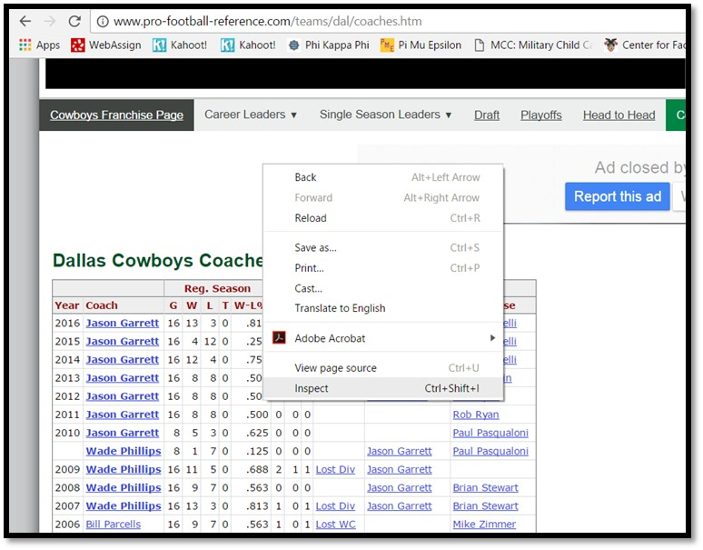
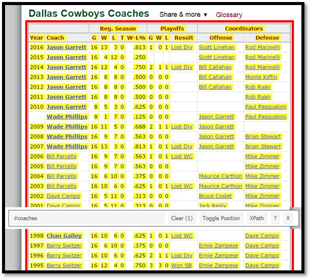
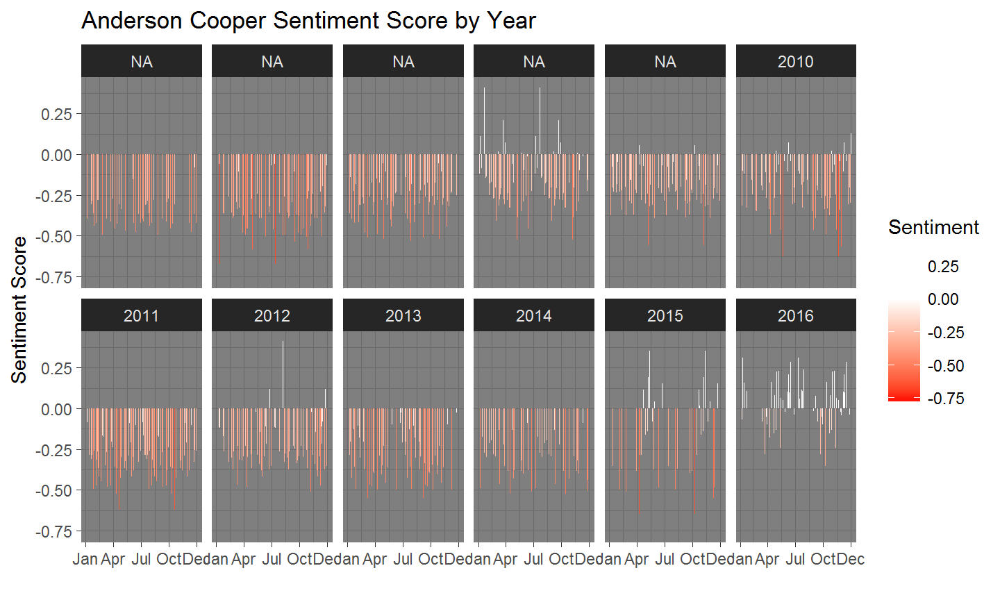

## Welcome {.build}

A Quote from the charter: <br><br>

"WG 33 supports methodologically sound work that will **advance the community's analytic capabilities** for the complex and uncertain operating environments faced today.""

## Today's Overview
 
Digital Data Collection Techniques  

* Traditional Collection
* Google Docs
* Data Scraping  
* Super Data Scraping  


## Acknowledgements {.build}

> 1. <a href="http://www.usma.edu/math/_layouts/wpFacultyBios/DisplayBio.aspx?ID=ebdd74e5-07fe-4bd0-b30d-ff96f904ce6e&List=1ebd54dc-d44d-4834-8add-2da90afb21f5"> COL Joe Lindquist </a>  <br>
  Academy Professor    <br>
  Mentor <br>
> 2. <a href="https://www.facebook.com/jill.finkbeinerturner"> Jill Turner </a>  
  Wife    <br>
  Biggest Fan   <br>


## 'Old School' Web Scraping

Lets look at some interesting <a href="http://www.pro-football-reference.com/teams/dal/coaches.htm">data</a>.


## 'Newer School' Web Scraping

<a href="https://docs.google.com/spreadsheets/d/1o_2wPqMA0tlPzDnHVHZebtz6B3c_iu9ledWE0aouwMY/edit?usp=sharing">Google Docs</a>


## Problem of Extention {.smaller}

* Dallas Cowboys
* NY Giants
* Philadelphia Eagles
* Washington Redskins


## Enter R Vest

* Hadley Wickham
* <a href="https://github.com/hadley?tab=repositories"> Github Repository</a>
* <a href="hadley.nz"> Professional Webpage </a>
* <a href="https://twitter.com/hadleywickham"> @hadleywickham </a>  


## R Vest How To

Install the package


```r
install.packages("rvest")
```

Call the package


```r
library(rvest)
```

## R Vest How To {.smaller}

R Vest Requires 3 Pieces of Information

1. URL
2. CSS or X Path Selector
3. Data Type

## R Vest How To {.smaller}

Using Our Dallas Cowboys Example

1. URL = "http://www.pro-football-reference.com/teams/dal/coaches.htm"
2. CSS or X Path Selector
3. Data Type

## R Vest How To {.smaller}

Using Our Dallas Cowboys Example

1. URL = http://www.pro-football-reference.com/teams/dal/coaches.htm
2. **CSS or X Path Selector**
3. Data Type

----



----


## R Vest How To {.build}
There's got to be an easier way...  

Enter Selector Gadget

<a href="https://chrome.google.com/webstore/detail/selectorgadget/mhjhnkcfbdhnjickkkdbjoemdmbfginb?hl=en"> Selector Gadget Chrome Download  </a>  

----



## R Vest How To {.smaller}

1. URL = "http://www.pro-football-reference.com/teams/dal/coaches.htm"
2. CSS or X Path Selector
3. **Data Type**    Table or Text

## R Vest How To{.smaller}

Call Library

```r
## library(rvest)
```
Input URL

```r
## step1 = read_html("URL IN QUOTES") 
```
CSS or X Path Selector

```r
## step2 = html_nodes(step1, xpath =, css = )
```
Scrape the Data

```r
## step3 = html_table(step2, header = TRUE)
```


## Dallas Cowboys Example: X Path

Input URL

```r
step1x = read_html("http://www.pro-football-reference.com/teams/dal/coaches.htm") 
```
X Path ID

```r
step2x = html_nodes(step1x, xpath='//*[(@id = "coaches")]')
```
Scrape the Data

```r
step3x = html_table(step2x, header = TRUE)
```

----

View the data

```r
head(step3x[[1]][1:6])
```

```
##                   .1 Reg. Season Reg. Season.1 Reg. Season.2 Reg. Season.3
## 1 Year         Coach           G             W             L             T
## 2 2017 Jason Garrett          11             5             6             0
## 3 2016 Jason Garrett          16            13             3             0
## 4 2015 Jason Garrett          16             4            12             0
## 5 2014 Jason Garrett          16            12             4             0
## 6 2013 Jason Garrett          16             8             8             0
```


## Dallas Cowboys Example: CSS

Input URL

```r
step1css = read_html("http://www.pro-football-reference.com/teams/dal/coaches.htm") 
```
CSS

```r
step2css = html_nodes(step1css, css="#coaches")
```
Scrape the Data

```r
step3css = html_table(step2css, header = TRUE)
```

----

View the data

```r
head(step3css[[1]][1:6])
```

```
##                   .1 Reg. Season Reg. Season.1 Reg. Season.2 Reg. Season.3
## 1 Year         Coach           G             W             L             T
## 2 2017 Jason Garrett          11             5             6             0
## 3 2016 Jason Garrett          16            13             3             0
## 4 2015 Jason Garrett          16             4            12             0
## 5 2014 Jason Garrett          16            12             4             0
## 6 2013 Jason Garrett          16             8             8             0
```

## Simplify: The Pipe Command {.smaller}
A Short Aside

```r
multiply = function(x,y) {
  answer = x * y
  return(answer)
}
multiply(3,4)
```

```
## [1] 12
```

```r
3 %>% multiply(4)
```

```
## [1] 12
```

## R Vest How To{.smaller}

```r
allonestep = "http://www.pro-football-reference.com/teams/dal/coaches.htm" %>% 
    read_html() %>%
    html_nodes(xpath='//*[(@id = "coaches")]') %>%
    html_table(header = TRUE)
```

View the data

```r
allonestep=allonestep[[1]]
colnames(allonestep)=allonestep[1,]
head(allonestep[,1:12])
```

```
##   Year         Coach  G  W  L T W-L% G.1 W.1 L.1   Result       Offense
## 1 Year         Coach  G  W  L T W-L%   G   W   L   Result       Offense
## 2 2017 Jason Garrett 11  5  6 0 .455                      Scott Linehan
## 3 2016 Jason Garrett 16 13  3 0 .813   1   0   1 Lost Div Scott Linehan
## 4 2015 Jason Garrett 16  4 12 0 .250                      Scott Linehan
## 5 2014 Jason Garrett 16 12  4 0 .750   2   1   1 Lost Div Bill Callahan
## 6 2013 Jason Garrett 16  8  8 0 .500   0   0   0          Bill Callahan
```

## Other Examples: Stocks {.smaller}

<a href="http://www.nasdaq.com/symbol/p">   </a> 

----


```r
pandora = "http://www.nasdaq.com/symbol/p"

pstock = pandora %>%
  read_html() %>%
  html_nodes("#quotes_content_left_InfoQuotesResults td+ td") %>%
  html_text()
```

----

Downloading Stocks of Interest


```r
pstock
```

```
##  [1] "10.5"                                                                                                
##  [2] "$ 5.395 / $ 5.25"                                                                                    
##  [3] "\r\n                                        8,789,539\r\n                                    "       
##  [4] "8,230,800"                                                                                           
##  [5] "$ 5.26"                                                                                              
##  [6] "\r\n                                        $ 14.10 / $ 4.44\r\n                                    "
##  [7] "$ 1,321,032,510 "                                                                                    
##  [8] "NE"                                                                                                  
##  [9] "NE"                                                                                                  
## [10] "$ -2.48"                                                                                             
## [11] "N/A"                                                                                                 
## [12] "N/A"                                                                                                 
## [13] "N/A"                                                                                                 
## [14] "0 %"                                                                                                 
## [15] "-0.72"
```


```r
pstock[5]
```

```
## [1] "$ 5.26"
```
----

Or time stamp the data


```r
pstock=(as.data.frame(pstock))
cbind(pstock,Sys.time())[5,]
```

```
##   pstock          Sys.time()
## 5 $ 5.26 2017-11-27 19:25:37
```

## Other Examples: NBA Basketball {.smaller}

<a href="http://www.basketball-reference.com/leaders/g_career_p.html">   </a> 

## Other Examples: NBA Basketball {.smaller}


```r
nbaurl = "http://www.basketball-reference.com/leaders/g_career_p.html"

leaders = nbaurl %>%
  read_html() %>%
  html_nodes("#tot") %>%
  html_table()
```

----

See the Results


```r
leaders=as.data.frame(leaders)
head(leaders,20)
```

```
##    Rank               Player   G
## 1     1         Derek Fisher 259
## 2     2           Tim Duncan 251
## 3     3         Robert Horry 244
## 4     4 Kareem Abdul-Jabbar* 237
## 5     5          Tony Parker 221
## 6     6          Kobe Bryant 220
## 7     7         LeBron James 217
## 8     8    Shaquille O'Neal* 216
## 9     9        Manu Ginobili 213
## 10   10      Scottie Pippen* 208
## 11   11         Karl Malone* 193
## 12   NA          Danny Ainge 193
## 13   13       Magic Johnson* 190
## 14   14       Julius Erving* 189
## 15   15       Robert Parish* 184
## 16   16          Byron Scott 183
## 17   17       John Stockton* 182
## 18   18      Dennis Johnson* 180
## 19   19      Michael Jordan* 179
## 20   20      Rasheed Wallace 177
```

## Other Examples: World Factbook {.smaller}

<a href="https://www.cia.gov/library/publications/the-world-factbook/geos/af.html">   </a> 

## Other Examples: World Factbook


```r
factbook <- "https://www.cia.gov/library/publications/the-world-factbook/geos/af.html"  

areaaf <- factbook %>%
  read_html() %>%
  html_nodes(".even:nth-child(6) .category_data:nth-child(14) , .even:nth-child(6) 
             #field:nth-child(13) a , #field+ div:nth-child(28) .category_data , 
             #field:nth-child(27) a , #field:nth-child(5)~ #field:nth-child(7) a , 
             .even:nth-child(4) div:nth-child(9) .category_data , 
             #field+ div:nth-child(8) .category_data , .countryName") %>%
html_text()
```

----

See the results


```r
areaaf
```

```
##  [1] "AFGHANISTAN"                             
##  [2] "AFGHANISTAN"                             
##  [3] "AFGHANISTAN"                             
##  [4] "AFGHANISTAN"                             
##  [5] "AFGHANISTAN"                             
##  [6] "Area:"                                   
##  [7] ""                                        
##  [8] "652,230 sq km"                           
##  [9] "AFGHANISTAN"                             
## [10] "Elevation:"                              
## [11] ""                                        
## [12] "1,884 m"                                 
## [13] "AFGHANISTAN"                             
## [14] "Citizenship:"                            
## [15] ""                                        
## [16] "no"                                      
## [17] "Electricity - from hydroelectric plants:"
## [18] ""
```

## Other Examples: University Info {.smaller}

<a href="https://www.princetonreview.com/schools/1023919/college/united-states-military-academy">   </a> 

---


```r
westpoint = "https://www.princetonreview.com/schools/1023919/college/united-states-military-academy"

wp = westpoint %>%
  read_html() %>%
  html_nodes("#admissions .col-sm-4 div") %>%
  html_text()
wp
```

```
##  [1] "Applicants"                             
##  [2] "14,829"                                 
##  [3] "Acceptance Rate"                        
##  [4] "10%"                                    
##  [5] "SAT Reading"                            
##  [6] "25th-75th percentile(enrolled students)"
##  [7] "580 - 690"                              
##  [8] "SAT Math"                               
##  [9] "25th-75th percentile(enrolled students)"
## [10] "600 - 700"                              
## [11] "SAT Writing"                            
## [12] "25th-75th percentile(enrolled students)"
## [13] "550 - 660"
```

---


```r
navy = "https://www.princetonreview.com/schools/1022813/college/united-states-naval-academy"

goats = navy %>%
  read_html() %>%
  html_nodes("#admissions .col-sm-4 div") %>%
  html_text()
goats
```

```
##  [1] "Applicants"                                                                              
##  [2] "17,043"                                                                                  
##  [3] "Acceptance Rate"                                                                         
##  [4] "8%"                                                                                      
##  [5] "Average HS GPA"                                                                          
##  [6] "4.16"                                                                                    
##  [7] "\n        \n            79%\n        \n        \n            Over 3.75\n        \n    "  
##  [8] "\n            79%\n        "                                                             
##  [9] "\n            Over 3.75\n        "                                                       
## [10] "\n        \n            10%\n        \n        \n            3.50 - 3.74\n        \n    "
## [11] "\n            10%\n        "                                                             
## [12] "\n            3.50 - 3.74\n        "                                                     
## [13] "\n        \n            6%\n        \n        \n            3.25 - 3.49\n        \n    " 
## [14] "\n            6%\n        "                                                              
## [15] "\n            3.25 - 3.49\n        "                                                     
## [16] "\n        \n            4%\n        \n        \n            3.00 - 3.24\n        \n    " 
## [17] "\n            4%\n        "                                                              
## [18] "\n            3.00 - 3.24\n        "                                                     
## [19] "\n        \n            1%\n        \n        \n            2.50 - 2.99\n        \n    " 
## [20] "\n            1%\n        "                                                              
## [21] "\n            2.50 - 2.99\n        "                                                     
## [22] "SAT Reading"                                                                             
## [23] "25th-75th percentile(enrolled students)"                                                 
## [24] "570 - 680"                                                                               
## [25] "SAT Math"                                                                                
## [26] "25th-75th percentile(enrolled students)"                                                 
## [27] "600 - 710"
```

---


```r
airforce = "https://www.princetonreview.com/schools/1023678/college/united-states-air-force-academy"

zoomie = airforce %>%
  read_html() %>%
  html_nodes("#admissions .col-sm-4 div") %>%
  html_text()
zoomie
```

```
##  [1] "Applicants"                                                                              
##  [2] "9,894"                                                                                   
##  [3] "Acceptance Rate"                                                                         
##  [4] "15%"                                                                                     
##  [5] "Average HS GPA"                                                                          
##  [6] "3.87"                                                                                    
##  [7] "\n        \n            78%\n        \n        \n            Over 3.75\n        \n    "  
##  [8] "\n            78%\n        "                                                             
##  [9] "\n            Over 3.75\n        "                                                       
## [10] "\n        \n            13%\n        \n        \n            3.50 - 3.74\n        \n    "
## [11] "\n            13%\n        "                                                             
## [12] "\n            3.50 - 3.74\n        "                                                     
## [13] "\n        \n            7%\n        \n        \n            3.25 - 3.49\n        \n    " 
## [14] "\n            7%\n        "                                                              
## [15] "\n            3.25 - 3.49\n        "                                                     
## [16] "\n        \n            2%\n        \n        \n            3.00 - 3.24\n        \n    " 
## [17] "\n            2%\n        "                                                              
## [18] "\n            3.00 - 3.24\n        "                                                     
## [19] "SAT Reading"                                                                             
## [20] "25th-75th percentile(enrolled students)"                                                 
## [21] "600 - 690"                                                                               
## [22] "SAT Math"                                                                                
## [23] "25th-75th percentile(enrolled students)"                                                 
## [24] "620 - 720"
```

---


```r
aggregate = data.frame(School = c("Army", "Navy", "Air Force"), 
                       Applicants = c(wp[2],goats[2],zoomie[2]),
                       AcceptanceRate = c(wp[4],goats[4],zoomie[4]))
aggregate
```

```
##      School Applicants AcceptanceRate
## 1      Army     14,829            10%
## 2      Navy     17,043             8%
## 3 Air Force      9,894            15%
```

## Super Scraping 


```r
teamurls = c(NA)
teamabvs = c("nwe", "mia", "buf", "nyj", "pit", "rav", "cin", "cle", "htx", "oti",
             "clt", "jax", "rai", "kan", "den", "sdg", "dal", "nyg", "was", "phi",
             "det", "min", "gnb", "chi", "tam", "atl", "car", "nor", "sea", "crd",
             "ram", "sfo")
for (i in 1:length(teamabvs)) {
  teamurls[i] = paste0(paste0("http://www.pro-football-reference.com/teams/",
                              teamabvs[i]),"/coaches.htm")
}
head(teamurls,10)
```

```
##  [1] "http://www.pro-football-reference.com/teams/nwe/coaches.htm"
##  [2] "http://www.pro-football-reference.com/teams/mia/coaches.htm"
##  [3] "http://www.pro-football-reference.com/teams/buf/coaches.htm"
##  [4] "http://www.pro-football-reference.com/teams/nyj/coaches.htm"
##  [5] "http://www.pro-football-reference.com/teams/pit/coaches.htm"
##  [6] "http://www.pro-football-reference.com/teams/rav/coaches.htm"
##  [7] "http://www.pro-football-reference.com/teams/cin/coaches.htm"
##  [8] "http://www.pro-football-reference.com/teams/cle/coaches.htm"
##  [9] "http://www.pro-football-reference.com/teams/htx/coaches.htm"
## [10] "http://www.pro-football-reference.com/teams/oti/coaches.htm"
```

----

Call Library


```r
library(dplyr)
```

Scrape data and build table


```r
coaches = data.frame(NA)
for (i in 1:length(teamurls)) {
  allonestep = teamurls[i] %>%
    read_html() %>%
    html_nodes(xpath='//*[(@id = "coaches")]') %>%
    html_table(header = FALSE)
  allonestep <- allonestep[[1]]
  allonestep = allonestep[-1,]
  coaches = bind_rows(coaches, allonestep)
}
```

----

```r
coaches
```

```
##      NA.   X1                     X2   X3   X4   X5   X6    X7   X8   X9
## 1     NA <NA>                   <NA> <NA> <NA> <NA> <NA>  <NA> <NA> <NA>
## 2     NA Year                  Coach    G    W    L    T  W-L%    G    W
## 3     NA 2017         Bill Belichick   11    9    2    0  .818          
## 4     NA 2016         Bill Belichick   16   14    2    0  .875    3    3
## 5     NA 2015         Bill Belichick   16   12    4    0  .750    2    1
## 6     NA 2014         Bill Belichick   16   12    4    0  .750    3    3
## 7     NA 2013         Bill Belichick   16   12    4    0  .750    2    1
## 8     NA 2012         Bill Belichick   16   12    4    0  .750    2    1
## 9     NA 2011         Bill Belichick   16   13    3    0  .813    3    2
## 10    NA 2010         Bill Belichick   16   14    2    0  .875    1    0
## 11    NA 2009         Bill Belichick   16   10    6    0  .625    1    0
## 12    NA 2008         Bill Belichick   16   11    5    0  .688    0    0
## 13    NA 2007         Bill Belichick   16   16    0    0 1.000    3    2
## 14    NA 2006         Bill Belichick   16   12    4    0  .750    3    2
## 15    NA 2005         Bill Belichick   16   10    6    0  .625    2    1
## 16    NA 2004         Bill Belichick   16   14    2    0  .875    3    3
## 17    NA 2003         Bill Belichick   16   14    2    0  .875    3    3
## 18    NA 2002         Bill Belichick   16    9    7    0  .563    0    0
## 19    NA 2001         Bill Belichick   16   11    5    0  .688    3    3
## 20    NA 2000         Bill Belichick   16    5   11    0  .313    0    0
## 21    NA 1999           Pete Carroll   16    8    8    0  .500    0    0
## 22    NA 1998           Pete Carroll   16    9    7    0  .563    1    0
## 23    NA 1997           Pete Carroll   16   10    6    0  .625    2    1
## 24    NA 1996          Bill Parcells   16   11    5    0  .688    3    2
## 25    NA 1995          Bill Parcells   16    6   10    0  .375    0    0
## 26    NA 1994          Bill Parcells   16   10    6    0  .625    1    0
## 27    NA 1993          Bill Parcells   16    5   11    0  .313    0    0
## 28    NA 1992        Dick MacPherson   16    2   14    0  .125    0    0
## 29    NA 1991        Dick MacPherson   16    6   10    0  .375    0    0
## 30    NA 1990               Rod Rust   16    1   15    0  .063    0    0
## 31    NA 1989          Raymond Berry   16    5   11    0  .313    0    0
## 32    NA 1988          Raymond Berry   16    9    7    0  .563    0    0
## 33    NA 1987          Raymond Berry   15    8    7    0  .533    0    0
## 34    NA 1986          Raymond Berry   16   11    5    0  .688    1    0
## 35    NA 1985          Raymond Berry   16   11    5    0  .688    4    3
## 36    NA 1984              Ron Meyer    8    5    3    0  .625    0    0
## 37    NA               Raymond Berry    8    4    4    0  .500    0    0
## 38    NA 1983              Ron Meyer   16    8    8    0  .500    0    0
## 39    NA 1982              Ron Meyer    9    5    4    0  .556    1    0
## 40    NA 1981            Ron Erhardt   16    2   14    0  .125    0    0
## 41    NA 1980            Ron Erhardt   16   10    6    0  .625    0    0
## 42    NA 1979            Ron Erhardt   16    9    7    0  .563    0    0
## 43    NA 1978            Ron Erhardt    1    0    1    0  .000    0    0
## 44    NA               Hank Bullough    1    0    1    0  .000    0    0
## 45    NA             Chuck Fairbanks   15   11    4    0  .733    1    0
## 46    NA 1977        Chuck Fairbanks   14    9    5    0  .643    0    0
## 47    NA 1976        Chuck Fairbanks   14   11    3    0  .786    1    0
## 48    NA 1975        Chuck Fairbanks   14    3   11    0  .214    0    0
## 49    NA 1974        Chuck Fairbanks   14    7    7    0  .500    0    0
## 50    NA 1973        Chuck Fairbanks   14    5    9    0  .357    0    0
## 51    NA 1972             John Mazur    9    2    7    0  .222    0    0
## 52    NA               Phil Bengtson    5    1    4    0  .200    0    0
## 53    NA 1971             John Mazur   14    6    8    0  .429    0    0
## 54    NA 1970             Clive Rush    7    1    6    0  .143    0    0
## 55    NA                  John Mazur    7    1    6    0  .143    0    0
## 56    NA 1969             Clive Rush   14    4   10    0  .286    0    0
## 57    NA 1968           Mike Holovak   14    4   10    0  .286    0    0
## 58    NA 1967           Mike Holovak   14    3   10    1  .231    0    0
## 59    NA 1966           Mike Holovak   14    8    4    2  .667    0    0
## 60    NA 1965           Mike Holovak   14    4    8    2  .333    0    0
## 61    NA 1964           Mike Holovak   14   10    3    1  .769    0    0
## 62    NA 1963           Mike Holovak   14    7    6    1  .538    2    1
## 63    NA 1962           Mike Holovak   14    9    4    1  .692    0    0
## 64    NA 1961              Lou Saban    5    2    3    0  .400    0    0
## 65    NA                Mike Holovak    9    7    1    1  .875    0    0
## 66    NA 1960              Lou Saban   14    5    9    0  .357    0    0
## 67    NA Year                  Coach    G    W    L    T  W-L%    G    W
## 68    NA 2017              Adam Gase   11    4    7    0  .364          
## 69    NA 2016              Adam Gase   16   10    6    0  .625    1    0
## 70    NA 2015           Dan Campbell   12    5    7    0  .417          
## 71    NA                 Joe Philbin    4    1    3    0  .250    0    0
## 72    NA 2014            Joe Philbin   16    8    8    0  .500    0    0
## 73    NA 2013            Joe Philbin   16    8    8    0  .500    0    0
## 74    NA 2012            Joe Philbin   16    7    9    0  .438    0    0
## 75    NA 2011            Todd Bowles    3    2    1    0  .667    0    0
## 76    NA                Tony Sparano   13    4    9    0  .308    0    0
## 77    NA 2010           Tony Sparano   16    7    9    0  .438    0    0
## 78    NA 2009           Tony Sparano   16    7    9    0  .438    0    0
## 79    NA 2008           Tony Sparano   16   11    5    0  .688    1    0
## 80    NA 2007            Cam Cameron   16    1   15    0  .063    0    0
## 81    NA 2006             Nick Saban   16    6   10    0  .375    0    0
## 82    NA 2005             Nick Saban   16    9    7    0  .563    0    0
## 83    NA 2004              Jim Bates    7    3    4    0  .429    0    0
## 84    NA              Dave Wannstedt    9    1    8    0  .111    0    0
## 85    NA 2003         Dave Wannstedt   16   10    6    0  .625    0    0
## 86    NA 2002         Dave Wannstedt   16    9    7    0  .563    0    0
## 87    NA 2001         Dave Wannstedt   16   11    5    0  .688    1    0
## 88    NA 2000         Dave Wannstedt   16   11    5    0  .688    2    1
## 89    NA 1999          Jimmy Johnson   16    9    7    0  .563    2    1
## 90    NA 1998          Jimmy Johnson   16   10    6    0  .625    2    1
## 91    NA 1997          Jimmy Johnson   16    9    7    0  .563    1    0
## 92    NA 1996          Jimmy Johnson   16    8    8    0  .500    0    0
## 93    NA 1995              Don Shula   16    9    7    0  .563    1    0
## 94    NA 1994              Don Shula   16   10    6    0  .625    2    1
## 95    NA 1993              Don Shula   16    9    7    0  .563    0    0
## 96    NA 1992              Don Shula   16   11    5    0  .688    2    1
## 97    NA 1991              Don Shula   16    8    8    0  .500    0    0
## 98    NA 1990              Don Shula   16   12    4    0  .750    2    1
## 99    NA 1989              Don Shula   16    8    8    0  .500    0    0
## 100   NA 1988              Don Shula   16    6   10    0  .375    0    0
## 101   NA 1987              Don Shula   15    8    7    0  .533    0    0
## 102   NA 1986              Don Shula   16    8    8    0  .500    0    0
## 103   NA 1985              Don Shula   16   12    4    0  .750    2    1
## 104   NA 1984              Don Shula   16   14    2    0  .875    3    2
## 105   NA 1983              Don Shula   16   12    4    0  .750    1    0
## 106   NA 1982              Don Shula    9    7    2    0  .778    4    3
## 107   NA 1981              Don Shula   16   11    4    1  .719    1    0
## 108   NA 1980              Don Shula   16    8    8    0  .500    0    0
## 109   NA 1979              Don Shula   16   10    6    0  .625    1    0
## 110   NA 1978              Don Shula   16   11    5    0  .688    1    0
## 111   NA 1977              Don Shula   14   10    4    0  .714    0    0
## 112   NA 1976              Don Shula   14    6    8    0  .429    0    0
## 113   NA 1975              Don Shula   14   10    4    0  .714    0    0
## 114   NA 1974              Don Shula   14   11    3    0  .786    1    0
## 115   NA 1973              Don Shula   14   12    2    0  .857    3    3
## 116   NA 1972              Don Shula   14   14    0    0 1.000    3    3
## 117   NA 1971              Don Shula   14   10    3    1  .769    3    2
## 118   NA 1970              Don Shula   14   10    4    0  .714    1    0
## 119   NA 1969          George Wilson   14    3   10    1  .231    0    0
## 120   NA 1968          George Wilson   14    5    8    1  .385    0    0
## 121   NA 1967          George Wilson   14    4   10    0  .286    0    0
## 122   NA 1966          George Wilson   14    3   11    0  .214    0    0
## 123   NA Year                  Coach    G    W    L    T  W-L%    G    W
## 124   NA 2017         Sean McDermott   11    6    5    0  .545          
## 125   NA 2016           Anthony Lynn    1    0    1    0  .000    0    0
## 126   NA                    Rex Ryan   15    7    8    0  .467    0    0
## 127   NA 2015               Rex Ryan   16    8    8    0  .500          
## 128   NA 2014           Doug Marrone   16    9    7    0  .563    0    0
## 129   NA 2013           Doug Marrone   16    6   10    0  .375    0    0
## 130   NA 2012            Chan Gailey   16    6   10    0  .375    0    0
## 131   NA 2011            Chan Gailey   16    6   10    0  .375    0    0
## 132   NA 2010            Chan Gailey   16    4   12    0  .250    0    0
## 133   NA 2009           Perry Fewell    7    3    4    0  .429    0    0
## 134   NA                 Dick Jauron    9    3    6    0  .333    0    0
## 135   NA 2008            Dick Jauron   16    7    9    0  .438    0    0
## 136   NA 2007            Dick Jauron   16    7    9    0  .438    0    0
## 137   NA 2006            Dick Jauron   16    7    9    0  .438    0    0
## 138   NA 2005          Mike Mularkey   16    5   11    0  .313    0    0
## 139   NA 2004          Mike Mularkey   16    9    7    0  .563    0    0
## 140   NA 2003         Gregg Williams   16    6   10    0  .375    0    0
## 141   NA 2002         Gregg Williams   16    8    8    0  .500    0    0
## 142   NA 2001         Gregg Williams   16    3   13    0  .188    0    0
## 143   NA 2000          Wade Phillips   16    8    8    0  .500    0    0
## 144   NA 1999          Wade Phillips   16   11    5    0  .688    1    0
## 145   NA 1998          Wade Phillips   16   10    6    0  .625    1    0
## 146   NA 1997              Marv Levy   16    6   10    0  .375    0    0
## 147   NA 1996              Marv Levy   16   10    6    0  .625    1    0
## 148   NA 1995              Marv Levy   16   10    6    0  .625    2    1
## 149   NA 1994              Marv Levy   16    7    9    0  .438    0    0
## 150   NA 1993              Marv Levy   16   12    4    0  .750    3    2
## 151   NA 1992              Marv Levy   16   11    5    0  .688    4    3
## 152   NA 1991              Marv Levy   16   13    3    0  .813    3    2
## 153   NA 1990              Marv Levy   16   13    3    0  .813    3    2
## 154   NA 1989              Marv Levy   16    9    7    0  .563    1    0
## 155   NA 1988              Marv Levy   16   12    4    0  .750    2    1
## 156   NA 1987              Marv Levy   15    7    8    0  .467    0    0
## 157   NA 1986          Hank Bullough    9    2    7    0  .222    0    0
## 158   NA                   Marv Levy    7    2    5    0  .286    0    0
## 159   NA 1985         Kay Stephenson    4    0    4    0  .000    0    0
## 160   NA               Hank Bullough   12    2   10    0  .167    0    0
## 161   NA 1984         Kay Stephenson   16    2   14    0  .125    0    0
## 162   NA 1983         Kay Stephenson   16    8    8    0  .500    0    0
## 163   NA 1982             Chuck Knox    9    4    5    0  .444    0    0
## 164   NA 1981             Chuck Knox   16   10    6    0  .625    2    1
## 165   NA 1980             Chuck Knox   16   11    5    0  .688    1    0
## 166   NA 1979             Chuck Knox   16    7    9    0  .438    0    0
## 167   NA 1978             Chuck Knox   16    5   11    0  .313    0    0
## 168   NA 1977              Jim Ringo   14    3   11    0  .214    0    0
## 169   NA 1976              Lou Saban    5    2    3    0  .400    0    0
## 170   NA                   Jim Ringo    9    0    9    0  .000    0    0
## 171   NA 1975              Lou Saban   14    8    6    0  .571    0    0
## 172   NA 1974              Lou Saban   14    9    5    0  .643    1    0
## 173   NA 1973              Lou Saban   14    9    5    0  .643    0    0
## 174   NA 1972              Lou Saban   14    4    9    1  .321    0    0
## 175   NA 1971         Harvey Johnson   14    1   13    0  .071    0    0
## 176   NA 1970             John Rauch   14    3   10    1  .231    0    0
## 177   NA 1969             John Rauch   14    4   10    0  .286    0    0
## 178   NA 1968            Joe Collier    2    0    2    0  .000    0    0
## 179   NA              Harvey Johnson   12    1   10    1  .091    0    0
## 180   NA 1967            Joe Collier   14    4   10    0  .286    0    0
## 181   NA 1966            Joe Collier   14    9    4    1  .692    1    0
## 182   NA 1965              Lou Saban   14   10    3    1  .769    1    1
## 183   NA 1964              Lou Saban   14   12    2    0  .857    1    1
## 184   NA 1963              Lou Saban   14    7    6    1  .538    1    0
## 185   NA 1962              Lou Saban   14    7    6    1  .538    0    0
## 186   NA 1961          Buster Ramsey   14    6    8    0  .429    0    0
## 187   NA 1960          Buster Ramsey   14    5    8    1  .385    0    0
## 188   NA Year                  Coach    G    W    L    T  W-L%    G    W
## 189   NA 2017            Todd Bowles   11    4    7    0  .364          
## 190   NA 2016            Todd Bowles   16    5   11    0  .313          
## 191   NA 2015            Todd Bowles   16   10    6    0  .625          
## 192   NA 2014               Rex Ryan   16    4   12    0  .250    0    0
## 193   NA 2013               Rex Ryan   16    8    8    0  .500    0    0
## 194   NA 2012               Rex Ryan   16    6   10    0  .375    0    0
## 195   NA 2011               Rex Ryan   16    8    8    0  .500    0    0
## 196   NA 2010               Rex Ryan   16   11    5    0  .688    3    2
## 197   NA 2009               Rex Ryan   16    9    7    0  .563    3    2
## 198   NA 2008           Eric Mangini   16    9    7    0  .563    0    0
## 199   NA 2007           Eric Mangini   16    4   12    0  .250    0    0
## 200   NA 2006           Eric Mangini   16   10    6    0  .625    1    0
## 201   NA 2005           Herm Edwards   16    4   12    0  .250    0    0
## 202   NA 2004           Herm Edwards   16   10    6    0  .625    2    1
## 203   NA 2003           Herm Edwards   16    6   10    0  .375    0    0
## 204   NA 2002           Herm Edwards   16    9    7    0  .563    2    1
## 205   NA 2001           Herm Edwards   16   10    6    0  .625    1    0
## 206   NA 2000                Al Groh   16    9    7    0  .563    0    0
## 207   NA 1999          Bill Parcells   16    8    8    0  .500    0    0
## 208   NA 1998          Bill Parcells   16   12    4    0  .750    2    1
## 209   NA 1997          Bill Parcells   16    9    7    0  .563    0    0
## 210   NA 1996            Rich Kotite   16    1   15    0  .063    0    0
## 211   NA 1995            Rich Kotite   16    3   13    0  .188    0    0
## 212   NA 1994           Pete Carroll   16    6   10    0  .375    0    0
## 213   NA 1993           Bruce Coslet   16    8    8    0  .500    0    0
## 214   NA 1992           Bruce Coslet   16    4   12    0  .250    0    0
## 215   NA 1991           Bruce Coslet   16    8    8    0  .500    1    0
## 216   NA 1990           Bruce Coslet   16    6   10    0  .375    0    0
## 217   NA 1989             Joe Walton   16    4   12    0  .250    0    0
## 218   NA 1988             Joe Walton   16    8    7    1  .531    0    0
## 219   NA 1987             Joe Walton   15    6    9    0  .400    0    0
## 220   NA 1986             Joe Walton   16   10    6    0  .625    2    1
## 221   NA 1985             Joe Walton   16   11    5    0  .688    1    0
## 222   NA 1984             Joe Walton   16    7    9    0  .438    0    0
## 223   NA 1983             Joe Walton   16    7    9    0  .438    0    0
## 224   NA 1982          Walt Michaels    9    6    3    0  .667    3    2
## 225   NA 1981          Walt Michaels   16   10    5    1  .656    1    0
## 226   NA 1980          Walt Michaels   16    4   12    0  .250    0    0
## 227   NA 1979          Walt Michaels   16    8    8    0  .500    0    0
## 228   NA 1978          Walt Michaels   16    8    8    0  .500    0    0
## 229   NA 1977          Walt Michaels   14    3   11    0  .214    0    0
## 230   NA 1976              Lou Holtz   13    3   10    0  .231    0    0
## 231   NA                Mike Holovak    1    0    1    0  .000    0    0
## 232   NA 1975         Charley Winner    9    2    7    0  .222    0    0
## 233   NA                   Ken Shipp    5    1    4    0  .200    0    0
## 234   NA 1974         Charley Winner   14    7    7    0  .500    0    0
## 235   NA 1973            Weeb Ewbank   14    4   10    0  .286    0    0
## 236   NA 1972            Weeb Ewbank   14    7    7    0  .500    0    0
## 237   NA 1971            Weeb Ewbank   14    6    8    0  .429    0    0
## 238   NA 1970            Weeb Ewbank   14    4   10    0  .286    0    0
## 239   NA 1969            Weeb Ewbank   14   10    4    0  .714    1    0
## 240   NA 1968            Weeb Ewbank   14   11    3    0  .786    2    2
## 241   NA 1967            Weeb Ewbank   14    8    5    1  .615    0    0
## 242   NA 1966            Weeb Ewbank   14    6    6    2  .500    0    0
## 243   NA 1965            Weeb Ewbank   14    5    8    1  .385    0    0
## 244   NA 1964            Weeb Ewbank   14    5    8    1  .385    0    0
## 245   NA 1963            Weeb Ewbank   14    5    8    1  .385    0    0
## 246   NA 1962         Bulldog Turner   14    5    9    0  .357    0    0
## 247   NA 1961            Sammy Baugh   14    7    7    0  .500    0    0
## 248   NA 1960            Sammy Baugh   14    7    7    0  .500    0    0
## 249   NA Year                  Coach    G    W    L    T  W-L%    G    W
## 250   NA 2017            Mike Tomlin   11    9    2    0  .818          
## 251   NA 2016            Mike Tomlin   16   11    5    0  .688    3    2
## 252   NA 2015            Mike Tomlin   16   10    6    0  .625    2    1
## 253   NA 2014            Mike Tomlin   16   11    5    0  .688    1    0
## 254   NA 2013            Mike Tomlin   16    8    8    0  .500    0    0
## 255   NA 2012            Mike Tomlin   16    8    8    0  .500    0    0
## 256   NA 2011            Mike Tomlin   16   12    4    0  .750    1    0
## 257   NA 2010            Mike Tomlin   16   12    4    0  .750    3    2
## 258   NA 2009            Mike Tomlin   16    9    7    0  .563    0    0
## 259   NA 2008            Mike Tomlin   16   12    4    0  .750    3    3
## 260   NA 2007            Mike Tomlin   16   10    6    0  .625    1    0
## 261   NA 2006            Bill Cowher   16    8    8    0  .500    0    0
## 262   NA 2005            Bill Cowher   16   11    5    0  .688    4    4
## 263   NA 2004            Bill Cowher   16   15    1    0  .938    2    1
## 264   NA 2003            Bill Cowher   16    6   10    0  .375    0    0
## 265   NA 2002            Bill Cowher   16   10    5    1  .656    2    1
## 266   NA 2001            Bill Cowher   16   13    3    0  .813    2    1
## 267   NA 2000            Bill Cowher   16    9    7    0  .563    0    0
## 268   NA 1999            Bill Cowher   16    6   10    0  .375    0    0
## 269   NA 1998            Bill Cowher   16    7    9    0  .438    0    0
## 270   NA 1997            Bill Cowher   16   11    5    0  .688    2    1
## 271   NA 1996            Bill Cowher   16   10    6    0  .625    2    1
## 272   NA 1995            Bill Cowher   16   11    5    0  .688    3    2
## 273   NA 1994            Bill Cowher   16   12    4    0  .750    2    1
## 274   NA 1993            Bill Cowher   16    9    7    0  .563    1    0
## 275   NA 1992            Bill Cowher   16   11    5    0  .688    1    0
## 276   NA 1991             Chuck Noll   16    7    9    0  .438    0    0
## 277   NA 1990             Chuck Noll   16    9    7    0  .563    0    0
## 278   NA 1989             Chuck Noll   16    9    7    0  .563    2    1
## 279   NA 1988             Chuck Noll   16    5   11    0  .313    0    0
## 280   NA 1987             Chuck Noll   15    8    7    0  .533    0    0
## 281   NA 1986             Chuck Noll   16    6   10    0  .375    0    0
## 282   NA 1985             Chuck Noll   16    7    9    0  .438    0    0
## 283   NA 1984             Chuck Noll   16    9    7    0  .563    2    1
## 284   NA 1983             Chuck Noll   16   10    6    0  .625    1    0
## 285   NA 1982             Chuck Noll    9    6    3    0  .667    1    0
## 286   NA 1981             Chuck Noll   16    8    8    0  .500    0    0
## 287   NA 1980             Chuck Noll   16    9    7    0  .563    0    0
## 288   NA 1979             Chuck Noll   16   12    4    0  .750    3    3
## 289   NA 1978             Chuck Noll   16   14    2    0  .875    3    3
## 290   NA 1977             Chuck Noll   14    9    5    0  .643    1    0
## 291   NA 1976             Chuck Noll   14   10    4    0  .714    2    1
## 292   NA 1975             Chuck Noll   14   12    2    0  .857    3    3
## 293   NA 1974             Chuck Noll   14   10    3    1  .750    3    3
## 294   NA 1973             Chuck Noll   14   10    4    0  .714    1    0
## 295   NA 1972             Chuck Noll   14   11    3    0  .786    2    1
## 296   NA 1971             Chuck Noll   14    6    8    0  .429    0    0
## 297   NA 1970             Chuck Noll   14    5    9    0  .357    0    0
## 298   NA 1969             Chuck Noll   14    1   13    0  .071    0    0
## 299   NA 1968            Bill Austin   14    2   11    1  .154    0    0
## 300   NA 1967            Bill Austin   14    4    9    1  .308    0    0
## 301   NA 1966            Bill Austin   14    5    8    1  .385    0    0
## 302   NA 1965             Mike Nixon   14    2   12    0  .143    0    0
## 303   NA 1964           Buddy Parker   14    5    9    0  .357    0    0
## 304   NA 1963           Buddy Parker   14    7    4    3  .636    0    0
## 305   NA 1962           Buddy Parker   14    9    5    0  .643    0    0
## 306   NA 1961           Buddy Parker   14    6    8    0  .429    0    0
## 307   NA 1960           Buddy Parker   12    5    6    1  .455    0    0
## 308   NA 1959           Buddy Parker   12    6    5    1  .545    0    0
## 309   NA 1958           Buddy Parker   12    7    4    1  .636    0    0
## 310   NA 1957           Buddy Parker   12    6    6    0  .500    0    0
## 311   NA 1956          Walt Kiesling   12    5    7    0  .417    0    0
## 312   NA 1955          Walt Kiesling   12    4    8    0  .333    0    0
## 313   NA 1954          Walt Kiesling   12    5    7    0  .417    0    0
## 314   NA 1953               Joe Bach   12    6    6    0  .500    0    0
## 315   NA 1952               Joe Bach   12    5    7    0  .417    0    0
## 316   NA 1951        John Michelosen   12    4    7    1  .364    0    0
## 317   NA 1950        John Michelosen   12    6    6    0  .500    0    0
## 318   NA 1949        John Michelosen   12    6    5    1  .545    0    0
## 319   NA 1948        John Michelosen   12    4    8    0  .333    0    0
## 320   NA 1947        Jock Sutherland   12    8    4    0  .667    1    0
## 321   NA 1946        Jock Sutherland   11    5    5    1  .500    0    0
## 322   NA 1945            Jim Leonard   10    2    8    0  .200    0    0
## 323   NA 1942          Walt Kiesling   11    7    4    0  .636    0    0
## 324   NA 1941           Aldo Donelli    5    0    5    0  .000    0    0
## 325   NA                   Bert Bell    2    0    2    0  .000    0    0
## 326   NA               Walt Kiesling    4    1    2    1  .333    0    0
## 327   NA 1940          Walt Kiesling   11    2    7    2  .222    0    0
## 328   NA 1939           Johnny Blood    3    0    3    0  .000    0    0
## 329   NA               Walt Kiesling    8    1    6    1  .143    0    0
## 330   NA 1938           Johnny Blood   11    2    9    0  .182    0    0
## 331   NA 1937           Johnny Blood   11    4    7    0  .364    0    0
## 332   NA 1936               Joe Bach   12    6    6    0  .500    0    0
## 333   NA 1935               Joe Bach   12    4    8    0  .333    0    0
## 334   NA 1934           Luby DiMeolo   12    2   10    0  .167    0    0
## 335   NA 1933              Jap Douds   11    3    6    2  .333    0    0
## 336   NA Year                  Coach    G    W    L    T  W-L%    G    W
## 337   NA 2017          John Harbaugh   10    5    5    0  .500          
## 338   NA 2016          John Harbaugh   16    8    8    0  .500          
## 339   NA 2015          John Harbaugh   16    5   11    0  .313          
## 340   NA 2014          John Harbaugh   16   10    6    0  .625    2    1
## 341   NA 2013          John Harbaugh   16    8    8    0  .500    0    0
## 342   NA 2012          John Harbaugh   16   10    6    0  .625    4    4
## 343   NA 2011          John Harbaugh   16   12    4    0  .750    2    1
## 344   NA 2010          John Harbaugh   16   12    4    0  .750    2    1
## 345   NA 2009          John Harbaugh   16    9    7    0  .563    2    1
## 346   NA 2008          John Harbaugh   16   11    5    0  .688    3    2
## 347   NA 2007          Brian Billick   16    5   11    0  .313    0    0
## 348   NA 2006          Brian Billick   16   13    3    0  .813    1    0
## 349   NA 2005          Brian Billick   16    6   10    0  .375    0    0
## 350   NA 2004          Brian Billick   16    9    7    0  .563    0    0
## 351   NA 2003          Brian Billick   16   10    6    0  .625    1    0
## 352   NA 2002          Brian Billick   16    7    9    0  .438    0    0
## 353   NA 2001          Brian Billick   16   10    6    0  .625    2    1
## 354   NA 2000          Brian Billick   16   12    4    0  .750    4    4
## 355   NA 1999          Brian Billick   16    8    8    0  .500    0    0
## 356   NA 1998        Ted Marchibroda   16    6   10    0  .375    0    0
## 357   NA 1997        Ted Marchibroda   16    6    9    1  .406    0    0
## 358   NA 1996        Ted Marchibroda   16    4   12    0  .250    0    0
## 359   NA Year                  Coach    G    W    L    T  W-L%    G    W
## 360   NA 2017           Marvin Lewis   11    5    6    0  .455          
## 361   NA 2016           Marvin Lewis   16    6    9    1  .406          
## 362   NA 2015           Marvin Lewis   16   12    4    0  .750    1    0
## 363   NA 2014           Marvin Lewis   16   10    5    1  .656    1    0
## 364   NA 2013           Marvin Lewis   16   11    5    0  .688    1    0
## 365   NA 2012           Marvin Lewis   16   10    6    0  .625    1    0
## 366   NA 2011           Marvin Lewis   16    9    7    0  .563    1    0
## 367   NA 2010           Marvin Lewis   16    4   12    0  .250    0    0
## 368   NA 2009           Marvin Lewis   16   10    6    0  .625    1    0
## 369   NA 2008           Marvin Lewis   16    4   11    1  .281    0    0
## 370   NA 2007           Marvin Lewis   16    7    9    0  .438    0    0
## 371   NA 2006           Marvin Lewis   16    8    8    0  .500    0    0
## 372   NA 2005           Marvin Lewis   16   11    5    0  .688    1    0
## 373   NA 2004           Marvin Lewis   16    8    8    0  .500    0    0
## 374   NA 2003           Marvin Lewis   16    8    8    0  .500    0    0
## 375   NA 2002            Dick LeBeau   16    2   14    0  .125    0    0
## 376   NA 2001            Dick LeBeau   16    6   10    0  .375    0    0
## 377   NA 2000            Dick LeBeau   13    4    9    0  .308    0    0
## 378   NA                Bruce Coslet    3    0    3    0  .000    0    0
## 379   NA 1999           Bruce Coslet   16    4   12    0  .250    0    0
## 380   NA 1998           Bruce Coslet   16    3   13    0  .188    0    0
## 381   NA 1997           Bruce Coslet   16    7    9    0  .438    0    0
## 382   NA 1996           Bruce Coslet    9    7    2    0  .778    0    0
## 383   NA                 David Shula    7    1    6    0  .143    0    0
## 384   NA 1995            David Shula   16    7    9    0  .438    0    0
## 385   NA 1994            David Shula   16    3   13    0  .188    0    0
## 386   NA 1993            David Shula   16    3   13    0  .188    0    0
## 387   NA 1992            David Shula   16    5   11    0  .313    0    0
## 388   NA 1991              Sam Wyche   16    3   13    0  .188    0    0
## 389   NA 1990              Sam Wyche   16    9    7    0  .563    2    1
## 390   NA 1989              Sam Wyche   16    8    8    0  .500    0    0
## 391   NA 1988              Sam Wyche   16   12    4    0  .750    3    2
## 392   NA 1987              Sam Wyche   15    4   11    0  .267    0    0
## 393   NA 1986              Sam Wyche   16   10    6    0  .625    0    0
## 394   NA 1985              Sam Wyche   16    7    9    0  .438    0    0
## 395   NA 1984              Sam Wyche   16    8    8    0  .500    0    0
## 396   NA 1983          Forrest Gregg   16    7    9    0  .438    0    0
## 397   NA 1982          Forrest Gregg    9    7    2    0  .778    1    0
## 398   NA 1981          Forrest Gregg   16   12    4    0  .750    3    2
## 399   NA 1980          Forrest Gregg   16    6   10    0  .375    0    0
## 400   NA 1979             Homer Rice   16    4   12    0  .250    0    0
## 401   NA 1978           Bill Johnson    5    0    5    0  .000    0    0
## 402   NA                  Homer Rice   11    4    7    0  .364    0    0
## 403   NA 1977           Bill Johnson   14    8    6    0  .571    0    0
## 404   NA 1976           Bill Johnson   14   10    4    0  .714    0    0
## 405   NA 1975             Paul Brown   14   11    3    0  .786    1    0
## 406   NA 1974             Paul Brown   14    7    7    0  .500    0    0
## 407   NA 1973             Paul Brown   14   10    4    0  .714    1    0
## 408   NA 1972             Paul Brown   14    8    6    0  .571    0    0
## 409   NA 1971             Paul Brown   14    4   10    0  .286    0    0
## 410   NA 1970             Paul Brown   14    8    6    0  .571    1    0
## 411   NA 1969             Paul Brown   14    4    9    1  .308    0    0
## 412   NA 1968             Paul Brown   14    3   11    0  .214    0    0
## 413   NA Year                  Coach    G    W    L    T  W-L%    G    W
## 414   NA 2017            Hue Jackson   11    0   11    0  .000          
## 415   NA 2016            Hue Jackson   16    1   15    0  .063          
## 416   NA 2015           Mike Pettine   16    3   13    0  .188          
## 417   NA 2014           Mike Pettine   16    7    9    0  .438    0    0
## 418   NA 2013         Rob Chudzinski   16    4   12    0  .250    0    0
## 419   NA 2012            Pat Shurmur   16    5   11    0  .313    0    0
## 420   NA 2011            Pat Shurmur   16    4   12    0  .250    0    0
## 421   NA 2010           Eric Mangini   16    5   11    0  .313    0    0
## 422   NA 2009           Eric Mangini   16    5   11    0  .313    0    0
## 423   NA 2008          Romeo Crennel   16    4   12    0  .250    0    0
## 424   NA 2007          Romeo Crennel   16   10    6    0  .625    0    0
## 425   NA 2006          Romeo Crennel   16    4   12    0  .250    0    0
## 426   NA 2005          Romeo Crennel   16    6   10    0  .375    0    0
## 427   NA 2004         Terry Robiskie    5    1    4    0  .200    0    0
## 428   NA                 Butch Davis   11    3    8    0  .273    0    0
## 429   NA 2003            Butch Davis   16    5   11    0  .313    0    0
## 430   NA 2002            Butch Davis   16    9    7    0  .563    1    0
## 431   NA 2001            Butch Davis   16    7    9    0  .438    0    0
## 432   NA 2000           Chris Palmer   16    3   13    0  .188    0    0
## 433   NA 1999           Chris Palmer   16    2   14    0  .125    0    0
## 434   NA 1995         Bill Belichick   16    5   11    0  .313    0    0
## 435   NA 1994         Bill Belichick   16   11    5    0  .688    2    1
## 436   NA 1993         Bill Belichick   16    7    9    0  .438    0    0
## 437   NA 1992         Bill Belichick   16    7    9    0  .438    0    0
## 438   NA 1991         Bill Belichick   16    6   10    0  .375    0    0
## 439   NA 1990            Jim Shofner    7    1    6    0  .143    0    0
## 440   NA                  Bud Carson    9    2    7    0  .222    0    0
## 441   NA 1989             Bud Carson   16    9    6    1  .594    2    1
## 442   NA 1988   Marty Schottenheimer   16   10    6    0  .625    1    0
## 443   NA 1987   Marty Schottenheimer   15   10    5    0  .667    2    1
## 444   NA 1986   Marty Schottenheimer   16   12    4    0  .750    2    1
## 445   NA 1985   Marty Schottenheimer   16    8    8    0  .500    1    0
## 446   NA 1984   Marty Schottenheimer    8    4    4    0  .500    0    0
## 447   NA              Sam Rutigliano    8    1    7    0  .125    0    0
## 448   NA 1983         Sam Rutigliano   16    9    7    0  .563    0    0
## 449   NA 1982         Sam Rutigliano    9    4    5    0  .444    1    0
## 450   NA 1981         Sam Rutigliano   16    5   11    0  .313    0    0
## 451   NA 1980         Sam Rutigliano   16   11    5    0  .688    1    0
## 452   NA 1979         Sam Rutigliano   16    9    7    0  .563    0    0
## 453   NA 1978         Sam Rutigliano   16    8    8    0  .500    0    0
## 454   NA 1977          Forrest Gregg   13    6    7    0  .462    0    0
## 455   NA            Dick Modzelewski    1    0    1    0  .000    0    0
## 456   NA 1976          Forrest Gregg   14    9    5    0  .643    0    0
## 457   NA 1975          Forrest Gregg   14    3   11    0  .214    0    0
## 458   NA 1974           Nick Skorich   14    4   10    0  .286    0    0
## 459   NA 1973           Nick Skorich   14    7    5    2  .571    0    0
## 460   NA 1972           Nick Skorich   14   10    4    0  .714    1    0
## 461   NA 1971           Nick Skorich   14    9    5    0  .643    1    0
## 462   NA 1970        Blanton Collier   14    7    7    0  .500    0    0
## 463   NA 1969        Blanton Collier   14   10    3    1  .769    2    1
## 464   NA 1968        Blanton Collier   14   10    4    0  .714    2    1
## 465   NA 1967        Blanton Collier   14    9    5    0  .643    1    0
## 466   NA 1966        Blanton Collier   14    9    5    0  .643    0    0
## 467   NA 1965        Blanton Collier   14   11    3    0  .786    1    0
## 468   NA 1964        Blanton Collier   14   10    3    1  .769    1    1
## 469   NA 1963        Blanton Collier   14   10    4    0  .714    0    0
## 470   NA 1962             Paul Brown   14    7    6    1  .538    0    0
## 471   NA 1961             Paul Brown   14    8    5    1  .615    0    0
## 472   NA 1960             Paul Brown   12    8    3    1  .727    0    0
## 473   NA 1959             Paul Brown   12    7    5    0  .583    0    0
## 474   NA 1958             Paul Brown   12    9    3    0  .750    1    0
## 475   NA 1957             Paul Brown   12    9    2    1  .818    1    0
## 476   NA 1956             Paul Brown   12    5    7    0  .417    0    0
## 477   NA 1955             Paul Brown   12    9    2    1  .818    1    1
## 478   NA 1954             Paul Brown   12    9    3    0  .750    1    1
## 479   NA 1953             Paul Brown   12   11    1    0  .917    1    0
## 480   NA 1952             Paul Brown   12    8    4    0  .667    1    0
## 481   NA 1951             Paul Brown   12   11    1    0  .917    1    0
## 482   NA 1950             Paul Brown   12   10    2    0  .833    2    2
## 483   NA 1949             Paul Brown   12    9    1    2  .900    2    2
## 484   NA 1948             Paul Brown   14   14    0    0 1.000    1    1
## 485   NA 1947             Paul Brown   14   12    1    1  .923    1    1
## 486   NA 1946             Paul Brown   14   12    2    0  .857    1    1
## 487   NA Year                  Coach    G    W    L    T  W-L%    G    W
## 488   NA 2017           Bill O'Brien   10    4    6    0  .400          
## 489   NA 2016           Bill O'Brien   16    9    7    0  .563    2    1
## 490   NA 2015           Bill O'Brien   16    9    7    0  .563    1    0
## 491   NA 2014           Bill O'Brien   16    9    7    0  .563    0    0
## 492   NA 2013          Wade Phillips    3    0    3    0  .000    0    0
## 493   NA                 Gary Kubiak   13    2   11    0  .154    0    0
## 494   NA 2012            Gary Kubiak   16   12    4    0  .750    2    1
## 495   NA 2011            Gary Kubiak   16   10    6    0  .625    2    1
## 496   NA 2010            Gary Kubiak   16    6   10    0  .375    0    0
## 497   NA 2009            Gary Kubiak   16    9    7    0  .563    0    0
## 498   NA 2008            Gary Kubiak   16    8    8    0  .500    0    0
## 499   NA 2007            Gary Kubiak   16    8    8    0  .500    0    0
## 500   NA 2006            Gary Kubiak   16    6   10    0  .375    0    0
## 501   NA 2005             Dom Capers   16    2   14    0  .125    0    0
## 502   NA 2004             Dom Capers   16    7    9    0  .438    0    0
## 503   NA 2003             Dom Capers   16    5   11    0  .313    0    0
## 504   NA 2002             Dom Capers   16    4   12    0  .250    0    0
## 505   NA Year                  Coach    G    W    L    T  W-L%    G    W
## 506   NA 2017          Mike Mularkey   11    7    4    0  .636          
## 507   NA 2016          Mike Mularkey   16    9    7    0  .563          
## 508   NA 2015          Mike Mularkey    9    2    7    0  .222          
## 509   NA              Ken Whisenhunt    7    1    6    0  .143    0    0
## 510   NA 2014         Ken Whisenhunt   16    2   14    0  .125    0    0
## 511   NA 2013           Mike Munchak   16    7    9    0  .438    0    0
## 512   NA 2012           Mike Munchak   16    6   10    0  .375    0    0
## 513   NA 2011           Mike Munchak   16    9    7    0  .563    0    0
## 514   NA 2010            Jeff Fisher   16    6   10    0  .375    0    0
## 515   NA 2009            Jeff Fisher   16    8    8    0  .500    0    0
## 516   NA 2008            Jeff Fisher   16   13    3    0  .813    1    0
## 517   NA 2007            Jeff Fisher   16   10    6    0  .625    1    0
## 518   NA 2006            Jeff Fisher   16    8    8    0  .500    0    0
## 519   NA 2005            Jeff Fisher   16    4   12    0  .250    0    0
## 520   NA 2004            Jeff Fisher   16    5   11    0  .313    0    0
## 521   NA 2003            Jeff Fisher   16   12    4    0  .750    2    1
## 522   NA 2002            Jeff Fisher   16   11    5    0  .688    2    1
## 523   NA 2001            Jeff Fisher   16    7    9    0  .438    0    0
## 524   NA 2000            Jeff Fisher   16   13    3    0  .813    1    0
## 525   NA 1999            Jeff Fisher   16   13    3    0  .813    4    3
## 526   NA 1998            Jeff Fisher   16    8    8    0  .500    0    0
## 527   NA 1997            Jeff Fisher   16    8    8    0  .500    0    0
## 528   NA 1996            Jeff Fisher   16    8    8    0  .500    0    0
## 529   NA 1995            Jeff Fisher   16    7    9    0  .438    0    0
## 530   NA 1994            Jeff Fisher    6    1    5    0  .167    0    0
## 531   NA                 Jack Pardee   10    1    9    0  .100    0    0
## 532   NA 1993            Jack Pardee   16   12    4    0  .750    1    0
## 533   NA 1992            Jack Pardee   16   10    6    0  .625    1    0
## 534   NA 1991            Jack Pardee   16   11    5    0  .688    2    1
## 535   NA 1990            Jack Pardee   16    9    7    0  .563    1    0
## 536   NA 1989        Jerry Glanville   16    9    7    0  .563    1    0
## 537   NA 1988        Jerry Glanville   16   10    6    0  .625    2    1
## 538   NA 1987        Jerry Glanville   15    9    6    0  .600    2    1
## 539   NA 1986        Jerry Glanville   16    5   11    0  .313    0    0
## 540   NA 1985          Hugh Campbell   14    5    9    0  .357    0    0
## 541   NA             Jerry Glanville    2    0    2    0  .000    0    0
## 542   NA 1984          Hugh Campbell   16    3   13    0  .188    0    0
## 543   NA 1983               Ed Biles    6    0    6    0  .000    0    0
## 544   NA               Chuck Studley   10    2    8    0  .200    0    0
## 545   NA 1982               Ed Biles    9    1    8    0  .111    0    0
## 546   NA 1981               Ed Biles   16    7    9    0  .438    0    0
## 547   NA 1980           Bum Phillips   16   11    5    0  .688    1    0
## 548   NA 1979           Bum Phillips   16   11    5    0  .688    3    2
## 549   NA 1978           Bum Phillips   16   10    6    0  .625    3    2
## 550   NA 1977           Bum Phillips   14    8    6    0  .571    0    0
## 551   NA 1976           Bum Phillips   14    5    9    0  .357    0    0
## 552   NA 1975           Bum Phillips   14   10    4    0  .714    0    0
## 553   NA 1974            Sid Gillman   14    7    7    0  .500    0    0
## 554   NA 1973          Bill Peterson    5    0    5    0  .000    0    0
## 555   NA                 Sid Gillman    9    1    8    0  .111    0    0
## 556   NA 1972          Bill Peterson   14    1   13    0  .071    0    0
## 557   NA 1971              Ed Hughes   14    4    9    1  .308    0    0
## 558   NA 1970             Wally Lemm   14    3   10    1  .231    0    0
## 559   NA 1969             Wally Lemm   14    6    6    2  .500    1    0
## 560   NA 1968             Wally Lemm   14    7    7    0  .500    0    0
## 561   NA 1967             Wally Lemm   14    9    4    1  .692    1    0
## 562   NA 1966             Wally Lemm   14    3   11    0  .214    0    0
## 563   NA 1965            Hugh Taylor   14    4   10    0  .286    0    0
## 564   NA 1964            Sammy Baugh   14    4   10    0  .286    0    0
## 565   NA 1963                Pop Ivy   14    6    8    0  .429    0    0
## 566   NA 1962                Pop Ivy   14   11    3    0  .786    1    0
## 567   NA 1961             Lou Rymkus    5    1    3    1  .250    0    0
## 568   NA                  Wally Lemm    9    9    0    0 1.000    1    1
## 569   NA 1960             Lou Rymkus   14   10    4    0  .714    1    1
## 570   NA Year                  Coach    G    W    L    T  W-L%    G    W
## 571   NA 2017           Chuck Pagano   11    3    8    0  .273          
## 572   NA 2016           Chuck Pagano   16    8    8    0  .500          
## 573   NA 2015           Chuck Pagano   16    8    8    0  .500          
## 574   NA 2014           Chuck Pagano   16   11    5    0  .688    3    2
## 575   NA 2013           Chuck Pagano   16   11    5    0  .688    2    1
## 576   NA 2012           Chuck Pagano   16   11    5    0  .688    1    0
## 577   NA 2011           Jim Caldwell   16    2   14    0  .125    0    0
## 578   NA 2010           Jim Caldwell   16   10    6    0  .625    1    0
## 579   NA 2009           Jim Caldwell   16   14    2    0  .875    3    2
## 580   NA 2008             Tony Dungy   16   12    4    0  .750    1    0
## 581   NA 2007             Tony Dungy   16   13    3    0  .813    1    0
## 582   NA 2006             Tony Dungy   16   12    4    0  .750    4    4
## 583   NA 2005             Tony Dungy   16   14    2    0  .875    1    0
## 584   NA 2004             Tony Dungy   16   12    4    0  .750    2    1
## 585   NA 2003             Tony Dungy   16   12    4    0  .750    3    2
## 586   NA 2002             Tony Dungy   16   10    6    0  .625    1    0
## 587   NA 2001               Jim Mora   16    6   10    0  .375    0    0
## 588   NA 2000               Jim Mora   16   10    6    0  .625    1    0
## 589   NA 1999               Jim Mora   16   13    3    0  .813    1    0
## 590   NA 1998               Jim Mora   16    3   13    0  .188    0    0
## 591   NA 1997          Lindy Infante   16    3   13    0  .188    0    0
## 592   NA 1996          Lindy Infante   16    9    7    0  .563    1    0
## 593   NA 1995        Ted Marchibroda   16    9    7    0  .563    3    2
## 594   NA 1994        Ted Marchibroda   16    8    8    0  .500    0    0
## 595   NA 1993        Ted Marchibroda   16    4   12    0  .250    0    0
## 596   NA 1992        Ted Marchibroda   16    9    7    0  .563    0    0
## 597   NA 1991           Rick Venturi   11    1   10    0  .091    0    0
## 598   NA                   Ron Meyer    5    0    5    0  .000    0    0
## 599   NA 1990              Ron Meyer   16    7    9    0  .438    0    0
## 600   NA 1989              Ron Meyer   16    8    8    0  .500    0    0
## 601   NA 1988              Ron Meyer   16    9    7    0  .563    0    0
## 602   NA 1987              Ron Meyer   15    9    6    0  .600    1    0
## 603   NA 1986           Rod Dowhower   13    0   13    0  .000    0    0
## 604   NA                   Ron Meyer    3    3    0    0 1.000    0    0
## 605   NA 1985           Rod Dowhower   16    5   11    0  .313    0    0
## 606   NA 1984             Frank Kush   15    4   11    0  .267    0    0
## 607   NA                  Hal Hunter    1    0    1    0  .000    0    0
## 608   NA 1983             Frank Kush   16    7    9    0  .438    0    0
## 609   NA 1982             Frank Kush    9    0    8    1  .056    0    0
## 610   NA 1981         Mike McCormack   16    2   14    0  .125    0    0
## 611   NA 1980         Mike McCormack   16    7    9    0  .438    0    0
## 612   NA 1979        Ted Marchibroda   16    5   11    0  .313    0    0
## 613   NA 1978        Ted Marchibroda   16    5   11    0  .313    0    0
## 614   NA 1977        Ted Marchibroda   14   10    4    0  .714    1    0
## 615   NA 1976        Ted Marchibroda   14   11    3    0  .786    1    0
## 616   NA 1975        Ted Marchibroda   14   10    4    0  .714    1    0
## 617   NA 1974 Howard Schnellenberger    3    0    3    0  .000    0    0
## 618   NA                  Joe Thomas   11    2    9    0  .182    0    0
## 619   NA 1973 Howard Schnellenberger   14    4   10    0  .286    0    0
## 620   NA 1972         Don McCafferty    5    1    4    0  .200    0    0
## 621   NA               John Sandusky    9    4    5    0  .444    0    0
## 622   NA 1971         Don McCafferty   14   10    4    0  .714    2    1
## 623   NA 1970         Don McCafferty   14   11    2    1  .846    3    3
## 624   NA 1969              Don Shula   14    8    5    1  .615    0    0
## 625   NA 1968              Don Shula   14   13    1    0  .929    3    2
## 626   NA 1967              Don Shula   14   11    1    2  .917    0    0
## 627   NA 1966              Don Shula   14    9    5    0  .643    0    0
## 628   NA 1965              Don Shula   14   10    3    1  .769    1    0
## 629   NA 1964              Don Shula   14   12    2    0  .857    1    0
## 630   NA 1963              Don Shula   14    8    6    0  .571    0    0
## 631   NA 1962            Weeb Ewbank   14    7    7    0  .500    0    0
## 632   NA 1961            Weeb Ewbank   14    8    6    0  .571    0    0
## 633   NA 1960            Weeb Ewbank   12    6    6    0  .500    0    0
## 634   NA 1959            Weeb Ewbank   12    9    3    0  .750    1    1
## 635   NA 1958            Weeb Ewbank   12    9    3    0  .750    1    1
## 636   NA 1957            Weeb Ewbank   12    7    5    0  .583    0    0
## 637   NA 1956            Weeb Ewbank   12    5    7    0  .417    0    0
## 638   NA 1955            Weeb Ewbank   12    5    6    1  .455    0    0
## 639   NA 1954            Weeb Ewbank   12    3    9    0  .250    0    0
## 640   NA 1953       Keith Molesworth   12    3    9    0  .250    0    0
## 641   NA Year                  Coach    G    W    L    T  W-L%    G    W
## 642   NA 2017           Doug Marrone   11    7    4    0  .636          
## 643   NA 2016           Doug Marrone    2    1    1    0  .500          
## 644   NA                 Gus Bradley   14    2   12    0  .143    0    0
## 645   NA 2015            Gus Bradley   16    5   11    0  .313          
## 646   NA 2014            Gus Bradley   16    3   13    0  .188    0    0
## 647   NA 2013            Gus Bradley   16    4   12    0  .250    0    0
## 648   NA 2012          Mike Mularkey   16    2   14    0  .125    0    0
## 649   NA 2011             Mel Tucker    5    2    3    0  .400    0    0
## 650   NA                Jack Del Rio   11    3    8    0  .273    0    0
## 651   NA 2010           Jack Del Rio   16    8    8    0  .500    0    0
## 652   NA 2009           Jack Del Rio   16    7    9    0  .438    0    0
## 653   NA 2008           Jack Del Rio   16    5   11    0  .313    0    0
## 654   NA 2007           Jack Del Rio   16   11    5    0  .688    2    1
## 655   NA 2006           Jack Del Rio   16    8    8    0  .500    0    0
## 656   NA 2005           Jack Del Rio   16   12    4    0  .750    1    0
## 657   NA 2004           Jack Del Rio   16    9    7    0  .563    0    0
## 658   NA 2003           Jack Del Rio   16    5   11    0  .313    0    0
## 659   NA 2002           Tom Coughlin   16    6   10    0  .375    0    0
## 660   NA 2001           Tom Coughlin   16    6   10    0  .375    0    0
## 661   NA 2000           Tom Coughlin   16    7    9    0  .438    0    0
## 662   NA 1999           Tom Coughlin   16   14    2    0  .875    2    1
## 663   NA 1998           Tom Coughlin   16   11    5    0  .688    2    1
## 664   NA 1997           Tom Coughlin   16   11    5    0  .688    1    0
## 665   NA 1996           Tom Coughlin   16    9    7    0  .563    3    2
## 666   NA 1995           Tom Coughlin   16    4   12    0  .250    0    0
## 667   NA Year                  Coach    G    W    L    T  W-L%    G    W
## 668   NA 2017           Jack Del Rio   11    5    6    0  .455          
## 669   NA 2016           Jack Del Rio   16   12    4    0  .750    1    0
## 670   NA 2015           Jack Del Rio   16    7    9    0  .438          
## 671   NA 2014           Tony Sparano   12    3    9    0  .250    0    0
## 672   NA                Dennis Allen    4    0    4    0  .000    0    0
## 673   NA 2013           Dennis Allen   16    4   12    0  .250    0    0
## 674   NA 2012           Dennis Allen   16    4   12    0  .250    0    0
## 675   NA 2011            Hue Jackson   16    8    8    0  .500    0    0
## 676   NA 2010              Tom Cable   16    8    8    0  .500    0    0
## 677   NA 2009              Tom Cable   16    5   11    0  .313    0    0
## 678   NA 2008              Tom Cable   12    4    8    0  .333    0    0
## 679   NA                 Lane Kiffin    4    1    3    0  .250    0    0
## 680   NA 2007            Lane Kiffin   16    4   12    0  .250    0    0
## 681   NA 2006              Art Shell   16    2   14    0  .125    0    0
## 682   NA 2005            Norv Turner   16    4   12    0  .250    0    0
## 683   NA 2004            Norv Turner   16    5   11    0  .313    0    0
## 684   NA 2003          Bill Callahan   16    4   12    0  .250    0    0
## 685   NA 2002          Bill Callahan   16   11    5    0  .688    3    2
## 686   NA 2001             Jon Gruden   16   10    6    0  .625    2    1
## 687   NA 2000             Jon Gruden   16   12    4    0  .750    2    1
## 688   NA 1999             Jon Gruden   16    8    8    0  .500    0    0
## 689   NA 1998             Jon Gruden   16    8    8    0  .500    0    0
## 690   NA 1997              Joe Bugel   16    4   12    0  .250    0    0
## 691   NA 1996             Mike White   16    7    9    0  .438    0    0
## 692   NA 1995             Mike White   16    8    8    0  .500    0    0
## 693   NA 1994              Art Shell   16    9    7    0  .563    0    0
## 694   NA 1993              Art Shell   16   10    6    0  .625    2    1
## 695   NA 1992              Art Shell   16    7    9    0  .438    0    0
## 696   NA 1991              Art Shell   16    9    7    0  .563    1    0
## 697   NA 1990              Art Shell   16   12    4    0  .750    2    1
## 698   NA 1989              Art Shell   12    7    5    0  .583    0    0
## 699   NA               Mike Shanahan    4    1    3    0  .250    0    0
## 700   NA 1988          Mike Shanahan   16    7    9    0  .438    0    0
## 701   NA 1987             Tom Flores   15    5   10    0  .333    0    0
## 702   NA 1986             Tom Flores   16    8    8    0  .500    0    0
## 703   NA 1985             Tom Flores   16   12    4    0  .750    1    0
## 704   NA 1984             Tom Flores   16   11    5    0  .688    1    0
## 705   NA 1983             Tom Flores   16   12    4    0  .750    3    3
## 706   NA 1982             Tom Flores    9    8    1    0  .889    2    1
## 707   NA 1981             Tom Flores   16    7    9    0  .438    0    0
## 708   NA 1980             Tom Flores   16   11    5    0  .688    4    4
## 709   NA 1979             Tom Flores   16    9    7    0  .563    0    0
## 710   NA 1978            John Madden   16    9    7    0  .563    0    0
## 711   NA 1977            John Madden   14   11    3    0  .786    2    1
## 712   NA 1976            John Madden   14   13    1    0  .929    3    3
## 713   NA 1975            John Madden   14   11    3    0  .786    2    1
## 714   NA 1974            John Madden   14   12    2    0  .857    2    1
## 715   NA 1973            John Madden   14    9    4    1  .679    2    1
## 716   NA 1972            John Madden   14   10    3    1  .750    1    0
## 717   NA 1971            John Madden   14    8    4    2  .667    0    0
## 718   NA 1970            John Madden   14    8    4    2  .667    2    1
## 719   NA 1969            John Madden   14   12    1    1  .923    2    1
## 720   NA 1968             John Rauch   14   12    2    0  .857    2    1
## 721   NA 1967             John Rauch   14   13    1    0  .929    2    1
## 722   NA 1966             John Rauch   14    8    5    1  .615    0    0
## 723   NA 1965               Al Davis   14    8    5    1  .615    0    0
## 724   NA 1964               Al Davis   14    5    7    2  .417    0    0
## 725   NA 1963               Al Davis   14   10    4    0  .714    0    0
## 726   NA 1962          Marty Feldman    5    0    5    0  .000    0    0
## 727   NA              Bill Conkright    9    1    8    0  .111    0    0
## 728   NA 1961         Eddie Erdelatz    2    0    2    0  .000    0    0
## 729   NA               Marty Feldman   12    2   10    0  .167    0    0
## 730   NA 1960         Eddie Erdelatz   14    6    8    0  .429    0    0
## 731   NA Year                  Coach    G    W    L    T  W-L%    G    W
## 732   NA 2017              Andy Reid   11    6    5    0  .545          
## 733   NA 2016              Andy Reid   16   12    4    0  .750    1    0
## 734   NA 2015              Andy Reid   16   11    5    0  .688    2    1
## 735   NA 2014              Andy Reid   16    9    7    0  .563    0    0
## 736   NA 2013              Andy Reid   16   11    5    0  .688    1    0
## 737   NA 2012          Romeo Crennel   16    2   14    0  .125    0    0
## 738   NA 2011          Romeo Crennel    3    2    1    0  .667    0    0
## 739   NA                  Todd Haley   13    5    8    0  .385    0    0
## 740   NA 2010             Todd Haley   16   10    6    0  .625    1    0
## 741   NA 2009             Todd Haley   16    4   12    0  .250    0    0
## 742   NA 2008           Herm Edwards   16    2   14    0  .125    0    0
## 743   NA 2007           Herm Edwards   16    4   12    0  .250    0    0
## 744   NA 2006           Herm Edwards   16    9    7    0  .563    1    0
## 745   NA 2005           Dick Vermeil   16   10    6    0  .625    0    0
## 746   NA 2004           Dick Vermeil   16    7    9    0  .438    0    0
## 747   NA 2003           Dick Vermeil   16   13    3    0  .813    1    0
## 748   NA 2002           Dick Vermeil   16    8    8    0  .500    0    0
## 749   NA 2001           Dick Vermeil   16    6   10    0  .375    0    0
## 750   NA 2000     Gunther Cunningham   16    7    9    0  .438    0    0
## 751   NA 1999     Gunther Cunningham   16    9    7    0  .563    0    0
## 752   NA 1998   Marty Schottenheimer   16    7    9    0  .438    0    0
## 753   NA 1997   Marty Schottenheimer   16   13    3    0  .813    1    0
## 754   NA 1996   Marty Schottenheimer   16    9    7    0  .563    0    0
## 755   NA 1995   Marty Schottenheimer   16   13    3    0  .813    1    0
## 756   NA 1994   Marty Schottenheimer   16    9    7    0  .563    1    0
## 757   NA 1993   Marty Schottenheimer   16   11    5    0  .688    3    2
## 758   NA 1992   Marty Schottenheimer   16   10    6    0  .625    1    0
## 759   NA 1991   Marty Schottenheimer   16   10    6    0  .625    2    1
## 760   NA 1990   Marty Schottenheimer   16   11    5    0  .688    1    0
## 761   NA 1989   Marty Schottenheimer   16    8    7    1  .531    0    0
## 762   NA 1988            Frank Gansz   16    4   11    1  .281    0    0
## 763   NA 1987            Frank Gansz   15    4   11    0  .267    0    0
## 764   NA 1986          John Mackovic   16   10    6    0  .625    1    0
## 765   NA 1985          John Mackovic   16    6   10    0  .375    0    0
## 766   NA 1984          John Mackovic   16    8    8    0  .500    0    0
## 767   NA 1983          John Mackovic   16    6   10    0  .375    0    0
## 768   NA 1982              Marv Levy    9    3    6    0  .333    0    0
## 769   NA 1981              Marv Levy   16    9    7    0  .563    0    0
## 770   NA 1980              Marv Levy   16    8    8    0  .500    0    0
## 771   NA 1979              Marv Levy   16    7    9    0  .438    0    0
## 772   NA 1978              Marv Levy   16    4   12    0  .250    0    0
## 773   NA 1977            Paul Wiggin    7    1    6    0  .143    0    0
## 774   NA                  Tom Bettis    7    1    6    0  .143    0    0
## 775   NA 1976            Paul Wiggin   14    5    9    0  .357    0    0
## 776   NA 1975            Paul Wiggin   14    5    9    0  .357    0    0
## 777   NA 1974             Hank Stram   14    5    9    0  .357    0    0
## 778   NA 1973             Hank Stram   14    7    5    2  .571    0    0
## 779   NA 1972             Hank Stram   14    8    6    0  .571    0    0
## 780   NA 1971             Hank Stram   14   10    3    1  .769    1    0
## 781   NA 1970             Hank Stram   14    7    5    2  .583    0    0
## 782   NA 1969             Hank Stram   14   11    3    0  .786    3    3
## 783   NA 1968             Hank Stram   14   12    2    0  .857    1    0
## 784   NA 1967             Hank Stram   14    9    5    0  .643    0    0
## 785   NA 1966             Hank Stram   14   11    2    1  .846    2    1
## 786   NA 1965             Hank Stram   14    7    5    2  .583    0    0
## 787   NA 1964             Hank Stram   14    7    7    0  .500    0    0
## 788   NA 1963             Hank Stram   14    5    7    2  .417    0    0
## 789   NA 1962             Hank Stram   14   11    3    0  .786    1    1
## 790   NA 1961             Hank Stram   14    6    8    0  .429    0    0
## 791   NA 1960             Hank Stram   14    8    6    0  .571    0    0
## 792   NA Year                  Coach    G    W    L    T  W-L%    G    W
## 793   NA 2017           Vance Joseph   11    3    8    0  .273          
## 794   NA 2016            Gary Kubiak   16    9    7    0  .563          
## 795   NA 2015            Gary Kubiak   16   12    4    0  .750    3    3
## 796   NA 2014               John Fox   16   12    4    0  .750    1    0
## 797   NA 2013               John Fox   16   13    3    0  .813    3    2
## 798   NA 2012               John Fox   16   13    3    0  .813    1    0
## 799   NA 2011               John Fox   16    8    8    0  .500    2    1
## 800   NA 2010       Eric Studesville    4    1    3    0  .250    0    0
## 801   NA              Josh McDaniels   12    3    9    0  .250    0    0
## 802   NA 2009         Josh McDaniels   16    8    8    0  .500    0    0
## 803   NA 2008          Mike Shanahan   16    8    8    0  .500    0    0
## 804   NA 2007          Mike Shanahan   16    7    9    0  .438    0    0
## 805   NA 2006          Mike Shanahan   16    9    7    0  .563    0    0
## 806   NA 2005          Mike Shanahan   16   13    3    0  .813    2    1
## 807   NA 2004          Mike Shanahan   16   10    6    0  .625    1    0
## 808   NA 2003          Mike Shanahan   16   10    6    0  .625    1    0
## 809   NA 2002          Mike Shanahan   16    9    7    0  .563    0    0
## 810   NA 2001          Mike Shanahan   16    8    8    0  .500    0    0
## 811   NA 2000          Mike Shanahan   16   11    5    0  .688    1    0
## 812   NA 1999          Mike Shanahan   16    6   10    0  .375    0    0
## 813   NA 1998          Mike Shanahan   16   14    2    0  .875    3    3
## 814   NA 1997          Mike Shanahan   16   12    4    0  .750    4    4
## 815   NA 1996          Mike Shanahan   16   13    3    0  .813    1    0
## 816   NA 1995          Mike Shanahan   16    8    8    0  .500    0    0
## 817   NA 1994          Wade Phillips   16    7    9    0  .438    0    0
## 818   NA 1993          Wade Phillips   16    9    7    0  .563    1    0
## 819   NA 1992             Dan Reeves   16    8    8    0  .500    0    0
## 820   NA 1991             Dan Reeves   16   12    4    0  .750    2    1
## 821   NA 1990             Dan Reeves   16    5   11    0  .313    0    0
## 822   NA 1989             Dan Reeves   16   11    5    0  .688    3    2
## 823   NA 1988             Dan Reeves   16    8    8    0  .500    0    0
## 824   NA 1987             Dan Reeves   15   10    4    1  .700    3    2
## 825   NA 1986             Dan Reeves   16   11    5    0  .688    3    2
## 826   NA 1985             Dan Reeves   16   11    5    0  .688    0    0
## 827   NA 1984             Dan Reeves   16   13    3    0  .813    1    0
## 828   NA 1983             Dan Reeves   16    9    7    0  .563    1    0
## 829   NA 1982             Dan Reeves    9    2    7    0  .222    0    0
## 830   NA 1981             Dan Reeves   16   10    6    0  .625    0    0
## 831   NA 1980             Red Miller   16    8    8    0  .500    0    0
## 832   NA 1979             Red Miller   16   10    6    0  .625    1    0
## 833   NA 1978             Red Miller   16   10    6    0  .625    1    0
## 834   NA 1977             Red Miller   14   12    2    0  .857    3    2
## 835   NA 1976           John Ralston   14    9    5    0  .643    0    0
## 836   NA 1975           John Ralston   14    6    8    0  .429    0    0
## 837   NA 1974           John Ralston   14    7    6    1  .536    0    0
## 838   NA 1973           John Ralston   14    7    5    2  .571    0    0
## 839   NA 1972           John Ralston   14    5    9    0  .357    0    0
## 840   NA 1971              Lou Saban    9    2    6    1  .250    0    0
## 841   NA                 Jerry Smith    5    2    3    0  .400    0    0
## 842   NA 1970              Lou Saban   14    5    8    1  .385    0    0
## 843   NA 1969              Lou Saban   14    5    8    1  .385    0    0
## 844   NA 1968              Lou Saban   14    5    9    0  .357    0    0
## 845   NA 1967              Lou Saban   14    3   11    0  .214    0    0
## 846   NA 1966            Mac Speedie    2    0    2    0  .000    0    0
## 847   NA                Ray Malavasi   12    4    8    0  .333    0    0
## 848   NA 1965            Mac Speedie   14    4   10    0  .286    0    0
## 849   NA 1964          Jack Faulkner    4    0    4    0  .000    0    0
## 850   NA                 Mac Speedie   10    2    7    1  .222    0    0
## 851   NA 1963          Jack Faulkner   14    2   11    1  .154    0    0
## 852   NA 1962          Jack Faulkner   14    7    7    0  .500    0    0
## 853   NA 1961         Frank Filchock   14    3   11    0  .214    0    0
## 854   NA 1960         Frank Filchock   14    4    9    1  .308    0    0
## 855   NA Year                  Coach    G    W    L    T  W-L%    G    W
## 856   NA 2017           Anthony Lynn   11    5    6    0  .455          
## 857   NA 2016             Mike McCoy   16    5   11    0  .313          
## 858   NA 2015             Mike McCoy   16    4   12    0  .250          
## 859   NA 2014             Mike McCoy   16    9    7    0  .563    0    0
## 860   NA 2013             Mike McCoy   16    9    7    0  .563    2    1
## 861   NA 2012            Norv Turner   16    7    9    0  .438    0    0
## 862   NA 2011            Norv Turner   16    8    8    0  .500    0    0
## 863   NA 2010            Norv Turner   16    9    7    0  .563    0    0
## 864   NA 2009            Norv Turner   16   13    3    0  .813    1    0
## 865   NA 2008            Norv Turner   16    8    8    0  .500    2    1
## 866   NA 2007            Norv Turner   16   11    5    0  .688    3    2
## 867   NA 2006   Marty Schottenheimer   16   14    2    0  .875    1    0
## 868   NA 2005   Marty Schottenheimer   16    9    7    0  .563    0    0
## 869   NA 2004   Marty Schottenheimer   16   12    4    0  .750    1    0
## 870   NA 2003   Marty Schottenheimer   16    4   12    0  .250    0    0
## 871   NA 2002   Marty Schottenheimer   16    8    8    0  .500    0    0
## 872   NA 2001             Mike Riley   16    5   11    0  .313    0    0
## 873   NA 2000             Mike Riley   16    1   15    0  .063    0    0
## 874   NA 1999             Mike Riley   16    8    8    0  .500    0    0
## 875   NA 1998             June Jones   10    3    7    0  .300    0    0
## 876   NA              Kevin Gilbride    6    2    4    0  .333    0    0
## 877   NA 1997         Kevin Gilbride   16    4   12    0  .250    0    0
## 878   NA 1996             Bobby Ross   16    8    8    0  .500    0    0
## 879   NA 1995             Bobby Ross   16    9    7    0  .563    1    0
## 880   NA 1994             Bobby Ross   16   11    5    0  .688    3    2
## 881   NA 1993             Bobby Ross   16    8    8    0  .500    0    0
## 882   NA 1992             Bobby Ross   16   11    5    0  .688    2    1
## 883   NA 1991            Dan Henning   16    4   12    0  .250    0    0
## 884   NA 1990            Dan Henning   16    6   10    0  .375    0    0
## 885   NA 1989            Dan Henning   16    6   10    0  .375    0    0
## 886   NA 1988            Al Saunders   16    6   10    0  .375    0    0
## 887   NA 1987            Al Saunders   15    8    7    0  .533    0    0
## 888   NA 1986            Don Coryell    8    1    7    0  .125    0    0
## 889   NA                 Al Saunders    8    3    5    0  .375    0    0
## 890   NA 1985            Don Coryell   16    8    8    0  .500    0    0
## 891   NA 1984            Don Coryell   16    7    9    0  .438    0    0
## 892   NA 1983            Don Coryell   16    6   10    0  .375    0    0
## 893   NA 1982            Don Coryell    9    6    3    0  .667    2    1
## 894   NA 1981            Don Coryell   16   10    6    0  .625    2    1
## 895   NA 1980            Don Coryell   16   11    5    0  .688    2    1
## 896   NA 1979            Don Coryell   16   12    4    0  .750    1    0
## 897   NA 1978          Tommy Prothro    4    1    3    0  .250    0    0
## 898   NA                 Don Coryell   12    8    4    0  .667    0    0
## 899   NA 1977          Tommy Prothro   14    7    7    0  .500    0    0
## 900   NA 1976          Tommy Prothro   14    6    8    0  .429    0    0
## 901   NA 1975          Tommy Prothro   14    2   12    0  .143    0    0
## 902   NA 1974          Tommy Prothro   14    5    9    0  .357    0    0
## 903   NA 1973          Harland Svare    8    1    6    1  .188    0    0
## 904   NA                  Ron Waller    6    1    5    0  .167    0    0
## 905   NA 1972          Harland Svare   14    4    9    1  .321    0    0
## 906   NA 1971            Sid Gillman   10    4    6    0  .400    0    0
## 907   NA               Harland Svare    4    2    2    0  .500    0    0
## 908   NA 1970         Charlie Waller   14    5    6    3  .455    0    0
## 909   NA 1969            Sid Gillman    9    4    5    0  .444    0    0
## 910   NA              Charlie Waller    5    4    1    0  .800    0    0
## 911   NA 1968            Sid Gillman   14    9    5    0  .643    0    0
## 912   NA 1967            Sid Gillman   14    8    5    1  .615    0    0
## 913   NA 1966            Sid Gillman   14    7    6    1  .538    0    0
## 914   NA 1965            Sid Gillman   14    9    2    3  .818    1    0
## 915   NA 1964            Sid Gillman   14    8    5    1  .615    1    0
## 916   NA 1963            Sid Gillman   14   11    3    0  .786    1    1
## 917   NA 1962            Sid Gillman   14    4   10    0  .286    0    0
## 918   NA 1961            Sid Gillman   14   12    2    0  .857    1    0
## 919   NA 1960            Sid Gillman   14   10    4    0  .714    1    0
## 920   NA Year                  Coach    G    W    L    T  W-L%    G    W
## 921   NA 2017          Jason Garrett   11    5    6    0  .455          
## 922   NA 2016          Jason Garrett   16   13    3    0  .813    1    0
## 923   NA 2015          Jason Garrett   16    4   12    0  .250          
## 924   NA 2014          Jason Garrett   16   12    4    0  .750    2    1
## 925   NA 2013          Jason Garrett   16    8    8    0  .500    0    0
## 926   NA 2012          Jason Garrett   16    8    8    0  .500    0    0
## 927   NA 2011          Jason Garrett   16    8    8    0  .500    0    0
## 928   NA 2010          Jason Garrett    8    5    3    0  .625    0    0
## 929   NA               Wade Phillips    8    1    7    0  .125    0    0
## 930   NA 2009          Wade Phillips   16   11    5    0  .688    2    1
## 931   NA 2008          Wade Phillips   16    9    7    0  .563    0    0
## 932   NA 2007          Wade Phillips   16   13    3    0  .813    1    0
## 933   NA 2006          Bill Parcells   16    9    7    0  .563    1    0
## 934   NA 2005          Bill Parcells   16    9    7    0  .563    0    0
## 935   NA 2004          Bill Parcells   16    6   10    0  .375    0    0
## 936   NA 2003          Bill Parcells   16   10    6    0  .625    1    0
## 937   NA 2002             Dave Campo   16    5   11    0  .313    0    0
## 938   NA 2001             Dave Campo   16    5   11    0  .313    0    0
## 939   NA 2000             Dave Campo   16    5   11    0  .313    0    0
## 940   NA 1999            Chan Gailey   16    8    8    0  .500    1    0
## 941   NA 1998            Chan Gailey   16   10    6    0  .625    1    0
## 942   NA 1997          Barry Switzer   16    6   10    0  .375    0    0
## 943   NA 1996          Barry Switzer   16   10    6    0  .625    2    1
## 944   NA 1995          Barry Switzer   16   12    4    0  .750    3    3
## 945   NA 1994          Barry Switzer   16   12    4    0  .750    2    1
## 946   NA 1993          Jimmy Johnson   16   12    4    0  .750    3    3
## 947   NA 1992          Jimmy Johnson   16   13    3    0  .813    3    3
## 948   NA 1991          Jimmy Johnson   16   11    5    0  .688    2    1
## 949   NA 1990          Jimmy Johnson   16    7    9    0  .438    0    0
## 950   NA 1989          Jimmy Johnson   16    1   15    0  .063    0    0
## 951   NA 1988             Tom Landry   16    3   13    0  .188    0    0
## 952   NA 1987             Tom Landry   15    7    8    0  .467    0    0
## 953   NA 1986             Tom Landry   16    7    9    0  .438    0    0
## 954   NA 1985             Tom Landry   16   10    6    0  .625    1    0
## 955   NA 1984             Tom Landry   16    9    7    0  .563    0    0
## 956   NA 1983             Tom Landry   16   12    4    0  .750    1    0
## 957   NA 1982             Tom Landry    9    6    3    0  .667    3    2
## 958   NA 1981             Tom Landry   16   12    4    0  .750    2    1
## 959   NA 1980             Tom Landry   16   12    4    0  .750    3    2
## 960   NA 1979             Tom Landry   16   11    5    0  .688    1    0
## 961   NA 1978             Tom Landry   16   12    4    0  .750    3    2
## 962   NA 1977             Tom Landry   14   12    2    0  .857    3    3
## 963   NA 1976             Tom Landry   14   11    3    0  .786    1    0
## 964   NA 1975             Tom Landry   14   10    4    0  .714    3    2
## 965   NA 1974             Tom Landry   14    8    6    0  .571    0    0
## 966   NA 1973             Tom Landry   14   10    4    0  .714    2    1
## 967   NA 1972             Tom Landry   14   10    4    0  .714    2    1
## 968   NA 1971             Tom Landry   14   11    3    0  .786    3    3
## 969   NA 1970             Tom Landry   14   10    4    0  .714    3    2
## 970   NA 1969             Tom Landry   14   11    2    1  .846    1    0
## 971   NA 1968             Tom Landry   14   12    2    0  .857    1    0
## 972   NA 1967             Tom Landry   14    9    5    0  .643    2    1
## 973   NA 1966             Tom Landry   14   10    3    1  .769    1    0
## 974   NA 1965             Tom Landry   14    7    7    0  .500    0    0
## 975   NA 1964             Tom Landry   14    5    8    1  .385    0    0
## 976   NA 1963             Tom Landry   14    4   10    0  .286    0    0
## 977   NA 1962             Tom Landry   14    5    8    1  .385    0    0
## 978   NA 1961             Tom Landry   14    4    9    1  .308    0    0
## 979   NA 1960             Tom Landry   12    0   11    1  .000    0    0
## 980   NA Year                  Coach    G    W    L    T  W-L%    G    W
## 981   NA 2017             Ben McAdoo   11    2    9    0  .182          
## 982   NA 2016             Ben McAdoo   16   11    5    0  .688    1    0
## 983   NA 2015           Tom Coughlin   16    6   10    0  .375          
## 984   NA 2014           Tom Coughlin   16    6   10    0  .375    0    0
## 985   NA 2013           Tom Coughlin   16    7    9    0  .438    0    0
## 986   NA 2012           Tom Coughlin   16    9    7    0  .563    0    0
## 987   NA 2011           Tom Coughlin   16    9    7    0  .563    4    4
## 988   NA 2010           Tom Coughlin   16   10    6    0  .625    0    0
## 989   NA 2009           Tom Coughlin   16    8    8    0  .500    0    0
## 990   NA 2008           Tom Coughlin   16   12    4    0  .750    1    0
## 991   NA 2007           Tom Coughlin   16   10    6    0  .625    4    4
## 992   NA 2006           Tom Coughlin   16    8    8    0  .500    1    0
## 993   NA 2005           Tom Coughlin   16   11    5    0  .688    1    0
## 994   NA 2004           Tom Coughlin   16    6   10    0  .375    0    0
## 995   NA 2003             Jim Fassel   16    4   12    0  .250    0    0
## 996   NA 2002             Jim Fassel   16   10    6    0  .625    1    0
## 997   NA 2001             Jim Fassel   16    7    9    0  .438    0    0
## 998   NA 2000             Jim Fassel   16   12    4    0  .750    3    2
## 999   NA 1999             Jim Fassel   16    7    9    0  .438    0    0
## 1000  NA 1998             Jim Fassel   16    8    8    0  .500    0    0
## 1001  NA 1997             Jim Fassel   16   10    5    1  .656    1    0
## 1002  NA 1996             Dan Reeves   16    6   10    0  .375    0    0
## 1003  NA 1995             Dan Reeves   16    5   11    0  .313    0    0
## 1004  NA 1994             Dan Reeves   16    9    7    0  .563    0    0
## 1005  NA 1993             Dan Reeves   16   11    5    0  .688    2    1
## 1006  NA 1992            Ray Handley   16    6   10    0  .375    0    0
## 1007  NA 1991            Ray Handley   16    8    8    0  .500    0    0
## 1008  NA 1990          Bill Parcells   16   13    3    0  .813    3    3
## 1009  NA 1989          Bill Parcells   16   12    4    0  .750    1    0
## 1010  NA 1988          Bill Parcells   16   10    6    0  .625    0    0
## 1011  NA 1987          Bill Parcells   15    6    9    0  .400    0    0
## 1012  NA 1986          Bill Parcells   16   14    2    0  .875    3    3
## 1013  NA 1985          Bill Parcells   16   10    6    0  .625    2    1
## 1014  NA 1984          Bill Parcells   16    9    7    0  .563    2    1
## 1015  NA 1983          Bill Parcells   16    3   12    1  .219    0    0
## 1016  NA 1982            Ray Perkins    9    4    5    0  .444    0    0
## 1017  NA 1981            Ray Perkins   16    9    7    0  .563    2    1
## 1018  NA 1980            Ray Perkins   16    4   12    0  .250    0    0
## 1019  NA 1979            Ray Perkins   16    6   10    0  .375    0    0
## 1020  NA 1978             John McVay   16    6   10    0  .375    0    0
## 1021  NA 1977             John McVay   14    5    9    0  .357    0    0
## 1022  NA 1976        Bill Arnsparger    7    0    7    0  .000    0    0
## 1023  NA                  John McVay    7    3    4    0  .429    0    0
## 1024  NA 1975        Bill Arnsparger   14    5    9    0  .357    0    0
## 1025  NA 1974        Bill Arnsparger   14    2   12    0  .143    0    0
## 1026  NA 1973           Alex Webster   14    2   11    1  .179    0    0
## 1027  NA 1972           Alex Webster   14    8    6    0  .571    0    0
## 1028  NA 1971           Alex Webster   14    4   10    0  .286    0    0
## 1029  NA 1970           Alex Webster   14    9    5    0  .643    0    0
## 1030  NA 1969           Alex Webster   14    6    8    0  .429    0    0
## 1031  NA 1968          Allie Sherman   14    7    7    0  .500    0    0
## 1032  NA 1967          Allie Sherman   14    7    7    0  .500    0    0
## 1033  NA 1966          Allie Sherman   14    1   12    1  .077    0    0
## 1034  NA 1965          Allie Sherman   14    7    7    0  .500    0    0
## 1035  NA 1964          Allie Sherman   14    2   10    2  .167    0    0
## 1036  NA 1963          Allie Sherman   14   11    3    0  .786    1    0
## 1037  NA 1962          Allie Sherman   14   12    2    0  .857    1    0
## 1038  NA 1961          Allie Sherman   14   10    3    1  .769    1    0
## 1039  NA 1960         Jim Lee Howell   12    6    4    2  .600    0    0
## 1040  NA 1959         Jim Lee Howell   12   10    2    0  .833    1    0
## 1041  NA 1958         Jim Lee Howell   12    9    3    0  .750    2    1
## 1042  NA 1957         Jim Lee Howell   12    7    5    0  .583    0    0
## 1043  NA 1956         Jim Lee Howell   12    8    3    1  .727    1    1
## 1044  NA 1955         Jim Lee Howell   12    6    5    1  .545    0    0
## 1045  NA 1954         Jim Lee Howell   12    7    5    0  .583    0    0
## 1046  NA 1953             Steve Owen   12    3    9    0  .250    0    0
## 1047  NA 1952             Steve Owen   12    7    5    0  .583    0    0
## 1048  NA 1951             Steve Owen   12    9    2    1  .818    0    0
## 1049  NA 1950             Steve Owen   12   10    2    0  .833    1    0
## 1050  NA 1949             Steve Owen   12    6    6    0  .500    0    0
## 1051  NA 1948             Steve Owen   12    4    8    0  .333    0    0
## 1052  NA 1947             Steve Owen   12    2    8    2  .200    0    0
## 1053  NA 1946             Steve Owen   11    7    3    1  .700    1    0
## 1054  NA 1945             Steve Owen   10    3    6    1  .333    0    0
## 1055  NA 1944             Steve Owen   10    8    1    1  .889    1    0
## 1056  NA 1943             Steve Owen   10    6    3    1  .667    1    0
## 1057  NA 1942             Steve Owen   11    5    5    1  .500    0    0
## 1058  NA 1941             Steve Owen   11    8    3    0  .727    1    0
## 1059  NA 1940             Steve Owen   11    6    4    1  .600    0    0
## 1060  NA 1939             Steve Owen   11    9    1    1  .900    1    0
## 1061  NA 1938             Steve Owen   11    8    2    1  .800    1    1
## 1062  NA 1937             Steve Owen   11    6    3    2  .667    0    0
## 1063  NA 1936             Steve Owen   12    5    6    1  .455    0    0
## 1064  NA 1935             Steve Owen   12    9    3    0  .750    1    0
## 1065  NA 1934             Steve Owen   13    8    5    0  .615    1    1
## 1066  NA 1933             Steve Owen   14   11    3    0  .786    1    0
## 1067  NA 1932             Steve Owen   12    4    6    2  .400    0    0
## 1068  NA 1931             Steve Owen   14    7    6    1  .538    0    0
## 1069  NA 1930            Roy Andrews   15   11    4    0  .733    0    0
## 1070  NA              Benny Friedman    2    2    0    0 1.000    0    0
## 1071  NA                  Steve Owen    2    2    0    0 1.000          
## 1072  NA 1929            Roy Andrews   15   13    1    1  .929    0    0
## 1073  NA 1928         Earl Potteiger   13    4    7    2  .364    0    0
## 1074  NA 1927         Earl Potteiger   13   11    1    1  .917    0    0
## 1075  NA 1926          Doc Alexander   13    8    4    1  .667    0    0
## 1076  NA 1925            Bob Folwell   12    8    4    0  .667    0    0
## 1077  NA Year                  Coach    G    W    L    T  W-L%    G    W
## 1078  NA 2017             Jay Gruden   11    5    6    0  .455          
## 1079  NA 2016             Jay Gruden   16    8    7    1  .531          
## 1080  NA 2015             Jay Gruden   16    9    7    0  .563    1    0
## 1081  NA 2014             Jay Gruden   16    4   12    0  .250    0    0
## 1082  NA 2013          Mike Shanahan   16    3   13    0  .188    0    0
## 1083  NA 2012          Mike Shanahan   16   10    6    0  .625    1    0
## 1084  NA 2011          Mike Shanahan   16    5   11    0  .313    0    0
## 1085  NA 2010          Mike Shanahan   16    6   10    0  .375    0    0
## 1086  NA 2009               Jim Zorn   16    4   12    0  .250    0    0
## 1087  NA 2008               Jim Zorn   16    8    8    0  .500    0    0
## 1088  NA 2007              Joe Gibbs   16    9    7    0  .563    1    0
## 1089  NA 2006              Joe Gibbs   16    5   11    0  .313    0    0
## 1090  NA 2005              Joe Gibbs   16   10    6    0  .625    2    1
## 1091  NA 2004              Joe Gibbs   16    6   10    0  .375    0    0
## 1092  NA 2003         Steve Spurrier   16    5   11    0  .313    0    0
## 1093  NA 2002         Steve Spurrier   16    7    9    0  .438    0    0
## 1094  NA 2001   Marty Schottenheimer   16    8    8    0  .500    0    0
## 1095  NA 2000         Terry Robiskie    3    1    2    0  .333    0    0
## 1096  NA                 Norv Turner   13    7    6    0  .538    0    0
## 1097  NA 1999            Norv Turner   16   10    6    0  .625    2    1
## 1098  NA 1998            Norv Turner   16    6   10    0  .375    0    0
## 1099  NA 1997            Norv Turner   16    8    7    1  .531    0    0
## 1100  NA 1996            Norv Turner   16    9    7    0  .563    0    0
## 1101  NA 1995            Norv Turner   16    6   10    0  .375    0    0
## 1102  NA 1994            Norv Turner   16    3   13    0  .188    0    0
## 1103  NA 1993        Richie Petitbon   16    4   12    0  .250    0    0
## 1104  NA 1992              Joe Gibbs   16    9    7    0  .563    2    1
## 1105  NA 1991              Joe Gibbs   16   14    2    0  .875    3    3
## 1106  NA 1990              Joe Gibbs   16   10    6    0  .625    2    1
## 1107  NA 1989              Joe Gibbs   16   10    6    0  .625    0    0
## 1108  NA 1988              Joe Gibbs   16    7    9    0  .438    0    0
## 1109  NA 1987              Joe Gibbs   15   11    4    0  .733    3    3
## 1110  NA 1986              Joe Gibbs   16   12    4    0  .750    3    2
## 1111  NA 1985              Joe Gibbs   16   10    6    0  .625    0    0
## 1112  NA 1984              Joe Gibbs   16   11    5    0  .688    1    0
## 1113  NA 1983              Joe Gibbs   16   14    2    0  .875    3    2
## 1114  NA 1982              Joe Gibbs    9    8    1    0  .889    4    4
## 1115  NA 1981              Joe Gibbs   16    8    8    0  .500    0    0
## 1116  NA 1980            Jack Pardee   16    6   10    0  .375    0    0
## 1117  NA 1979            Jack Pardee   16   10    6    0  .625    0    0
## 1118  NA 1978            Jack Pardee   16    8    8    0  .500    0    0
## 1119  NA 1977           George Allen   14    9    5    0  .643    0    0
## 1120  NA 1976           George Allen   14   10    4    0  .714    1    0
## 1121  NA 1975           George Allen   14    8    6    0  .571    0    0
## 1122  NA 1974           George Allen   14   10    4    0  .714    1    0
## 1123  NA 1973           George Allen   14   10    4    0  .714    1    0
## 1124  NA 1972           George Allen   14   11    3    0  .786    3    2
## 1125  NA 1971           George Allen   14    9    4    1  .692    1    0
## 1126  NA 1970            Bill Austin   14    6    8    0  .429    0    0
## 1127  NA 1969         Vince Lombardi   14    7    5    2  .583    0    0
## 1128  NA 1968            Otto Graham   14    5    9    0  .357    0    0
## 1129  NA 1967            Otto Graham   14    5    6    3  .455    0    0
## 1130  NA 1966            Otto Graham   14    7    7    0  .500    0    0
## 1131  NA 1965            Bill McPeak   14    6    8    0  .429    0    0
## 1132  NA 1964            Bill McPeak   14    6    8    0  .429    0    0
## 1133  NA 1963            Bill McPeak   14    3   11    0  .214    0    0
## 1134  NA 1962            Bill McPeak   14    5    7    2  .417    0    0
## 1135  NA 1961            Bill McPeak   14    1   12    1  .077    0    0
## 1136  NA 1960             Mike Nixon   12    1    9    2  .100    0    0
## 1137  NA 1959             Mike Nixon   12    3    9    0  .250    0    0
## 1138  NA 1958           Joe Kuharich   12    4    7    1  .364    0    0
## 1139  NA 1957           Joe Kuharich   12    5    6    1  .455    0    0
## 1140  NA 1956           Joe Kuharich   12    6    6    0  .500    0    0
## 1141  NA 1955           Joe Kuharich   12    8    4    0  .667    0    0
## 1142  NA 1954           Joe Kuharich   12    3    9    0  .250    0    0
## 1143  NA 1953          Curly Lambeau   12    6    5    1  .545    0    0
## 1144  NA 1952          Curly Lambeau   12    4    8    0  .333    0    0
## 1145  NA 1951            Herman Ball    3    0    3    0  .000    0    0
## 1146  NA                   Dick Todd    9    5    4    0  .556    0    0
## 1147  NA 1950            Herman Ball   12    3    9    0  .250    0    0
## 1148  NA 1949          John Whelchel    7    3    3    1  .500    0    0
## 1149  NA                 Herman Ball    5    1    4    0  .200    0    0
## 1150  NA 1948           Turk Edwards   12    7    5    0  .583    0    0
## 1151  NA 1947           Turk Edwards   12    4    8    0  .333    0    0
## 1152  NA 1946           Turk Edwards   11    5    5    1  .500    0    0
## 1153  NA 1945         Dudley DeGroot   10    8    2    0  .800    1    0
## 1154  NA 1944         Dudley DeGroot   10    6    3    1  .667    0    0
## 1155  NA 1943          Dutch Bergman   10    6    3    1  .667    2    1
## 1156  NA 1942           Ray Flaherty   11   10    1    0  .909    1    1
## 1157  NA 1941           Ray Flaherty   11    6    5    0  .545    0    0
## 1158  NA 1940           Ray Flaherty   11    9    2    0  .818    1    0
## 1159  NA 1939           Ray Flaherty   11    8    2    1  .800    0    0
## 1160  NA 1938           Ray Flaherty   11    6    3    2  .667    0    0
## 1161  NA 1937           Ray Flaherty   11    8    3    0  .727    1    1
## 1162  NA 1936           Ray Flaherty   12    7    5    0  .583    1    0
## 1163  NA 1935            Eddie Casey   11    2    8    1  .200    0    0
## 1164  NA 1934        Lone Star Dietz   12    6    6    0  .500    0    0
## 1165  NA 1933        Lone Star Dietz   12    5    5    2  .500    0    0
## 1166  NA 1932               Lud Wray   10    4    4    2  .500    0    0
## 1167  NA Year                  Coach    G    W    L    T  W-L%    G    W
## 1168  NA 2017          Doug Pederson   11   10    1    0  .909          
## 1169  NA 2016          Doug Pederson   16    7    9    0  .438          
## 1170  NA 2015            Pat Shurmur    1    1    0    0 1.000          
## 1171  NA                  Chip Kelly   15    6    9    0  .400    0    0
## 1172  NA 2014             Chip Kelly   16   10    6    0  .625    0    0
## 1173  NA 2013             Chip Kelly   16   10    6    0  .625    1    0
## 1174  NA 2012              Andy Reid   16    4   12    0  .250    0    0
## 1175  NA 2011              Andy Reid   16    8    8    0  .500    0    0
## 1176  NA 2010              Andy Reid   16   10    6    0  .625    1    0
## 1177  NA 2009              Andy Reid   16   11    5    0  .688    1    0
## 1178  NA 2008              Andy Reid   16    9    6    1  .594    3    2
## 1179  NA 2007              Andy Reid   16    8    8    0  .500    0    0
## 1180  NA 2006              Andy Reid   16   10    6    0  .625    2    1
## 1181  NA 2005              Andy Reid   16    6   10    0  .375    0    0
## 1182  NA 2004              Andy Reid   16   13    3    0  .813    3    2
## 1183  NA 2003              Andy Reid   16   12    4    0  .750    2    1
## 1184  NA 2002              Andy Reid   16   12    4    0  .750    2    1
## 1185  NA 2001              Andy Reid   16   11    5    0  .688    3    2
## 1186  NA 2000              Andy Reid   16   11    5    0  .688    2    1
## 1187  NA 1999              Andy Reid   16    5   11    0  .313    0    0
## 1188  NA 1998             Ray Rhodes   16    3   13    0  .188    0    0
## 1189  NA 1997             Ray Rhodes   16    6    9    1  .406    0    0
## 1190  NA 1996             Ray Rhodes   16   10    6    0  .625    1    0
## 1191  NA 1995             Ray Rhodes   16   10    6    0  .625    2    1
## 1192  NA 1994            Rich Kotite   16    7    9    0  .438    0    0
## 1193  NA 1993            Rich Kotite   16    8    8    0  .500    0    0
## 1194  NA 1992            Rich Kotite   16   11    5    0  .688    2    1
## 1195  NA 1991            Rich Kotite   16   10    6    0  .625    0    0
## 1196  NA 1990             Buddy Ryan   16   10    6    0  .625    1    0
## 1197  NA 1989             Buddy Ryan   16   11    5    0  .688    1    0
## 1198  NA 1988             Buddy Ryan   16   10    6    0  .625    1    0
## 1199  NA 1987             Buddy Ryan   15    7    8    0  .467    0    0
## 1200  NA 1986             Buddy Ryan   16    5   10    1  .344    0    0
## 1201  NA 1985        Marion Campbell   15    6    9    0  .400    0    0
## 1202  NA                 Fred Bruney    1    1    0    0 1.000    0    0
## 1203  NA 1984        Marion Campbell   16    6    9    1  .406    0    0
## 1204  NA 1983        Marion Campbell   16    5   11    0  .313    0    0
## 1205  NA 1982           Dick Vermeil    9    3    6    0  .333    0    0
## 1206  NA 1981           Dick Vermeil   16   10    6    0  .625    1    0
## 1207  NA 1980           Dick Vermeil   16   12    4    0  .750    3    2
## 1208  NA 1979           Dick Vermeil   16   11    5    0  .688    2    1
## 1209  NA 1978           Dick Vermeil   16    9    7    0  .563    1    0
## 1210  NA 1977           Dick Vermeil   14    5    9    0  .357    0    0
## 1211  NA 1976           Dick Vermeil   14    4   10    0  .286    0    0
## 1212  NA 1975         Mike McCormack   14    4   10    0  .286    0    0
## 1213  NA 1974         Mike McCormack   14    7    7    0  .500    0    0
## 1214  NA 1973         Mike McCormack   14    5    8    1  .393    0    0
## 1215  NA 1972              Ed Khayat   14    2   11    1  .179    0    0
## 1216  NA 1971         Jerry Williams    3    0    3    0  .000    0    0
## 1217  NA                   Ed Khayat   11    6    4    1  .600    0    0
## 1218  NA 1970         Jerry Williams   14    3   10    1  .231    0    0
## 1219  NA 1969         Jerry Williams   14    4    9    1  .308    0    0
## 1220  NA 1968           Joe Kuharich   14    2   12    0  .143    0    0
## 1221  NA 1967           Joe Kuharich   14    6    7    1  .462    0    0
## 1222  NA 1966           Joe Kuharich   14    9    5    0  .643    0    0
## 1223  NA 1965           Joe Kuharich   14    5    9    0  .357    0    0
## 1224  NA 1964           Joe Kuharich   14    6    8    0  .429    0    0
## 1225  NA 1963           Nick Skorich   14    2   10    2  .167    0    0
## 1226  NA 1962           Nick Skorich   14    3   10    1  .231    0    0
## 1227  NA 1961           Nick Skorich   14   10    4    0  .714    0    0
## 1228  NA 1960              Buck Shaw   12   10    2    0  .833    1    1
## 1229  NA 1959              Buck Shaw   12    7    5    0  .583    0    0
## 1230  NA 1958              Buck Shaw   12    2    9    1  .182    0    0
## 1231  NA 1957            Hugh Devore   12    4    8    0  .333    0    0
## 1232  NA 1956            Hugh Devore   12    3    8    1  .273    0    0
## 1233  NA 1955            Jim Trimble   12    4    7    1  .364    0    0
## 1234  NA 1954            Jim Trimble   12    7    4    1  .636    0    0
## 1235  NA 1953            Jim Trimble   12    7    4    1  .636    0    0
## 1236  NA 1952            Jim Trimble   12    7    5    0  .583    0    0
## 1237  NA 1951            Bo McMillin    2    2    0    0 1.000    0    0
## 1238  NA               Wayne Millner   10    2    8    0  .200    0    0
## 1239  NA 1950           Greasy Neale   12    6    6    0  .500    0    0
## 1240  NA 1949           Greasy Neale   12   11    1    0  .917    1    1
## 1241  NA 1948           Greasy Neale   12    9    2    1  .818    1    1
## 1242  NA 1947           Greasy Neale   12    8    4    0  .667    2    1
## 1243  NA 1946           Greasy Neale   11    6    5    0  .545    0    0
## 1244  NA 1945           Greasy Neale   10    7    3    0  .700    0    0
## 1245  NA 1944           Greasy Neale   10    7    1    2  .875    0    0
## 1246  NA 1943           Greasy Neale   10    5    4    1  .556    0    0
## 1247  NA               Walt Kiesling   10    5    4    1  .556    0    0
## 1248  NA 1942           Greasy Neale   11    2    9    0  .182    0    0
## 1249  NA 1941           Greasy Neale   11    2    8    1  .200    0    0
## 1250  NA 1940              Bert Bell   11    1   10    0  .091    0    0
## 1251  NA 1939              Bert Bell   11    1    9    1  .100    0    0
## 1252  NA 1938              Bert Bell   11    5    6    0  .455    0    0
## 1253  NA 1937              Bert Bell   11    2    8    1  .200    0    0
## 1254  NA 1936              Bert Bell   12    1   11    0  .083    0    0
## 1255  NA 1935               Lud Wray   11    2    9    0  .182    0    0
## 1256  NA 1934               Lud Wray   11    4    7    0  .364    0    0
## 1257  NA 1933               Lud Wray    9    3    5    1  .375    0    0
## 1258  NA Year                  Coach    G    W    L    T  W-L%    G    W
## 1259  NA 2017           Jim Caldwell   11    6    5    0  .545          
## 1260  NA 2016           Jim Caldwell   16    9    7    0  .563    1    0
## 1261  NA 2015           Jim Caldwell   16    7    9    0  .438          
## 1262  NA 2014           Jim Caldwell   16   11    5    0  .688    1    0
## 1263  NA 2013           Jim Schwartz   16    7    9    0  .438    0    0
## 1264  NA 2012           Jim Schwartz   16    4   12    0  .250    0    0
## 1265  NA 2011           Jim Schwartz   16   10    6    0  .625    1    0
## 1266  NA 2010           Jim Schwartz   16    6   10    0  .375    0    0
## 1267  NA 2009           Jim Schwartz   16    2   14    0  .125    0    0
## 1268  NA 2008          Rod Marinelli   16    0   16    0  .000    0    0
## 1269  NA 2007          Rod Marinelli   16    7    9    0  .438    0    0
## 1270  NA 2006          Rod Marinelli   16    3   13    0  .188    0    0
## 1271  NA 2005            Dick Jauron    5    1    4    0  .200    0    0
## 1272  NA              Steve Mariucci   11    4    7    0  .364    0    0
## 1273  NA 2004         Steve Mariucci   16    6   10    0  .375    0    0
## 1274  NA 2003         Steve Mariucci   16    5   11    0  .313    0    0
## 1275  NA 2002       Marty Mornhinweg   16    3   13    0  .188    0    0
## 1276  NA 2001       Marty Mornhinweg   16    2   14    0  .125    0    0
## 1277  NA 2000           Gary Moeller    7    4    3    0  .571    0    0
## 1278  NA                  Bobby Ross    9    5    4    0  .556    0    0
## 1279  NA 1999             Bobby Ross   16    8    8    0  .500    1    0
## 1280  NA 1998             Bobby Ross   16    5   11    0  .313    0    0
## 1281  NA 1997             Bobby Ross   16    9    7    0  .563    1    0
## 1282  NA 1996           Wayne Fontes   16    5   11    0  .313    0    0
## 1283  NA 1995           Wayne Fontes   16   10    6    0  .625    1    0
## 1284  NA 1994           Wayne Fontes   16    9    7    0  .563    1    0
## 1285  NA 1993           Wayne Fontes   16   10    6    0  .625    1    0
## 1286  NA 1992           Wayne Fontes   16    5   11    0  .313    0    0
## 1287  NA 1991           Wayne Fontes   16   12    4    0  .750    2    1
## 1288  NA 1990           Wayne Fontes   16    6   10    0  .375    0    0
## 1289  NA 1989           Wayne Fontes   16    7    9    0  .438    0    0
## 1290  NA 1988           Wayne Fontes    5    2    3    0  .400    0    0
## 1291  NA               Darryl Rogers   11    2    9    0  .182    0    0
## 1292  NA 1987          Darryl Rogers   15    4   11    0  .267    0    0
## 1293  NA 1986          Darryl Rogers   16    5   11    0  .313    0    0
## 1294  NA 1985          Darryl Rogers   16    7    9    0  .438    0    0
## 1295  NA 1984            Monte Clark   16    4   11    1  .281    0    0
## 1296  NA 1983            Monte Clark   16    9    7    0  .563    1    0
## 1297  NA 1982            Monte Clark    9    4    5    0  .444    1    0
## 1298  NA 1981            Monte Clark   16    8    8    0  .500    0    0
## 1299  NA 1980            Monte Clark   16    9    7    0  .563    0    0
## 1300  NA 1979            Monte Clark   16    2   14    0  .125    0    0
## 1301  NA 1978            Monte Clark   16    7    9    0  .438    0    0
## 1302  NA 1977         Tommy Hudspeth   14    6    8    0  .429    0    0
## 1303  NA 1976           Rick Forzano    4    1    3    0  .250    0    0
## 1304  NA              Tommy Hudspeth   10    5    5    0  .500    0    0
## 1305  NA 1975           Rick Forzano   14    7    7    0  .500    0    0
## 1306  NA 1974           Rick Forzano   14    7    7    0  .500    0    0
## 1307  NA 1973         Don McCafferty   14    6    7    1  .464    0    0
## 1308  NA 1972            Joe Schmidt   14    8    5    1  .607    0    0
## 1309  NA 1971            Joe Schmidt   14    7    6    1  .538    0    0
## 1310  NA 1970            Joe Schmidt   14   10    4    0  .714    1    0
## 1311  NA 1969            Joe Schmidt   14    9    4    1  .692    0    0
## 1312  NA 1968            Joe Schmidt   14    4    8    2  .333    0    0
## 1313  NA 1967            Joe Schmidt   14    5    7    2  .417    0    0
## 1314  NA 1966           Harry Gilmer   14    4    9    1  .308    0    0
## 1315  NA 1965           Harry Gilmer   14    6    7    1  .462    0    0
## 1316  NA 1964          George Wilson   14    7    5    2  .583    0    0
## 1317  NA 1963          George Wilson   14    5    8    1  .385    0    0
## 1318  NA 1962          George Wilson   14   11    3    0  .786    0    0
## 1319  NA 1961          George Wilson   14    8    5    1  .615    0    0
## 1320  NA 1960          George Wilson   12    7    5    0  .583    0    0
## 1321  NA 1959          George Wilson   12    3    8    1  .273    0    0
## 1322  NA 1958          George Wilson   12    4    7    1  .364    0    0
## 1323  NA 1957          George Wilson   12    8    4    0  .667    2    2
## 1324  NA 1956           Buddy Parker   12    9    3    0  .750    0    0
## 1325  NA 1955           Buddy Parker   12    3    9    0  .250    0    0
## 1326  NA 1954           Buddy Parker   12    9    2    1  .818    1    0
## 1327  NA 1953           Buddy Parker   12   10    2    0  .833    1    1
## 1328  NA 1952           Buddy Parker   12    9    3    0  .750    2    2
## 1329  NA 1951           Buddy Parker   12    7    4    1  .636    0    0
## 1330  NA 1950            Bo McMillin   12    6    6    0  .500    0    0
## 1331  NA 1949            Bo McMillin   12    4    8    0  .333    0    0
## 1332  NA 1948            Bo McMillin   12    2   10    0  .167    0    0
## 1333  NA 1947             Gus Dorais   12    3    9    0  .250    0    0
## 1334  NA 1946             Gus Dorais   11    1   10    0  .091    0    0
## 1335  NA 1945             Gus Dorais   10    7    3    0  .700    0    0
## 1336  NA 1944             Gus Dorais   10    6    3    1  .667    0    0
## 1337  NA 1943             Gus Dorais   10    3    6    1  .333    0    0
## 1338  NA 1942           Bill Edwards    3    0    3    0  .000    0    0
## 1339  NA                 Bull Karcis    8    0    8    0  .000    0    0
## 1340  NA 1941           Bill Edwards   11    4    6    1  .400    0    0
## 1341  NA 1940            Potsy Clark   11    5    5    1  .500    0    0
## 1342  NA 1939          Gus Henderson   11    6    5    0  .545    0    0
## 1343  NA 1938            Dutch Clark   11    7    4    0  .636    0    0
## 1344  NA 1937            Dutch Clark   11    7    4    0  .636    0    0
## 1345  NA 1936            Potsy Clark   12    8    4    0  .667    0    0
## 1346  NA 1935            Potsy Clark   12    7    3    2  .700    1    1
## 1347  NA 1934            Potsy Clark   13   10    3    0  .769    0    0
## 1348  NA 1933            Potsy Clark   11    6    5    0  .545    0    0
## 1349  NA 1932            Potsy Clark   12    6    2    4  .750    0    0
## 1350  NA 1931            Potsy Clark   14   11    3    0  .786    0    0
## 1351  NA 1930            Hal Griffen   14    5    6    3  .455    0    0
## 1352  NA Year                  Coach    G    W    L    T  W-L%    G    W
## 1353  NA 2017            Mike Zimmer   11    9    2    0  .818          
## 1354  NA 2016            Mike Zimmer   16    8    8    0  .500          
## 1355  NA 2015            Mike Zimmer   16   11    5    0  .688    1    0
## 1356  NA 2014            Mike Zimmer   16    7    9    0  .438    0    0
## 1357  NA 2013         Leslie Frazier   16    5   10    1  .344    0    0
## 1358  NA 2012         Leslie Frazier   16   10    6    0  .625    1    0
## 1359  NA 2011         Leslie Frazier   16    3   13    0  .188    0    0
## 1360  NA 2010         Leslie Frazier    6    3    3    0  .500    0    0
## 1361  NA              Brad Childress   10    3    7    0  .300    0    0
## 1362  NA 2009         Brad Childress   16   12    4    0  .750    2    1
## 1363  NA 2008         Brad Childress   16   10    6    0  .625    1    0
## 1364  NA 2007         Brad Childress   16    8    8    0  .500    0    0
## 1365  NA 2006         Brad Childress   16    6   10    0  .375    0    0
## 1366  NA 2005              Mike Tice   16    9    7    0  .563    0    0
## 1367  NA 2004              Mike Tice   16    8    8    0  .500    2    1
## 1368  NA 2003              Mike Tice   16    9    7    0  .563    0    0
## 1369  NA 2002              Mike Tice   16    6   10    0  .375    0    0
## 1370  NA 2001              Mike Tice    1    0    1    0  .000    0    0
## 1371  NA                Dennis Green   15    5   10    0  .333    0    0
## 1372  NA 2000           Dennis Green   16   11    5    0  .688    2    1
## 1373  NA 1999           Dennis Green   16   10    6    0  .625    2    1
## 1374  NA 1998           Dennis Green   16   15    1    0  .938    2    1
## 1375  NA 1997           Dennis Green   16    9    7    0  .563    2    1
## 1376  NA 1996           Dennis Green   16    9    7    0  .563    1    0
## 1377  NA 1995           Dennis Green   16    8    8    0  .500    0    0
## 1378  NA 1994           Dennis Green   16   10    6    0  .625    1    0
## 1379  NA 1993           Dennis Green   16    9    7    0  .563    1    0
## 1380  NA 1992           Dennis Green   16   11    5    0  .688    1    0
## 1381  NA 1991            Jerry Burns   16    8    8    0  .500    0    0
## 1382  NA 1990            Jerry Burns   16    6   10    0  .375    0    0
## 1383  NA 1989            Jerry Burns   16   10    6    0  .625    1    0
## 1384  NA 1988            Jerry Burns   16   11    5    0  .688    2    1
## 1385  NA 1987            Jerry Burns   15    8    7    0  .533    3    2
## 1386  NA 1986            Jerry Burns   16    9    7    0  .563    0    0
## 1387  NA 1985              Bud Grant   16    7    9    0  .438    0    0
## 1388  NA 1984            Les Steckel   16    3   13    0  .188    0    0
## 1389  NA 1983              Bud Grant   16    8    8    0  .500    0    0
## 1390  NA 1982              Bud Grant    9    5    4    0  .556    2    1
## 1391  NA 1981              Bud Grant   16    7    9    0  .438    0    0
## 1392  NA 1980              Bud Grant   16    9    7    0  .563    1    0
## 1393  NA 1979              Bud Grant   16    7    9    0  .438    0    0
## 1394  NA 1978              Bud Grant   16    8    7    1  .531    1    0
## 1395  NA 1977              Bud Grant   14    9    5    0  .643    2    1
## 1396  NA 1976              Bud Grant   14   11    2    1  .821    3    2
## 1397  NA 1975              Bud Grant   14   12    2    0  .857    1    0
## 1398  NA 1974              Bud Grant   14   10    4    0  .714    3    2
## 1399  NA 1973              Bud Grant   14   12    2    0  .857    3    2
## 1400  NA 1972              Bud Grant   14    7    7    0  .500    0    0
## 1401  NA 1971              Bud Grant   14   11    3    0  .786    1    0
## 1402  NA 1970              Bud Grant   14   12    2    0  .857    1    0
## 1403  NA 1969              Bud Grant   14   12    2    0  .857    3    2
## 1404  NA 1968              Bud Grant   14    8    6    0  .571    1    0
## 1405  NA 1967              Bud Grant   14    3    8    3  .273    0    0
## 1406  NA 1966      Norm Van Brocklin   14    4    9    1  .308    0    0
## 1407  NA 1965      Norm Van Brocklin   14    7    7    0  .500    0    0
## 1408  NA 1964      Norm Van Brocklin   14    8    5    1  .615    0    0
## 1409  NA 1963      Norm Van Brocklin   14    5    8    1  .385    0    0
## 1410  NA 1962      Norm Van Brocklin   14    2   11    1  .154    0    0
## 1411  NA 1961      Norm Van Brocklin   14    3   11    0  .214    0    0
## 1412  NA Year                  Coach    G    W    L    T  W-L%    G    W
## 1413  NA 2017          Mike McCarthy   11    5    6    0  .455          
## 1414  NA 2016          Mike McCarthy   16   10    6    0  .625    3    2
## 1415  NA 2015          Mike McCarthy   16   10    6    0  .625    2    1
## 1416  NA 2014          Mike McCarthy   16   12    4    0  .750    2    1
## 1417  NA 2013          Mike McCarthy   16    8    7    1  .531    1    0
## 1418  NA 2012          Mike McCarthy   16   11    5    0  .688    2    1
## 1419  NA 2011          Mike McCarthy   16   15    1    0  .938    1    0
## 1420  NA 2010          Mike McCarthy   16   10    6    0  .625    4    4
## 1421  NA 2009          Mike McCarthy   16   11    5    0  .688    1    0
## 1422  NA 2008          Mike McCarthy   16    6   10    0  .375    0    0
## 1423  NA 2007          Mike McCarthy   16   13    3    0  .813    2    1
## 1424  NA 2006          Mike McCarthy   16    8    8    0  .500    0    0
## 1425  NA 2005           Mike Sherman   16    4   12    0  .250    0    0
## 1426  NA 2004           Mike Sherman   16   10    6    0  .625    1    0
## 1427  NA 2003           Mike Sherman   16   10    6    0  .625    2    1
## 1428  NA 2002           Mike Sherman   16   12    4    0  .750    1    0
## 1429  NA 2001           Mike Sherman   16   12    4    0  .750    2    1
## 1430  NA 2000           Mike Sherman   16    9    7    0  .563    0    0
## 1431  NA 1999             Ray Rhodes   16    8    8    0  .500    0    0
## 1432  NA 1998          Mike Holmgren   16   11    5    0  .688    1    0
## 1433  NA 1997          Mike Holmgren   16   13    3    0  .813    3    2
## 1434  NA 1996          Mike Holmgren   16   13    3    0  .813    3    3
## 1435  NA 1995          Mike Holmgren   16   11    5    0  .688    3    2
## 1436  NA 1994          Mike Holmgren   16    9    7    0  .563    2    1
## 1437  NA 1993          Mike Holmgren   16    9    7    0  .563    2    1
## 1438  NA 1992          Mike Holmgren   16    9    7    0  .563    0    0
## 1439  NA 1991          Lindy Infante   16    4   12    0  .250    0    0
## 1440  NA 1990          Lindy Infante   16    6   10    0  .375    0    0
## 1441  NA 1989          Lindy Infante   16   10    6    0  .625    0    0
## 1442  NA 1988          Lindy Infante   16    4   12    0  .250    0    0
## 1443  NA 1987          Forrest Gregg   15    5    9    1  .367    0    0
## 1444  NA 1986          Forrest Gregg   16    4   12    0  .250    0    0
## 1445  NA 1985          Forrest Gregg   16    8    8    0  .500    0    0
## 1446  NA 1984          Forrest Gregg   16    8    8    0  .500    0    0
## 1447  NA 1983             Bart Starr   16    8    8    0  .500    0    0
## 1448  NA 1982             Bart Starr    9    5    3    1  .611    2    1
## 1449  NA 1981             Bart Starr   16    8    8    0  .500    0    0
## 1450  NA 1980             Bart Starr   16    5   10    1  .344    0    0
## 1451  NA 1979             Bart Starr   16    5   11    0  .313    0    0
## 1452  NA 1978             Bart Starr   16    8    7    1  .531    0    0
## 1453  NA 1977             Bart Starr   14    4   10    0  .286    0    0
## 1454  NA 1976             Bart Starr   14    5    9    0  .357    0    0
## 1455  NA 1975             Bart Starr   14    4   10    0  .286    0    0
## 1456  NA 1974             Dan Devine   14    6    8    0  .429    0    0
## 1457  NA 1973             Dan Devine   14    5    7    2  .429    0    0
## 1458  NA 1972             Dan Devine   14   10    4    0  .714    1    0
## 1459  NA 1971             Dan Devine   14    4    8    2  .333    0    0
## 1460  NA 1970          Phil Bengtson   14    6    8    0  .429    0    0
## 1461  NA 1969          Phil Bengtson   14    8    6    0  .571    0    0
## 1462  NA 1968          Phil Bengtson   14    6    7    1  .462    0    0
## 1463  NA 1967         Vince Lombardi   14    9    4    1  .692    3    3
## 1464  NA 1966         Vince Lombardi   14   12    2    0  .857    2    2
## 1465  NA 1965         Vince Lombardi   14   10    3    1  .769    2    2
## 1466  NA 1964         Vince Lombardi   14    8    5    1  .615    0    0
## 1467  NA 1963         Vince Lombardi   14   11    2    1  .846    0    0
## 1468  NA 1962         Vince Lombardi   14   13    1    0  .929    1    1
## 1469  NA 1961         Vince Lombardi   14   11    3    0  .786    1    1
## 1470  NA 1960         Vince Lombardi   12    8    4    0  .667    1    0
## 1471  NA 1959         Vince Lombardi   12    7    5    0  .583    0    0
## 1472  NA 1958             Ray McLean   12    1   10    1  .091    0    0
## 1473  NA 1957       Lisle Blackbourn   12    3    9    0  .250    0    0
## 1474  NA 1956       Lisle Blackbourn   12    4    8    0  .333    0    0
## 1475  NA 1955       Lisle Blackbourn   12    6    6    0  .500    0    0
## 1476  NA 1954       Lisle Blackbourn   12    4    8    0  .333    0    0
## 1477  NA 1953           Gene Ronzani   10    2    7    1  .222    0    0
## 1478  NA                  Ray McLean    2    0    2    0  .000    0    0
## 1479  NA                 Hugh Devore    2    0    2    0  .000    0    0
## 1480  NA 1952           Gene Ronzani   12    6    6    0  .500    0    0
## 1481  NA 1951           Gene Ronzani   12    3    9    0  .250    0    0
## 1482  NA 1950           Gene Ronzani   12    3    9    0  .250    0    0
## 1483  NA 1949          Curly Lambeau   12    2   10    0  .167    0    0
## 1484  NA 1948          Curly Lambeau   12    3    9    0  .250    0    0
## 1485  NA 1947          Curly Lambeau   12    6    5    1  .545    0    0
## 1486  NA 1946          Curly Lambeau   11    6    5    0  .545    0    0
## 1487  NA 1945          Curly Lambeau   10    6    4    0  .600    0    0
## 1488  NA 1944          Curly Lambeau   10    8    2    0  .800    1    1
## 1489  NA 1943          Curly Lambeau   10    7    2    1  .778    0    0
## 1490  NA 1942          Curly Lambeau   11    8    2    1  .800    0    0
## 1491  NA 1941          Curly Lambeau   11   10    1    0  .909    1    0
## 1492  NA 1940          Curly Lambeau   11    6    4    1  .600    0    0
## 1493  NA 1939          Curly Lambeau   11    9    2    0  .818    1    1
## 1494  NA 1938          Curly Lambeau   11    8    3    0  .727    1    0
## 1495  NA 1937          Curly Lambeau   11    7    4    0  .636    0    0
## 1496  NA 1936          Curly Lambeau   12   10    1    1  .909    1    1
## 1497  NA 1935          Curly Lambeau   12    8    4    0  .667    0    0
## 1498  NA 1934          Curly Lambeau   13    7    6    0  .538    0    0
## 1499  NA 1933          Curly Lambeau   13    5    7    1  .417    0    0
## 1500  NA 1932          Curly Lambeau   14   10    3    1  .769    0    0
## 1501  NA 1931          Curly Lambeau   14   12    2    0  .857    0    0
## 1502  NA 1930          Curly Lambeau   14   10    3    1  .769    0    0
## 1503  NA 1929          Curly Lambeau   13   12    0    1 1.000    0    0
## 1504  NA 1928          Curly Lambeau   13    6    4    3  .600    0    0
## 1505  NA 1927          Curly Lambeau   10    7    2    1  .778    0    0
## 1506  NA 1926          Curly Lambeau   13    7    3    3  .700    0    0
## 1507  NA 1925          Curly Lambeau   13    8    5    0  .615    0    0
## 1508  NA 1924          Curly Lambeau   11    7    4    0  .636    0    0
## 1509  NA 1923          Curly Lambeau   10    7    2    1  .778    0    0
## 1510  NA 1922          Curly Lambeau   10    4    3    3  .571    0    0
## 1511  NA 1921          Curly Lambeau    6    3    2    1  .600    0    0
## 1512  NA Year                  Coach    G    W    L    T  W-L%    G    W
## 1513  NA 2017               John Fox   11    3    8    0  .273          
## 1514  NA 2016               John Fox   16    3   13    0  .188          
## 1515  NA 2015               John Fox   16    6   10    0  .375          
## 1516  NA 2014          Marc Trestman   16    5   11    0  .313    0    0
## 1517  NA 2013          Marc Trestman   16    8    8    0  .500    0    0
## 1518  NA 2012            Lovie Smith   16   10    6    0  .625    0    0
## 1519  NA 2011            Lovie Smith   16    8    8    0  .500    0    0
## 1520  NA 2010            Lovie Smith   16   11    5    0  .688    2    1
## 1521  NA 2009            Lovie Smith   16    7    9    0  .438    0    0
## 1522  NA 2008            Lovie Smith   16    9    7    0  .563    0    0
## 1523  NA 2007            Lovie Smith   16    7    9    0  .438    0    0
## 1524  NA 2006            Lovie Smith   16   13    3    0  .813    3    2
## 1525  NA 2005            Lovie Smith   16   11    5    0  .688    1    0
## 1526  NA 2004            Lovie Smith   16    5   11    0  .313    0    0
## 1527  NA 2003            Dick Jauron   16    7    9    0  .438    0    0
## 1528  NA 2002            Dick Jauron   16    4   12    0  .250    0    0
## 1529  NA 2001            Dick Jauron   16   13    3    0  .813    1    0
## 1530  NA 2000            Dick Jauron   16    5   11    0  .313    0    0
## 1531  NA 1999            Dick Jauron   16    6   10    0  .375    0    0
## 1532  NA 1998         Dave Wannstedt   16    4   12    0  .250    0    0
## 1533  NA 1997         Dave Wannstedt   16    4   12    0  .250    0    0
## 1534  NA 1996         Dave Wannstedt   16    7    9    0  .438    0    0
## 1535  NA 1995         Dave Wannstedt   16    9    7    0  .563    0    0
## 1536  NA 1994         Dave Wannstedt   16    9    7    0  .563    2    1
## 1537  NA 1993         Dave Wannstedt   16    7    9    0  .438    0    0
## 1538  NA 1992             Mike Ditka   16    5   11    0  .313    0    0
## 1539  NA 1991             Mike Ditka   16   11    5    0  .688    1    0
## 1540  NA 1990             Mike Ditka   16   11    5    0  .688    2    1
## 1541  NA 1989             Mike Ditka   16    6   10    0  .375    0    0
## 1542  NA 1988             Mike Ditka   16   12    4    0  .750    2    1
## 1543  NA 1987             Mike Ditka   15   11    4    0  .733    1    0
## 1544  NA 1986             Mike Ditka   16   14    2    0  .875    1    0
## 1545  NA 1985             Mike Ditka   16   15    1    0  .938    3    3
## 1546  NA 1984             Mike Ditka   16   10    6    0  .625    2    1
## 1547  NA 1983             Mike Ditka   16    8    8    0  .500    0    0
## 1548  NA 1982             Mike Ditka    9    3    6    0  .333    0    0
## 1549  NA 1981        Neill Armstrong   16    6   10    0  .375    0    0
## 1550  NA 1980        Neill Armstrong   16    7    9    0  .438    0    0
## 1551  NA 1979        Neill Armstrong   16   10    6    0  .625    1    0
## 1552  NA 1978        Neill Armstrong   16    7    9    0  .438    0    0
## 1553  NA 1977            Jack Pardee   14    9    5    0  .643    1    0
## 1554  NA 1976            Jack Pardee   14    7    7    0  .500    0    0
## 1555  NA 1975            Jack Pardee   14    4   10    0  .286    0    0
## 1556  NA 1974             Abe Gibron   14    4   10    0  .286    0    0
## 1557  NA 1973             Abe Gibron   14    3   11    0  .214    0    0
## 1558  NA 1972             Abe Gibron   14    4    9    1  .321    0    0
## 1559  NA 1971             Jim Dooley   14    6    8    0  .429    0    0
## 1560  NA 1970             Jim Dooley   14    6    8    0  .429    0    0
## 1561  NA 1969             Jim Dooley   14    1   13    0  .071    0    0
## 1562  NA 1968             Jim Dooley   14    7    7    0  .500    0    0
## 1563  NA 1967           George Halas   14    7    6    1  .538    0    0
## 1564  NA 1966           George Halas   14    5    7    2  .417    0    0
## 1565  NA 1965           George Halas   14    9    5    0  .643    0    0
## 1566  NA 1964           George Halas   14    5    9    0  .357    0    0
## 1567  NA 1963           George Halas   14   11    1    2  .917    1    1
## 1568  NA 1962           George Halas   14    9    5    0  .643    0    0
## 1569  NA 1961           George Halas   14    8    6    0  .571    0    0
## 1570  NA 1960           George Halas   12    5    6    1  .455    0    0
## 1571  NA 1959           George Halas   12    8    4    0  .667    0    0
## 1572  NA 1958           George Halas   12    8    4    0  .667    0    0
## 1573  NA 1957         Paddy Driscoll   12    5    7    0  .417    0    0
## 1574  NA 1956         Paddy Driscoll   12    9    2    1  .818    1    0
## 1575  NA 1955           George Halas   12    8    4    0  .667    0    0
## 1576  NA 1954           George Halas   12    8    4    0  .667    0    0
## 1577  NA 1953           George Halas   12    3    8    1  .273    0    0
## 1578  NA 1952           George Halas   12    5    7    0  .417    0    0
## 1579  NA 1951           George Halas   12    7    5    0  .583    0    0
## 1580  NA 1950           George Halas   12    9    3    0  .750    1    0
## 1581  NA 1949           George Halas   12    9    3    0  .750    0    0
## 1582  NA 1948           George Halas   12   10    2    0  .833    0    0
## 1583  NA 1947           George Halas   12    8    4    0  .667    0    0
## 1584  NA 1946           George Halas   11    8    2    1  .800    1    1
## 1585  NA 1945           Luke Johnsos   10    3    7    0  .300    0    0
## 1586  NA               Hunk Anderson   10    3    7    0  .300    0    0
## 1587  NA 1944           Luke Johnsos   10    6    3    1  .667    0    0
## 1588  NA               Hunk Anderson   10    6    3    1  .667    0    0
## 1589  NA 1943           Luke Johnsos   10    8    1    1  .889    1    1
## 1590  NA               Hunk Anderson   10    8    1    1  .889    1    1
## 1591  NA 1942           George Halas    5    5    0    0 1.000    0    0
## 1592  NA                Luke Johnsos    6    6    0    0 1.000    1    0
## 1593  NA               Hunk Anderson    6    6    0    0 1.000    1    0
## 1594  NA 1941           George Halas   11   10    1    0  .909    2    2
## 1595  NA 1940           George Halas   11    8    3    0  .727    1    1
## 1596  NA 1939           George Halas   11    8    3    0  .727    0    0
## 1597  NA 1938           George Halas   11    6    5    0  .545    0    0
## 1598  NA 1937           George Halas   11    9    1    1  .900    1    0
## 1599  NA 1936           George Halas   12    9    3    0  .750    0    0
## 1600  NA 1935           George Halas   12    6    4    2  .600    0    0
## 1601  NA 1934           George Halas   13   13    0    0 1.000    1    0
## 1602  NA 1933           George Halas   13   10    2    1  .833    1    1
## 1603  NA 1932            Ralph Jones   14    7    1    6  .875    0    0
## 1604  NA 1931            Ralph Jones   13    8    5    0  .615    0    0
## 1605  NA 1930            Ralph Jones   14    9    4    1  .692    0    0
## 1606  NA 1929           George Halas   15    4    9    2  .308    0    0
## 1607  NA 1928           George Halas   13    7    5    1  .583    0    0
## 1608  NA 1927           George Halas   14    9    3    2  .750    0    0
## 1609  NA 1926           George Halas   16   12    1    3  .923    0    0
## 1610  NA 1925           George Halas   17    9    5    3  .643    0    0
## 1611  NA 1924           George Halas   11    6    1    4  .857    0    0
## 1612  NA 1923           George Halas   12    9    2    1  .818    0    0
## 1613  NA 1922           George Halas   12    9    3    0  .750    0    0
## 1614  NA 1921           George Halas   11    9    1    1  .900    0    0
## 1615  NA 1920           George Halas   13   10    1    2  .909    0    0
## 1616  NA Year                  Coach    G    W    L    T  W-L%    G    W
## 1617  NA 2017           Dirk Koetter   11    4    7    0  .364          
## 1618  NA 2016           Dirk Koetter   16    9    7    0  .563          
## 1619  NA 2015            Lovie Smith   16    6   10    0  .375          
## 1620  NA 2014            Lovie Smith   16    2   14    0  .125    0    0
## 1621  NA 2013           Greg Schiano   16    4   12    0  .250    0    0
## 1622  NA 2012           Greg Schiano   16    7    9    0  .438    0    0
## 1623  NA 2011          Raheem Morris   16    4   12    0  .250    0    0
## 1624  NA 2010          Raheem Morris   16   10    6    0  .625    0    0
## 1625  NA 2009          Raheem Morris   16    3   13    0  .188    0    0
## 1626  NA 2008             Jon Gruden   16    9    7    0  .563    0    0
## 1627  NA 2007             Jon Gruden   16    9    7    0  .563    1    0
## 1628  NA 2006             Jon Gruden   16    4   12    0  .250    0    0
## 1629  NA 2005             Jon Gruden   16   11    5    0  .688    1    0
## 1630  NA 2004             Jon Gruden   16    5   11    0  .313    0    0
## 1631  NA 2003             Jon Gruden   16    7    9    0  .438    0    0
## 1632  NA 2002             Jon Gruden   16   12    4    0  .750    3    3
## 1633  NA 2001             Tony Dungy   16    9    7    0  .563    1    0
## 1634  NA 2000             Tony Dungy   16   10    6    0  .625    1    0
## 1635  NA 1999             Tony Dungy   16   11    5    0  .688    2    1
## 1636  NA 1998             Tony Dungy   16    8    8    0  .500    0    0
## 1637  NA 1997             Tony Dungy   16   10    6    0  .625    2    1
## 1638  NA 1996             Tony Dungy   16    6   10    0  .375    0    0
## 1639  NA 1995              Sam Wyche   16    7    9    0  .438    0    0
## 1640  NA 1994              Sam Wyche   16    6   10    0  .375    0    0
## 1641  NA 1993              Sam Wyche   16    5   11    0  .313    0    0
## 1642  NA 1992              Sam Wyche   16    5   11    0  .313    0    0
## 1643  NA 1991     Richard Williamson   16    3   13    0  .188    0    0
## 1644  NA 1990     Richard Williamson    3    1    2    0  .333    0    0
## 1645  NA                 Ray Perkins   13    5    8    0  .385    0    0
## 1646  NA 1989            Ray Perkins   16    5   11    0  .313    0    0
## 1647  NA 1988            Ray Perkins   16    5   11    0  .313    0    0
## 1648  NA 1987            Ray Perkins   15    4   11    0  .267    0    0
## 1649  NA 1986         Leeman Bennett   16    2   14    0  .125    0    0
## 1650  NA 1985         Leeman Bennett   16    2   14    0  .125    0    0
## 1651  NA 1984             John McKay   16    6   10    0  .375    0    0
## 1652  NA 1983             John McKay   16    2   14    0  .125    0    0
## 1653  NA 1982             John McKay    9    5    4    0  .556    1    0
## 1654  NA 1981             John McKay   16    9    7    0  .563    1    0
## 1655  NA 1980             John McKay   16    5   10    1  .344    0    0
## 1656  NA 1979             John McKay   16   10    6    0  .625    2    1
## 1657  NA 1978             John McKay   16    5   11    0  .313    0    0
## 1658  NA 1977             John McKay   14    2   12    0  .143    0    0
## 1659  NA 1976             John McKay   14    0   14    0  .000    0    0
## 1660  NA Year                  Coach    G    W    L    T  W-L%    G    W
## 1661  NA 2017              Dan Quinn   11    7    4    0  .636          
## 1662  NA 2016              Dan Quinn   16   11    5    0  .688    3    2
## 1663  NA 2015              Dan Quinn   16    8    8    0  .500    0    0
## 1664  NA 2014             Mike Smith   16    6   10    0  .375    0    0
## 1665  NA 2013             Mike Smith   16    4   12    0  .250    0    0
## 1666  NA 2012             Mike Smith   16   13    3    0  .813    2    1
## 1667  NA 2011             Mike Smith   16   10    6    0  .625    1    0
## 1668  NA 2010             Mike Smith   16   13    3    0  .813    1    0
## 1669  NA 2009             Mike Smith   16    9    7    0  .563    0    0
## 1670  NA 2008             Mike Smith   16   11    5    0  .688    1    0
## 1671  NA 2007          Emmitt Thomas    3    1    2    0  .333    0    0
## 1672  NA               Bobby Petrino   13    3   10    0  .231    0    0
## 1673  NA 2006               Jim Mora   16    7    9    0  .438    0    0
## 1674  NA 2005               Jim Mora   16    8    8    0  .500    0    0
## 1675  NA 2004               Jim Mora   16   11    5    0  .688    2    1
## 1676  NA 2003          Wade Phillips    3    2    1    0  .667    0    0
## 1677  NA                  Dan Reeves   13    3   10    0  .231    0    0
## 1678  NA 2002             Dan Reeves   16    9    6    1  .594    2    1
## 1679  NA 2001             Dan Reeves   16    7    9    0  .438    0    0
## 1680  NA 2000             Dan Reeves   16    4   12    0  .250    0    0
## 1681  NA 1999             Dan Reeves   16    5   11    0  .313    0    0
## 1682  NA 1998             Dan Reeves   16   14    2    0  .875    3    2
## 1683  NA 1997             Dan Reeves   16    7    9    0  .438    0    0
## 1684  NA 1996             June Jones   16    3   13    0  .188    0    0
## 1685  NA 1995             June Jones   16    9    7    0  .563    1    0
## 1686  NA 1994             June Jones   16    7    9    0  .438    0    0
## 1687  NA 1993        Jerry Glanville   16    6   10    0  .375    0    0
## 1688  NA 1992        Jerry Glanville   16    6   10    0  .375    0    0
## 1689  NA 1991        Jerry Glanville   16   10    6    0  .625    2    1
## 1690  NA 1990        Jerry Glanville   16    5   11    0  .313    0    0
## 1691  NA 1989            Jim Hanifan    4    0    4    0  .000    0    0
## 1692  NA             Marion Campbell   12    3    9    0  .250    0    0
## 1693  NA 1988        Marion Campbell   16    5   11    0  .313    0    0
## 1694  NA 1987        Marion Campbell   15    3   12    0  .200    0    0
## 1695  NA 1986            Dan Henning   16    7    8    1  .469    0    0
## 1696  NA 1985            Dan Henning   16    4   12    0  .250    0    0
## 1697  NA 1984            Dan Henning   16    4   12    0  .250    0    0
## 1698  NA 1983            Dan Henning   16    7    9    0  .438    0    0
## 1699  NA 1982         Leeman Bennett    9    5    4    0  .556    1    0
## 1700  NA 1981         Leeman Bennett   16    7    9    0  .438    0    0
## 1701  NA 1980         Leeman Bennett   16   12    4    0  .750    1    0
## 1702  NA 1979         Leeman Bennett   16    6   10    0  .375    0    0
## 1703  NA 1978         Leeman Bennett   16    9    7    0  .563    2    1
## 1704  NA 1977         Leeman Bennett   14    7    7    0  .500    0    0
## 1705  NA 1976        Marion Campbell    5    1    4    0  .200    0    0
## 1706  NA                 Pat Peppler    9    3    6    0  .333    0    0
## 1707  NA 1975        Marion Campbell   14    4   10    0  .286    0    0
## 1708  NA 1974      Norm Van Brocklin    8    2    6    0  .250    0    0
## 1709  NA             Marion Campbell    6    1    5    0  .167    0    0
## 1710  NA 1973      Norm Van Brocklin   14    9    5    0  .643    0    0
## 1711  NA 1972      Norm Van Brocklin   14    7    7    0  .500    0    0
## 1712  NA 1971      Norm Van Brocklin   14    7    6    1  .538    0    0
## 1713  NA 1970      Norm Van Brocklin   14    4    8    2  .333    0    0
## 1714  NA 1969      Norm Van Brocklin   14    6    8    0  .429    0    0
## 1715  NA 1968            Norb Hecker    3    0    3    0  .000    0    0
## 1716  NA           Norm Van Brocklin   11    2    9    0  .182    0    0
## 1717  NA 1967            Norb Hecker   14    1   12    1  .077    0    0
## 1718  NA 1966            Norb Hecker   14    3   11    0  .214    0    0
## 1719  NA Year                  Coach    G    W    L    T  W-L%    G    W
## 1720  NA 2017             Ron Rivera   11    8    3    0  .727          
## 1721  NA 2016             Ron Rivera   16    6   10    0  .375          
## 1722  NA 2015             Ron Rivera   16   15    1    0  .938    3    2
## 1723  NA 2014             Ron Rivera   16    7    8    1  .469    2    1
## 1724  NA 2013             Ron Rivera   16   12    4    0  .750    1    0
## 1725  NA 2012             Ron Rivera   16    7    9    0  .438    0    0
## 1726  NA 2011             Ron Rivera   16    6   10    0  .375    0    0
## 1727  NA 2010               John Fox   16    2   14    0  .125    0    0
## 1728  NA 2009               John Fox   16    8    8    0  .500    0    0
## 1729  NA 2008               John Fox   16   12    4    0  .750    1    0
## 1730  NA 2007               John Fox   16    7    9    0  .438    0    0
## 1731  NA 2006               John Fox   16    8    8    0  .500    0    0
## 1732  NA 2005               John Fox   16   11    5    0  .688    3    2
## 1733  NA 2004               John Fox   16    7    9    0  .438    0    0
## 1734  NA 2003               John Fox   16   11    5    0  .688    4    3
## 1735  NA 2002               John Fox   16    7    9    0  .438    0    0
## 1736  NA 2001         George Seifert   16    1   15    0  .063    0    0
## 1737  NA 2000         George Seifert   16    7    9    0  .438    0    0
## 1738  NA 1999         George Seifert   16    8    8    0  .500    0    0
## 1739  NA 1998             Dom Capers   16    4   12    0  .250    0    0
## 1740  NA 1997             Dom Capers   16    7    9    0  .438    0    0
## 1741  NA 1996             Dom Capers   16   12    4    0  .750    2    1
## 1742  NA 1995             Dom Capers   16    7    9    0  .438    0    0
## 1743  NA Year                  Coach    G    W    L    T  W-L%    G    W
## 1744  NA 2017            Sean Payton   11    8    3    0  .727          
## 1745  NA 2016            Sean Payton   16    7    9    0  .438          
## 1746  NA 2015            Sean Payton   16    7    9    0  .438          
## 1747  NA 2014            Sean Payton   16    7    9    0  .438    0    0
## 1748  NA 2013            Sean Payton   16   11    5    0  .688    2    1
## 1749  NA 2012               Joe Vitt   10    5    5    0  .500    0    0
## 1750  NA                Aaron Kromer    6    2    4    0  .333    0    0
## 1751  NA 2011            Sean Payton   16   13    3    0  .813    2    1
## 1752  NA 2010            Sean Payton   16   11    5    0  .688    1    0
## 1753  NA 2009            Sean Payton   16   13    3    0  .813    3    3
## 1754  NA 2008            Sean Payton   16    8    8    0  .500    0    0
## 1755  NA 2007            Sean Payton   16    7    9    0  .438    0    0
## 1756  NA 2006            Sean Payton   16   10    6    0  .625    2    1
## 1757  NA 2005            Jim Haslett   16    3   13    0  .188    0    0
## 1758  NA 2004            Jim Haslett   16    8    8    0  .500    0    0
## 1759  NA 2003            Jim Haslett   16    8    8    0  .500    0    0
## 1760  NA 2002            Jim Haslett   16    9    7    0  .563    0    0
## 1761  NA 2001            Jim Haslett   16    7    9    0  .438    0    0
## 1762  NA 2000            Jim Haslett   16   10    6    0  .625    2    1
## 1763  NA 1999             Mike Ditka   16    3   13    0  .188    0    0
## 1764  NA 1998             Mike Ditka   16    6   10    0  .375    0    0
## 1765  NA 1997             Mike Ditka   16    6   10    0  .375    0    0
## 1766  NA 1996           Rick Venturi    8    1    7    0  .125    0    0
## 1767  NA                    Jim Mora    8    2    6    0  .250    0    0
## 1768  NA 1995               Jim Mora   16    7    9    0  .438    0    0
## 1769  NA 1994               Jim Mora   16    7    9    0  .438    0    0
## 1770  NA 1993               Jim Mora   16    8    8    0  .500    0    0
## 1771  NA 1992               Jim Mora   16   12    4    0  .750    1    0
## 1772  NA 1991               Jim Mora   16   11    5    0  .688    1    0
## 1773  NA 1990               Jim Mora   16    8    8    0  .500    1    0
## 1774  NA 1989               Jim Mora   16    9    7    0  .563    0    0
## 1775  NA 1988               Jim Mora   16   10    6    0  .625    0    0
## 1776  NA 1987               Jim Mora   15   12    3    0  .800    1    0
## 1777  NA 1986               Jim Mora   16    7    9    0  .438    0    0
## 1778  NA 1985           Bum Phillips   12    4    8    0  .333    0    0
## 1779  NA               Wade Phillips    4    1    3    0  .250    0    0
## 1780  NA 1984           Bum Phillips   16    7    9    0  .438    0    0
## 1781  NA 1983           Bum Phillips   16    8    8    0  .500    0    0
## 1782  NA 1982           Bum Phillips    9    4    5    0  .444    0    0
## 1783  NA 1981           Bum Phillips   16    4   12    0  .250    0    0
## 1784  NA 1980             Dick Nolan   12    0   12    0  .000    0    0
## 1785  NA                Dick Stanfel    4    1    3    0  .250    0    0
## 1786  NA 1979             Dick Nolan   16    8    8    0  .500    0    0
## 1787  NA 1978             Dick Nolan   16    7    9    0  .438    0    0
## 1788  NA 1977             Hank Stram   14    3   11    0  .214    0    0
## 1789  NA 1976             Hank Stram   14    4   10    0  .286    0    0
## 1790  NA 1975             John North    6    1    5    0  .167    0    0
## 1791  NA              Ernie Hefferle    8    1    7    0  .125    0    0
## 1792  NA 1974             John North   14    5    9    0  .357    0    0
## 1793  NA 1973             John North   14    5    9    0  .357    0    0
## 1794  NA 1972           J.D. Roberts   14    2   11    1  .179    0    0
## 1795  NA 1971           J.D. Roberts   14    4    8    2  .333    0    0
## 1796  NA 1970              Tom Fears    7    1    5    1  .167    0    0
## 1797  NA                J.D. Roberts    7    1    6    0  .143    0    0
## 1798  NA 1969              Tom Fears   14    5    9    0  .357    0    0
## 1799  NA 1968              Tom Fears   14    4    9    1  .308    0    0
## 1800  NA 1967              Tom Fears   14    3   11    0  .214    0    0
## 1801  NA Year                  Coach    G    W    L    T  W-L%    G    W
## 1802  NA 2017           Pete Carroll   11    7    4    0  .636          
## 1803  NA 2016           Pete Carroll   16   10    5    1  .656    2    1
## 1804  NA 2015           Pete Carroll   16   10    6    0  .625    2    1
## 1805  NA 2014           Pete Carroll   16   12    4    0  .750    3    2
## 1806  NA 2013           Pete Carroll   16   13    3    0  .813    3    3
## 1807  NA 2012           Pete Carroll   16   11    5    0  .688    2    1
## 1808  NA 2011           Pete Carroll   16    7    9    0  .438    0    0
## 1809  NA 2010           Pete Carroll   16    7    9    0  .438    2    1
## 1810  NA 2009               Jim Mora   16    5   11    0  .313    0    0
## 1811  NA 2008          Mike Holmgren   16    4   12    0  .250    0    0
## 1812  NA 2007          Mike Holmgren   16   10    6    0  .625    2    1
## 1813  NA 2006          Mike Holmgren   16    9    7    0  .563    2    1
## 1814  NA 2005          Mike Holmgren   16   13    3    0  .813    3    2
## 1815  NA 2004          Mike Holmgren   16    9    7    0  .563    1    0
## 1816  NA 2003          Mike Holmgren   16   10    6    0  .625    1    0
## 1817  NA 2002          Mike Holmgren   16    7    9    0  .438    0    0
## 1818  NA 2001          Mike Holmgren   16    9    7    0  .563    0    0
## 1819  NA 2000          Mike Holmgren   16    6   10    0  .375    0    0
## 1820  NA 1999          Mike Holmgren   16    9    7    0  .563    1    0
## 1821  NA 1998        Dennis Erickson   16    8    8    0  .500    0    0
## 1822  NA 1997        Dennis Erickson   16    8    8    0  .500    0    0
## 1823  NA 1996        Dennis Erickson   16    7    9    0  .438    0    0
## 1824  NA 1995        Dennis Erickson   16    8    8    0  .500    0    0
## 1825  NA 1994             Tom Flores   16    6   10    0  .375    0    0
## 1826  NA 1993             Tom Flores   16    6   10    0  .375    0    0
## 1827  NA 1992             Tom Flores   16    2   14    0  .125    0    0
## 1828  NA 1991             Chuck Knox   16    7    9    0  .438    0    0
## 1829  NA 1990             Chuck Knox   16    9    7    0  .563    0    0
## 1830  NA 1989             Chuck Knox   16    7    9    0  .438    0    0
## 1831  NA 1988             Chuck Knox   16    9    7    0  .563    1    0
## 1832  NA 1987             Chuck Knox   15    9    6    0  .600    1    0
## 1833  NA 1986             Chuck Knox   16   10    6    0  .625    0    0
## 1834  NA 1985             Chuck Knox   16    8    8    0  .500    0    0
## 1835  NA 1984             Chuck Knox   16   12    4    0  .750    2    1
## 1836  NA 1983             Chuck Knox   16    9    7    0  .563    3    2
## 1837  NA 1982            Jack Patera    2    0    2    0  .000    0    0
## 1838  NA              Mike McCormack    7    4    3    0  .571    0    0
## 1839  NA 1981            Jack Patera   16    6   10    0  .375    0    0
## 1840  NA 1980            Jack Patera   16    4   12    0  .250    0    0
## 1841  NA 1979            Jack Patera   16    9    7    0  .563    0    0
## 1842  NA 1978            Jack Patera   16    9    7    0  .563    0    0
## 1843  NA 1977            Jack Patera   14    5    9    0  .357    0    0
## 1844  NA 1976            Jack Patera   14    2   12    0  .143    0    0
## 1845  NA Year                  Coach    G    W    L    T  W-L%    G    W
## 1846  NA 2017           Bruce Arians   11    5    6    0  .455          
## 1847  NA 2016           Bruce Arians   16    7    8    1  .469          
## 1848  NA 2015           Bruce Arians   16   13    3    0  .813    2    1
## 1849  NA 2014           Bruce Arians   16   11    5    0  .688    1    0
## 1850  NA 2013           Bruce Arians   16   10    6    0  .625    0    0
## 1851  NA 2012         Ken Whisenhunt   16    5   11    0  .313    0    0
## 1852  NA 2011         Ken Whisenhunt   16    8    8    0  .500    0    0
## 1853  NA 2010         Ken Whisenhunt   16    5   11    0  .313    0    0
## 1854  NA 2009         Ken Whisenhunt   16   10    6    0  .625    2    1
## 1855  NA 2008         Ken Whisenhunt   16    9    7    0  .563    4    3
## 1856  NA 2007         Ken Whisenhunt   16    8    8    0  .500    0    0
## 1857  NA 2006           Dennis Green   16    5   11    0  .313    0    0
## 1858  NA 2005           Dennis Green   16    5   11    0  .313    0    0
## 1859  NA 2004           Dennis Green   16    6   10    0  .375    0    0
## 1860  NA 2003          Dave McGinnis   16    4   12    0  .250    0    0
## 1861  NA 2002          Dave McGinnis   16    5   11    0  .313    0    0
## 1862  NA 2001          Dave McGinnis   16    7    9    0  .438    0    0
## 1863  NA 2000            Vince Tobin    7    2    5    0  .286    0    0
## 1864  NA               Dave McGinnis    9    1    8    0  .111    0    0
## 1865  NA 1999            Vince Tobin   16    6   10    0  .375    0    0
## 1866  NA 1998            Vince Tobin   16    9    7    0  .563    2    1
## 1867  NA 1997            Vince Tobin   16    4   12    0  .250    0    0
## 1868  NA 1996            Vince Tobin   16    7    9    0  .438    0    0
## 1869  NA 1995             Buddy Ryan   16    4   12    0  .250    0    0
## 1870  NA 1994             Buddy Ryan   16    8    8    0  .500    0    0
## 1871  NA 1993              Joe Bugel   16    7    9    0  .438    0    0
## 1872  NA 1992              Joe Bugel   16    4   12    0  .250    0    0
## 1873  NA 1991              Joe Bugel   16    4   12    0  .250    0    0
## 1874  NA 1990              Joe Bugel   16    5   11    0  .313    0    0
## 1875  NA 1989          Hank Kuhlmann    5    0    5    0  .000    0    0
## 1876  NA              Gene Stallings   11    5    6    0  .455    0    0
## 1877  NA 1988         Gene Stallings   16    7    9    0  .438    0    0
## 1878  NA 1987         Gene Stallings   15    7    8    0  .467    0    0
## 1879  NA 1986         Gene Stallings   16    4   11    1  .281    0    0
## 1880  NA 1985            Jim Hanifan   16    5   11    0  .313    0    0
## 1881  NA 1984            Jim Hanifan   16    9    7    0  .563    0    0
## 1882  NA 1983            Jim Hanifan   16    8    7    1  .531    0    0
## 1883  NA 1982            Jim Hanifan    9    5    4    0  .556    1    0
## 1884  NA 1981            Jim Hanifan   16    7    9    0  .438    0    0
## 1885  NA 1980            Jim Hanifan   16    5   11    0  .313    0    0
## 1886  NA 1979          Bud Wilkinson   13    3   10    0  .231    0    0
## 1887  NA                Larry Wilson    3    2    1    0  .667    0    0
## 1888  NA 1978          Bud Wilkinson   16    6   10    0  .375    0    0
## 1889  NA 1977            Don Coryell   14    7    7    0  .500    0    0
## 1890  NA 1976            Don Coryell   14   10    4    0  .714    0    0
## 1891  NA 1975            Don Coryell   14   11    3    0  .786    1    0
## 1892  NA 1974            Don Coryell   14   10    4    0  .714    1    0
## 1893  NA 1973            Don Coryell   14    4    9    1  .321    0    0
## 1894  NA 1972            Bob Hollway   14    4    9    1  .321    0    0
## 1895  NA 1971            Bob Hollway   14    4    9    1  .308    0    0
## 1896  NA 1970         Charley Winner   14    8    5    1  .615    0    0
## 1897  NA 1969         Charley Winner   14    4    9    1  .308    0    0
## 1898  NA 1968         Charley Winner   14    9    4    1  .692    0    0
## 1899  NA 1967         Charley Winner   14    6    7    1  .462    0    0
## 1900  NA 1966         Charley Winner   14    8    5    1  .615    0    0
## 1901  NA 1965             Wally Lemm   14    5    9    0  .357    0    0
## 1902  NA 1964             Wally Lemm   14    9    3    2  .750    0    0
## 1903  NA 1963             Wally Lemm   14    9    5    0  .643    0    0
## 1904  NA 1962             Wally Lemm   14    4    9    1  .308    0    0
## 1905  NA 1961                Pop Ivy   12    5    7    0  .417    0    0
## 1906  NA                Chuck Drulis    2    2    0    0 1.000    0    0
## 1907  NA                 Ray Willsey    2    2    0    0 1.000    0    0
## 1908  NA               Ray Prochaska    2    2    0    0 1.000    0    0
## 1909  NA 1960                Pop Ivy   12    6    5    1  .545    0    0
## 1910  NA 1959                Pop Ivy   12    2   10    0  .167    0    0
## 1911  NA 1958                Pop Ivy   12    2    9    1  .182    0    0
## 1912  NA 1957           Ray Richards   12    3    9    0  .250    0    0
## 1913  NA 1956           Ray Richards   12    7    5    0  .583    0    0
## 1914  NA 1955           Ray Richards   12    4    7    1  .364    0    0
## 1915  NA 1954           Joe Stydahar   12    2   10    0  .167    0    0
## 1916  NA 1953           Joe Stydahar   12    1   10    1  .091    0    0
## 1917  NA 1952           Joe Kuharich   12    4    8    0  .333    0    0
## 1918  NA 1951          Curly Lambeau   10    2    8    0  .200    0    0
## 1919  NA                Cecil Isbell    2    1    1    0  .500    0    0
## 1920  NA                Phil Handler    2    1    1    0  .500    0    0
## 1921  NA 1950          Curly Lambeau   12    5    7    0  .417    0    0
## 1922  NA 1949           Buddy Parker   12    6    5    1  .545    0    0
## 1923  NA                Phil Handler    6    2    4    0  .333    0    0
## 1924  NA 1948        Jimmy Conzelman   12   11    1    0  .917    1    0
## 1925  NA 1947        Jimmy Conzelman   12    9    3    0  .750    1    1
## 1926  NA 1946        Jimmy Conzelman   11    6    5    0  .545    0    0
## 1927  NA 1945           Phil Handler   10    1    9    0  .100    0    0
## 1928  NA 1944          Walt Kiesling   10    0   10    0  .000    0    0
## 1929  NA                Phil Handler   10    0   10    0  .000    0    0
## 1930  NA 1943           Phil Handler   10    0   10    0  .000    0    0
## 1931  NA 1942        Jimmy Conzelman   11    3    8    0  .273    0    0
## 1932  NA 1941        Jimmy Conzelman   11    3    7    1  .300    0    0
## 1933  NA 1940        Jimmy Conzelman   11    2    7    2  .222    0    0
## 1934  NA 1939           Ernie Nevers   11    1   10    0  .091    0    0
## 1935  NA 1938        Milan Creighton   11    2    9    0  .182    0    0
## 1936  NA 1937        Milan Creighton   11    5    5    1  .500    0    0
## 1937  NA 1936        Milan Creighton   12    3    8    1  .273    0    0
## 1938  NA 1935        Milan Creighton   12    6    4    2  .600    0    0
## 1939  NA 1934         Paul Schissler   11    5    6    0  .455    0    0
## 1940  NA 1933         Paul Schissler   11    1    9    1  .100    0    0
## 1941  NA 1932          Jack Chevigny   10    2    6    2  .250    0    0
## 1942  NA 1931            Roy Andrews    1    0    1    0  .000    0    0
## 1943  NA                Ernie Nevers    8    5    3    0  .625    0    0
## 1944  NA 1930           Ernie Nevers   13    5    6    2  .455    0    0
## 1945  NA 1929          Dewey Scanlon   13    6    6    1  .500    0    0
## 1946  NA 1928           Fred Gillies    6    1    5    0  .167    0    0
## 1947  NA 1927         Guy Chamberlin   11    3    7    1  .300    0    0
## 1948  NA 1926             Norm Barry   12    5    6    1  .455    0    0
## 1949  NA 1925             Norm Barry   14   11    2    1  .846    0    0
## 1950  NA 1924          Arnie Horween   10    5    4    1  .556    0    0
## 1951  NA 1923          Arnie Horween   12    8    4    0  .667    0    0
## 1952  NA 1922         Paddy Driscoll   11    8    3    0  .727    0    0
## 1953  NA 1921         Paddy Driscoll    8    3    3    2  .500    0    0
## 1954  NA 1920         Paddy Driscoll   10    6    2    2  .750    0    0
## 1955  NA Year                  Coach    G    W    L    T  W-L%    G    W
## 1956  NA 2017             Sean McVay   11    8    3    0  .727          
## 1957  NA 2016            John Fassel    3    0    3    0  .000          
## 1958  NA                 Jeff Fisher   13    4    9    0  .308    0    0
## 1959  NA 2015            Jeff Fisher   16    7    9    0  .438          
## 1960  NA 2014            Jeff Fisher   16    6   10    0  .375    0    0
## 1961  NA 2013            Jeff Fisher   16    7    9    0  .438    0    0
## 1962  NA 2012            Jeff Fisher   16    7    8    1  .469    0    0
## 1963  NA 2011        Steve Spagnuolo   16    2   14    0  .125    0    0
## 1964  NA 2010        Steve Spagnuolo   16    7    9    0  .438    0    0
## 1965  NA 2009        Steve Spagnuolo   16    1   15    0  .063    0    0
## 1966  NA 2008            Jim Haslett   12    2   10    0  .167    0    0
## 1967  NA               Scott Linehan    4    0    4    0  .000    0    0
## 1968  NA 2007          Scott Linehan   16    3   13    0  .188    0    0
## 1969  NA 2006          Scott Linehan   16    8    8    0  .500    0    0
## 1970  NA 2005               Joe Vitt   11    4    7    0  .364    0    0
## 1971  NA                  Mike Martz    5    2    3    0  .400    0    0
## 1972  NA 2004             Mike Martz   16    8    8    0  .500    2    1
## 1973  NA 2003             Mike Martz   16   12    4    0  .750    1    0
## 1974  NA 2002             Mike Martz   16    7    9    0  .438    0    0
## 1975  NA 2001             Mike Martz   16   14    2    0  .875    3    2
## 1976  NA 2000             Mike Martz   16   10    6    0  .625    1    0
## 1977  NA 1999           Dick Vermeil   16   13    3    0  .813    3    3
## 1978  NA 1998           Dick Vermeil   16    4   12    0  .250    0    0
## 1979  NA 1997           Dick Vermeil   16    5   11    0  .313    0    0
## 1980  NA 1996            Rich Brooks   16    6   10    0  .375    0    0
## 1981  NA 1995            Rich Brooks   16    7    9    0  .438    0    0
## 1982  NA 1994             Chuck Knox   16    4   12    0  .250    0    0
## 1983  NA 1993             Chuck Knox   16    5   11    0  .313    0    0
## 1984  NA 1992             Chuck Knox   16    6   10    0  .375    0    0
## 1985  NA 1991          John Robinson   16    3   13    0  .188    0    0
## 1986  NA 1990          John Robinson   16    5   11    0  .313    0    0
## 1987  NA 1989          John Robinson   16   11    5    0  .688    3    2
## 1988  NA 1988          John Robinson   16   10    6    0  .625    1    0
## 1989  NA 1987          John Robinson   15    6    9    0  .400    0    0
## 1990  NA 1986          John Robinson   16   10    6    0  .625    1    0
## 1991  NA 1985          John Robinson   16   11    5    0  .688    2    1
## 1992  NA 1984          John Robinson   16   10    6    0  .625    1    0
## 1993  NA 1983          John Robinson   16    9    7    0  .563    2    1
## 1994  NA 1982           Ray Malavasi    9    2    7    0  .222    0    0
## 1995  NA 1981           Ray Malavasi   16    6   10    0  .375    0    0
## 1996  NA 1980           Ray Malavasi   16   11    5    0  .688    1    0
## 1997  NA 1979           Ray Malavasi   16    9    7    0  .563    3    2
## 1998  NA 1978           Ray Malavasi   16   12    4    0  .750    2    1
## 1999  NA 1977             Chuck Knox   14   10    4    0  .714    1    0
## 2000  NA 1976             Chuck Knox   14   10    3    1  .750    2    1
## 2001  NA 1975             Chuck Knox   14   12    2    0  .857    2    1
## 2002  NA 1974             Chuck Knox   14   10    4    0  .714    2    1
## 2003  NA 1973             Chuck Knox   14   12    2    0  .857    1    0
## 2004  NA 1972          Tommy Prothro   14    6    7    1  .464    0    0
## 2005  NA 1971          Tommy Prothro   14    8    5    1  .615    0    0
## 2006  NA 1970           George Allen   14    9    4    1  .692    0    0
## 2007  NA 1969           George Allen   14   11    3    0  .786    1    0
## 2008  NA 1968           George Allen   14   10    3    1  .769    0    0
## 2009  NA 1967           George Allen   14   11    1    2  .917    1    0
## 2010  NA 1966           George Allen   14    8    6    0  .571    0    0
## 2011  NA 1965          Harland Svare   14    4   10    0  .286    0    0
## 2012  NA 1964          Harland Svare   14    5    7    2  .417    0    0
## 2013  NA 1963          Harland Svare   14    5    9    0  .357    0    0
## 2014  NA 1962         Bob Waterfield    8    1    7    0  .125    0    0
## 2015  NA               Harland Svare    6    0    5    1  .000    0    0
## 2016  NA 1961         Bob Waterfield   14    4   10    0  .286    0    0
## 2017  NA 1960         Bob Waterfield   12    4    7    1  .364    0    0
## 2018  NA 1959            Sid Gillman   12    2   10    0  .167    0    0
## 2019  NA 1958            Sid Gillman   12    8    4    0  .667    0    0
## 2020  NA 1957            Sid Gillman   12    6    6    0  .500    0    0
## 2021  NA 1956            Sid Gillman   12    4    8    0  .333    0    0
## 2022  NA 1955            Sid Gillman   12    8    3    1  .727    1    0
## 2023  NA 1954           Hampton Pool   12    6    5    1  .545    0    0
## 2024  NA 1953           Hampton Pool   12    8    3    1  .727    0    0
## 2025  NA 1952           Joe Stydahar    1    0    1    0  .000    0    0
## 2026  NA                Hampton Pool   11    9    2    0  .818    1    0
## 2027  NA 1951           Joe Stydahar   12    8    4    0  .667    1    1
## 2028  NA 1950           Joe Stydahar   12    9    3    0  .750    2    1
## 2029  NA 1949      Clark Shaughnessy   12    8    2    2  .800    1    0
## 2030  NA 1948      Clark Shaughnessy   12    6    5    1  .545    0    0
## 2031  NA 1947             Bob Snyder   12    6    6    0  .500    0    0
## 2032  NA 1946             Adam Walsh   11    6    4    1  .600    0    0
## 2033  NA 1945             Adam Walsh   10    9    1    0  .900    1    1
## 2034  NA 1944           Aldo Donelli   10    4    6    0  .400    0    0
## 2035  NA 1942            Dutch Clark   11    5    6    0  .455    0    0
## 2036  NA 1941            Dutch Clark   11    2    9    0  .182    0    0
## 2037  NA 1940            Dutch Clark   11    4    6    1  .400    0    0
## 2038  NA 1939            Dutch Clark   11    5    5    1  .500    0    0
## 2039  NA 1938            Hugo Bezdek    3    0    3    0  .000    0    0
## 2040  NA                   Art Lewis    8    4    4    0  .500    0    0
## 2041  NA 1937            Hugo Bezdek   11    1   10    0  .091    0    0
## 2042  NA Year                  Coach    G    W    L    T  W-L%    G    W
## 2043  NA 2017          Kyle Shanahan   11    1   10    0  .091          
## 2044  NA 2016             Chip Kelly   16    2   14    0  .125          
## 2045  NA 2015            Jim Tomsula   16    5   11    0  .313          
## 2046  NA 2014           Jim Harbaugh   16    8    8    0  .500    0    0
## 2047  NA 2013           Jim Harbaugh   16   12    4    0  .750    3    2
## 2048  NA 2012           Jim Harbaugh   16   11    4    1  .719    3    2
## 2049  NA 2011           Jim Harbaugh   16   13    3    0  .813    2    1
## 2050  NA 2010            Jim Tomsula    1    1    0    0 1.000    0    0
## 2051  NA             Mike Singletary   15    5   10    0  .333    0    0
## 2052  NA 2009        Mike Singletary   16    8    8    0  .500    0    0
## 2053  NA 2008        Mike Singletary    9    5    4    0  .556    0    0
## 2054  NA                  Mike Nolan    7    2    5    0  .286    0    0
## 2055  NA 2007             Mike Nolan   16    5   11    0  .313    0    0
## 2056  NA 2006             Mike Nolan   16    7    9    0  .438    0    0
## 2057  NA 2005             Mike Nolan   16    4   12    0  .250    0    0
## 2058  NA 2004        Dennis Erickson   16    2   14    0  .125    0    0
## 2059  NA 2003        Dennis Erickson   16    7    9    0  .438    0    0
## 2060  NA 2002         Steve Mariucci   16   10    6    0  .625    2    1
## 2061  NA 2001         Steve Mariucci   16   12    4    0  .750    1    0
## 2062  NA 2000         Steve Mariucci   16    6   10    0  .375    0    0
## 2063  NA 1999         Steve Mariucci   16    4   12    0  .250    0    0
## 2064  NA 1998         Steve Mariucci   16   12    4    0  .750    2    1
## 2065  NA 1997         Steve Mariucci   16   13    3    0  .813    2    1
## 2066  NA 1996         George Seifert   16   12    4    0  .750    2    1
## 2067  NA 1995         George Seifert   16   11    5    0  .688    1    0
## 2068  NA 1994         George Seifert   16   13    3    0  .813    3    3
## 2069  NA 1993         George Seifert   16   10    6    0  .625    2    1
## 2070  NA 1992         George Seifert   16   14    2    0  .875    2    1
## 2071  NA 1991         George Seifert   16   10    6    0  .625    0    0
## 2072  NA 1990         George Seifert   16   14    2    0  .875    2    1
## 2073  NA 1989         George Seifert   16   14    2    0  .875    3    3
## 2074  NA 1988             Bill Walsh   16   10    6    0  .625    3    3
## 2075  NA 1987             Bill Walsh   15   13    2    0  .867    1    0
## 2076  NA 1986             Bill Walsh   16   10    5    1  .656    1    0
## 2077  NA 1985             Bill Walsh   16   10    6    0  .625    1    0
## 2078  NA 1984             Bill Walsh   16   15    1    0  .938    3    3
## 2079  NA 1983             Bill Walsh   16   10    6    0  .625    2    1
## 2080  NA 1982             Bill Walsh    9    3    6    0  .333    0    0
## 2081  NA 1981             Bill Walsh   16   13    3    0  .813    3    3
## 2082  NA 1980             Bill Walsh   16    6   10    0  .375    0    0
## 2083  NA 1979             Bill Walsh   16    2   14    0  .125    0    0
## 2084  NA 1978          Pete McCulley    9    1    8    0  .111    0    0
## 2085  NA               Fred O'Connor    7    1    6    0  .143    0    0
## 2086  NA 1977              Ken Meyer   14    5    9    0  .357    0    0
## 2087  NA 1976            Monte Clark   14    8    6    0  .571    0    0
## 2088  NA 1975             Dick Nolan   14    5    9    0  .357    0    0
## 2089  NA 1974             Dick Nolan   14    6    8    0  .429    0    0
## 2090  NA 1973             Dick Nolan   14    5    9    0  .357    0    0
## 2091  NA 1972             Dick Nolan   14    8    5    1  .607    1    0
## 2092  NA 1971             Dick Nolan   14    9    5    0  .643    2    1
## 2093  NA 1970             Dick Nolan   14   10    3    1  .769    2    1
## 2094  NA 1969             Dick Nolan   14    4    8    2  .333    0    0
## 2095  NA 1968             Dick Nolan   14    7    6    1  .538    0    0
## 2096  NA 1967      Jack Christiansen   14    7    7    0  .500    0    0
## 2097  NA 1966      Jack Christiansen   14    6    6    2  .500    0    0
## 2098  NA 1965      Jack Christiansen   14    7    6    1  .538    0    0
## 2099  NA 1964      Jack Christiansen   14    4   10    0  .286    0    0
## 2100  NA 1963             Red Hickey    3    0    3    0  .000    0    0
## 2101  NA           Jack Christiansen   11    2    9    0  .182    0    0
## 2102  NA 1962             Red Hickey   14    6    8    0  .429    0    0
## 2103  NA 1961             Red Hickey   14    7    6    1  .538    0    0
## 2104  NA 1960             Red Hickey   12    7    5    0  .583    0    0
## 2105  NA 1959             Red Hickey   12    7    5    0  .583    0    0
## 2106  NA 1958         Frankie Albert   12    6    6    0  .500    0    0
## 2107  NA 1957         Frankie Albert   12    8    4    0  .667    1    0
## 2108  NA 1956         Frankie Albert   12    5    6    1  .455    0    0
## 2109  NA 1955            Red Strader   12    4    8    0  .333    0    0
## 2110  NA 1954              Buck Shaw   12    7    4    1  .636    0    0
## 2111  NA 1953              Buck Shaw   12    9    3    0  .750    0    0
## 2112  NA 1952              Buck Shaw   12    7    5    0  .583    0    0
## 2113  NA 1951              Buck Shaw   12    7    4    1  .636    0    0
## 2114  NA 1950              Buck Shaw   12    3    9    0  .250    0    0
## 2115  NA 1949              Buck Shaw   12    9    3    0  .750    2    1
## 2116  NA 1948              Buck Shaw   14   12    2    0  .857    0    0
## 2117  NA 1947              Buck Shaw   14    8    4    2  .667    0    0
## 2118  NA 1946              Buck Shaw   14    9    5    0  .643    0    0
##       X10        X11                               X12
## 1    <NA>       <NA>                              <NA>
## 2       L     Result                           Offense
## 3                                       Josh McDaniels
## 4       0     Won SB                    Josh McDaniels
## 5       1  Lost Conf                    Josh McDaniels
## 6       0     Won SB                    Josh McDaniels
## 7       1  Lost Conf                    Josh McDaniels
## 8       1  Lost Conf                    Josh McDaniels
## 9       1    Lost SB                      Bill O'Brien
## 10      1   Lost Div                                  
## 11      1    Lost WC                                  
## 12      0                               Josh McDaniels
## 13      1    Lost SB                    Josh McDaniels
## 14      1  Lost Conf                    Josh McDaniels
## 15      1   Lost Div                                  
## 16      0     Won SB                      Charlie Weis
## 17      0     Won SB                      Charlie Weis
## 18      0                                 Charlie Weis
## 19      0     Won SB                      Charlie Weis
## 20      0                                 Charlie Weis
## 21      0                                Ernie Zampese
## 22      1    Lost WC                     Ernie Zampese
## 23      1   Lost Div                      Larry Kennan
## 24      1    Lost SB                       Ray Perkins
## 25      0                                  Ray Perkins
## 26      1    Lost WC                       Ray Perkins
## 27      0                                  Ray Perkins
## 28      0                                   Dick Coury
## 29      0                                   Dick Coury
## 30      0                                   Jimmy Raye
## 31      0                                             
## 32      0                                             
## 33      0                                             
## 34      1   Lost Div                                  
## 35      1    Lost SB                                  
## 36      0                                    Lew Erber
## 37      0                                    Lew Erber
## 38      0                                    Lew Erber
## 39      1    Lost WC                         Lew Erber
## 40      0                                    Jim Ringo
## 41      0                                    Jim Ringo
## 42      0                                    Jim Ringo
## 43      0   Lost Div                                  
## 44      0   Lost Div                       Ron Erhardt
## 45      1   Lost Div                       Ron Erhardt
## 46      0                                  Ron Erhardt
## 47      1   Lost Div                                  
## 48      0                                             
## 49      0                                             
## 50      0                                             
## 51      0                                             
## 52      0                                             
## 53      0                                             
## 54      0                                             
## 55      0                                             
## 56      0                                             
## 57      0                                             
## 58      0                                             
## 59      0                                             
## 60      0                                             
## 61      0                                             
## 62      1 Lost Champ                                  
## 63      0                                             
## 64      0                                             
## 65      0                                             
## 66      0                                             
## 67      L     Result                           Offense
## 68                                   Clyde Christensen
## 69      1    Lost WC                 Clyde Christensen
## 70                              Bill Lazor, Zac Taylor
## 71      0                       Bill Lazor, Zac Taylor
## 72      0                                   Bill Lazor
## 73      0                                 Mike Sherman
## 74      0                                 Mike Sherman
## 75      0                                 Brian Daboll
## 76      0                                 Brian Daboll
## 77      0                                  Dan Henning
## 78      0                                  Dan Henning
## 79      1    Lost WC                       Dan Henning
## 80      0                                             
## 81      0                                Mike Mularkey
## 82      0                                Scott Linehan
## 83      0                               Chris Foerster
## 84      0                               Chris Foerster
## 85      0                                  Norv Turner
## 86      0                                  Norv Turner
## 87      1    Lost WC                       Chan Gailey
## 88      1   Lost Div                       Chan Gailey
## 89      1   Lost Div                       Kippy Brown
## 90      1   Lost Div                       Kippy Brown
## 91      1    Lost WC                      Gary Stevens
## 92      0                                 Gary Stevens
## 93      1    Lost WC                      Gary Stevens
## 94      1   Lost Div                      Gary Stevens
## 95      0                                 Gary Stevens
## 96      1  Lost Conf                      Gary Stevens
## 97      0                                 Gary Stevens
## 98      1   Lost Div                      Gary Stevens
## 99      0                                 Gary Stevens
## 100     0                                             
## 101     0                                             
## 102     0                                             
## 103     1  Lost Conf                                  
## 104     1    Lost SB                                  
## 105     1   Lost Div                                  
## 106     1    Lost SB                                  
## 107     1   Lost Div                                  
## 108     0                                             
## 109     1   Lost Div                                  
## 110     1    Lost WC            Howard Schnellenberger
## 111     0                       Howard Schnellenberger
## 112     0                       Howard Schnellenberger
## 113     0                       Howard Schnellenberger
## 114     1   Lost Div                       Monte Clark
## 115     0     Won SB                       Bill McPeak
## 116     0     Won SB            Howard Schnellenberger
## 117     1    Lost SB            Howard Schnellenberger
## 118     1   Lost Div            Howard Schnellenberger
## 119     0                                             
## 120     0                                             
## 121     0                                             
## 122     0                                             
## 123     L     Result                           Offense
## 124                                      Rick Dennison
## 125     0                                   Greg Roman
## 126     0                     Anthony Lynn, Greg Roman
## 127                                         Greg Roman
## 128     0                            Nathaniel Hackett
## 129     0                            Nathaniel Hackett
## 130     0                               Curtis Modkins
## 131     0                               Curtis Modkins
## 132     0                               Curtis Modkins
## 133     0                                Alex Van Pelt
## 134     0                                Alex Van Pelt
## 135     0                                Turk Schonert
## 136     0                              Steve Fairchild
## 137     0                              Steve Fairchild
## 138     0                                 Tom Clements
## 139     0                                 Tom Clements
## 140     0                               Kevin Gilbride
## 141     0                               Kevin Gilbride
## 142     0                                Mike Sheppard
## 143     0                                   Joe Pendry
## 144     1    Lost WC                        Joe Pendry
## 145     1    Lost WC                        Joe Pendry
## 146     0                                  Dan Henning
## 147     1    Lost WC                     Tom Bresnahan
## 148     1   Lost Div                     Tom Bresnahan
## 149     0                                Tom Bresnahan
## 150     1    Lost SB                     Tom Bresnahan
## 151     1    Lost SB                     Tom Bresnahan
## 152     1    Lost SB                   Ted Marchibroda
## 153     1    Lost SB                   Ted Marchibroda
## 154     1   Lost Div                   Ted Marchibroda
## 155     1  Lost Conf                         Jim Ringo
## 156     0                                    Jim Ringo
## 157     0                                    Jim Ringo
## 158     0                                    Jim Ringo
## 159     0                                    Jim Ringo
## 160     0                                    Jim Ringo
## 161     0                                             
## 162     0                                             
## 163     0                                Ray Prochaska
## 164     1   Lost Div                     Ray Prochaska
## 165     1   Lost Div                     Ray Prochaska
## 166     0                                Ray Prochaska
## 167     0                                Ray Prochaska
## 168     0                                             
## 169     0                                             
## 170     0                                             
## 171     0                                             
## 172     1   Lost Div                                  
## 173     0                                             
## 174     0                                             
## 175     0                                             
## 176     0                                             
## 177     0                                             
## 178     0                                             
## 179     0                                             
## 180     0                                             
## 181     1  Lost Conf                                  
## 182     0  Won Champ                                  
## 183     0  Won Champ                                  
## 184     1   Lost Div                                  
## 185     0                                             
## 186     0                                             
## 187     0                                             
## 188     L     Result                           Offense
## 189                                        John Morton
## 190                                        Chan Gailey
## 191                                        Chan Gailey
## 192     0                             Marty Mornhinweg
## 193     0                             Marty Mornhinweg
## 194     0                                 Tony Sparano
## 195     0                         Brian Schottenheimer
## 196     1  Lost Conf              Brian Schottenheimer
## 197     1  Lost Conf              Brian Schottenheimer
## 198     0                         Brian Schottenheimer
## 199     0                         Brian Schottenheimer
## 200     1    Lost WC              Brian Schottenheimer
## 201     0                            Mike Heimerdinger
## 202     1   Lost Div                      Paul Hackett
## 203     0                                 Paul Hackett
## 204     1   Lost Div                      Paul Hackett
## 205     1    Lost WC                      Paul Hackett
## 206     0                                  Dan Henning
## 207     0                                 Charlie Weis
## 208     1  Lost Conf                      Charlie Weis
## 209     0                                 Charlie Weis
## 210     0                                  Ron Erhardt
## 211     0                              Zeke Bratkowski
## 212     0                                  Ray Sherman
## 213     0                                             
## 214     0                                             
## 215     1    Lost WC                                  
## 216     0                                             
## 217     0                                  Rich Kotite
## 218     0                                  Rich Kotite
## 219     0                                  Rich Kotite
## 220     1   Lost Div                       Rich Kotite
## 221     1    Lost WC                       Rich Kotite
## 222     0                                             
## 223     0                                             
## 224     1  Lost Conf                        Joe Walton
## 225     1    Lost WC                        Joe Walton
## 226     0                                             
## 227     0                                   John Idzik
## 228     0                                   John Idzik
## 229     0                                   John Idzik
## 230     0                                             
## 231     0                                             
## 232     0                                             
## 233     0                                             
## 234     0                                             
## 235     0                                             
## 236     0                                             
## 237     0                                             
## 238     0                                             
## 239     1   Lost Div                                  
## 240     0     Won SB                                  
## 241     0                                             
## 242     0                                             
## 243     0                                             
## 244     0                                             
## 245     0                                             
## 246     0                                             
## 247     0                                             
## 248     0                                             
## 249     L     Result                           Offense
## 250                                         Todd Haley
## 251     1  Lost Conf                        Todd Haley
## 252     1   Lost Div                        Todd Haley
## 253     1    Lost WC                        Todd Haley
## 254     0                                   Todd Haley
## 255     0                                   Todd Haley
## 256     1    Lost WC                      Bruce Arians
## 257     1    Lost SB                      Bruce Arians
## 258     0                                 Bruce Arians
## 259     0     Won SB                      Bruce Arians
## 260     1    Lost WC                      Bruce Arians
## 261     0                               Ken Whisenhunt
## 262     0     Won SB                    Ken Whisenhunt
## 263     1  Lost Conf                    Ken Whisenhunt
## 264     0                                Mike Mularkey
## 265     1   Lost Div                     Mike Mularkey
## 266     1  Lost Conf                     Mike Mularkey
## 267     0                               Kevin Gilbride
## 268     0                               Kevin Gilbride
## 269     0                                  Ray Sherman
## 270     1  Lost Conf                       Chan Gailey
## 271     1   Lost Div                       Chan Gailey
## 272     1    Lost SB                       Ron Erhardt
## 273     1  Lost Conf                       Ron Erhardt
## 274     1    Lost WC                       Ron Erhardt
## 275     1   Lost Div                       Ron Erhardt
## 276     0                                   Joe Walton
## 277     0                                   Joe Walton
## 278     1   Lost Div                         Tom Moore
## 279     0                                    Tom Moore
## 280     0                                    Tom Moore
## 281     0                                    Tom Moore
## 282     0                                    Tom Moore
## 283     1  Lost Conf                         Tom Moore
## 284     1   Lost Div                         Tom Moore
## 285     1    Lost WC                                  
## 286     0                                             
## 287     0                                             
## 288     0     Won SB                                  
## 289     0     Won SB                                  
## 290     1   Lost Div                                  
## 291     1  Lost Conf                                  
## 292     0     Won SB                                  
## 293     0     Won SB                                  
## 294     1   Lost Div                                  
## 295     1  Lost Conf                                  
## 296     0                                             
## 297     0                                             
## 298     0                                             
## 299     0                                             
## 300     0                                             
## 301     0                                             
## 302     0                                             
## 303     0                                             
## 304     0                                             
## 305     0                                             
## 306     0                                             
## 307     0                                             
## 308     0                                             
## 309     0                                             
## 310     0                                             
## 311     0                                             
## 312     0                                             
## 313     0                                             
## 314     0                                             
## 315     0                                             
## 316     0                                             
## 317     0                                             
## 318     0                                             
## 319     0                                             
## 320     1   Lost Div                                  
## 321     0                                             
## 322     0                                             
## 323     0                                             
## 324     0                                             
## 325     0                                             
## 326     0                                             
## 327     0                                             
## 328     0                                             
## 329     0                                             
## 330     0                                             
## 331     0                                             
## 332     0                                             
## 333     0                                             
## 334     0                                             
## 335     0                                             
## 336     L     Result                           Offense
## 337                                   Marty Mornhinweg
## 338                    Marty Mornhinweg, Marc Trestman
## 339                                      Marc Trestman
## 340     1   Lost Div                       Gary Kubiak
## 341     0                                 Jim Caldwell
## 342     0     Won SB         Jim Caldwell, Cam Cameron
## 343     1  Lost Conf                       Cam Cameron
## 344     1   Lost Div                       Cam Cameron
## 345     1   Lost Div                       Cam Cameron
## 346     1  Lost Conf                       Cam Cameron
## 347     0                               Rick Neuheisel
## 348     1   Lost Div                        Jim Fassel
## 349     0                                   Jim Fassel
## 350     0                               Matt Cavanaugh
## 351     1    Lost WC                    Matt Cavanaugh
## 352     0                               Matt Cavanaugh
## 353     1   Lost Div                    Matt Cavanaugh
## 354     0     Won SB                    Matt Cavanaugh
## 355     0                               Matt Cavanaugh
## 356     0                                             
## 357     0                                             
## 358     0                                             
## 359     L     Result                           Offense
## 360                            Bill Lazor, Ken Zampese
## 361                                        Ken Zampese
## 362     1    Lost WC                       Hue Jackson
## 363     1    Lost WC                       Hue Jackson
## 364     1    Lost WC                        Jay Gruden
## 365     1    Lost WC                        Jay Gruden
## 366     1    Lost WC                        Jay Gruden
## 367     0                               Bob Bratkowski
## 368     1    Lost WC                    Bob Bratkowski
## 369     0                               Bob Bratkowski
## 370     0                               Bob Bratkowski
## 371     0                               Bob Bratkowski
## 372     1    Lost WC                    Bob Bratkowski
## 373     0                               Bob Bratkowski
## 374     0                               Bob Bratkowski
## 375     0                               Bob Bratkowski
## 376     0                               Bob Bratkowski
## 377     0                                 Ken Anderson
## 378     0                                 Ken Anderson
## 379     0                                 Ken Anderson
## 380     0                                 Ken Anderson
## 381     0                                 Ken Anderson
## 382     0                                 Ken Anderson
## 383     0                   Ken Anderson, Bruce Coslet
## 384     0                                 Bruce Coslet
## 385     0                                 Bruce Coslet
## 386     0                                    Mike Pope
## 387     0                                             
## 388     0                                             
## 389     1   Lost Div                                  
## 390     0                                 Bruce Coslet
## 391     1    Lost SB                      Bruce Coslet
## 392     0                                 Bruce Coslet
## 393     0                                 Bruce Coslet
## 394     0                                             
## 395     0                                             
## 396     0                                             
## 397     1    Lost WC                     Lindy Infante
## 398     1    Lost SB                                  
## 399     0                                             
## 400     0                                             
## 401     0                                             
## 402     0                                             
## 403     0                                             
## 404     0                                             
## 405     1   Lost Div                                  
## 406     0                                             
## 407     1   Lost Div                                  
## 408     0                                             
## 409     0                                             
## 410     1   Lost Div                                  
## 411     0                                             
## 412     0                                             
## 413     L     Result                           Offense
## 414                                                   
## 415                                                   
## 416                                     John DeFilippo
## 417     0                                Kyle Shanahan
## 418     0                                  Norv Turner
## 419     0                               Brad Childress
## 420     0                                             
## 421     0                                 Brian Daboll
## 422     0                                 Brian Daboll
## 423     0                               Rob Chudzinski
## 424     0                               Rob Chudzinski
## 425     0               Maurice Carthon, Jeff Davidson
## 426     0                              Maurice Carthon
## 427     0                               Rob Chudzinski
## 428     0               Rob Chudzinski, Terry Robiskie
## 429     0                                 Bruce Arians
## 430     1    Lost WC                      Bruce Arians
## 431     0                                 Bruce Arians
## 432     0                              Pete Carmichael
## 433     0                                             
## 434     0                                 Steve Crosby
## 435     1   Lost Div                      Steve Crosby
## 436     0                                             
## 437     0                                             
## 438     0                                             
## 439     0                                             
## 440     0                                  Jim Shofner
## 441     1  Lost Conf                     Marc Trestman
## 442     1    Lost WC                                  
## 443     1  Lost Conf                     Lindy Infante
## 444     1  Lost Conf                     Lindy Infante
## 445     1   Lost Div                        Joe Pendry
## 446     0                                Joe Scannella
## 447     0                                Joe Scannella
## 448     0                                Larrye Weaver
## 449     1    Lost WC                                  
## 450     0                                             
## 451     1   Lost Div                                  
## 452     0                                             
## 453     0                                             
## 454     0                                             
## 455     0                                             
## 456     0                                             
## 457     0                                             
## 458     0                                             
## 459     0                                             
## 460     1   Lost Div                                  
## 461     1   Lost Div                                  
## 462     0                                             
## 463     1  Lost Conf                                  
## 464     1  Lost Conf                                  
## 465     1   Lost Div                                  
## 466     0                                             
## 467     1 Lost Champ                                  
## 468     0  Won Champ                                  
## 469     0                                             
## 470     0                                             
## 471     0                                             
## 472     0                                             
## 473     0                                             
## 474     1   Lost Div                                  
## 475     1 Lost Champ                                  
## 476     0                                             
## 477     0  Won Champ                                  
## 478     0  Won Champ                                  
## 479     1 Lost Champ                                  
## 480     1 Lost Champ                                  
## 481     1 Lost Champ                                  
## 482     0  Won Champ                                  
## 483     0  Won Champ                                  
## 484     0  Won Champ                                  
## 485     0  Won Champ                                  
## 486     0  Won Champ                                  
## 487     L     Result                           Offense
## 488                                                   
## 489     1   Lost Div                     George Godsey
## 490     1    Lost WC                     George Godsey
## 491     0                                             
## 492     0                                Rick Dennison
## 493     0                                Rick Dennison
## 494     1   Lost Div                     Rick Dennison
## 495     1   Lost Div                     Rick Dennison
## 496     0                                Rick Dennison
## 497     0                                Kyle Shanahan
## 498     0                                Kyle Shanahan
## 499     0                                 Mike Sherman
## 500     0                                 Troy Calhoun
## 501     0                     Chris Palmer, Joe Pendry
## 502     0                                 Chris Palmer
## 503     0                                 Chris Palmer
## 504     0                                 Chris Palmer
## 505     L     Result                           Offense
## 506                                     Terry Robiskie
## 507                                     Terry Robiskie
## 508                                      Jason Michael
## 509     0                                Jason Michael
## 510     0                                Jason Michael
## 511     0                              Dowell Loggains
## 512     0                                 Chris Palmer
## 513     0                                 Chris Palmer
## 514     0                            Mike Heimerdinger
## 515     0                            Mike Heimerdinger
## 516     1   Lost Div                 Mike Heimerdinger
## 517     1    Lost WC                         Norm Chow
## 518     0                                    Norm Chow
## 519     0                                    Norm Chow
## 520     0                            Mike Heimerdinger
## 521     1   Lost Div                 Mike Heimerdinger
## 522     1  Lost Conf                 Mike Heimerdinger
## 523     0                            Mike Heimerdinger
## 524     1   Lost Div                 Mike Heimerdinger
## 525     1    Lost SB                       Les Steckel
## 526     0                                  Les Steckel
## 527     0                                  Les Steckel
## 528     0                                  Jerry Rhome
## 529     0                                  Jerry Rhome
## 530     0                   Dick Coury, Kevin Gilbride
## 531     0                   Dick Coury, Kevin Gilbride
## 532     1   Lost Div                    Kevin Gilbride
## 533     1    Lost WC                    Kevin Gilbride
## 534     1   Lost Div                    Kevin Gilbride
## 535     1    Lost WC                    Kevin Gilbride
## 536     1    Lost WC                    Kevin Gilbride
## 537     1   Lost Div                                  
## 538     1   Lost Div                                  
## 539     0                                Dick Jamieson
## 540     0                                Joe Faragalli
## 541     0                                Joe Faragalli
## 542     0                                   Kay Dalton
## 543     0                                   Kay Dalton
## 544     0                                   Kay Dalton
## 545     0                                  Jim Shofner
## 546     0                                  Jim Shofner
## 547     1    Lost WC                                  
## 548     1  Lost Conf                                  
## 549     1  Lost Conf                                  
## 550     0                                    Ken Shipp
## 551     0                                    King Hill
## 552     0                                    King Hill
## 553     0                                             
## 554     0                                             
## 555     0                                             
## 556     0                                             
## 557     0                                             
## 558     0                                             
## 559     1   Lost Div                                  
## 560     0                                             
## 561     1  Lost Conf                                  
## 562     0                                             
## 563     0                                             
## 564     0                                             
## 565     0                                             
## 566     1 Lost Champ                                  
## 567     0  Won Champ                                  
## 568     0  Won Champ                                  
## 569     0  Won Champ                                  
## 570     L     Result                           Offense
## 571                                     Rob Chudzinski
## 572                                     Rob Chudzinski
## 573                       Rob Chudzinski, Pep Hamilton
## 574     1  Lost Conf                      Pep Hamilton
## 575     1   Lost Div                      Pep Hamilton
## 576     1    Lost WC                      Bruce Arians
## 577     0                            Clyde Christensen
## 578     1    Lost WC                 Clyde Christensen
## 579     1    Lost SB                         Tom Moore
## 580     1    Lost WC                         Tom Moore
## 581     1   Lost Div                         Tom Moore
## 582     0     Won SB                         Tom Moore
## 583     1   Lost Div                         Tom Moore
## 584     1   Lost Div                         Tom Moore
## 585     1  Lost Conf                         Tom Moore
## 586     1    Lost WC                         Tom Moore
## 587     0                                    Tom Moore
## 588     1    Lost WC                         Tom Moore
## 589     1   Lost Div                         Tom Moore
## 590     0                                    Tom Moore
## 591     0                                             
## 592     1    Lost WC                                  
## 593     1  Lost Conf                     Lindy Infante
## 594     0                                 Nick Nicolau
## 595     0                                 Nick Nicolau
## 596     0                                 Nick Nicolau
## 597     0                  Leon Burtnett, Milt Jackson
## 598     0                  Leon Burtnett, Milt Jackson
## 599     0                                 Larry Kennan
## 600     0                                 Larry Kennan
## 601     0                                  John Becker
## 602     1   Lost Div                       John Becker
## 603     0                              Billie Matthews
## 604     0                              Billie Matthews
## 605     0                              Billie Matthews
## 606     0                              Zeke Bratkowski
## 607     0                              Zeke Bratkowski
## 608     0                              Zeke Bratkowski
## 609     0                              Zeke Bratkowski
## 610     0                                             
## 611     0                                             
## 612     0                                             
## 613     0                                             
## 614     1   Lost Div                                  
## 615     1   Lost Div                                  
## 616     1   Lost Div                                  
## 617     0                                             
## 618     0                                             
## 619     0                                             
## 620     0                                             
## 621     0                                             
## 622     1  Lost Conf                                  
## 623     0     Won SB                                  
## 624     0                                             
## 625     1    Lost SB                                  
## 626     0                                             
## 627     0                                             
## 628     1   Lost Div                                  
## 629     1 Lost Champ                                  
## 630     0                                             
## 631     0                                             
## 632     0                                             
## 633     0                                             
## 634     0  Won Champ                                  
## 635     0  Won Champ                                  
## 636     0                                             
## 637     0                                             
## 638     0                                             
## 639     0                                             
## 640     0                                             
## 641     L     Result                           Offense
## 642                                  Nathaniel Hackett
## 643                      Nathaniel Hackett, Greg Olson
## 644     0                Nathaniel Hackett, Greg Olson
## 645                                         Greg Olson
## 646     0                                   Jedd Fisch
## 647     0                                   Jedd Fisch
## 648     0                               Bob Bratkowski
## 649     0                                 Dirk Koetter
## 650     0                                 Dirk Koetter
## 651     0                                 Dirk Koetter
## 652     0                                 Dirk Koetter
## 653     0                                 Dirk Koetter
## 654     1   Lost Div                      Dirk Koetter
## 655     0                                   Carl Smith
## 656     1    Lost WC                        Carl Smith
## 657     0                                Bill Musgrave
## 658     0                                Bill Musgrave
## 659     0                                             
## 660     0                                Bobby Petrino
## 661     0                                             
## 662     1  Lost Conf                                  
## 663     1   Lost Div                      Chris Palmer
## 664     1    Lost WC                      Chris Palmer
## 665     1  Lost Conf                    Kevin Gilbride
## 666     0                               Kevin Gilbride
## 667     L     Result                           Offense
## 668                                       Todd Downing
## 669     1    Lost WC                     Bill Musgrave
## 670                                      Bill Musgrave
## 671     0                                   Greg Olson
## 672     0                                   Greg Olson
## 673     0                                   Greg Olson
## 674     0                                   Greg Knapp
## 675     0                                  Al Saunders
## 676     0                                  Hue Jackson
## 677     0                                             
## 678     0                                   Greg Knapp
## 679     0                                   Greg Knapp
## 680     0                                   Greg Knapp
## 681     0                        John Shoop, Tom Walsh
## 682     0                                   Jimmy Raye
## 683     0                                   Jimmy Raye
## 684     0                                Marc Trestman
## 685     1    Lost SB                     Marc Trestman
## 686     1   Lost Div                     Bill Callahan
## 687     1  Lost Conf                     Bill Callahan
## 688     0                                Bill Callahan
## 689     0                                Bill Callahan
## 690     0                                  Ray Perkins
## 691     0                                    Joe Bugel
## 692     0                                    Joe Bugel
## 693     0                                    Tom Walsh
## 694     1   Lost Div                         Tom Walsh
## 695     0                    Terry Robiskie, Tom Walsh
## 696     1    Lost WC                    Terry Robiskie
## 697     1  Lost Conf                    Terry Robiskie
## 698     0                    Terry Robiskie, Tom Walsh
## 699     0                    Terry Robiskie, Tom Walsh
## 700     0                                             
## 701     0                                             
## 702     0                                             
## 703     1   Lost Div                                  
## 704     1    Lost WC                                  
## 705     0     Won SB                                  
## 706     1   Lost Div                                  
## 707     0                                             
## 708     0     Won SB                                  
## 709     0                                             
## 710     0                                             
## 711     1  Lost Conf                                  
## 712     0     Won SB                                  
## 713     1  Lost Conf                                  
## 714     1  Lost Conf                                  
## 715     1  Lost Conf                                  
## 716     1   Lost Div                                  
## 717     0                                             
## 718     1  Lost Conf                                  
## 719     1  Lost Conf                                  
## 720     1  Lost Conf                                  
## 721     1    Lost SB                                  
## 722     0                                             
## 723     0                                             
## 724     0                                             
## 725     0                                             
## 726     0                                             
## 727     0                                             
## 728     0                                             
## 729     0                                             
## 730     0                                             
## 731     L     Result                           Offense
## 732                                          Matt Nagy
## 733     1   Lost Div                    Brad Childress
## 734     1   Lost Div                     Doug Pederson
## 735     0                                Doug Pederson
## 736     1    Lost WC                     Doug Pederson
## 737     0                                 Brian Daboll
## 738     0                                    Bill Muir
## 739     0                                    Bill Muir
## 740     1    Lost WC                      Charlie Weis
## 741     0                                             
## 742     0                                  Chan Gailey
## 743     0                                  Mike Solari
## 744     1    Lost WC                       Mike Solari
## 745     0                                  Al Saunders
## 746     0                                  Al Saunders
## 747     1   Lost Div                       Al Saunders
## 748     0                                  Al Saunders
## 749     0                                  Al Saunders
## 750     0                                   Jimmy Raye
## 751     0                                   Jimmy Raye
## 752     0                                   Jimmy Raye
## 753     1   Lost Div                      Paul Hackett
## 754     0                                 Paul Hackett
## 755     1   Lost Div                      Paul Hackett
## 756     1    Lost WC                      Paul Hackett
## 757     1  Lost Conf                      Paul Hackett
## 758     1    Lost WC                        Joe Pendry
## 759     1   Lost Div                        Joe Pendry
## 760     1    Lost WC                        Joe Pendry
## 761     0                                   Joe Pendry
## 762     0                                George Sefcik
## 763     0                                  Homer Smith
## 764     1    Lost WC                                  
## 765     0                                             
## 766     0                                             
## 767     0                                             
## 768     0                                             
## 769     0                                             
## 770     0                                             
## 771     0                                             
## 772     0                                             
## 773     0                                Bob Schnelker
## 774     0                                Bob Schnelker
## 775     0                                Chet Franklin
## 776     0                                Chet Franklin
## 777     0                                             
## 778     0                                             
## 779     0                                             
## 780     1   Lost Div                                  
## 781     0                                             
## 782     0     Won SB                                  
## 783     1   Lost Div                                  
## 784     0                                             
## 785     1    Lost SB                                  
## 786     0                                             
## 787     0                                             
## 788     0                                             
## 789     0  Won Champ                                  
## 790     0                                             
## 791     0                                             
## 792     L     Result                           Offense
## 793                          Mike McCoy, Bill Musgrave
## 794                                      Rick Dennison
## 795     0     Won SB                     Rick Dennison
## 796     1   Lost Div                         Adam Gase
## 797     1    Lost SB                         Adam Gase
## 798     1   Lost Div                        Mike McCoy
## 799     1   Lost Div                        Mike McCoy
## 800     0                                   Mike McCoy
## 801     0                                   Mike McCoy
## 802     0                                   Mike McCoy
## 803     0                                Rick Dennison
## 804     0                                Rick Dennison
## 805     0                                Rick Dennison
## 806     1  Lost Conf                       Gary Kubiak
## 807     1    Lost WC                       Gary Kubiak
## 808     1    Lost WC                       Gary Kubiak
## 809     0                                  Gary Kubiak
## 810     0                                  Gary Kubiak
## 811     1    Lost WC                       Gary Kubiak
## 812     0                                  Gary Kubiak
## 813     0     Won SB                       Gary Kubiak
## 814     0     Won SB                       Gary Kubiak
## 815     1   Lost Div                       Gary Kubiak
## 816     0                                  Gary Kubiak
## 817     0                                   Jim Fassel
## 818     1    Lost WC                        Jim Fassel
## 819     0                               George Henshaw
## 820     1  Lost Conf                     Mike Shanahan
## 821     0                                  Chan Gailey
## 822     1    Lost SB                       Chan Gailey
## 823     0                                             
## 824     1    Lost SB                     Mike Shanahan
## 825     1    Lost SB                     Mike Shanahan
## 826     0                                Mike Shanahan
## 827     1   Lost Div                                  
## 828     1    Lost WC                                  
## 829     0                                 Rod Dowhower
## 830     0                                 Rod Dowhower
## 831     0                                 Rod Dowhower
## 832     1    Lost WC                                  
## 833     1   Lost Div                                  
## 834     1    Lost SB                                  
## 835     0                                    Max Coley
## 836     0                                    Max Coley
## 837     0                                    Max Coley
## 838     0                                    Max Coley
## 839     0                                    Max Coley
## 840     0                                             
## 841     0                                             
## 842     0                                             
## 843     0                                             
## 844     0                                             
## 845     0                                             
## 846     0                                             
## 847     0                                             
## 848     0                                             
## 849     0                                             
## 850     0                                             
## 851     0                                             
## 852     0                                             
## 853     0                                             
## 854     0                                             
## 855     L     Result                           Offense
## 856                                     Ken Whisenhunt
## 857                                     Ken Whisenhunt
## 858                                        Frank Reich
## 859     0                                  Frank Reich
## 860     1   Lost Div                    Ken Whisenhunt
## 861     0                                   Hal Hunter
## 862     0                             Clarence Shelmon
## 863     0                             Clarence Shelmon
## 864     1   Lost Div                  Clarence Shelmon
## 865     1   Lost Div                  Clarence Shelmon
## 866     1  Lost Conf                  Clarence Shelmon
## 867     1   Lost Div                       Cam Cameron
## 868     0                                  Cam Cameron
## 869     1    Lost WC                       Cam Cameron
## 870     0                                  Cam Cameron
## 871     0                                  Cam Cameron
## 872     0                                  Norv Turner
## 873     0                                  Geep Chryst
## 874     0                                  Geep Chryst
## 875     0                                Mike Sheppard
## 876     0                                Mike Sheppard
## 877     0                                Mike Sheppard
## 878     0                               Ralph Friedgen
## 879     1    Lost WC                    Ralph Friedgen
## 880     1    Lost SB                    Ralph Friedgen
## 881     0                                             
## 882     1   Lost Div                                  
## 883     0                                  Ted Tollner
## 884     0                                             
## 885     0                               Larry Beightol
## 886     0                                  Jerry Rhome
## 887     0                                    Dave Levy
## 888     0                                Ernie Zampese
## 889     0                                Ernie Zampese
## 890     0                                Ernie Zampese
## 891     0                                Ernie Zampese
## 892     0                                Ernie Zampese
## 893     1   Lost Div                     Larrye Weaver
## 894     1  Lost Conf                     Larrye Weaver
## 895     1  Lost Conf                         Joe Gibbs
## 896     1   Lost Div                         Joe Gibbs
## 897     0                                  Ray Perkins
## 898     0                                  Ray Perkins
## 899     0                                    Max Coley
## 900     0                                   Bill Walsh
## 901     0                                             
## 902     0                                             
## 903     0                                             
## 904     0                                             
## 905     0                                             
## 906     0                                             
## 907     0                                             
## 908     0                                             
## 909     0                                             
## 910     0                                             
## 911     0                                             
## 912     0                                             
## 913     0                                             
## 914     1 Lost Champ                                  
## 915     1 Lost Champ                                  
## 916     0  Won Champ                                  
## 917     0                                             
## 918     1 Lost Champ                                  
## 919     1 Lost Champ                                  
## 920     L     Result                           Offense
## 921                                      Scott Linehan
## 922     1   Lost Div                     Scott Linehan
## 923                                      Scott Linehan
## 924     1   Lost Div                     Bill Callahan
## 925     0                                Bill Callahan
## 926     0                                Bill Callahan
## 927     0                                             
## 928     0                                             
## 929     0                                Jason Garrett
## 930     1   Lost Div                     Jason Garrett
## 931     0                                Jason Garrett
## 932     1   Lost Div                     Jason Garrett
## 933     1    Lost WC                                  
## 934     0                                             
## 935     0                              Maurice Carthon
## 936     1    Lost WC                   Maurice Carthon
## 937     0                                 Bruce Coslet
## 938     0                                  Jack Reilly
## 939     0                                  Jack Reilly
## 940     1    Lost WC                                  
## 941     1    Lost WC                                  
## 942     0                                Ernie Zampese
## 943     1   Lost Div                     Ernie Zampese
## 944     0     Won SB                     Ernie Zampese
## 945     1  Lost Conf                     Ernie Zampese
## 946     0     Won SB                       Norv Turner
## 947     0     Won SB                       Norv Turner
## 948     1   Lost Div                       Norv Turner
## 949     0                                  David Shula
## 950     0                                  David Shula
## 951     0                                             
## 952     0                                             
## 953     0                                             
## 954     1   Lost Div                                  
## 955     0                                             
## 956     1    Lost WC                                  
## 957     1  Lost Conf                                  
## 958     1  Lost Conf                                  
## 959     1  Lost Conf                        Dan Reeves
## 960     1   Lost Div                        Dan Reeves
## 961     1    Lost SB                        Dan Reeves
## 962     0     Won SB                        Dan Reeves
## 963     1   Lost Div                         Jim Myers
## 964     1    Lost SB                         Jim Myers
## 965     0                                    Jim Myers
## 966     1  Lost Conf                         Jim Myers
## 967     1  Lost Conf                                  
## 968     0     Won SB                                  
## 969     1    Lost SB                                  
## 970     1   Lost Div                                  
## 971     1   Lost Div                                  
## 972     1  Lost Conf                                  
## 973     1  Lost Conf                                  
## 974     0                                             
## 975     0                                             
## 976     0                                             
## 977     0                                             
## 978     0                                             
## 979     0                                             
## 980     L     Result                           Offense
## 981                                      Mike Sullivan
## 982     1    Lost WC                     Mike Sullivan
## 983                                         Ben McAdoo
## 984     0                                   Ben McAdoo
## 985     0                               Kevin Gilbride
## 986     0                               Kevin Gilbride
## 987     0     Won SB                    Kevin Gilbride
## 988     0                               Kevin Gilbride
## 989     0                               Kevin Gilbride
## 990     1   Lost Div                    Kevin Gilbride
## 991     0     Won SB                    Kevin Gilbride
## 992     1    Lost WC                     John Hufnagel
## 993     1    Lost WC                     John Hufnagel
## 994     0                                John Hufnagel
## 995     0                                             
## 996     1    Lost WC                       Sean Payton
## 997     0                                  Sean Payton
## 998     1    Lost SB                       Sean Payton
## 999     0                                  Jim Skipper
## 1000    0                                  Jim Skipper
## 1001    1    Lost WC                       Jim Skipper
## 1002    0                               George Henshaw
## 1003    0                               George Henshaw
## 1004    0                               George Henshaw
## 1005    1   Lost Div                    George Henshaw
## 1006    0                                   Jim Fassel
## 1007    0                                             
## 1008    0     Won SB                       Ron Erhardt
## 1009    1   Lost Div                       Ron Erhardt
## 1010    0                                  Ron Erhardt
## 1011    0                                  Ron Erhardt
## 1012    0     Won SB                       Ron Erhardt
## 1013    1   Lost Div                       Ron Erhardt
## 1014    1   Lost Div                       Ron Erhardt
## 1015    0                                  Ron Erhardt
## 1016    0                                  Ron Erhardt
## 1017    1   Lost Div                                  
## 1018    0                                             
## 1019    0                                             
## 1020    0                                   Bob Gibson
## 1021    0                                   Bob Gibson
## 1022    0                                             
## 1023    0                                             
## 1024    0                                             
## 1025    0                                             
## 1026    0                                   Joe Walton
## 1027    0                                   Joe Walton
## 1028    0                                   Joe Walton
## 1029    0                                Ken Kavanaugh
## 1030    0                                Ken Kavanaugh
## 1031    0                                             
## 1032    0                                             
## 1033    0                                             
## 1034    0                                             
## 1035    0                                             
## 1036    1 Lost Champ                         Kyle Rote
## 1037    1 Lost Champ                         Kyle Rote
## 1038    1 Lost Champ                       Bill Austin
## 1039    0                                Allie Sherman
## 1040    1 Lost Champ                     Allie Sherman
## 1041    1 Lost Champ                    Vince Lombardi
## 1042    0                               Vince Lombardi
## 1043    0  Won Champ                    Vince Lombardi
## 1044    0                               Vince Lombardi
## 1045    0                               Vince Lombardi
## 1046    0                                             
## 1047    0                                             
## 1048    0                                             
## 1049    1   Lost Div                                  
## 1050    0                                             
## 1051    0                                             
## 1052    0                                             
## 1053    1 Lost Champ                                  
## 1054    0                                             
## 1055    1 Lost Champ                                  
## 1056    1   Lost Div                                  
## 1057    0                                             
## 1058    1 Lost Champ                                  
## 1059    0                                             
## 1060    1 Lost Champ                                  
## 1061    0  Won Champ                                  
## 1062    0                                             
## 1063    0                                             
## 1064    1 Lost Champ                                  
## 1065    0  Won Champ                                  
## 1066    1 Lost Champ                                  
## 1067    0                                             
## 1068    0                                             
## 1069    0                                             
## 1070    0                                             
## 1071                                                  
## 1072    0                                             
## 1073    0                                             
## 1074    0  Won Champ                                  
## 1075    0                                             
## 1076    0                                             
## 1077    L     Result                           Offense
## 1078                                    Matt Cavanaugh
## 1079                                        Sean McVay
## 1080    1    Lost WC                        Sean McVay
## 1081    0                                   Sean McVay
## 1082    0                                Kyle Shanahan
## 1083    1    Lost WC                     Kyle Shanahan
## 1084    0                                Kyle Shanahan
## 1085    0                                Kyle Shanahan
## 1086    0                                Sherman Smith
## 1087    0                                Sherman Smith
## 1088    1    Lost WC           Don Breaux, Al Saunders
## 1089    0                      Don Breaux, Al Saunders
## 1090    1   Lost Div                        Don Breaux
## 1091    0                                   Don Breaux
## 1092    0                                  Hue Jackson
## 1093    0                                             
## 1094    0                                   Jimmy Raye
## 1095    0                                             
## 1096    0                                             
## 1097    1   Lost Div                                  
## 1098    0                                             
## 1099    0                                             
## 1100    0                                             
## 1101    0                                             
## 1102    0                                             
## 1103    0                                 Rod Dowhower
## 1104    1   Lost Div                                  
## 1105    0     Won SB                                  
## 1106    1   Lost Div                                  
## 1107    0                                             
## 1108    0                                             
## 1109    0     Won SB                                  
## 1110    1  Lost Conf                                  
## 1111    0                                             
## 1112    1   Lost Div                                  
## 1113    1    Lost SB                                  
## 1114    0     Won SB                         Joe Bugel
## 1115    0                                    Joe Bugel
## 1116    0                                   Joe Walton
## 1117    0                                   Joe Walton
## 1118    0                                   Joe Walton
## 1119    0                                             
## 1120    1   Lost Div                                  
## 1121    0                                             
## 1122    1   Lost Div                                  
## 1123    1   Lost Div                                  
## 1124    1    Lost SB                                  
## 1125    1   Lost Div                                  
## 1126    0                                             
## 1127    0                                             
## 1128    0                                             
## 1129    0                                             
## 1130    0                                             
## 1131    0                                             
## 1132    0                                             
## 1133    0                                             
## 1134    0                                             
## 1135    0                                             
## 1136    0                                             
## 1137    0                                             
## 1138    0                                             
## 1139    0                                             
## 1140    0                                             
## 1141    0                                             
## 1142    0                                             
## 1143    0                                             
## 1144    0                                             
## 1145    0                                             
## 1146    0                                             
## 1147    0                                             
## 1148    0                                             
## 1149    0                                             
## 1150    0                                             
## 1151    0                                             
## 1152    0                                             
## 1153    1 Lost Champ                                  
## 1154    0                                             
## 1155    1 Lost Champ                                  
## 1156    0  Won Champ                                  
## 1157    0                                             
## 1158    1 Lost Champ                                  
## 1159    0                                             
## 1160    0                                             
## 1161    0  Won Champ                                  
## 1162    1 Lost Champ                                  
## 1163    0                                             
## 1164    0                                             
## 1165    0                                             
## 1166    0                                             
## 1167    L     Result                           Offense
## 1168                                       Frank Reich
## 1169                                       Frank Reich
## 1170                                                  
## 1171    0                                  Pat Shurmur
## 1172    0                                  Pat Shurmur
## 1173    1    Lost WC                       Pat Shurmur
## 1174    0                             Marty Mornhinweg
## 1175    0                             Marty Mornhinweg
## 1176    1    Lost WC                  Marty Mornhinweg
## 1177    1    Lost WC                  Marty Mornhinweg
## 1178    1  Lost Conf                  Marty Mornhinweg
## 1179    0                             Marty Mornhinweg
## 1180    1   Lost Div                  Marty Mornhinweg
## 1181    0                               Brad Childress
## 1182    1    Lost SB                    Brad Childress
## 1183    1  Lost Conf                    Brad Childress
## 1184    1  Lost Conf                    Brad Childress
## 1185    1  Lost Conf                      Rod Dowhower
## 1186    1   Lost Div                      Rod Dowhower
## 1187    0                                 Rod Dowhower
## 1188    0                                   Dana Bible
## 1189    0                                   Jon Gruden
## 1190    1    Lost WC                        Jon Gruden
## 1191    1   Lost Div                        Jon Gruden
## 1192    0                              Zeke Bratkowski
## 1193    0                              Zeke Bratkowski
## 1194    1   Lost Div                                  
## 1195    0                                             
## 1196    1    Lost WC                       Rich Kotite
## 1197    1    Lost WC                         Ted Plumb
## 1198    1   Lost Div                         Ted Plumb
## 1199    0                                    Ted Plumb
## 1200    0                                    Ted Plumb
## 1201    0                              Ted Marchibroda
## 1202    0                              Ted Marchibroda
## 1203    0                              Ted Marchibroda
## 1204    0                                    Dick Wood
## 1205    0                                             
## 1206    1    Lost WC                                  
## 1207    1    Lost SB                                  
## 1208    1   Lost Div                                  
## 1209    1    Lost WC                      John Ralston
## 1210    0                                             
## 1211    0                                   John Idzik
## 1212    0                                             
## 1213    0                                             
## 1214    0                                             
## 1215    0                                    Tom Fears
## 1216    0                                    Tom Fears
## 1217    0                                    Tom Fears
## 1218    0                                             
## 1219    0                                             
## 1220    0                                             
## 1221    0                                             
## 1222    0                                             
## 1223    0                                             
## 1224    0                                             
## 1225    0                                             
## 1226    0                                             
## 1227    0                                             
## 1228    0  Won Champ                                  
## 1229    0                                             
## 1230    0                                             
## 1231    0                                             
## 1232    0                                             
## 1233    0                                             
## 1234    0                                             
## 1235    0                                             
## 1236    0                                             
## 1237    0                                             
## 1238    0                                             
## 1239    0                                             
## 1240    0  Won Champ                                  
## 1241    0  Won Champ                                  
## 1242    1 Lost Champ                                  
## 1243    0                                             
## 1244    0                                             
## 1245    0                                             
## 1246    0                                             
## 1247    0                                             
## 1248    0                                             
## 1249    0                                             
## 1250    0                                             
## 1251    0                                             
## 1252    0                                             
## 1253    0                                             
## 1254    0                                             
## 1255    0                                             
## 1256    0                                             
## 1257    0                                             
## 1258    L     Result                           Offense
## 1259                                    Jim Bob Cooter
## 1260    1    Lost WC                    Jim Bob Cooter
## 1261                      Jim Bob Cooter, Joe Lombardi
## 1262    1    Lost WC                      Joe Lombardi
## 1263    0                                Scott Linehan
## 1264    0                                Scott Linehan
## 1265    1    Lost WC                     Scott Linehan
## 1266    0                                Scott Linehan
## 1267    0                                Scott Linehan
## 1268    0                                 Jim Colletto
## 1269    0                                   Mike Martz
## 1270    0                                   Mike Martz
## 1271    0                      Greg Olson, Ted Tollner
## 1272    0                      Greg Olson, Ted Tollner
## 1273    0                                Sherman Lewis
## 1274    0                                Sherman Lewis
## 1275    0                              Maurice Carthon
## 1276    0                              Maurice Carthon
## 1277    0                              Sylvester Croom
## 1278    0                              Sylvester Croom
## 1279    1    Lost WC                   Sylvester Croom
## 1280    0                              Sylvester Croom
## 1281    1    Lost WC                   Sylvester Croom
## 1282    0                                    Tom Moore
## 1283    1    Lost WC                         Tom Moore
## 1284    1    Lost WC                         Dave Levy
## 1285    1    Lost WC            Dan Henning, Dave Levy
## 1286    0                                  Dan Henning
## 1287    1  Lost Conf                         Dave Levy
## 1288    0                                  Mouse Davis
## 1289    0                                  Mouse Davis
## 1290    0                     Bob Baker, Lew Carpenter
## 1291    0                     Bob Baker, Lew Carpenter
## 1292    0                                    Bob Baker
## 1293    0                                    Bob Baker
## 1294    0                                    Bob Baker
## 1295    0                                  Bill Nelsen
## 1296    1   Lost Div                   Ted Marchibroda
## 1297    1    Lost WC                   Ted Marchibroda
## 1298    0                                Bob Schnelker
## 1299    0                                Bob Schnelker
## 1300    0                                Bob Schnelker
## 1301    0                                Bob Schnelker
## 1302    0                                    Ed Hughes
## 1303    0                                             
## 1304    0                                             
## 1305    0                                             
## 1306    0                                             
## 1307    0                                             
## 1308    0                                             
## 1309    0                                             
## 1310    1   Lost Div                                  
## 1311    0                                             
## 1312    0                                             
## 1313    0                                             
## 1314    0                                             
## 1315    0                                             
## 1316    0                                             
## 1317    0                                             
## 1318    0                                             
## 1319    0                                             
## 1320    0                                             
## 1321    0                                             
## 1322    0                                             
## 1323    0  Won Champ                                  
## 1324    0                                             
## 1325    0                                             
## 1326    1 Lost Champ                                  
## 1327    0  Won Champ                                  
## 1328    0  Won Champ                                  
## 1329    0                                             
## 1330    0                                             
## 1331    0                                             
## 1332    0                                             
## 1333    0                                             
## 1334    0                                             
## 1335    0                                             
## 1336    0                                             
## 1337    0                                             
## 1338    0                                             
## 1339    0                                             
## 1340    0                                             
## 1341    0                                             
## 1342    0                                             
## 1343    0                                             
## 1344    0                                             
## 1345    0                                             
## 1346    0  Won Champ                                  
## 1347    0                                             
## 1348    0                                             
## 1349    0                                             
## 1350    0                                             
## 1351    0                                             
## 1352    L     Result                           Offense
## 1353                                       Pat Shurmur
## 1354                          Pat Shurmur, Norv Turner
## 1355    1    Lost WC                       Norv Turner
## 1356    0                                  Norv Turner
## 1357    0                                Bill Musgrave
## 1358    1    Lost WC                     Bill Musgrave
## 1359    0                                Bill Musgrave
## 1360    0                               Darrell Bevell
## 1361    0                               Darrell Bevell
## 1362    1  Lost Conf                    Darrell Bevell
## 1363    1    Lost WC                    Darrell Bevell
## 1364    0                               Darrell Bevell
## 1365    0                               Darrell Bevell
## 1366    0                                  Steve Loney
## 1367    1   Lost Div                     Scott Linehan
## 1368    0                                Scott Linehan
## 1369    0                                Scott Linehan
## 1370    0                                Sherman Lewis
## 1371    0                                Sherman Lewis
## 1372    1  Lost Conf                     Sherman Lewis
## 1373    1   Lost Div                       Ray Sherman
## 1374    1  Lost Conf                     Brian Billick
## 1375    1   Lost Div                     Brian Billick
## 1376    1    Lost WC                     Brian Billick
## 1377    0                                Brian Billick
## 1378    1    Lost WC                     Brian Billick
## 1379    1    Lost WC         Brian Billick, Jack Burns
## 1380    1    Lost WC                        Jack Burns
## 1381    0                                    Tom Moore
## 1382    0                                Bob Schnelker
## 1383    1   Lost Div                     Bob Schnelker
## 1384    1   Lost Div                     Bob Schnelker
## 1385    1  Lost Conf                     Bob Schnelker
## 1386    0                                Bob Schnelker
## 1387    0                                  Jerry Burns
## 1388    0                                  Jerry Burns
## 1389    0                                  Jerry Burns
## 1390    1   Lost Div                       Jerry Burns
## 1391    0                                  Jerry Burns
## 1392    1   Lost Div                       Jerry Burns
## 1393    0                                  Jerry Burns
## 1394    1   Lost Div                       Jerry Burns
## 1395    1  Lost Conf                       Jerry Burns
## 1396    1    Lost SB                       Jerry Burns
## 1397    1   Lost Div                       Jerry Burns
## 1398    1    Lost SB                       Jerry Burns
## 1399    1    Lost SB                       Jerry Burns
## 1400    0                                  Jerry Burns
## 1401    1   Lost Div                       Jerry Burns
## 1402    1   Lost Div                       Jerry Burns
## 1403    1    Lost SB                       Jerry Burns
## 1404    1   Lost Div                       Jerry Burns
## 1405    0                                             
## 1406    0                                             
## 1407    0                                             
## 1408    0                                             
## 1409    0                                             
## 1410    0                                             
## 1411    0                                             
## 1412    L     Result                           Offense
## 1413                                     Edgar Bennett
## 1414    1  Lost Conf                     Edgar Bennett
## 1415    1   Lost Div                     Edgar Bennett
## 1416    1  Lost Conf                      Tom Clements
## 1417    1    Lost WC                      Tom Clements
## 1418    1   Lost Div                      Tom Clements
## 1419    1   Lost Div                       Joe Philbin
## 1420    0     Won SB                       Joe Philbin
## 1421    1    Lost WC                       Joe Philbin
## 1422    0                                  Joe Philbin
## 1423    1  Lost Conf                       Joe Philbin
## 1424    0                             Jeff Jagodzinski
## 1425    0                                  Tom Rossley
## 1426    1    Lost WC                       Tom Rossley
## 1427    1   Lost Div                       Tom Rossley
## 1428    1    Lost WC                       Tom Rossley
## 1429    1   Lost Div                       Tom Rossley
## 1430    0                                  Tom Rossley
## 1431    0                                Sherman Lewis
## 1432    1    Lost WC                     Sherman Lewis
## 1433    1    Lost SB                     Sherman Lewis
## 1434    0     Won SB                     Sherman Lewis
## 1435    1  Lost Conf                     Sherman Lewis
## 1436    1   Lost Div                     Sherman Lewis
## 1437    1   Lost Div                     Sherman Lewis
## 1438    0                                Sherman Lewis
## 1439    0                                             
## 1440    0                                             
## 1441    0                                             
## 1442    0                                             
## 1443    0                                             
## 1444    0                                             
## 1445    0                                Bob Schnelker
## 1446    0                                Bob Schnelker
## 1447    0                                Bob Schnelker
## 1448    1   Lost Div                     Bob Schnelker
## 1449    0                                             
## 1450    0                                             
## 1451    0                                             
## 1452    0                                             
## 1453    0                                             
## 1454    0                                   Paul Roach
## 1455    0                                   Paul Roach
## 1456    0                                             
## 1457    0                                             
## 1458    1   Lost Div                                  
## 1459    0                                             
## 1460    0                                             
## 1461    0                                             
## 1462    0                                             
## 1463    0     Won SB                                  
## 1464    0     Won SB                                  
## 1465    0  Won Champ                                  
## 1466    0                                             
## 1467    0                                             
## 1468    0  Won Champ                                  
## 1469    0  Won Champ                                  
## 1470    1 Lost Champ                                  
## 1471    0                                             
## 1472    0                                             
## 1473    0                                             
## 1474    0                                             
## 1475    0                                             
## 1476    0                                             
## 1477    0                                             
## 1478    0                                             
## 1479    0                                             
## 1480    0                                             
## 1481    0                                             
## 1482    0                                             
## 1483    0                                             
## 1484    0                                             
## 1485    0                                             
## 1486    0                                             
## 1487    0                                             
## 1488    0  Won Champ                                  
## 1489    0                                             
## 1490    0                                             
## 1491    1   Lost Div                                  
## 1492    0                                             
## 1493    0  Won Champ                                  
## 1494    1 Lost Champ                                  
## 1495    0                                             
## 1496    0  Won Champ                                  
## 1497    0                                             
## 1498    0                                             
## 1499    0                                             
## 1500    0                                             
## 1501    0  Won Champ                                  
## 1502    0  Won Champ                                  
## 1503    0  Won Champ                                  
## 1504    0                                             
## 1505    0                                             
## 1506    0                                             
## 1507    0                                             
## 1508    0                                             
## 1509    0                                             
## 1510    0                                             
## 1511    0                                             
## 1512    L     Result                           Offense
## 1513                                   Dowell Loggains
## 1514                                   Dowell Loggains
## 1515                                         Adam Gase
## 1516    0                                 Aaron Kromer
## 1517    0                                 Aaron Kromer
## 1518    0                                    Mike Tice
## 1519    0                                   Mike Martz
## 1520    1  Lost Conf                        Mike Martz
## 1521    0                                   Ron Turner
## 1522    0                                   Ron Turner
## 1523    0                                   Ron Turner
## 1524    1    Lost SB                        Ron Turner
## 1525    1   Lost Div                        Ron Turner
## 1526    0                                   Terry Shea
## 1527    0                                   John Shoop
## 1528    0                                   John Shoop
## 1529    1   Lost Div                        John Shoop
## 1530    0                                 Gary Crowton
## 1531    0                                 Gary Crowton
## 1532    0                               Matt Cavanaugh
## 1533    0                               Matt Cavanaugh
## 1534    0                                   Ron Turner
## 1535    0                                   Ron Turner
## 1536    1   Lost Div                        Ron Turner
## 1537    0                                   Ron Turner
## 1538    0                                  Greg Landry
## 1539    1    Lost WC                       Greg Landry
## 1540    1   Lost Div                       Greg Landry
## 1541    0                                  Greg Landry
## 1542    1  Lost Conf                         Ed Hughes
## 1543    1   Lost Div                         Ed Hughes
## 1544    1   Lost Div                         Ed Hughes
## 1545    0     Won SB                         Ed Hughes
## 1546    1  Lost Conf                         Ed Hughes
## 1547    0                                    Ed Hughes
## 1548    0                                    Ed Hughes
## 1549    0                              Ted Marchibroda
## 1550    0                                    Ken Meyer
## 1551    1    Lost WC                         Ken Meyer
## 1552    0                                    Ken Meyer
## 1553    1   Lost Div                                  
## 1554    0                                             
## 1555    0                                             
## 1556    0                                             
## 1557    0                                             
## 1558    0                                             
## 1559    0                                             
## 1560    0                                             
## 1561    0                                             
## 1562    0                                             
## 1563    0                                             
## 1564    0                                             
## 1565    0                                             
## 1566    0                                             
## 1567    0  Won Champ                                  
## 1568    0                                             
## 1569    0                                             
## 1570    0                                             
## 1571    0                                             
## 1572    0                                             
## 1573    0                                             
## 1574    1 Lost Champ                                  
## 1575    0                                             
## 1576    0                                             
## 1577    0                                             
## 1578    0                                             
## 1579    0                                             
## 1580    1   Lost Div                                  
## 1581    0                                             
## 1582    0                                             
## 1583    0                                             
## 1584    0  Won Champ                                  
## 1585    0                                             
## 1586    0                                             
## 1587    0                                             
## 1588    0                                             
## 1589    0  Won Champ                                  
## 1590    0  Won Champ                                  
## 1591    0 Lost Champ                                  
## 1592    1 Lost Champ                                  
## 1593    1 Lost Champ                                  
## 1594    0  Won Champ                                  
## 1595    0  Won Champ                                  
## 1596    0                                             
## 1597    0                                             
## 1598    1 Lost Champ                                  
## 1599    0                                             
## 1600    0                                             
## 1601    1 Lost Champ                                  
## 1602    0  Won Champ                                  
## 1603    0  Won Champ                                  
## 1604    0                                             
## 1605    0                                             
## 1606    0                                             
## 1607    0                                             
## 1608    0                                             
## 1609    0                                             
## 1610    0                                             
## 1611    0                                             
## 1612    0                                             
## 1613    0                                             
## 1614    0  Won Champ                                  
## 1615    0                                             
## 1616    L     Result                           Offense
## 1617                                       Todd Monken
## 1618                                       Todd Monken
## 1619                                      Dirk Koetter
## 1620    0                                 Jeff Tedford
## 1621    0                                Mike Sullivan
## 1622    0                                Mike Sullivan
## 1623    0                                   Greg Olson
## 1624    0                                   Greg Olson
## 1625    0                                   Greg Olson
## 1626    0                                    Bill Muir
## 1627    1    Lost WC                         Bill Muir
## 1628    0                                    Bill Muir
## 1629    1    Lost WC                         Bill Muir
## 1630    0                                    Bill Muir
## 1631    0                                    Bill Muir
## 1632    0     Won SB                         Bill Muir
## 1633    1    Lost WC                 Clyde Christensen
## 1634    1    Lost WC                       Les Steckel
## 1635    1  Lost Conf                        Mike Shula
## 1636    0                                   Mike Shula
## 1637    1   Lost Div                        Mike Shula
## 1638    0                                   Mike Shula
## 1639    0                                             
## 1640    0                                             
## 1641    0                                             
## 1642    0                                             
## 1643    0                                Hank Kuhlmann
## 1644    0                                             
## 1645    0                                             
## 1646    0                                             
## 1647    0                                             
## 1648    0                                             
## 1649    0                                   Jimmy Raye
## 1650    0                                   Jimmy Raye
## 1651    0                                             
## 1652    0                                             
## 1653    1    Lost WC                                  
## 1654    1   Lost Div                                  
## 1655    0                                             
## 1656    1  Lost Conf                                  
## 1657    0                                    Joe Gibbs
## 1658    0                                             
## 1659    0                                   John Rauch
## 1660    L     Result                           Offense
## 1661                                   Steve Sarkisian
## 1662    1    Lost SB                     Kyle Shanahan
## 1663    0                                Kyle Shanahan
## 1664    0                                 Dirk Koetter
## 1665    0                                 Dirk Koetter
## 1666    1  Lost Conf                      Dirk Koetter
## 1667    1    Lost WC                     Mike Mularkey
## 1668    1   Lost Div                     Mike Mularkey
## 1669    0                                Mike Mularkey
## 1670    1    Lost WC                     Mike Mularkey
## 1671    0                                  Hue Jackson
## 1672    0                                  Hue Jackson
## 1673    0                                   Greg Knapp
## 1674    0                                   Greg Knapp
## 1675    1  Lost Conf                        Greg Knapp
## 1676    0                               Pete Mangurian
## 1677    0                               Pete Mangurian
## 1678    1   Lost Div                                  
## 1679    0                                George Sefcik
## 1680    0                                George Sefcik
## 1681    0                                George Sefcik
## 1682    1    Lost SB                     George Sefcik
## 1683    0                                George Sefcik
## 1684    0                                             
## 1685    1    Lost WC                                  
## 1686    0                                             
## 1687    0                                   June Jones
## 1688    0                                   June Jones
## 1689    1   Lost Div                        June Jones
## 1690    0                                  Ray Sherman
## 1691    0                                 Rod Dowhower
## 1692    0                                 Rod Dowhower
## 1693    0                                 Rod Dowhower
## 1694    0                                 Rod Dowhower
## 1695    0                                             
## 1696    0                                             
## 1697    0                                      Bob Fry
## 1698    0                                      Bob Fry
## 1699    1    Lost WC                                  
## 1700    0                                             
## 1701    1   Lost Div                                  
## 1702    0                                             
## 1703    1   Lost Div                                  
## 1704    0                                             
## 1705    0                    Bill Nelsen, Johnny Rauch
## 1706    0                    Bill Nelsen, Johnny Rauch
## 1707    0                                  Bill Nelsen
## 1708    0                                             
## 1709    0                                             
## 1710    0                                             
## 1711    0                                             
## 1712    0                                             
## 1713    0                                             
## 1714    0                                             
## 1715    0                                             
## 1716    0                                             
## 1717    0                                             
## 1718    0                                             
## 1719    L     Result                           Offense
## 1720                                        Mike Shula
## 1721                                        Mike Shula
## 1722    1    Lost SB                        Mike Shula
## 1723    1   Lost Div                        Mike Shula
## 1724    1   Lost Div                        Mike Shula
## 1725    0                               Rob Chudzinski
## 1726    0                               Rob Chudzinski
## 1727    0                                Jeff Davidson
## 1728    0                                Jeff Davidson
## 1729    1   Lost Div                     Jeff Davidson
## 1730    0                                Jeff Davidson
## 1731    0                                  Dan Henning
## 1732    1  Lost Conf                       Dan Henning
## 1733    0                                  Dan Henning
## 1734    1    Lost SB                       Dan Henning
## 1735    0                                  Dan Henning
## 1736    0                           Richard Williamson
## 1737    0            Bill Musgrave, Richard Williamson
## 1738    0                                  Gil Haskell
## 1739    0                                  Gil Haskell
## 1740    0                                   Joe Pendry
## 1741    1  Lost Conf                        Joe Pendry
## 1742    0                                   Joe Pendry
## 1743    L     Result                           Offense
## 1744                                   Pete Carmichael
## 1745                                   Pete Carmichael
## 1746                                   Pete Carmichael
## 1747    0                              Pete Carmichael
## 1748    1   Lost Div                   Pete Carmichael
## 1749    0                              Pete Carmichael
## 1750    0                              Pete Carmichael
## 1751    1   Lost Div                   Pete Carmichael
## 1752    1    Lost WC                   Pete Carmichael
## 1753    0     Won SB                   Pete Carmichael
## 1754    0                                 Doug Marrone
## 1755    0                                 Doug Marrone
## 1756    1  Lost Conf                      Doug Marrone
## 1757    0                                Mike Sheppard
## 1758    0                                Mike McCarthy
## 1759    0                                Mike McCarthy
## 1760    0                                Mike McCarthy
## 1761    0                                Mike McCarthy
## 1762    1   Lost Div                     Mike McCarthy
## 1763    0                             Danny Abramowicz
## 1764    0                             Danny Abramowicz
## 1765    0                             Danny Abramowicz
## 1766    0                                   Carl Smith
## 1767    0                                   Carl Smith
## 1768    0                                   Carl Smith
## 1769    0                                   Carl Smith
## 1770    0                                   Carl Smith
## 1771    1    Lost WC                        Carl Smith
## 1772    1    Lost WC                        Carl Smith
## 1773    1    Lost WC                        Carl Smith
## 1774    0                                   Carl Smith
## 1775    0                                   Carl Smith
## 1776    1    Lost WC                        Carl Smith
## 1777    0                                   Carl Smith
## 1778    0                        King Hill, John Levra
## 1779    0                        King Hill, John Levra
## 1780    0                                    King Hill
## 1781    0                                    King Hill
## 1782    0                                    King Hill
## 1783    0                                    King Hill
## 1784    0                                 Dick Stanfel
## 1785    0                                             
## 1786    0                                             
## 1787    0                                             
## 1788    0                                             
## 1789    0                                             
## 1790    0                                             
## 1791    0                                             
## 1792    0                                             
## 1793    0                                             
## 1794    0                                             
## 1795    0                                             
## 1796    0                                             
## 1797    0                                             
## 1798    0                                             
## 1799    0                                             
## 1800    0                                             
## 1801    L     Result                           Offense
## 1802                                    Darrell Bevell
## 1803    1   Lost Div                    Darrell Bevell
## 1804    1   Lost Div                    Darrell Bevell
## 1805    1    Lost SB                    Darrell Bevell
## 1806    0     Won SB                    Darrell Bevell
## 1807    1   Lost Div                    Darrell Bevell
## 1808    0                               Darrell Bevell
## 1809    1   Lost Div                      Jeremy Bates
## 1810    0                                   Greg Knapp
## 1811    0                                  Gil Haskell
## 1812    1   Lost Div                       Gil Haskell
## 1813    1   Lost Div                       Gil Haskell
## 1814    1    Lost SB                       Gil Haskell
## 1815    1    Lost WC                       Gil Haskell
## 1816    1    Lost WC                       Gil Haskell
## 1817    0                                  Gil Haskell
## 1818    0                                  Gil Haskell
## 1819    0                                  Gil Haskell
## 1820    1    Lost WC                      Mike Sherman
## 1821    0                               Bob Bratkowski
## 1822    0                               Bob Bratkowski
## 1823    0                               Bob Bratkowski
## 1824    0                               Bob Bratkowski
## 1825    0                                 Larry Kennan
## 1826    0                                 Larry Kennan
## 1827    0                                 Larry Kennan
## 1828    0                                  John Becker
## 1829    0                                  John Becker
## 1830    0                                  John Becker
## 1831    1   Lost Div                                  
## 1832    1    Lost WC                                  
## 1833    0                                             
## 1834    0                                Ray Prochaska
## 1835    1   Lost Div                     Ray Prochaska
## 1836    1  Lost Conf                     Ray Prochaska
## 1837    0                                  Jerry Rhome
## 1838    0                                  Jerry Rhome
## 1839    0                                  Jerry Rhome
## 1840    0                                  Jerry Rhome
## 1841    0                                  Jerry Rhome
## 1842    0                                  Jerry Rhome
## 1843    0                                Sam Boghosian
## 1844    0                                Sam Boghosian
## 1845    L     Result                           Offense
## 1846                                    Harold Goodwin
## 1847                                    Harold Goodwin
## 1848    1  Lost Conf                    Harold Goodwin
## 1849    1    Lost WC                    Harold Goodwin
## 1850    0                               Harold Goodwin
## 1851    0                                  Mike Miller
## 1852    0                                  Mike Miller
## 1853    0                                             
## 1854    1   Lost Div                                  
## 1855    1    Lost SB                        Todd Haley
## 1856    0                                   Todd Haley
## 1857    0                    Mike Kruczek, Keith Rowen
## 1858    0                                  Keith Rowen
## 1859    0                                    Alex Wood
## 1860    0                               Jerry Sullivan
## 1861    0                                   Rich Olson
## 1862    0                                   Rich Olson
## 1863    0                                Marc Trestman
## 1864    0                                Marc Trestman
## 1865    0                                Marc Trestman
## 1866    1   Lost Div                     Marc Trestman
## 1867    0                                Dick Jamieson
## 1868    0                                   Jim Fassel
## 1869    0                                  Dave Atkins
## 1870    0                                  Dave Atkins
## 1871    0                                  Jerry Rhome
## 1872    0                                  Jerry Rhome
## 1873    0                                  Jerry Rhome
## 1874    0                                  Jerry Rhome
## 1875    0                                  Jim Shofner
## 1876    0                                  Jim Shofner
## 1877    0                                  Jim Shofner
## 1878    0                                  Jim Shofner
## 1879    0                                  Jim Shofner
## 1880    0                                Dick Jamieson
## 1881    0                                 Rod Dowhower
## 1882    0                                 Rod Dowhower
## 1883    1    Lost WC                                  
## 1884    0                                             
## 1885    0                                             
## 1886    0                                             
## 1887    0                                             
## 1888    0                                             
## 1889    0                                             
## 1890    0                                             
## 1891    1   Lost Div                                  
## 1892    1   Lost Div                                  
## 1893    0                                             
## 1894    0                                Lew Carpenter
## 1895    0                                Lew Carpenter
## 1896    0                                             
## 1897    0                                             
## 1898    0                                             
## 1899    0                                             
## 1900    0                                             
## 1901    0                                             
## 1902    0                                             
## 1903    0                                             
## 1904    0                                             
## 1905    0                                             
## 1906    0                                             
## 1907    0                                             
## 1908    0                                             
## 1909    0                                             
## 1910    0                                             
## 1911    0                                             
## 1912    0                                             
## 1913    0                                             
## 1914    0                                             
## 1915    0                                             
## 1916    0                                             
## 1917    0                                             
## 1918    0                                             
## 1919    0                                             
## 1920    0                                             
## 1921    0                                             
## 1922    0                                             
## 1923    0                                             
## 1924    1 Lost Champ                                  
## 1925    0  Won Champ                                  
## 1926    0                                             
## 1927    0                                             
## 1928    0                                             
## 1929    0                                             
## 1930    0                                             
## 1931    0                                             
## 1932    0                                             
## 1933    0                                             
## 1934    0                                             
## 1935    0                                             
## 1936    0                                             
## 1937    0                                             
## 1938    0                                             
## 1939    0                                             
## 1940    0                                             
## 1941    0                                             
## 1942    0                                             
## 1943    0                                             
## 1944    0                                             
## 1945    0                                             
## 1946    0                                             
## 1947    0                                             
## 1948    0                                             
## 1949    0  Won Champ                                  
## 1950    0                                             
## 1951    0                                             
## 1952    0                                             
## 1953    0                                             
## 1954    0                                             
## 1955    L     Result                           Offense
## 1956                                      Matt LaFleur
## 1957                                         Rob Boras
## 1958    0                                    Rob Boras
## 1959                         Rob Boras, Frank Cignetti
## 1960    0                         Brian Schottenheimer
## 1961    0                         Brian Schottenheimer
## 1962    0                         Brian Schottenheimer
## 1963    0                               Josh McDaniels
## 1964    0                                  Pat Shurmur
## 1965    0                                  Pat Shurmur
## 1966    0                                  Al Saunders
## 1967    0                                  Al Saunders
## 1968    0                                   Greg Olson
## 1969    0                                   Greg Olson
## 1970    0                              Steve Fairchild
## 1971    0                              Steve Fairchild
## 1972    1   Lost Div                   Steve Fairchild
## 1973    1   Lost Div                   Steve Fairchild
## 1974    0                                Bobby Jackson
## 1975    1    Lost SB                     Bobby Jackson
## 1976    1    Lost WC                     Bobby Jackson
## 1977    0     Won SB                        Mike Martz
## 1978    0                                  Jerry Rhome
## 1979    0                                  Jerry Rhome
## 1980    0                                  Jack Reilly
## 1981    0                                  Jack Reilly
## 1982    0                                 Chick Harris
## 1983    0                                Ernie Zampese
## 1984    0                                Ernie Zampese
## 1985    0                                Ernie Zampese
## 1986    0                                Ernie Zampese
## 1987    1  Lost Conf                     Ernie Zampese
## 1988    1    Lost WC                     Ernie Zampese
## 1989    0                                Ernie Zampese
## 1990    1    Lost WC                                  
## 1991    1  Lost Conf                                  
## 1992    1    Lost WC                        Jimmy Raye
## 1993    1   Lost Div                        Jimmy Raye
## 1994    0                                    John Hadl
## 1995    0                                Lionel Taylor
## 1996    1    Lost WC                     Lionel Taylor
## 1997    1    Lost SB                                  
## 1998    1  Lost Conf                                  
## 1999    1   Lost Div                                  
## 2000    1  Lost Conf                                  
## 2001    1  Lost Conf                                  
## 2002    1  Lost Conf                                  
## 2003    1   Lost Div                                  
## 2004    0                                             
## 2005    0                                             
## 2006    0                                             
## 2007    1   Lost Div                                  
## 2008    0                                             
## 2009    1   Lost Div                                  
## 2010    0                                             
## 2011    0                                             
## 2012    0                                             
## 2013    0                                             
## 2014    0                                             
## 2015    0                                             
## 2016    0                                             
## 2017    0                                             
## 2018    0                                             
## 2019    0                                             
## 2020    0                                             
## 2021    0                                             
## 2022    1 Lost Champ                                  
## 2023    0                                             
## 2024    0                                             
## 2025    0   Lost Div                                  
## 2026    1   Lost Div                                  
## 2027    0  Won Champ                                  
## 2028    1 Lost Champ                                  
## 2029    1 Lost Champ                                  
## 2030    0                                             
## 2031    0                                             
## 2032    0                                             
## 2033    0  Won Champ                                  
## 2034    0                                             
## 2035    0                                             
## 2036    0                                             
## 2037    0                                             
## 2038    0                                             
## 2039    0                                             
## 2040    0                                             
## 2041    0                                             
## 2042    L     Result                           Offense
## 2043                                                  
## 2044                                    Curtis Modkins
## 2045                                       Geep Chryst
## 2046    0                                   Greg Roman
## 2047    1  Lost Conf                        Greg Roman
## 2048    1    Lost SB                        Greg Roman
## 2049    1  Lost Conf                        Greg Roman
## 2050    0                                   Jimmy Raye
## 2051    0                                   Jimmy Raye
## 2052    0                                   Jimmy Raye
## 2053    0                                   Mike Martz
## 2054    0                                   Mike Martz
## 2055    0                                  Jim Hostler
## 2056    0                                  Norv Turner
## 2057    0                                Mike McCarthy
## 2058    0                                  Ted Tollner
## 2059    0                                   Greg Knapp
## 2060    1   Lost Div                        Greg Knapp
## 2061    1    Lost WC                        Greg Knapp
## 2062    0                             Marty Mornhinweg
## 2063    0                             Marty Mornhinweg
## 2064    1   Lost Div                  Marty Mornhinweg
## 2065    1  Lost Conf                  Marty Mornhinweg
## 2066    1   Lost Div                     Marc Trestman
## 2067    1   Lost Div                     Marc Trestman
## 2068    0     Won SB                     Mike Shanahan
## 2069    1  Lost Conf                     Mike Shanahan
## 2070    1  Lost Conf                     Mike Shanahan
## 2071    0                                Mike Holmgren
## 2072    1  Lost Conf                     Mike Holmgren
## 2073    0     Won SB                     Mike Holmgren
## 2074    0     Won SB                                  
## 2075    1   Lost Div                                  
## 2076    1   Lost Div                                  
## 2077    1    Lost WC                                  
## 2078    0     Won SB                                  
## 2079    1  Lost Conf                                  
## 2080    0                                             
## 2081    0     Won SB                                  
## 2082    0                                             
## 2083    0                                             
## 2084    0                                             
## 2085    0                                             
## 2086    0                                             
## 2087    0                                             
## 2088    0                                             
## 2089    0                                             
## 2090    0                                             
## 2091    1   Lost Div                                  
## 2092    1  Lost Conf                                  
## 2093    1  Lost Conf                                  
## 2094    0                                             
## 2095    0                                             
## 2096    0                                             
## 2097    0                                             
## 2098    0                                             
## 2099    0                                             
## 2100    0                                             
## 2101    0                                             
## 2102    0                                             
## 2103    0                                             
## 2104    0                                             
## 2105    0                                             
## 2106    0                                             
## 2107    1   Lost Div                                  
## 2108    0                                             
## 2109    0                                             
## 2110    0                                             
## 2111    0                                             
## 2112    0                                             
## 2113    0                                             
## 2114    0                                             
## 2115    1 Lost Champ                                  
## 2116    0                                             
## 2117    0                                             
## 2118    0                                             
##                                            X13
## 1                                         <NA>
## 2                                      Defense
## 3                                Matt Patricia
## 4                                Matt Patricia
## 5                                Matt Patricia
## 6                                Matt Patricia
## 7                                Matt Patricia
## 8                                Matt Patricia
## 9                                             
## 10                                            
## 11                                   Dean Pees
## 12                                   Dean Pees
## 13                                   Dean Pees
## 14                                   Dean Pees
## 15                                Eric Mangini
## 16                               Romeo Crennel
## 17                               Romeo Crennel
## 18                               Romeo Crennel
## 19                               Romeo Crennel
## 20                                            
## 21                               Steve Sidwell
## 22                               Steve Sidwell
## 23                               Steve Sidwell
## 24                                     Al Groh
## 25                                     Al Groh
## 26                                     Al Groh
## 27                                     Al Groh
## 28                                 Joe Collier
## 29                                 Joe Collier
## 30                                            
## 31                                            
## 32                                            
## 33                                    Rod Rust
## 34                                    Rod Rust
## 35                                    Rod Rust
## 36                                    Rod Rust
## 37                                    Rod Rust
## 38                                    Rod Rust
## 39                                    Jim Mora
## 40                               Fritz Shurmur
## 41                               Fritz Shurmur
## 42                               Fritz Shurmur
## 43                               Hank Bullough
## 44                                            
## 45                               Hank Bullough
## 46                                            
## 47                                            
## 48                                            
## 49                                            
## 50                                            
## 51                                            
## 52                                            
## 53                                            
## 54                                            
## 55                                            
## 56                                            
## 57                                            
## 58                                            
## 59                                            
## 60                                            
## 61                                            
## 62                                            
## 63                                            
## 64                                            
## 65                                            
## 66                                            
## 67                                     Defense
## 68                                  Matt Burke
## 69                                Vance Joseph
## 70                    Lou Anarumo, Kevin Coyle
## 71                    Lou Anarumo, Kevin Coyle
## 72                                 Kevin Coyle
## 73                                 Kevin Coyle
## 74                                 Kevin Coyle
## 75                                  Mike Nolan
## 76                                  Mike Nolan
## 77                                  Mike Nolan
## 78                             Paul Pasqualoni
## 79                             Paul Pasqualoni
## 80                                  Dom Capers
## 81                                  Dom Capers
## 82                               Richard Smith
## 83                                            
## 84                                   Jim Bates
## 85                                   Jim Bates
## 86                                   Jim Bates
## 87                                   Jim Bates
## 88                                   Jim Bates
## 89                 George Hill, Dave Wannstedt
## 90                                 George Hill
## 91                                 George Hill
## 92                                 George Hill
## 93                              Tom Olivadotti
## 94                              Tom Olivadotti
## 95                              Tom Olivadotti
## 96                              Tom Olivadotti
## 97                              Tom Olivadotti
## 98                              Tom Olivadotti
## 99                              Tom Olivadotti
## 100                             Tom Olivadotti
## 101                             Tom Olivadotti
## 102                              Chuck Studley
## 103                              Chuck Studley
## 104                              Chuck Studley
## 105                            Bill Arnsparger
## 106                            Bill Arnsparger
## 107                            Bill Arnsparger
## 108                            Bill Arnsparger
## 109                            Bill Arnsparger
## 110                            Bill Arnsparger
## 111                            Bill Arnsparger
## 112                            Bill Arnsparger
## 113                                           
## 114                             Vince Costello
## 115                            Bill Arnsparger
## 116                            Bill Arnsparger
## 117                            Bill Arnsparger
## 118                            Bill Arnsparger
## 119                                           
## 120                                           
## 121                                           
## 122                                           
## 123                                    Defense
## 124                             Leslie Frazier
## 125                             Dennis Thurman
## 126                             Dennis Thurman
## 127                             Dennis Thurman
## 128                               Jim Schwartz
## 129                               Mike Pettine
## 130                             Dave Wannstedt
## 131                             George Edwards
## 132                             George Edwards
## 133                                           
## 134                               Perry Fewell
## 135                               Perry Fewell
## 136                               Perry Fewell
## 137                               Perry Fewell
## 138                                 Jerry Gray
## 139                                 Jerry Gray
## 140                                 Jerry Gray
## 141                                 Jerry Gray
## 142                                 Jerry Gray
## 143                               Ted Cottrell
## 144                               Ted Cottrell
## 145                               Ted Cottrell
## 146                              Wade Phillips
## 147                              Wade Phillips
## 148                              Wade Phillips
## 149                                 Walt Corey
## 150                                 Walt Corey
## 151                                 Walt Corey
## 152                                 Walt Corey
## 153                                 Walt Corey
## 154                                 Walt Corey
## 155                                 Walt Corey
## 156                                 Walt Corey
## 157                               Herb Paterra
## 158                               Herb Paterra
## 159                              Hank Bullough
## 160                                           
## 161                               Don Lawrence
## 162                                  Bob Zeman
## 163                                 Tom Catlin
## 164                                 Tom Catlin
## 165                                 Tom Catlin
## 166                                 Tom Catlin
## 167                                 Tom Catlin
## 168                              Richie McCabe
## 169                              Richie McCabe
## 170                              Richie McCabe
## 171                                           
## 172                                           
## 173                                           
## 174                                           
## 175                                           
## 176                                           
## 177                                           
## 178                                           
## 179                                           
## 180                                           
## 181                                           
## 182                                           
## 183                                           
## 184                                           
## 185                                           
## 186                                           
## 187                                           
## 188                                    Defense
## 189                               Kacy Rodgers
## 190                               Kacy Rodgers
## 191                               Kacy Rodgers
## 192                             Dennis Thurman
## 193                             Dennis Thurman
## 194                               Mike Pettine
## 195                               Mike Pettine
## 196                               Mike Pettine
## 197                               Mike Pettine
## 198                                 Bob Sutton
## 199                                 Bob Sutton
## 200                                 Bob Sutton
## 201                           Donnie Henderson
## 202                           Donnie Henderson
## 203                               Ted Cottrell
## 204                               Ted Cottrell
## 205                               Ted Cottrell
## 206                                 Mike Nolan
## 207                             Bill Belichick
## 208                             Bill Belichick
## 209                             Bill Belichick
## 210                            Jim Vechiarella
## 211                            Jim Vechiarella
## 212                              Greg Robinson
## 213                               Pete Carroll
## 214                               Pete Carroll
## 215                               Pete Carroll
## 216                               Pete Carroll
## 217                              Ralph Hawkins
## 218                                 Bud Carson
## 219                                 Bud Carson
## 220                                 Bud Carson
## 221                                 Bud Carson
## 222                                  Joe Gardi
## 223                                  Joe Gardi
## 224                                  Joe Gardi
## 225                                  Joe Gardi
## 226                                 John Mazur
## 227                                 John Mazur
## 228                                           
## 229                                           
## 230                                           
## 231                                           
## 232                                           
## 233                                           
## 234                                           
## 235                                           
## 236                                           
## 237                                           
## 238                                           
## 239                                           
## 240                                           
## 241                                           
## 242                                           
## 243                                           
## 244                                           
## 245                                           
## 246                                           
## 247                                           
## 248                                           
## 249                                    Defense
## 250                               Keith Butler
## 251                               Keith Butler
## 252                               Keith Butler
## 253                                Dick LeBeau
## 254                                Dick LeBeau
## 255                                Dick LeBeau
## 256                                Dick LeBeau
## 257                                Dick LeBeau
## 258                                Dick LeBeau
## 259                                Dick LeBeau
## 260                                Dick LeBeau
## 261                                Dick LeBeau
## 262                                Dick LeBeau
## 263                                Dick LeBeau
## 264                                  Tim Lewis
## 265                                  Tim Lewis
## 266                                  Tim Lewis
## 267                                  Tim Lewis
## 268                                Jim Haslett
## 269                                Jim Haslett
## 270                                Jim Haslett
## 271                                Dick LeBeau
## 272                                Dick LeBeau
## 273                                 Dom Capers
## 274                                 Dom Capers
## 275                                 Dom Capers
## 276                                Dave Brazil
## 277                                Dave Brazil
## 278                                   Rod Rust
## 279                                 Tony Dungy
## 280                                 Tony Dungy
## 281                                 Tony Dungy
## 282                                 Tony Dungy
## 283                                 Tony Dungy
## 284                           Woody Widenhofer
## 285                           Woody Widenhofer
## 286                           Woody Widenhofer
## 287                           Woody Widenhofer
## 288                           Woody Widenhofer
## 289                              George Perles
## 290                                 Bud Carson
## 291                                 Bud Carson
## 292                                 Bud Carson
## 293                                 Bud Carson
## 294                                 Bud Carson
## 295                                 Bud Carson
## 296                                           
## 297                                           
## 298                                           
## 299                                           
## 300                                           
## 301                                           
## 302                                           
## 303                                           
## 304                                           
## 305                                           
## 306                                           
## 307                                           
## 308                                           
## 309                                           
## 310                                           
## 311                                           
## 312                                           
## 313                                           
## 314                                           
## 315                                           
## 316                                           
## 317                                           
## 318                                           
## 319                                           
## 320                                           
## 321                                           
## 322                                           
## 323                                           
## 324                                           
## 325                                           
## 326                                           
## 327                                           
## 328                                           
## 329                                           
## 330                                           
## 331                                           
## 332                                           
## 333                                           
## 334                                           
## 335                                           
## 336                                    Defense
## 337                                  Dean Pees
## 338                                  Dean Pees
## 339                                  Dean Pees
## 340                                  Dean Pees
## 341                                  Dean Pees
## 342                                  Dean Pees
## 343                               Chuck Pagano
## 344                              Greg Mattison
## 345                              Greg Mattison
## 346                                   Rex Ryan
## 347                                   Rex Ryan
## 348                                   Rex Ryan
## 349                                   Rex Ryan
## 350                                 Mike Nolan
## 351                                 Mike Nolan
## 352                                 Mike Nolan
## 353                               Marvin Lewis
## 354                               Marvin Lewis
## 355                               Marvin Lewis
## 356                               Marvin Lewis
## 357                               Marvin Lewis
## 358                               Marvin Lewis
## 359                                    Defense
## 360                              Paul Guenther
## 361                              Paul Guenther
## 362                              Paul Guenther
## 363                              Paul Guenther
## 364                                Mike Zimmer
## 365                                Mike Zimmer
## 366                                Mike Zimmer
## 367                                Mike Zimmer
## 368                                Mike Zimmer
## 369                                Mike Zimmer
## 370                            Chuck Bresnahan
## 371                            Chuck Bresnahan
## 372                            Chuck Bresnahan
## 373                             Leslie Frazier
## 374                             Leslie Frazier
## 375                               Mark Duffner
## 376                               Mark Duffner
## 377                                           
## 378                                Dick LeBeau
## 379                                Dick LeBeau
## 380                                Dick LeBeau
## 381                                Dick LeBeau
## 382                          Larry Peccatiello
## 383                          Larry Peccatiello
## 384                          Larry Peccatiello
## 385                          Larry Peccatiello
## 386                                   Ron Lynn
## 387                                   Ron Lynn
## 388                                Dick LeBeau
## 389                                Dick LeBeau
## 390                                Dick LeBeau
## 391                                Dick LeBeau
## 392                                Dick LeBeau
## 393                                Dick LeBeau
## 394                                Dick LeBeau
## 395                                Dick LeBeau
## 396                              Hank Bullough
## 397                              Hank Bullough
## 398                              Hank Bullough
## 399                              Hank Bullough
## 400                             Howard Brinker
## 401                             Howard Brinker
## 402                             Howard Brinker
## 403                             Howard Brinker
## 404                             Howard Brinker
## 405                                           
## 406                                Chuck Weber
## 407                                Chuck Weber
## 408                                Chuck Weber
## 409                                Chuck Weber
## 410                                Chuck Weber
## 411                                   Tom Bass
## 412                                           
## 413                                    Defense
## 414                             Gregg Williams
## 415                                 Ray Horton
## 416                                 Jim O'Neil
## 417                                 Jim O'Neil
## 418                                 Ray Horton
## 419                                Dick Jauron
## 420                                Dick Jauron
## 421                                   Rob Ryan
## 422                                   Rob Ryan
## 423                                 Mel Tucker
## 424                              Todd Grantham
## 425                              Todd Grantham
## 426                              Todd Grantham
## 427                                 Dave Campo
## 428                                 Dave Campo
## 429                                 Dave Campo
## 430                                 Foge Fazio
## 431                                 Foge Fazio
## 432                              Romeo Crennel
## 433                                 Bob Slowik
## 434                               Rick Venturi
## 435                                 Nick Saban
## 436                                 Nick Saban
## 437                                 Nick Saban
## 438                                 Nick Saban
## 439                            Jim Vechiarella
## 440                            Jim Vechiarella
## 441                             Dan Radakovich
## 442                                Dave Adolph
## 443                                Dave Adolph
## 444                                Dave Adolph
## 445                                 Tom Bettis
## 446                                           
## 447                       Marty Schottenheimer
## 448                       Marty Schottenheimer
## 449                       Marty Schottenheimer
## 450                       Marty Schottenheimer
## 451                       Marty Schottenheimer
## 452                                           
## 453                                           
## 454                           Dick Modzelewski
## 455                                           
## 456                           Dick Modzelewski
## 457                                           
## 458                                           
## 459                                           
## 460                                           
## 461                                           
## 462                                           
## 463                                           
## 464                                           
## 465                                           
## 466                                           
## 467                                           
## 468                                           
## 469                                           
## 470                                           
## 471                                           
## 472                                           
## 473                                           
## 474                                           
## 475                                           
## 476                                           
## 477                                           
## 478                                           
## 479                                           
## 480                                           
## 481                                           
## 482                                           
## 483                                           
## 484                                           
## 485                                           
## 486                                           
## 487                                    Defense
## 488                                Mike Vrabel
## 489                              Romeo Crennel
## 490                              Romeo Crennel
## 491                              Romeo Crennel
## 492                                           
## 493                              Wade Phillips
## 494                              Wade Phillips
## 495                              Wade Phillips
## 496                                 Frank Bush
## 497                                 Frank Bush
## 498                              Richard Smith
## 499                              Richard Smith
## 500                              Richard Smith
## 501                                 Vic Fangio
## 502                                 Vic Fangio
## 503                                 Vic Fangio
## 504                                 Vic Fangio
## 505                                    Defense
## 506                                Dick LeBeau
## 507                                Dick LeBeau
## 508                                 Ray Horton
## 509                                 Ray Horton
## 510                                 Ray Horton
## 511                                 Jerry Gray
## 512                                 Jerry Gray
## 513                                 Jerry Gray
## 514                                Chuck Cecil
## 515                                Chuck Cecil
## 516                               Jim Schwartz
## 517                               Jim Schwartz
## 518                               Jim Schwartz
## 519                               Jim Schwartz
## 520                               Jim Schwartz
## 521                               Jim Schwartz
## 522                               Jim Schwartz
## 523                               Jim Schwartz
## 524                             Gregg Williams
## 525                             Gregg Williams
## 526                             Gregg Williams
## 527                             Gregg Williams
## 528                              Steve Sidwell
## 529                              Steve Sidwell
## 530                                           
## 531                                Jeff Fisher
## 532                                 Buddy Ryan
## 533                                   Jim Eddy
## 534                                   Jim Eddy
## 535                                   Jim Eddy
## 536                                           
## 537                                           
## 538                                           
## 539                                           
## 540                            Jerry Glanville
## 541                                           
## 542                            Jerry Glanville
## 543                              Chuck Studley
## 544                                           
## 545                                           
## 546                                 Dick Nolan
## 547                                   Ed Biles
## 548                                   Ed Biles
## 549                                   Ed Biles
## 550                                   Ed Biles
## 551                                   Ed Biles
## 552                                   Ed Biles
## 553                               Bum Phillips
## 554                                           
## 555                                           
## 556                                           
## 557                                           
## 558                                           
## 559                                           
## 560                                           
## 561                                           
## 562                                           
## 563                                           
## 564                                           
## 565                                           
## 566                                           
## 567                                           
## 568                                           
## 569                                           
## 570                                    Defense
## 571                              Ted Monachino
## 572                              Ted Monachino
## 573                               Greg Manusky
## 574                               Greg Manusky
## 575                               Greg Manusky
## 576                               Greg Manusky
## 577                                Larry Coyer
## 578                                Larry Coyer
## 579                                Larry Coyer
## 580                                  Ron Meeks
## 581                                  Ron Meeks
## 582                                  Ron Meeks
## 583                                  Ron Meeks
## 584                                  Ron Meeks
## 585                                  Ron Meeks
## 586                                  Ron Meeks
## 587                                 Vic Fangio
## 588                                 Vic Fangio
## 589                                 Vic Fangio
## 590                              Rusty Tillman
## 591                                Jim Johnson
## 592                                Jim Johnson
## 593                                Jim Johnson
## 594                                Jim Johnson
## 595                               Rick Venturi
## 596                               Rick Venturi
## 597                                           
## 598                               Rick Venturi
## 599                                  Bill Muir
## 600                                  Bill Muir
## 601                                George Hill
## 602                                George Hill
## 603                                George Hill
## 604                                George Hill
## 605                                George Hill
## 606                               Rick Venturi
## 607                               Rick Venturi
## 608                                           
## 609                                 Bud Carson
## 610                                Chuck Weber
## 611                                Chuck Weber
## 612                              Maxie Baughan
## 613                              Maxie Baughan
## 614                              Maxie Baughan
## 615                              Maxie Baughan
## 616                              Maxie Baughan
## 617                                           
## 618                                           
## 619                                           
## 620                                           
## 621                                           
## 622                                           
## 623                                           
## 624                                           
## 625                                           
## 626                                           
## 627                                           
## 628                                           
## 629                                           
## 630                                           
## 631                                           
## 632                                           
## 633                                           
## 634                                           
## 635                                           
## 636                                           
## 637                                           
## 638                                           
## 639                                           
## 640                                           
## 641                                    Defense
## 642                                  Todd Wash
## 643                                  Todd Wash
## 644                                  Todd Wash
## 645                                 Bob Babich
## 646                                 Bob Babich
## 647                                 Bob Babich
## 648                                 Mel Tucker
## 649                                           
## 650                                 Mel Tucker
## 651                                 Mel Tucker
## 652                                 Mel Tucker
## 653                             Gregg Williams
## 654                                 Mike Smith
## 655                                 Mike Smith
## 656                                 Mike Smith
## 657                                 Mike Smith
## 658                                 Mike Smith
## 659                                 John Pease
## 660                               Gary Moeller
## 661                                 Dom Capers
## 662                                 Dom Capers
## 663                                Dick Jauron
## 664                                Dick Jauron
## 665                                Dick Jauron
## 666                                Dick Jauron
## 667                                    Defense
## 668                    Ken Norton, John Pagano
## 669                                 Ken Norton
## 670                                 Ken Norton
## 671                               Jason Tarver
## 672                               Jason Tarver
## 673                               Jason Tarver
## 674                               Jason Tarver
## 675                            Chuck Bresnahan
## 676                              John Marshall
## 677                              John Marshall
## 678                                   Rob Ryan
## 679                                   Rob Ryan
## 680                                   Rob Ryan
## 681                                   Rob Ryan
## 682                                   Rob Ryan
## 683                                   Rob Ryan
## 684                            Chuck Bresnahan
## 685                            Chuck Bresnahan
## 686                            Chuck Bresnahan
## 687                            Chuck Bresnahan
## 688                                Willie Shaw
## 689                                Willie Shaw
## 690                              Freeman White
## 691                              Freeman White
## 692                                   John Fox
## 693                                   John Fox
## 694                         Gunther Cunningham
## 695                         Gunther Cunningham
## 696                                Dave Adolph
## 697                                Dave Adolph
## 698                                Dave Adolph
## 699                                Dave Adolph
## 700                             Charlie Sumner
## 701                             Charlie Sumner
## 702                                           
## 703                                           
## 704                                           
## 705                                           
## 706                                           
## 707                                           
## 708                                           
## 709                                           
## 710                                           
## 711                                           
## 712                                           
## 713                                           
## 714                                           
## 715                                           
## 716                                           
## 717                                           
## 718                                           
## 719                                           
## 720                                           
## 721                                           
## 722                                           
## 723                                           
## 724                                           
## 725                                           
## 726                                           
## 727                                           
## 728                                           
## 729                                           
## 730                                           
## 731                                    Defense
## 732                                 Bob Sutton
## 733                                 Bob Sutton
## 734                                 Bob Sutton
## 735                                 Bob Sutton
## 736                                 Bob Sutton
## 737                                           
## 738                                           
## 739                              Romeo Crennel
## 740                              Romeo Crennel
## 741                          Clancy Pendergast
## 742                         Gunther Cunningham
## 743                         Gunther Cunningham
## 744                         Gunther Cunningham
## 745                         Gunther Cunningham
## 746                         Gunther Cunningham
## 747                              Greg Robinson
## 748                              Greg Robinson
## 749                              Greg Robinson
## 750                        Kurt Schottenheimer
## 751                        Kurt Schottenheimer
## 752                         Gunther Cunningham
## 753                         Gunther Cunningham
## 754                         Gunther Cunningham
## 755                         Gunther Cunningham
## 756                                Dave Adolph
## 757                                Dave Adolph
## 758                                Dave Adolph
## 759                                Bill Cowher
## 760                                Bill Cowher
## 761                                Bill Cowher
## 762                                   Rod Rust
## 763                                  John Paul
## 764                                 Walt Corey
## 765                                 Dan Daniel
## 766                                 Dan Daniel
## 767                                 Bud Carson
## 768                                   Rod Rust
## 769                                   Rod Rust
## 770                                   Rod Rust
## 771                                   Rod Rust
## 772                                   Rod Rust
## 773                                 Tom Bettis
## 774                                           
## 775                             Vince Costello
## 776                             Vince Costello
## 777                                           
## 778                                           
## 779                                           
## 780                                           
## 781                                           
## 782                                           
## 783                                           
## 784                                           
## 785                                           
## 786                                           
## 787                                           
## 788                                           
## 789                                           
## 790                                           
## 791                                           
## 792                                    Defense
## 793                                  Joe Woods
## 794                              Wade Phillips
## 795                              Wade Phillips
## 796                               Jack Del Rio
## 797                               Jack Del Rio
## 798                               Jack Del Rio
## 799                               Dennis Allen
## 800                             Don Martindale
## 801                             Don Martindale
## 802                                 Mike Nolan
## 803                                 Bob Slowik
## 804                                 Bob Slowik
## 805                                Larry Coyer
## 806                                Larry Coyer
## 807                                Larry Coyer
## 808                                Larry Coyer
## 809                                 Ray Rhodes
## 810                                 Ray Rhodes
## 811                              Greg Robinson
## 812                              Greg Robinson
## 813                              Greg Robinson
## 814                              Greg Robinson
## 815                              Greg Robinson
## 816                              Greg Robinson
## 817                             Charlie Waters
## 818                             Charlie Waters
## 819                              Wade Phillips
## 820                              Wade Phillips
## 821                              Wade Phillips
## 822                              Wade Phillips
## 823                                Joe Collier
## 824                                Joe Collier
## 825                                Joe Collier
## 826                                Joe Collier
## 827                                Joe Collier
## 828                                Joe Collier
## 829                                Joe Collier
## 830                                Joe Collier
## 831                                Joe Collier
## 832                                Joe Collier
## 833                                Joe Collier
## 834                                Joe Collier
## 835                                Joe Collier
## 836                                Joe Collier
## 837                                Joe Collier
## 838                                Joe Collier
## 839                                Joe Collier
## 840                                           
## 841                                           
## 842                                           
## 843                                           
## 844                                           
## 845                                           
## 846                                           
## 847                                           
## 848                                           
## 849                                           
## 850                                           
## 851                                           
## 852                                           
## 853                                           
## 854                                           
## 855                                    Defense
## 856                                Gus Bradley
## 857                                John Pagano
## 858                                John Pagano
## 859                                John Pagano
## 860                                John Pagano
## 861                                John Pagano
## 862                               Greg Manusky
## 863                                 Ron Rivera
## 864                                 Ron Rivera
## 865                   Ted Cottrell, Ron Rivera
## 866                               Ted Cottrell
## 867                              Wade Phillips
## 868                              Wade Phillips
## 869                              Wade Phillips
## 870                               Dale Lindsey
## 871                               Dale Lindsey
## 872  Mark Banker, Joe Pascale, Jim Vechiarella
## 873                                Joe Pascale
## 874                                Joe Pascale
## 875                                Joe Pascale
## 876                                Joe Pascale
## 877                                Joe Pascale
## 878                                Dave Adolph
## 879                                Dave Adolph
## 880                            Bill Arnsparger
## 881                            Bill Arnsparger
## 882                            Bill Arnsparger
## 883                                   Ron Lynn
## 884                                   Ron Lynn
## 885                                   Ron Lynn
## 886                                   Ron Lynn
## 887                                   Ron Lynn
## 888                                   Ron Lynn
## 889                                   Ron Lynn
## 890                      Dave Adolph, Tom Bass
## 891                                   Tom Bass
## 892                                   Tom Bass
## 893                                   Tom Bass
## 894                                Jack Pardee
## 895                             Jackie Simpson
## 896                             Jackie Simpson
## 897                             Jackie Simpson
## 898                             Jackie Simpson
## 899                                           
## 900                                           
## 901                                           
## 902                                           
## 903                                           
## 904                                           
## 905                                           
## 906                                           
## 907                                           
## 908                                           
## 909                                           
## 910                                           
## 911                                           
## 912                                           
## 913                                           
## 914                                           
## 915                                           
## 916                                           
## 917                                           
## 918                                           
## 919                                           
## 920                                    Defense
## 921                              Rod Marinelli
## 922                              Rod Marinelli
## 923                              Rod Marinelli
## 924                              Rod Marinelli
## 925                               Monte Kiffin
## 926                                   Rob Ryan
## 927                                   Rob Ryan
## 928                            Paul Pasqualoni
## 929                            Paul Pasqualoni
## 930                                           
## 931                              Brian Stewart
## 932                              Brian Stewart
## 933                                Mike Zimmer
## 934                                Mike Zimmer
## 935                                Mike Zimmer
## 936                                Mike Zimmer
## 937                                Mike Zimmer
## 938                                Mike Zimmer
## 939                                Mike Zimmer
## 940                                 Dave Campo
## 941                                 Dave Campo
## 942                                 Dave Campo
## 943                                 Dave Campo
## 944                                 Dave Campo
## 945                                Butch Davis
## 946                                Butch Davis
## 947                             Dave Wannstedt
## 948                             Dave Wannstedt
## 949                             Dave Wannstedt
## 950                             Dave Wannstedt
## 951                             Ernie Stautner
## 952                             Ernie Stautner
## 953                             Ernie Stautner
## 954                             Ernie Stautner
## 955                             Ernie Stautner
## 956                             Ernie Stautner
## 957                             Ernie Stautner
## 958                             Ernie Stautner
## 959                             Ernie Stautner
## 960                             Ernie Stautner
## 961                             Ernie Stautner
## 962                             Ernie Stautner
## 963                             Ernie Stautner
## 964                             Ernie Stautner
## 965                             Ernie Stautner
## 966                             Ernie Stautner
## 967                                           
## 968                                           
## 969                                           
## 970                                           
## 971                                           
## 972                                           
## 973                                           
## 974                                           
## 975                                           
## 976                                           
## 977                                           
## 978                                           
## 979                                           
## 980                                    Defense
## 981                            Steve Spagnuolo
## 982                            Steve Spagnuolo
## 983                            Steve Spagnuolo
## 984                               Perry Fewell
## 985                               Perry Fewell
## 986                               Perry Fewell
## 987                               Perry Fewell
## 988                               Perry Fewell
## 989                              Bill Sheridan
## 990                            Steve Spagnuolo
## 991                            Steve Spagnuolo
## 992                                  Tim Lewis
## 993                                  Tim Lewis
## 994                                  Tim Lewis
## 995                                Johnny Lynn
## 996                                Johnny Lynn
## 997                                   John Fox
## 998                                   John Fox
## 999                                   John Fox
## 1000                                  John Fox
## 1001                                  John Fox
## 1002                                Mike Nolan
## 1003                                Mike Nolan
## 1004                                Mike Nolan
## 1005                                Mike Nolan
## 1006                                  Rod Rust
## 1007                                   Al Groh
## 1008                            Bill Belichick
## 1009                            Bill Belichick
## 1010                            Bill Belichick
## 1011                            Bill Belichick
## 1012                            Bill Belichick
## 1013                            Bill Belichick
## 1014                                          
## 1015                                          
## 1016                             Bill Parcells
## 1017                             Bill Parcells
## 1018                             Ralph Hawkins
## 1019                             Ralph Hawkins
## 1020                          Dick Modzelewski
## 1021                      Marty Schottenheimer
## 1022                                          
## 1023                                          
## 1024                                          
## 1025                                          
## 1026                               Jim Garrett
## 1027                               Jim Garrett
## 1028                               Norb Hecker
## 1029                               Norb Hecker
## 1030                               Norb Hecker
## 1031                             Harland Svare
## 1032                             Harland Svare
## 1033                                   Pop Ivy
## 1034                                   Pop Ivy
## 1035                           Andy Robustelli
## 1036                           Andy Robustelli
## 1037                           Andy Robustelli
## 1038                             Harland Svare
## 1039                                          
## 1040                                Tom Landry
## 1041                                Tom Landry
## 1042                                Tom Landry
## 1043                                Tom Landry
## 1044                                Tom Landry
## 1045                                Tom Landry
## 1046                                          
## 1047                                          
## 1048                                          
## 1049                                          
## 1050                                          
## 1051                                          
## 1052                                          
## 1053                                          
## 1054                                          
## 1055                                          
## 1056                                          
## 1057                                          
## 1058                                          
## 1059                                          
## 1060                                          
## 1061                                          
## 1062                                          
## 1063                                          
## 1064                                          
## 1065                                          
## 1066                                          
## 1067                                          
## 1068                                          
## 1069                                          
## 1070                                          
## 1071                                          
## 1072                                          
## 1073                                          
## 1074                                          
## 1075                                          
## 1076                                          
## 1077                                   Defense
## 1078                              Greg Manusky
## 1079                                 Joe Barry
## 1080                                 Joe Barry
## 1081                               Jim Haslett
## 1082                               Jim Haslett
## 1083                               Jim Haslett
## 1084                               Jim Haslett
## 1085                               Jim Haslett
## 1086                               Greg Blache
## 1087                               Greg Blache
## 1088                            Gregg Williams
## 1089                            Gregg Williams
## 1090                            Gregg Williams
## 1091                            Gregg Williams
## 1092                            George Edwards
## 1093                              Marvin Lewis
## 1094                       Kurt Schottenheimer
## 1095                                Ray Rhodes
## 1096                                Ray Rhodes
## 1097                                Mike Nolan
## 1098                                Mike Nolan
## 1099                                Mike Nolan
## 1100                                  Ron Lynn
## 1101                                  Ron Lynn
## 1102                                  Ron Lynn
## 1103                         Larry Peccatiello
## 1104        Larry Peccatiello, Richie Petitbon
## 1105        Larry Peccatiello, Richie Petitbon
## 1106        Larry Peccatiello, Richie Petitbon
## 1107        Larry Peccatiello, Richie Petitbon
## 1108        Larry Peccatiello, Richie Petitbon
## 1109        Larry Peccatiello, Richie Petitbon
## 1110        Larry Peccatiello, Richie Petitbon
## 1111        Larry Peccatiello, Richie Petitbon
## 1112        Larry Peccatiello, Richie Petitbon
## 1113                           Richie Petitbon
## 1114                           Richie Petitbon
## 1115                           Richie Petitbon
## 1116                             Richard Urich
## 1117                                          
## 1118                                          
## 1119                           LaVern Torgeson
## 1120                           LaVern Torgeson
## 1121                           LaVern Torgeson
## 1122                           LaVern Torgeson
## 1123                           LaVern Torgeson
## 1124                           LaVern Torgeson
## 1125                           LaVern Torgeson
## 1126                                          
## 1127                             Harland Svare
## 1128                                          
## 1129                                          
## 1130                                          
## 1131                                          
## 1132                                          
## 1133                                          
## 1134                                          
## 1135                                          
## 1136                                          
## 1137                                          
## 1138                                          
## 1139                                          
## 1140                                          
## 1141                                          
## 1142                                          
## 1143                                          
## 1144                                          
## 1145                                          
## 1146                                          
## 1147                                          
## 1148                                          
## 1149                                          
## 1150                                          
## 1151                                          
## 1152                                          
## 1153                                          
## 1154                                          
## 1155                                          
## 1156                                          
## 1157                                          
## 1158                                          
## 1159                                          
## 1160                                          
## 1161                                          
## 1162                                          
## 1163                                          
## 1164                                          
## 1165                                          
## 1166                                          
## 1167                                   Defense
## 1168                              Jim Schwartz
## 1169                              Jim Schwartz
## 1170                                Bill Davis
## 1171                                Bill Davis
## 1172                                Bill Davis
## 1173                                Bill Davis
## 1174                Todd Bowles, Juan Castillo
## 1175                             Juan Castillo
## 1176                            Sean McDermott
## 1177                            Sean McDermott
## 1178                               Jim Johnson
## 1179                               Jim Johnson
## 1180                               Jim Johnson
## 1181                               Jim Johnson
## 1182                               Jim Johnson
## 1183                               Jim Johnson
## 1184                               Jim Johnson
## 1185                               Jim Johnson
## 1186                               Jim Johnson
## 1187                               Jim Johnson
## 1188                             Emmitt Thomas
## 1189                             Emmitt Thomas
## 1190                             Emmitt Thomas
## 1191                             Emmitt Thomas
## 1192                                Bud Carson
## 1193                                Bud Carson
## 1194                                Bud Carson
## 1195                                Bud Carson
## 1196                               Jeff Fisher
## 1197                               Jeff Fisher
## 1198                             Wade Phillips
## 1199                             Wade Phillips
## 1200                             Wade Phillips
## 1201                                          
## 1202                                          
## 1203                                          
## 1204                                          
## 1205                           Marion Campbell
## 1206                           Marion Campbell
## 1207                           Marion Campbell
## 1208                           Marion Campbell
## 1209                           Marion Campbell
## 1210                           Marion Campbell
## 1211                                John Mazur
## 1212                                          
## 1213                                          
## 1214                                          
## 1215                                          
## 1216                                          
## 1217                                          
## 1218                                          
## 1219                                          
## 1220                                          
## 1221                                          
## 1222                                          
## 1223                                          
## 1224                                          
## 1225                                          
## 1226                                          
## 1227                                          
## 1228                                          
## 1229                                          
## 1230                                          
## 1231                                          
## 1232                                          
## 1233                                          
## 1234                                          
## 1235                                          
## 1236                                          
## 1237                                          
## 1238                                          
## 1239                                          
## 1240                                          
## 1241                                          
## 1242                                          
## 1243                                          
## 1244                                          
## 1245                                          
## 1246                                          
## 1247                                          
## 1248                                          
## 1249                                          
## 1250                                          
## 1251                                          
## 1252                                          
## 1253                                          
## 1254                                          
## 1255                                          
## 1256                                          
## 1257                                          
## 1258                                   Defense
## 1259                              Teryl Austin
## 1260                              Teryl Austin
## 1261                              Teryl Austin
## 1262                              Teryl Austin
## 1263                        Gunther Cunningham
## 1264                        Gunther Cunningham
## 1265                        Gunther Cunningham
## 1266                        Gunther Cunningham
## 1267                        Gunther Cunningham
## 1268                                 Joe Barry
## 1269                                 Joe Barry
## 1270                          Donnie Henderson
## 1271                                          
## 1272                               Dick Jauron
## 1273                               Dick Jauron
## 1274                       Kurt Schottenheimer
## 1275                       Kurt Schottenheimer
## 1276                               Vince Tobin
## 1277                         Larry Peccatiello
## 1278                         Larry Peccatiello
## 1279                         Larry Peccatiello
## 1280                         Larry Peccatiello
## 1281                         Larry Peccatiello
## 1282                                  Jim Eddy
## 1283                              Herb Paterra
## 1284                              Herb Paterra
## 1285                             Hank Bullough
## 1286                          Woody Widenhofer
## 1287                          Woody Widenhofer
## 1288                          Woody Widenhofer
## 1289                          Woody Widenhofer
## 1290                                          
## 1291                              Wayne Fontes
## 1292                              Wayne Fontes
## 1293                              Wayne Fontes
## 1294                              Wayne Fontes
## 1295                                  Ed Beard
## 1296                                  Ed Beard
## 1297                             Maxie Baughan
## 1298                             Maxie Baughan
## 1299                             Maxie Baughan
## 1300                                          
## 1301                                          
## 1302                                          
## 1303                                          
## 1304                                          
## 1305                                          
## 1306                                          
## 1307                                          
## 1308                                          
## 1309                                          
## 1310                                          
## 1311                                          
## 1312                                          
## 1313                                          
## 1314                                          
## 1315                                          
## 1316                                          
## 1317                                          
## 1318                                          
## 1319                                          
## 1320                                          
## 1321                                          
## 1322                                          
## 1323                                          
## 1324                                          
## 1325                                          
## 1326                                          
## 1327                                          
## 1328                                          
## 1329                                          
## 1330                                          
## 1331                                          
## 1332                                          
## 1333                                          
## 1334                                          
## 1335                                          
## 1336                                          
## 1337                                          
## 1338                                          
## 1339                                          
## 1340                                          
## 1341                                          
## 1342                                          
## 1343                                          
## 1344                                          
## 1345                                          
## 1346                                          
## 1347                                          
## 1348                                          
## 1349                                          
## 1350                                          
## 1351                                          
## 1352                                   Defense
## 1353                            George Edwards
## 1354                            George Edwards
## 1355                            George Edwards
## 1356                            George Edwards
## 1357                             Alan Williams
## 1358                             Alan Williams
## 1359                                Fred Pagac
## 1360                                Fred Pagac
## 1361                Leslie Frazier, Fred Pagac
## 1362                            Leslie Frazier
## 1363                            Leslie Frazier
## 1364                            Leslie Frazier
## 1365                               Mike Tomlin
## 1366                              Ted Cottrell
## 1367                              Ted Cottrell
## 1368                            George O'Leary
## 1369                               Willie Shaw
## 1370                             Emmitt Thomas
## 1371                             Emmitt Thomas
## 1372                             Emmitt Thomas
## 1373                                Foge Fazio
## 1374                                Foge Fazio
## 1375                                Foge Fazio
## 1376                                Foge Fazio
## 1377                                Tony Dungy
## 1378                                Tony Dungy
## 1379                                Tony Dungy
## 1380                                Tony Dungy
## 1381                              Monte Kiffin
## 1382                              Floyd Peters
## 1383                              Floyd Peters
## 1384                              Floyd Peters
## 1385                              Floyd Peters
## 1386                              Floyd Peters
## 1387                               Bob Hollway
## 1388                               Floyd Reese
## 1389                               Bob Hollway
## 1390                               Bob Hollway
## 1391                               Bob Hollway
## 1392                               Bob Hollway
## 1393                               Bob Hollway
## 1394                               Bob Hollway
## 1395                                Buddy Ryan
## 1396                                Buddy Ryan
## 1397                                          
## 1398                                          
## 1399                                          
## 1400                                          
## 1401                                          
## 1402                                          
## 1403                                          
## 1404                                          
## 1405                                          
## 1406                                          
## 1407                                          
## 1408                                          
## 1409                                          
## 1410                                          
## 1411                                          
## 1412                                   Defense
## 1413                                Dom Capers
## 1414                                Dom Capers
## 1415                                Dom Capers
## 1416                                Dom Capers
## 1417                                Dom Capers
## 1418                                Dom Capers
## 1419                                Dom Capers
## 1420                                Dom Capers
## 1421                                Dom Capers
## 1422                               Bob Sanders
## 1423                               Bob Sanders
## 1424                               Bob Sanders
## 1425                                 Jim Bates
## 1426                                Bob Slowik
## 1427                               Ed Donatell
## 1428                               Ed Donatell
## 1429                               Ed Donatell
## 1430                               Ed Donatell
## 1431                             Emmitt Thomas
## 1432                             Fritz Shurmur
## 1433                             Fritz Shurmur
## 1434                             Fritz Shurmur
## 1435                             Fritz Shurmur
## 1436                             Fritz Shurmur
## 1437                                Ray Rhodes
## 1438                                Ray Rhodes
## 1439                             Hank Bullough
## 1440                             Hank Bullough
## 1441                             Hank Bullough
## 1442                             Hank Bullough
## 1443                          Dick Modzelewski
## 1444                          Dick Modzelewski
## 1445                          Dick Modzelewski
## 1446                          Dick Modzelewski
## 1447                                John Meyer
## 1448                                John Meyer
## 1449                                John Meyer
## 1450                                John Meyer
## 1451                               Dave Hanner
## 1452                               Dave Hanner
## 1453                               Dave Hanner
## 1454                               Dave Hanner
## 1455                               Dave Hanner
## 1456                               Dave Hanner
## 1457                               Dave Hanner
## 1458                               Dave Hanner
## 1459                                          
## 1460                                          
## 1461                                          
## 1462                                          
## 1463                                          
## 1464                                          
## 1465                                          
## 1466                                          
## 1467                                          
## 1468                                          
## 1469                                          
## 1470                                          
## 1471                                          
## 1472                                          
## 1473                                          
## 1474                                          
## 1475                                          
## 1476                                          
## 1477                                          
## 1478                                          
## 1479                                          
## 1480                                          
## 1481                                          
## 1482                                          
## 1483                                          
## 1484                                          
## 1485                                          
## 1486                                          
## 1487                                          
## 1488                                          
## 1489                                          
## 1490                                          
## 1491                                          
## 1492                                          
## 1493                                          
## 1494                                          
## 1495                                          
## 1496                                          
## 1497                                          
## 1498                                          
## 1499                                          
## 1500                                          
## 1501                                          
## 1502                                          
## 1503                                          
## 1504                                          
## 1505                                          
## 1506                                          
## 1507                                          
## 1508                                          
## 1509                                          
## 1510                                          
## 1511                                          
## 1512                                   Defense
## 1513                                Vic Fangio
## 1514                                Vic Fangio
## 1515                                Vic Fangio
## 1516                                Mel Tucker
## 1517                                Mel Tucker
## 1518                             Rod Marinelli
## 1519                             Rod Marinelli
## 1520                             Rod Marinelli
## 1521                                Bob Babich
## 1522                                Bob Babich
## 1523                                Bob Babich
## 1524                                Ron Rivera
## 1525                                Ron Rivera
## 1526                                Ron Rivera
## 1527                               Greg Blache
## 1528                               Greg Blache
## 1529                               Greg Blache
## 1530                               Greg Blache
## 1531                               Greg Blache
## 1532                                Bob Slowik
## 1533                                Bob Slowik
## 1534                                Bob Slowik
## 1535                                Bob Slowik
## 1536                                Bob Slowik
## 1537                                Bob Slowik
## 1538                               Vince Tobin
## 1539                               Vince Tobin
## 1540                               Vince Tobin
## 1541                               Vince Tobin
## 1542                               Vince Tobin
## 1543                               Vince Tobin
## 1544                               Vince Tobin
## 1545                                Buddy Ryan
## 1546                                Buddy Ryan
## 1547                                Buddy Ryan
## 1548                                Buddy Ryan
## 1549                                Buddy Ryan
## 1550                                Buddy Ryan
## 1551                                Buddy Ryan
## 1552                                Buddy Ryan
## 1553                                          
## 1554                                          
## 1555                                          
## 1556                                          
## 1557                                          
## 1558                                          
## 1559                                          
## 1560                                          
## 1561                                          
## 1562                                          
## 1563                                          
## 1564                                          
## 1565                                          
## 1566                                          
## 1567                                          
## 1568                                          
## 1569                                          
## 1570                                          
## 1571                                          
## 1572                                          
## 1573                                          
## 1574                                          
## 1575                                          
## 1576                                          
## 1577                                          
## 1578                                          
## 1579                                          
## 1580                                          
## 1581                                          
## 1582                                          
## 1583                                          
## 1584                                          
## 1585                                          
## 1586                                          
## 1587                                          
## 1588                                          
## 1589                                          
## 1590                                          
## 1591                                          
## 1592                                          
## 1593                                          
## 1594                                          
## 1595                                          
## 1596                                          
## 1597                                          
## 1598                                          
## 1599                                          
## 1600                                          
## 1601                                          
## 1602                                          
## 1603                                          
## 1604                                          
## 1605                                          
## 1606                                          
## 1607                                          
## 1608                                          
## 1609                                          
## 1610                                          
## 1611                                          
## 1612                                          
## 1613                                          
## 1614                                          
## 1615                                          
## 1616                                   Defense
## 1617                                Mike Smith
## 1618                                Mike Smith
## 1619                            Leslie Frazier
## 1620                            Leslie Frazier
## 1621                             Bill Sheridan
## 1622                             Bill Sheridan
## 1623                             Keith Millard
## 1624                                          
## 1625                                          
## 1626                              Monte Kiffin
## 1627                              Monte Kiffin
## 1628                              Monte Kiffin
## 1629                              Monte Kiffin
## 1630                              Monte Kiffin
## 1631                              Monte Kiffin
## 1632                              Monte Kiffin
## 1633                              Monte Kiffin
## 1634                              Monte Kiffin
## 1635                              Monte Kiffin
## 1636                              Monte Kiffin
## 1637                              Monte Kiffin
## 1638                              Monte Kiffin
## 1639                             Rusty Tillman
## 1640                              Floyd Peters
## 1641                              Floyd Peters
## 1642                              Floyd Peters
## 1643                              Floyd Peters
## 1644                               Fred Bruney
## 1645                               Fred Bruney
## 1646                               Doug Graber
## 1647                               Doug Graber
## 1648                               Doug Graber
## 1649                               Jim Stanley
## 1650                              Doug Shivley
## 1651                              Wayne Fontes
## 1652                              Wayne Fontes
## 1653                              Wayne Fontes
## 1654                                  Tom Bass
## 1655                                  Tom Bass
## 1656                                  Tom Bass
## 1657                                  Tom Bass
## 1658                                          
## 1659                                Abe Gibron
## 1660                                   Defense
## 1661                           Marquand Manuel
## 1662                             Richard Smith
## 1663                             Richard Smith
## 1664                                Mike Nolan
## 1665                                Mike Nolan
## 1666                                Mike Nolan
## 1667                           Brian VanGorder
## 1668                           Brian VanGorder
## 1669                           Brian VanGorder
## 1670                           Brian VanGorder
## 1671                               Mike Zimmer
## 1672                               Mike Zimmer
## 1673                               Ed Donatell
## 1674                               Ed Donatell
## 1675                               Ed Donatell
## 1676                                          
## 1677                             Wade Phillips
## 1678                             Wade Phillips
## 1679                              Don Blackmon
## 1680                               Rich Brooks
## 1681                               Rich Brooks
## 1682                               Rich Brooks
## 1683                               Rich Brooks
## 1684                                  Rod Rust
## 1685                               Joe Haering
## 1686                                 Jim Bates
## 1687                              Doug Shivley
## 1688                              Doug Shivley
## 1689                              Doug Shivley
## 1690                              Doug Shivley
## 1691                                          
## 1692                                          
## 1693                                          
## 1694                                          
## 1695                           Marion Campbell
## 1696                             John Marshall
## 1697                             John Marshall
## 1698                             John Marshall
## 1699                           Jerry Glanville
## 1700                           Jerry Glanville
## 1701                           Jerry Glanville
## 1702                           Jerry Glanville
## 1703                                          
## 1704                                          
## 1705                               Fred Bruney
## 1706                               Fred Bruney
## 1707                               Fred Bruney
## 1708                           Marion Campbell
## 1709                                          
## 1710                           Marion Campbell
## 1711                           Marion Campbell
## 1712                           Marion Campbell
## 1713                           Marion Campbell
## 1714                           Marion Campbell
## 1715                                          
## 1716                                          
## 1717                                          
## 1718                                          
## 1719                                   Defense
## 1720                               Steve Wilks
## 1721                            Sean McDermott
## 1722                            Sean McDermott
## 1723                            Sean McDermott
## 1724                            Sean McDermott
## 1725                            Sean McDermott
## 1726                            Sean McDermott
## 1727                                 Ron Meeks
## 1728                                 Ron Meeks
## 1729                              Mike Trgovac
## 1730                              Mike Trgovac
## 1731                              Mike Trgovac
## 1732                              Mike Trgovac
## 1733                              Mike Trgovac
## 1734                              Mike Trgovac
## 1735                              Jack Del Rio
## 1736                             John Marshall
## 1737                             John Marshall
## 1738                             John Marshall
## 1739                                Vic Fangio
## 1740                                Vic Fangio
## 1741                                Vic Fangio
## 1742                                Vic Fangio
## 1743                                   Defense
## 1744                              Dennis Allen
## 1745                              Dennis Allen
## 1746                    Dennis Allen, Rob Ryan
## 1747                                  Rob Ryan
## 1748                                  Rob Ryan
## 1749                           Steve Spagnuolo
## 1750                           Steve Spagnuolo
## 1751                            Gregg Williams
## 1752                            Gregg Williams
## 1753                            Gregg Williams
## 1754                                Gary Gibbs
## 1755                                Gary Gibbs
## 1756                                Gary Gibbs
## 1757                              Rick Venturi
## 1758                              Rick Venturi
## 1759                              Rick Venturi
## 1760                              Rick Venturi
## 1761                                  Ron Zook
## 1762                                  Ron Zook
## 1763                            Zaven Yaralian
## 1764                            Zaven Yaralian
## 1765                            Zaven Yaralian
## 1766                               Jim Haslett
## 1767                               Jim Haslett
## 1768                              Monte Kiffin
## 1769                             Steve Sidwell
## 1770                             Steve Sidwell
## 1771                             Steve Sidwell
## 1772                             Steve Sidwell
## 1773                             Steve Sidwell
## 1774                             Steve Sidwell
## 1775                             Steve Sidwell
## 1776                             Steve Sidwell
## 1777                             Steve Sidwell
## 1778                             Wade Phillips
## 1779                                          
## 1780                             Wade Phillips
## 1781                             Wade Phillips
## 1782                             Wade Phillips
## 1783                             Wade Phillips
## 1784                                          
## 1785                                          
## 1786                               Paul Wiggin
## 1787                               Paul Wiggin
## 1788                                          
## 1789                                          
## 1790                                          
## 1791                                          
## 1792                                          
## 1793                                          
## 1794                                          
## 1795                                          
## 1796                                          
## 1797                                          
## 1798                                          
## 1799                                          
## 1800                                          
## 1801                                   Defense
## 1802                              Kris Richard
## 1803                              Kris Richard
## 1804                              Kris Richard
## 1805                                 Dan Quinn
## 1806                                 Dan Quinn
## 1807                               Gus Bradley
## 1808                               Gus Bradley
## 1809                               Gus Bradley
## 1810                               Gus Bradley
## 1811                             John Marshall
## 1812                             John Marshall
## 1813                             John Marshall
## 1814                 John Marshall, Ray Rhodes
## 1815                                Ray Rhodes
## 1816                                Ray Rhodes
## 1817                             Steve Sidwell
## 1818                             Steve Sidwell
## 1819                             Steve Sidwell
## 1820                                  Jim Lind
## 1821                             Greg McMackin
## 1822                             Greg McMackin
## 1823                             Greg McMackin
## 1824                             Greg McMackin
## 1825                             Rusty Tillman
## 1826                             Rusty Tillman
## 1827                                Tom Catlin
## 1828                                Tom Catlin
## 1829                                Tom Catlin
## 1830                                Tom Catlin
## 1831                                Tom Catlin
## 1832                                Tom Catlin
## 1833                                Tom Catlin
## 1834                                Tom Catlin
## 1835                                Tom Catlin
## 1836                                Tom Catlin
## 1837                            Jackie Simpson
## 1838                            Jackie Simpson
## 1839                            Jackie Simpson
## 1840                         Larry Peccatiello
## 1841                         Larry Peccatiello
## 1842                         Larry Peccatiello
## 1843                               Bob Hollway
## 1844                               Bob Hollway
## 1845                                   Defense
## 1846                            James Bettcher
## 1847                            James Bettcher
## 1848                            James Bettcher
## 1849                               Todd Bowles
## 1850                               Todd Bowles
## 1851                                Ray Horton
## 1852                                Ray Horton
## 1853                                Bill Davis
## 1854                                Bill Davis
## 1855                         Clancy Pendergast
## 1856                         Clancy Pendergast
## 1857                         Clancy Pendergast
## 1858                         Clancy Pendergast
## 1859                         Clancy Pendergast
## 1860                              Larry Marmie
## 1861                              Larry Marmie
## 1862                              Larry Marmie
## 1863               Larry Marmie, Dave McGinnis
## 1864                              Larry Marmie
## 1865                             Dave McGinnis
## 1866                             Dave McGinnis
## 1867                             Dave McGinnis
## 1868                             Dave McGinnis
## 1869                              Ronnie Jones
## 1870                              Ronnie Jones
## 1871                             Fritz Shurmur
## 1872                             Fritz Shurmur
## 1873                             Fritz Shurmur
## 1874                               Joe Pascale
## 1875                                          
## 1876                                          
## 1877                                          
## 1878                                          
## 1879                                          
## 1880                              Floyd Peters
## 1881                  Tom Bettis, Floyd Peters
## 1882                  Tom Bettis, Floyd Peters
## 1883                  Tom Bettis, Floyd Peters
## 1884                                Tom Bettis
## 1885                                Tom Bettis
## 1886                                Tom Bettis
## 1887                                Tom Bettis
## 1888                                Tom Bettis
## 1889                               Ray Willsey
## 1890                               Ray Willsey
## 1891                               Ray Willsey
## 1892                               Ray Willsey
## 1893                               Ray Willsey
## 1894                              Chuck Drulis
## 1895                                Dick Voris
## 1896                                          
## 1897                                          
## 1898                                          
## 1899                                          
## 1900                                          
## 1901                                          
## 1902                                          
## 1903                                          
## 1904                                          
## 1905                                          
## 1906                                          
## 1907                                          
## 1908                                          
## 1909                                          
## 1910                                          
## 1911                                          
## 1912                                          
## 1913                                          
## 1914                                          
## 1915                                          
## 1916                                          
## 1917                                          
## 1918                                          
## 1919                                          
## 1920                                          
## 1921                                          
## 1922                                          
## 1923                                          
## 1924                                          
## 1925                                          
## 1926                                          
## 1927                                          
## 1928                                          
## 1929                                          
## 1930                                          
## 1931                                          
## 1932                                          
## 1933                                          
## 1934                                          
## 1935                                          
## 1936                                          
## 1937                                          
## 1938                                          
## 1939                                          
## 1940                                          
## 1941                                          
## 1942                                          
## 1943                                          
## 1944                                          
## 1945                                          
## 1946                                          
## 1947                                          
## 1948                                          
## 1949                                          
## 1950                                          
## 1951                                          
## 1952                                          
## 1953                                          
## 1954                                          
## 1955                                   Defense
## 1956                             Wade Phillips
## 1957                            Gregg Williams
## 1958                            Gregg Williams
## 1959                            Gregg Williams
## 1960                            Gregg Williams
## 1961                                Tim Walton
## 1962                                          
## 1963                               Ken Flajole
## 1964                               Ken Flajole
## 1965                               Ken Flajole
## 1966                              Rick Venturi
## 1967                 Jim Haslett, Rick Venturi
## 1968                               Jim Haslett
## 1969                               Jim Haslett
## 1970                              Larry Marmie
## 1971                              Larry Marmie
## 1972                              Larry Marmie
## 1973                               Lovie Smith
## 1974                               Lovie Smith
## 1975                               Lovie Smith
## 1976                              Peter Giunta
## 1977                              Peter Giunta
## 1978                              Peter Giunta
## 1979                                Bud Carson
## 1980                               Willie Shaw
## 1981                               Willie Shaw
## 1982                               George Dyer
## 1983                               George Dyer
## 1984                               George Dyer
## 1985                               Jeff Fisher
## 1986                             Fritz Shurmur
## 1987                             Fritz Shurmur
## 1988                             Fritz Shurmur
## 1989                             Fritz Shurmur
## 1990                             Fritz Shurmur
## 1991                             Fritz Shurmur
## 1992                             Fritz Shurmur
## 1993                             Fritz Shurmur
## 1994                                          
## 1995                                Bud Carson
## 1996                                Bud Carson
## 1997                                Bud Carson
## 1998                                Bud Carson
## 1999                                          
## 2000                                          
## 2001                                          
## 2002                                          
## 2003                                          
## 2004                                          
## 2005                                          
## 2006                                          
## 2007                                          
## 2008                                          
## 2009                                          
## 2010                                          
## 2011                                          
## 2012                                          
## 2013                                          
## 2014                                          
## 2015                                          
## 2016                                          
## 2017                                          
## 2018                                          
## 2019                                          
## 2020                                          
## 2021                                          
## 2022                                          
## 2023                                          
## 2024                                          
## 2025                                          
## 2026                                          
## 2027                                          
## 2028                                          
## 2029                                          
## 2030                                          
## 2031                                          
## 2032                                          
## 2033                                          
## 2034                                          
## 2035                                          
## 2036                                          
## 2037                                          
## 2038                                          
## 2039                                          
## 2040                                          
## 2041                                          
## 2042                                   Defense
## 2043                              Robert Saleh
## 2044                                Jim O'Neil
## 2045                              Eric Mangini
## 2046                                Vic Fangio
## 2047                                Vic Fangio
## 2048                                Vic Fangio
## 2049                                Vic Fangio
## 2050                              Greg Manusky
## 2051                              Greg Manusky
## 2052                              Greg Manusky
## 2053                              Greg Manusky
## 2054                              Greg Manusky
## 2055                              Greg Manusky
## 2056                                Bill Davis
## 2057                                Bill Davis
## 2058                            Willy Robinson
## 2059                                  Jim Mora
## 2060                                  Jim Mora
## 2061                                  Jim Mora
## 2062                                  Jim Mora
## 2063                                  Jim Mora
## 2064                             John Marshall
## 2065                             John Marshall
## 2066                              Pete Carroll
## 2067                              Pete Carroll
## 2068                                Ray Rhodes
## 2069                            Bill McPherson
## 2070                            Bill McPherson
## 2071                            Bill McPherson
## 2072                            Bill McPherson
## 2073                            Bill McPherson
## 2074                            George Seifert
## 2075                            George Seifert
## 2076                            George Seifert
## 2077                            George Seifert
## 2078                            George Seifert
## 2079                            George Seifert
## 2080                             Chuck Studley
## 2081                             Chuck Studley
## 2082                             Chuck Studley
## 2083                             Chuck Studley
## 2084                                          
## 2085                                          
## 2086                                          
## 2087                                          
## 2088                                          
## 2089                                          
## 2090                                          
## 2091                                          
## 2092                                          
## 2093                                          
## 2094                                          
## 2095                                          
## 2096                                          
## 2097                                          
## 2098                                          
## 2099                                          
## 2100                                          
## 2101                                          
## 2102                                          
## 2103                                          
## 2104                                          
## 2105                                          
## 2106                                          
## 2107                                          
## 2108                                          
## 2109                                          
## 2110                                          
## 2111                                          
## 2112                                          
## 2113                                          
## 2114                                          
## 2115                                          
## 2116                                          
## 2117                                          
## 2118
```


----

Data Cleaning

```r
coaches = coaches[-1,]
coaches = coaches[,-1]
coaches = coaches[,-(12:13)]
title = coaches[c(1),]
colnames(coaches) = title
coaches = coaches[-1,]
coaches$censor = ifelse(coaches$Year==2016,1,0)
colnames(coaches) = c("Year","Coach","Games","Wins","Losses","Ties","Record","PG",
                      "PW","PT","Result", "censor")
coaches$Year = as.numeric(coaches$Year)
coaches$Games = as.numeric(coaches$Games)
coaches$Wins = as.numeric(coaches$Wins)
coaches$Losses= as.numeric(coaches$Losses)
coaches$Ties= as.numeric(coaches$Ties)
coaches$Record= as.numeric(coaches$Record)
coaches$PG = as.numeric(coaches$PG)
coaches$PW = as.numeric(coaches$PW)
coaches$PT= as.numeric(coaches$PT)
coaches$censor= as.numeric(coaches$censor)
attach(coaches)
coaches2 = aggregate(cbind(Games, Wins, Losses, Ties, PG, PW, PT, censor) ~
                       Coach, coaches, sum)
yearcoached = count(coaches, vars = Coach)
yearcoached = as.data.frame(yearcoached)
colnames(yearcoached) = c("Coach", "n")
coaches2 = left_join(coaches2, yearcoached)
```

```
## Joining, by = "Coach"
```

```r
attach(coaches2)
```

```
## The following objects are masked from coaches:
## 
##     censor, Coach, Games, Losses, PG, PT, PW, Ties, Wins
```

---


```r
coaches2
```

```
##                      Coach Games Wins Losses Ties PG PW PT censor  n
## 1             Aaron Kromer     6    2      4    0  0  0  0      0  1
## 2               Abe Gibron    42   11     30    1  0  0  0      0  3
## 3                Adam Gase    16   10      6    0  1  0  1      1  2
## 4               Adam Walsh    21   15      5    1  1  1  0      0  2
## 5                 Al Davis    42   23     16    3  0  0  0      0  3
## 6                  Al Groh    16    9      7    0  0  0  0      0  1
## 7              Al Saunders    39   17     22    0  0  0  0      0  3
## 8             Aldo Donelli    15    4     11    0  0  0  0      0  2
## 9             Alex Webster    70   29     40    1  0  0  0      0  5
## 10           Allie Sherman   112   57     51    4  3  0  3      0  8
## 11               Andy Reid   288  173    114    1 23 11 12      1 19
## 12            Anthony Lynn     1    0      1    0  0  0  0      1  2
## 13           Arnie Horween    22   13      8    1  0  0  0      0  2
## 14               Art Lewis     8    4      4    0  0  0  0      0  1
## 15               Art Shell   108   56     52    0  5  2  3      0  7
## 16           Barry Switzer    64   40     24    0  7  5  2      0  4
## 17              Bart Starr   131   52     76    3  2  1  1      0  9
## 18              Ben McAdoo    16   11      5    0  1  0  1      1  2
## 19          Benny Friedman     2    2      0    0  0  0  0      0  1
## 20               Bert Bell    58   10     46    2  0  0  0      0  6
## 21         Bill Arnsparger    35    7     28    0  0  0  0      0  3
## 22             Bill Austin    56   17     36    3  0  0  0      0  4
## 23          Bill Belichick   352  237    115    0 36 26 10      1 23
## 24           Bill Callahan    32   15     17    0  3  2  1      0  2
## 25          Bill Conkright     9    1      8    0  0  0  0      0  1
## 26             Bill Cowher   240  149     90    1 21 12  9      0 15
## 27            Bill Edwards    14    4      9    1  0  0  0      0  2
## 28            Bill Johnson    33   18     15    0  0  0  0      0  3
## 29             Bill McPeak    70   21     46    3  0  0  0      0  5
## 30            Bill O'Brien    48   27     21    0  3  1  2      1  4
## 31           Bill Parcells   303  172    130    1 19 11  8      0 19
## 32           Bill Peterson    19    1     18    0  0  0  0      0  2
## 33              Bill Walsh   152   92     59    1 14 10  4      0 10
## 34         Blanton Collier   112   76     34    2  7  3  4      0  8
## 35             Bo McMillin    38   14     24    0  0  0  0      0  4
## 36             Bob Folwell    12    8      4    0  0  0  0      0  1
## 37             Bob Hollway    28    8     18    2  0  0  0      0  2
## 38              Bob Snyder    12    6      6    0  0  0  0      0  1
## 39          Bob Waterfield    34    9     24    1  0  0  0      0  3
## 40           Bobby Petrino    13    3     10    0  0  0  0      0  1
## 41              Bobby Ross   137   74     63    0  8  3  5      0  9
## 42          Brad Childress    74   39     35    0  3  1  2      0  5
## 43           Brian Billick   144   80     64    0  8  5  3      0  9
## 44            Bruce Arians    48   34     14    0  3  1  2      0  5
## 45            Bruce Coslet   124   47     77    0  1  0  1      0  9
## 46               Buck Shaw   150   90     55    5  3  2  1      0 12
## 47              Bud Carson    25   11     13    1  2  1  1      0  2
## 48               Bud Grant   259  158     96    5 22 10 12      0 18
## 49           Bud Wilkinson    29    9     20    0  0  0  0      0  2
## 50            Buddy Parker   188  104     75    9  4  3  1      0 15
## 51              Buddy Ryan   111   55     55    1  3  0  3      0  7
## 52             Bull Karcis     8    0      8    0  0  0  0      0  1
## 53          Bulldog Turner    14    5      9    0  0  0  0      0  1
## 54            Bum Phillips   159   82     77    0  7  4  3      0 11
## 55           Buster Ramsey    28   11     16    1  0  0  0      0  2
## 56             Butch Davis    59   24     35    0  1  0  1      0  4
## 57             Cam Cameron    16    1     15    0  0  0  0      0  1
## 58            Cecil Isbell     2    1      1    0  0  0  0      0  1
## 59             Chan Gailey    80   34     46    0  2  0  2      0  5
## 60          Charley Winner    93   44     44    5  0  0  0      0  7
## 61          Charlie Waller    19    9      7    3  0  0  0      0  2
## 62              Chip Kelly    47   26     21    0  1  0  1      0  4
## 63            Chris Palmer    32    5     27    0  0  0  0      0  2
## 64            Chuck Drulis     2    2      0    0  0  0  0      0  1
## 65         Chuck Fairbanks    85   46     39    0  2  0  2      0  6
## 66              Chuck Knox   334  186    147    1 18  7 11      0 22
## 67              Chuck Noll   342  193    148    1 24 16  8      0 23
## 68            Chuck Pagano    48   33     15    0  6  3  3      0  6
## 69           Chuck Studley    10    2      8    0  0  0  0      0  1
## 70       Clark Shaughnessy    24   14      7    3  1  0  1      0  2
## 71              Clive Rush    21    5     16    0  0  0  0      0  2
## 72           Curly Lambeau   380  226    132   22  5  3  2      0 33
## 73              Dan Devine    56   25     27    4  1  0  1      0  4
## 74             Dan Henning   112   38     73    1  0  0  0      0  7
## 75               Dan Quinn    32   19     13    0  3  2  1      1  3
## 76              Dan Reeves   357  190    165    2 20 11  9      0 23
## 77           Darryl Rogers    58   18     40    0  0  0  0      0  4
## 78              Dave Campo    48   15     33    0  0  0  0      0  3
## 79           Dave McGinnis    57   17     40    0  0  0  0      0  4
## 80          Dave Wannstedt   169   82     87    0  5  2  3      0 11
## 81             David Shula    71   19     52    0  0  0  0      0  5
## 82            Dennis Allen    36    8     28    0  0  0  0      0  3
## 83         Dennis Erickson    96   40     56    0  0  0  0      0  6
## 84            Dennis Green   207  113     94    0 12  4  8      0 13
## 85           Dewey Scanlon    13    6      6    1  0  0  0      0  1
## 86             Dick Jauron   142   60     82    0  1  0  1      0 10
## 87             Dick LeBeau    45   12     33    0  0  0  0      0  3
## 88         Dick MacPherson    32    8     24    0  0  0  0      0  2
## 89        Dick Modzelewski     1    0      1    0  0  0  0      0  1
## 90              Dick Nolan   156   69     82    5  5  2  3      0 11
## 91            Dick Stanfel     4    1      3    0  0  0  0      0  1
## 92               Dick Todd     9    5      4    0  0  0  0      0  1
## 93            Dick Vermeil   229  120    109    0 11  6  5      0 15
## 94           Doc Alexander    13    8      4    1  0  0  0      0  1
## 95              Dom Capers   128   48     80    0  2  1  1      0  8
## 96             Don Coryell   195  111     83    1  9  3  6      0 14
## 97          Don McCafferty    47   28     17    2  5  4  1      0  4
## 98               Don Shula   490  328    156    6 36 19 17      0 33
## 99            Doug Marrone    32   15     17    0  0  0  0      0  4
## 100         Dudley DeGroot    20   14      5    1  1  0  1      0  2
## 101          Dutch Bergman    10    6      3    1  2  1  1      0  1
## 102            Dutch Clark    66   30     34    2  0  0  0      0  6
## 103         Earl Potteiger    26   15      8    3  0  0  0      0  2
## 104               Ed Biles    31    8     23    0  0  0  0      0  3
## 105              Ed Hughes    14    4      9    1  0  0  0      0  1
## 106              Ed Khayat    25    8     15    2  0  0  0      0  2
## 107            Eddie Casey    11    2      8    1  0  0  0      0  1
## 108         Eddie Erdelatz    16    6     10    0  0  0  0      0  2
## 109          Emmitt Thomas     3    1      2    0  0  0  0      0  1
## 110           Eric Mangini    80   33     47    0  1  0  1      0  5
## 111       Eric Studesville     4    1      3    0  0  0  0      0  1
## 112         Ernie Hefferle     8    1      7    0  0  0  0      0  1
## 113           Ernie Nevers    32   11     19    2  0  0  0      0  3
## 114          Forrest Gregg   161   75     85    1  4  2  2      0 11
## 115         Frank Filchock    28    7     20    1  0  0  0      0  2
## 116            Frank Gansz    31    8     22    1  0  0  0      0  2
## 117             Frank Kush    40   11     28    1  0  0  0      0  3
## 118         Frankie Albert    36   19     16    1  1  0  1      0  3
## 119            Fred Bruney     1    1      0    0  0  0  0      0  1
## 120           Fred Gillies     6    1      5    0  0  0  0      0  1
## 121          Fred O'Connor     7    1      6    0  0  0  0      0  1
## 122            Gary Kubiak   141   73     68    0  7  5  2      0 10
## 123           Gary Moeller     7    4      3    0  0  0  0      0  1
## 124           Gene Ronzani    46   14     31    1  0  0  0      0  4
## 125         Gene Stallings    58   23     34    1  0  0  0      0  4
## 126           George Allen   168  116     47    5  9  2  7      0 12
## 127           George Halas   497  318    148   31  9  6  3      0 40
## 128         George Seifert   176  114     62    0 15 10  5      0 11
## 129          George Wilson   160   68     84    8  2  2  0      0 12
## 130           Greasy Neale   111   63     43    5  4  3  1      0 10
## 131           Greg Schiano    32   11     21    0  0  0  0      0  2
## 132         Gregg Williams    48   17     31    0  0  0  0      0  3
## 133     Gunther Cunningham    32   16     16    0  0  0  0      0  2
## 134            Gus Bradley    46    9     37    0  0  0  0      0  4
## 135             Gus Dorais    53   20     31    2  0  0  0      0  5
## 136          Gus Henderson    11    6      5    0  0  0  0      0  1
## 137         Guy Chamberlin    11    3      7    1  0  0  0      0  1
## 138            Hal Griffen    14    5      6    3  0  0  0      0  1
## 139             Hal Hunter     1    0      1    0  0  0  0      0  1
## 140           Hampton Pool    35   23     10    2  1  0  1      0  3
## 141          Hank Bullough    22    4     18    0  0  0  0      0  3
## 142          Hank Kuhlmann     5    0      5    0  0  0  0      0  1
## 143             Hank Stram   238  131     97   10  8  5  3      0 17
## 144          Harland Svare    74   21     48    5  0  0  0      0  7
## 145           Harry Gilmer    28   10     16    2  0  0  0      0  2
## 146         Harvey Johnson    26    2     23    1  0  0  0      0  2
## 147           Herm Edwards   128   54     74    0  6  2  4      0  8
## 148            Herman Ball    20    4     16    0  0  0  0      0  3
## 149             Homer Rice    27    8     19    0  0  0  0      0  2
## 150 Howard Schnellenberger    17    4     13    0  0  0  0      0  2
## 151            Hue Jackson    16    8      8    0  0  0  0      0  3
## 152          Hugh Campbell    30    8     22    0  0  0  0      0  2
## 153            Hugh Devore    26    7     18    1  0  0  0      0  3
## 154            Hugh Taylor    14    4     10    0  0  0  0      0  1
## 155            Hugo Bezdek    14    1     13    0  0  0  0      0  2
## 156          Hunk Anderson    36   23     11    2  2  1  1      0  4
## 157           J.D. Roberts    35    7     25    3  0  0  0      0  3
## 158          Jack Chevigny    10    2      6    2  0  0  0      0  1
## 159      Jack Christiansen    67   26     38    3  0  0  0      0  5
## 160           Jack Del Rio   155   80     75    0  4  1  3      1 12
## 161          Jack Faulkner    32    9     22    1  0  0  0      0  3
## 162            Jack Pardee   164   87     77    0  6  1  5      0 11
## 163            Jack Patera    94   35     59    0  0  0  0      0  7
## 164              Jap Douds    11    3      6    2  0  0  0      0  1
## 165          Jason Garrett    88   54     34    0  3  1  2      1  8
## 166             Jay Gruden    32   13     19    0  1  0  1      0  4
## 167            Jeff Fisher   323  166    156    1 11  5  6      0 22
## 168            Jerry Burns    95   52     43    0  6  3  3      0  6
## 169        Jerry Glanville   129   60     69    0  7  3  4      0  9
## 170            Jerry Smith     5    2      3    0  0  0  0      0  1
## 171         Jerry Williams    31    7     22    2  0  0  0      0  3
## 172              Jim Bates     7    3      4    0  0  0  0      0  1
## 173           Jim Caldwell    80   46     34    0  6  2  4      1  7
## 174             Jim Dooley    56   20     36    0  0  0  0      0  4
## 175             Jim Fassel   112   58     53    1  5  2  3      0  7
## 176            Jim Hanifan    93   39     53    1  1  0  1      0  7
## 177           Jim Harbaugh    64   44     19    1  8  5  3      0  4
## 178            Jim Haslett   108   47     61    0  2  1  1      0  7
## 179         Jim Lee Howell    84   53     27    4  4  2  2      0  7
## 180            Jim Leonard    10    2      8    0  0  0  0      0  1
## 181               Jim Mora   295  156    139    0  8  1  7      0 19
## 182              Jim Ringo    23    3     20    0  0  0  0      0  2
## 183           Jim Schwartz    80   29     51    0  1  0  1      0  5
## 184            Jim Shofner     7    1      6    0  0  0  0      0  1
## 185            Jim Tomsula     1    1      0    0  0  0  0      0  2
## 186            Jim Trimble    48   25     20    3  0  0  0      0  4
## 187               Jim Zorn    32   12     20    0  0  0  0      0  2
## 188        Jimmy Conzelman    68   34     31    3  2  1  1      0  6
## 189          Jimmy Johnson   144   80     64    0 13  9  4      0  9
## 190        Jock Sutherland    23   13      9    1  1  0  1      0  2
## 191               Joe Bach    48   21     27    0  0  0  0      0  4
## 192              Joe Bugel    80   24     56    0  0  0  0      0  5
## 193            Joe Collier    30   13     16    1  1  0  1      0  3
## 194              Joe Gibbs   248  154     94    0 24 17  7      0 16
## 195           Joe Kuharich   142   58     81    3  0  0  0      0 11
## 196            Joe Philbin    52   24     28    0  0  0  0      0  4
## 197            Joe Schmidt    84   43     34    7  1  0  1      0  6
## 198           Joe Stydahar    49   20     28    1  3  2  1      0  5
## 199             Joe Thomas    11    2      9    0  0  0  0      0  1
## 200               Joe Vitt    21    9     12    0  0  0  0      0  2
## 201             Joe Walton   111   53     57    1  3  1  2      0  7
## 202               John Fox   208  119     89    0 15  8  7      0 16
## 203          John Harbaugh   112   72     40    0 15 10  5      0 10
## 204          John Mackovic    64   30     34    0  1  0  1      0  4
## 205            John Madden   142  103     32    7 16  9  7      0 10
## 206             John Mazur    30    9     21    0  0  0  0      0  3
## 207             John McKay   133   44     88    1  4  1  3      0  9
## 208             John McVay    37   14     23    0  0  0  0      0  3
## 209        John Michelosen    48   20     26    2  0  0  0      0  4
## 210             John North    34   11     23    0  0  0  0      0  3
## 211           John Ralston    70   34     33    3  0  0  0      0  5
## 212             John Rauch    70   40     28    2  4  2  2      0  5
## 213          John Robinson   143   75     68    0 10  4  6      0  9
## 214          John Sandusky     9    4      5    0  0  0  0      0  1
## 215          John Whelchel     7    3      3    1  0  0  0      0  1
## 216           Johnny Blood    25    6     19    0  0  0  0      0  3
## 217             Jon Gruden   176   95     81    0  9  5  4      0 11
## 218         Josh McDaniels    28   11     17    0  0  0  0      0  2
## 219             June Jones    58   22     36    0  1  0  1      0  4
## 220         Kay Stephenson    36   10     26    0  0  0  0      0  3
## 221       Keith Molesworth    12    3      9    0  0  0  0      0  1
## 222              Ken Meyer    14    5      9    0  0  0  0      0  1
## 223              Ken Shipp     5    1      4    0  0  0  0      0  1
## 224         Ken Whisenhunt   119   48     71    0  6  4  2      0  8
## 225         Kevin Gilbride    22    6     16    0  0  0  0      0  2
## 226            Lane Kiffin    20    5     15    0  0  0  0      0  2
## 227           Larry Wilson     3    2      1    0  0  0  0      0  1
## 228         Leeman Bennett   119   50     69    0  4  1  3      0  8
## 229            Les Steckel    16    3     13    0  0  0  0      0  1
## 230         Leslie Frazier    54   21     32    1  1  0  1      0  4
## 231          Lindy Infante    96   36     60    0  1  0  1      0  6
## 232       Lisle Blackbourn    48   17     31    0  0  0  0      0  4
## 233        Lone Star Dietz    24   11     11    2  0  0  0      0  2
## 234              Lou Holtz    13    3     10    0  0  0  0      0  1
## 235             Lou Rymkus    19   11      7    1  1  1  0      0  2
## 236              Lou Saban   201   95     99    7  4  2  2      0 16
## 237            Lovie Smith   160   83     77    0  6  3  3      0 11
## 238           Luby DiMeolo    12    2     10    0  0  0  0      0  1
## 239               Lud Wray    41   13     25    3  0  0  0      0  4
## 240           Luke Johnsos    36   23     11    2  2  1  1      0  4
## 241            Mac Speedie    26    6     19    1  0  0  0      0  3
## 242          Marc Trestman    32   13     19    0  0  0  0      0  2
## 243        Marion Campbell   115   34     80    1  0  0  0      0  9
## 244          Marty Feldman    17    2     15    0  0  0  0      0  2
## 245       Marty Mornhinweg    32    5     27    0  0  0  0      0  2
## 246   Marty Schottenheimer   327  200    126    1 18  5 13      0 21
## 247              Marv Levy   255  143    112    0 19 11  8      0 17
## 248           Marvin Lewis   208  112     94    2  7  0  7      0 15
## 249             Mel Tucker     5    2      3    0  0  0  0      0  1
## 250             Mike Ditka   216  121     95    0 12  6  6      0 14
## 251          Mike Holmgren   272  161    111    0 24 13 11      0 17
## 252           Mike Holovak   108   52     47    9  2  1  1      0  9
## 253             Mike Martz    85   53     32    0  7  3  4      0  6
## 254          Mike McCarthy   176  114     61    1 18 10  8      1 12
## 255         Mike McCormack    81   29     51    1  0  0  0      0  6
## 256             Mike McCoy    32   18     14    0  2  1  1      0  4
## 257          Mike Mularkey    48   16     32    0  0  0  0      0  6
## 258           Mike Munchak    48   22     26    0  0  0  0      0  3
## 259             Mike Nixon    38    6     30    2  0  0  0      0  3
## 260             Mike Nolan    55   18     37    0  0  0  0      0  4
## 261           Mike Pettine    16    7      9    0  0  0  0      0  2
## 262             Mike Riley    48   14     34    0  0  0  0      0  3
## 263          Mike Shanahan   308  170    138    0 14  8  6      0 20
## 264           Mike Sherman    96   57     39    0  6  2  4      0  6
## 265        Mike Singletary    40   18     22    0  0  0  0      0  3
## 266             Mike Smith   112   66     46    0  5  1  4      0  7
## 267              Mike Tice    65   32     33    0  2  1  1      0  5
## 268            Mike Tomlin   160  103     57    0 14  8  6      1 11
## 269             Mike White    32   15     17    0  0  0  0      0  2
## 270            Mike Zimmer    32   18     14    0  1  0  1      0  4
## 271        Milan Creighton    46   16     26    4  0  0  0      0  4
## 272            Monte Clark   119   51     67    1  2  0  2      0  8
## 273        Neill Armstrong    64   30     34    0  1  0  1      0  4
## 274             Nick Saban    32   15     17    0  0  0  0      0  2
## 275           Nick Skorich    98   45     48    5  2  0  2      0  7
## 276            Norb Hecker    31    4     26    1  0  0  0      0  3
## 277             Norm Barry    26   16      8    2  0  0  0      0  2
## 278      Norm Van Brocklin   173   66    100    7  0  0  0      0 13
## 279            Norv Turner   237  114    122    1  8  4  4      0 15
## 280            Otto Graham    42   17     22    3  0  0  0      0  3
## 281         Paddy Driscoll    53   31     17    5  1  0  1      0  5
## 282            Pat Peppler     9    3      6    0  0  0  0      0  1
## 283            Pat Shurmur    32    9     23    0  0  0  0      0  3
## 284             Paul Brown   326  213    104    9 17  9  8      0 25
## 285         Paul Schissler    22    6     15    1  0  0  0      0  2
## 286            Paul Wiggin    35   11     24    0  0  0  0      0  3
## 287           Perry Fewell     7    3      4    0  0  0  0      0  1
## 288           Pete Carroll   176  103     72    1 17 10  7      1 12
## 289          Pete McCulley     9    1      8    0  0  0  0      0  1
## 290          Phil Bengtson    47   21     25    1  0  0  0      0  4
## 291           Phil Handler    38    4     34    0  0  0  0      0  5
## 292                Pop Ivy    76   32     42    2  1  0  1      0  6
## 293            Potsy Clark    85   53     25    7  1  1  0      0  7
## 294          Raheem Morris    48   17     31    0  0  0  0      0  3
## 295            Ralph Jones    41   24     10    7  0  0  0      0  3
## 296           Ray Flaherty    78   54     21    3  4  2  2      0  7
## 297            Ray Handley    32   14     18    0  0  0  0      0  2
## 298           Ray Malavasi    85   44     41    0  6  3  3      0  6
## 299             Ray McLean    14    1     12    1  0  0  0      0  2
## 300            Ray Perkins   117   42     75    0  2  1  1      0  8
## 301          Ray Prochaska     2    2      0    0  0  0  0      0  1
## 302             Ray Rhodes    80   37     42    1  3  1  2      0  5
## 303           Ray Richards    36   14     21    1  0  0  0      0  3
## 304            Ray Willsey     2    2      0    0  0  0  0      0  1
## 305          Raymond Berry    87   48     39    0  5  3  2      0  6
## 306             Red Hickey    55   27     27    1  0  0  0      0  5
## 307             Red Miller    62   40     22    0  5  2  3      0  4
## 308            Red Strader    12    4      8    0  0  0  0      0  1
## 309               Rex Ryan   111   53     58    0  6  4  2      0  8
## 310            Rich Brooks    32   13     19    0  0  0  0      0  2
## 311            Rich Kotite    96   40     56    0  2  1  1      0  6
## 312     Richard Williamson    19    4     15    0  0  0  0      0  2
## 313        Richie Petitbon    16    4     12    0  0  0  0      0  1
## 314           Rick Forzano    32   15     17    0  0  0  0      0  3
## 315           Rick Venturi    19    2     17    0  0  0  0      0  2
## 316         Rob Chudzinski    16    4     12    0  0  0  0      0  1
## 317           Rod Dowhower    29    5     24    0  0  0  0      0  2
## 318          Rod Marinelli    48   10     38    0  0  0  0      0  3
## 319               Rod Rust    16    1     15    0  0  0  0      0  1
## 320          Romeo Crennel    83   28     55    0  0  0  0      0  6
## 321            Ron Erhardt    49   21     28    0  0  0  0      0  4
## 322              Ron Meyer   104   54     50    0  2  0  2      0  9
## 323             Ron Rivera    80   47     32    1  6  3  3      0  7
## 324             Ron Waller     6    1      5    0  0  0  0      0  1
## 325            Roy Andrews    31   24      6    1  0  0  0      0  3
## 326         Sam Rutigliano    97   47     50    0  2  0  2      0  7
## 327              Sam Wyche   191   84    107    0  5  3  2      0 12
## 328            Sammy Baugh    42   18     24    0  0  0  0      0  3
## 329          Scott Linehan    36   11     25    0  0  0  0      0  3
## 330            Sean Payton   128   80     48    0 10  6  4      0 11
## 331            Sid Gillman   228  122     99    7  6  1  5      0 18
## 332         Steve Mariucci   139   72     67    0  7  3  4      0  9
## 333             Steve Owen   268  151    100   17 10  2  8      0 24
## 334        Steve Spagnuolo    48   10     38    0  0  0  0      0  3
## 335         Steve Spurrier    32   12     20    0  0  0  0      0  2
## 336        Ted Marchibroda   186   87     98    1  6  2  4      0 12
## 337         Terry Robiskie     8    2      6    0  0  0  0      0  2
## 338            Todd Bowles     3    2      1    0  0  0  0      0  4
## 339             Todd Haley    45   19     26    0  1  0  1      0  3
## 340             Tom Bettis     7    1      6    0  0  0  0      0  1
## 341              Tom Cable    44   17     27    0  0  0  0      0  3
## 342           Tom Coughlin   304  164    140    0 19 12  7      0 20
## 343              Tom Fears    49   13     34    2  0  0  0      0  4
## 344             Tom Flores   184   97     87    0 11  8  3      0 12
## 345             Tom Landry   418  250    162    6 36 20 16      0 29
## 346         Tommy Hudspeth    24   11     13    0  0  0  0      0  2
## 347          Tommy Prothro    88   35     51    2  0  0  0      0  7
## 348             Tony Dungy   208  139     69    0 19  9 10      0 13
## 349           Tony Sparano    73   32     41    0  1  0  1      0  5
## 350           Turk Edwards    35   16     18    1  0  0  0      0  3
## 351         Vince Lombardi   136   96     34    6 10  9  1      0 10
## 352            Vince Tobin    71   28     43    0  2  1  1      0  5
## 353          Wade Phillips   146   82     64    0  6  1  5      0 12
## 354             Wally Lemm   135   64     64    7  3  1  2      0 10
## 355          Walt Kiesling    90   30     55    5  0  0  0      0  9
## 356          Walt Michaels    87   39     47    1  4  2  2      0  6
## 357           Wayne Fontes   133   66     67    0  5  1  4      0  9
## 358          Wayne Millner    10    2      8    0  0  0  0      0  1
## 359            Weeb Ewbank   266  130    129    7  5  4  1      0 20
```

---

Survival Analysis


```r
library(survival)
```


```r
my.surv.object <- Surv(n, censor)
### creates survival analysis model
firedmodel = coxph(my.surv.object~Wins+Games+Losses+PG+PW)
```

----


```r
summary(firedmodel)
```

```
## Call:
## coxph(formula = my.surv.object ~ Wins + Games + Losses + PG + 
##     PW)
## 
##   n= 359, number of events= 13 
## 
##           coef exp(coef) se(coef)      z Pr(>|z|)
## Wins    1.0031    2.7268   0.6674  1.503    0.133
## Games  -1.0804    0.3395   0.6641 -1.627    0.104
## Losses  0.9450    2.5729   0.6621  1.427    0.154
## PG      0.6419    1.9001   0.4541  1.414    0.157
## PW     -0.5128    0.5988   0.5041 -1.017    0.309
## 
##        exp(coef) exp(-coef) lower .95 upper .95
## Wins      2.7268     0.3667   0.73722    10.086
## Games     0.3395     2.9457   0.09237     1.248
## Losses    2.5729     0.3887   0.70274     9.420
## PG        1.9001     0.5263   0.78026     4.627
## PW        0.5988     1.6699   0.22297     1.608
## 
## Concordance= 0.987  (se = 0.105 )
## Rsquare= 0.162   (max possible= 0.274 )
## Likelihood ratio test= 63.6  on 5 df,   p=2.189e-12
## Wald test            = 23.13  on 5 df,   p=0.0003187
## Score (logrank) test = 26.74  on 5 df,   p=6.411e-05
```

----

Make a Prediction


```r
ndata = data.frame(Wins= 5, Games= 6, Losses = 1, PG=0, PW = 0)
predict(firedmodel, newdata = ndata, type=c("lp", "risk", "expected", "terms", "survival"))
```

```
##      1 
## 7.7194
```

## Other Scraping Examples {.smaller}

Sentament Analysis


Model Building Pseudo Code


```r
# for(i in 1:nrow(buildURLs)){
#   urls[i] = paste0("http://transcripts.cnn.com/TRANSCRIPTS/", year[i]),
#   month[i]),"/"),day[i]),"/acd.0"),
# }
# 
# for(i in 1:length(urls)){
#   cnn <- urls[i] %>%
#   read_html() %>%
#   html_nodes(".cnnBodyText")
# }
```

## Other Scraping Examples {.smaller}

Anderson Cooper 


```r
cnn
```

```
##         X    x            y year month day yearcount monthactual alt
## 1       1   11 -0.322175732    5     1  11        11         Jan   1
## 2       2   13 -0.395299145    5     1  13        13         Jan   1
## 3       3   17 -0.413793103    5     1  17        17         Jan   1
## 4       4   21 -0.358757062    5     1  21        21         Jan   1
## 5       5   25 -0.309686221    5     1  25        25         Jan   1
## 6       6   31 -0.312762973    5     1  31        31         Jan   1
## 7       7   41 -0.306799337    5     2  10        41         Feb   1
## 8       8   45 -0.284578696    5     2  14        45         Feb   1
## 9       9   47 -0.421511628    5     2  16        47         Feb   1
## 10     10   49 -0.489566613    5     2  18        49         Feb   1
## 11     11   53 -0.343835616    5     2  22        53         Feb   1
## 12     12   55 -0.362126246    5     2  24        55         Feb   1
## 13     13   59 -0.437819421    5     2  28        59         Feb   1
## 14     14   73 -0.423622047    5     3  11        73         Mar   1
## 15     15   77 -0.419773096    5     3  15        77         Mar   1
## 16     16   79 -0.419152276    5     3  17        79         Mar   1
## 17     17   83 -0.283322170    5     3  21        83         Mar   1
## 18     18   85 -0.355852317    5     3  23        85         Mar   1
## 19     19   87 -0.279579316    5     3  25        87         Mar   1
## 20     20   91 -0.264264264    5     3  29        91         Mar   1
## 21     21   93 -0.339673913    5     3  31        93         Mar   1
## 22     22  105 -0.377581121    5     4  12       105         Apr   1
## 23     23  107 -0.382228491    5     4  14       107         Apr   1
## 24     24  111 -0.209003215    5     4  18       111         Apr   1
## 25     25  113 -0.405405405    5     4  20       113         Apr   1
## 26     26  115 -0.494830133    5     4  22       115         Apr   1
## 27     27  119 -0.291172596    5     4  26       119         Apr   1
## 28     28  121 -0.339869281    5     4  28       121         Apr   1
## 29     29  135 -0.448148148    5     5  11       135         May   1
## 30     30  137 -0.359550562    5     5  13       137         May   1
## 31     31  141 -0.474515434    5     5  17       141         May   1
## 32     32  143 -0.394453005    5     5  19       143         May   1
## 33     33  147 -0.071770335    5     5  23       147         May   1
## 34     34  149 -0.234248788    5     5  25       149         May   1
## 35     35  151 -0.486413043    5     5  27       151         May   1
## 36     36  155 -0.172312224    5     5  31       155         May   1
## 37     37  165 -0.258119658    5     6  10       165         Jun   1
## 38     38  169 -0.200710480    5     6  14       169         Jun   1
## 39     39  171 -0.412199630    5     6  16       171         Jun   1
## 40     40  175 -0.292207792    5     6  20       175         Jun   1
## 41     41  177 -0.384615385    5     6  22       177         Jun   1
## 42     42  179 -0.230158730    5     6  24       179         Jun   1
## 43     43  183 -0.401162791    5     6  28       183         Jun   1
## 44     44  185 -0.270903010    5     6  30       185         Jun   1
## 45     45  197 -0.331325301    5     7  11       197         Jul   1
## 46     46  199 -0.457413249    5     7  13       199         Jul   1
## 47     47  201 -0.207142857    5     7  15       201         Jul   1
## 48     48  205 -0.217910448    5     7  19       205         Jul   1
## 49     49  207 -0.238993711    5     7  21       207         Jul   1
## 50     50  211 -0.016501650    5     7  25       211         Jul   1
## 51     51  213 -0.424802111    5     7  27       213         Jul   1
## 52     52  215 -0.274924471    5     7  29       215         Jul   1
## 53     53  227 -0.308584687    5     8  10       227         Aug   1
## 54     54  229 -0.339869281    5     8  12       229         Aug   1
## 55     55  233 -0.401662050    5     8  16       233         Aug   1
## 56     56  235 -0.433155080    5     8  18       235         Aug   1
## 57     57  239 -0.411764706    5     8  22       239         Aug   1
## 58     58  241 -0.336384439    5     8  24       241         Aug   1
## 59     59  243 -0.360824742    5     8  26       243         Aug   1
## 60     60  247 -0.462783172    5     8  30       247         Aug   1
## 61     61  261 -0.448275862    5     9  13       261         Sep   1
## 62     62  263 -0.219858156    5     9  15       263         Sep   1
## 63     63  267 -0.364963504    5     9  19       267         Sep   1
## 64     64  269 -0.469026549    5     9  21       269         Sep   1
## 65     65  271 -0.377192982    5     9  23       271         Sep   1
## 66     66  275 -0.300353357    5     9  27       275         Sep   1
## 67     67  277 -0.183673469    5     9  29       277         Sep   1
## 68     68  289 -0.501706485    5    10  10       289         Oct   1
## 69     69  291 -0.319865320    5    10  12       291         Oct   1
## 70     70  293 -0.297959184    5    10  14       293         Oct   1
## 71     71  297 -0.311594203    5    10  18       297         Oct   1
## 72     72  299 -0.400000000    5    10  20       299         Oct   1
## 73     73  303 -0.154811715    5    10  24       303         Oct   1
## 74     74  305 -0.375838926    5    10  26       305         Oct   1
## 75     75  307 -0.402366864    5    10  28       307         Oct   1
## 76     76  320 -0.151898734    5    11  10       320         Nov   2
## 77     77  321 -0.345454545    5    11  11       321         Nov   1
## 78     78  324 -0.423180593    5    11  14       324         Nov   2
## 79     79  325 -0.541176471    5    11  15       325         Nov   1
## 80     80  326 -0.251851852    5    11  16       326         Nov   2
## 81     81  327 -0.289672544    5    11  17       327         Nov   1
## 82     82  328 -0.372670807    5    11  18       328         Nov   2
## 83     83  331 -0.405714286    5    11  21       331         Nov   1
## 84     84  332 -0.236749117    5    11  22       332         Nov   2
## 85     85  333 -0.209580838    5    11  23       333         Nov   1
## 86     86  338 -0.477088949    5    11  28       338         Nov   2
## 87     87  339 -0.393586006    5    11  29       339         Nov   1
## 88     88  340 -0.115853659    5    11  30       340         Nov   2
## 89     89  353 -0.414084507    5    12  12       353         Dec   1
## 90     90  354 -0.377906977    5    12  13       354         Dec   2
## 91     91  355 -0.229299363    5    12  14       355         Dec   1
## 92     92  356 -0.321167883    5    12  15       356         Dec   2
## 93     93  357 -0.368421053    5    12  16       357         Dec   1
## 94     94  361 -0.080745342    5    12  20       361         Dec   1
## 95     95  363 -0.238754325    5    12  22       363         Dec   1
## 96     96  367 -0.412429379    5    12  26       367         Dec   1
## 97     97  369 -0.393939394    5    12  28       369         Dec   1
## 98     98  370 -0.559139785    5    12  29       370         Dec   2
## 99     99  371 -0.421348315    5    12  30       371         Dec   1
## 100   100  383 -0.322175732    5     1  11       383         Jan   1
## 101   101  385 -0.395299145    5     1  13       385         Jan   1
## 102   102  389 -0.413793103    5     1  17       389         Jan   1
## 103   103  393 -0.358757062    5     1  21       393         Jan   1
## 104   104  397 -0.309686221    5     1  25       397         Jan   1
## 105   105  403 -0.312762973    5     1  31       403         Jan   1
## 106   106  413 -0.306799337    5     2  10       413         Feb   1
## 107   107  417 -0.284578696    5     2  14       417         Feb   1
## 108   108  419 -0.421511628    5     2  16       419         Feb   1
## 109   109  421 -0.489566613    5     2  18       421         Feb   1
## 110   110  425 -0.343835616    5     2  22       425         Feb   1
## 111   111  427 -0.362126246    5     2  24       427         Feb   1
## 112   112  431 -0.437819421    5     2  28       431         Feb   1
## 113   113  445 -0.423622047    5     3  11       445         Mar   1
## 114   114  449 -0.419773096    5     3  15       449         Mar   1
## 115   115  451 -0.419152276    5     3  17       451         Mar   1
## 116   116  455 -0.283322170    5     3  21       455         Mar   1
## 117   117  457 -0.355852317    5     3  23       457         Mar   1
## 118   118  459 -0.279579316    5     3  25       459         Mar   1
## 119   119  463 -0.264264264    5     3  29       463         Mar   1
## 120   120  465 -0.339673913    5     3  31       465         Mar   1
## 121   121  477 -0.377581121    5     4  12       477         Apr   1
## 122   122  479 -0.382228491    5     4  14       479         Apr   1
## 123   123  483 -0.209003215    5     4  18       483         Apr   1
## 124   124  485 -0.405405405    5     4  20       485         Apr   1
## 125   125  487 -0.494830133    5     4  22       487         Apr   1
## 126   126  491 -0.291172596    5     4  26       491         Apr   1
## 127   127  493 -0.339869281    5     4  28       493         Apr   1
## 128   128  507 -0.448148148    5     5  11       507         May   1
## 129   129  509 -0.359550562    5     5  13       509         May   1
## 130   130  513 -0.474515434    5     5  17       513         May   1
## 131   131  515 -0.394453005    5     5  19       515         May   1
## 132   132  519 -0.071770335    5     5  23       519         May   1
## 133   133  521 -0.234248788    5     5  25       521         May   1
## 134   134  523 -0.486413043    5     5  27       523         May   1
## 135   135  527 -0.172312224    5     5  31       527         May   1
## 136   136  537 -0.258119658    5     6  10       537         Jun   1
## 137   137  541 -0.200710480    5     6  14       541         Jun   1
## 138   138  543 -0.412199630    5     6  16       543         Jun   1
## 139   139  547 -0.292207792    5     6  20       547         Jun   1
## 140   140  549 -0.384615385    5     6  22       549         Jun   1
## 141   141  551 -0.230158730    5     6  24       551         Jun   1
## 142   142  555 -0.401162791    5     6  28       555         Jun   1
## 143   143  557 -0.270903010    5     6  30       557         Jun   1
## 144   144  569 -0.331325301    5     7  11       569         Jul   1
## 145   145  571 -0.457413249    5     7  13       571         Jul   1
## 146   146  573 -0.207142857    5     7  15       573         Jul   1
## 147   147  577 -0.217910448    5     7  19       577         Jul   1
## 148   148  579 -0.238993711    5     7  21       579         Jul   1
## 149   149  583 -0.016501650    5     7  25       583         Jul   1
## 150   150  585 -0.424802111    5     7  27       585         Jul   1
## 151   151  587 -0.274924471    5     7  29       587         Jul   1
## 152   152  599 -0.308584687    5     8  10       599         Aug   1
## 153   153  601 -0.339869281    5     8  12       601         Aug   1
## 154   154  605 -0.401662050    5     8  16       605         Aug   1
## 155   155  607 -0.433155080    5     8  18       607         Aug   1
## 156   156  611 -0.411764706    5     8  22       611         Aug   1
## 157   157  613 -0.336384439    5     8  24       613         Aug   1
## 158   158  615 -0.360824742    5     8  26       615         Aug   1
## 159   159  619 -0.462783172    5     8  30       619         Aug   1
## 160   160  633 -0.448275862    5     9  13       633         Sep   1
## 161   161  635 -0.219858156    5     9  15       635         Sep   1
## 162   162  639 -0.364963504    5     9  19       639         Sep   1
## 163   163  641 -0.469026549    5     9  21       641         Sep   1
## 164   164  643 -0.377192982    5     9  23       643         Sep   1
## 165   165  647 -0.300353357    5     9  27       647         Sep   1
## 166   166  649 -0.183673469    5     9  29       649         Sep   1
## 167   167  661 -0.501706485    5    10  10       661         Oct   1
## 168   168  663 -0.319865320    5    10  12       663         Oct   1
## 169   169  665 -0.297959184    5    10  14       665         Oct   1
## 170   170  669 -0.311594203    5    10  18       669         Oct   1
## 171   171  671 -0.400000000    5    10  20       671         Oct   1
## 172   172  675 -0.154811715    5    10  24       675         Oct   1
## 173   173  677 -0.375838926    5    10  26       677         Oct   1
## 174   174  679 -0.402366864    5    10  28       679         Oct   1
## 175   175  692 -0.151898734    5    11  10       692         Nov   2
## 176   176  693 -0.345454545    5    11  11       693         Nov   1
## 177   177  696 -0.423180593    5    11  14       696         Nov   2
## 178   178  697 -0.541176471    5    11  15       697         Nov   1
## 179   179  698 -0.251851852    5    11  16       698         Nov   2
## 180   180  699 -0.289672544    5    11  17       699         Nov   1
## 181   181  700 -0.372670807    5    11  18       700         Nov   2
## 182   182  703 -0.405714286    5    11  21       703         Nov   1
## 183   183  704 -0.236749117    5    11  22       704         Nov   2
## 184   184  705 -0.209580838    5    11  23       705         Nov   1
## 185   185  710 -0.477088949    5    11  28       710         Nov   2
## 186   186  711 -0.393586006    5    11  29       711         Nov   1
## 187   187  712 -0.115853659    5    11  30       712         Nov   2
## 188   188  725 -0.414084507    5    12  12       725         Dec   1
## 189   189  726 -0.377906977    5    12  13       726         Dec   2
## 190   190  727 -0.229299363    5    12  14       727         Dec   1
## 191   191  728 -0.321167883    5    12  15       728         Dec   2
## 192   192  729 -0.368421053    5    12  16       729         Dec   1
## 193   193  733 -0.080745342    5    12  20       733         Dec   1
## 194   194  735 -0.238754325    5    12  22       735         Dec   1
## 195   195  739 -0.412429379    5    12  26       739         Dec   1
## 196   196  741 -0.393939394    5    12  28       741         Dec   1
## 197   197  742 -0.559139785    5    12  29       742         Dec   2
## 198   198  743 -0.421348315    5    12  30       743         Dec   1
## 199   199  754 -0.458432304    6     1  10        10         Jan   2
## 200   200  755 -0.220689655    6     1  11        11         Jan   1
## 201   201  756 -0.414772727    6     1  12        12         Jan   2
## 202   202  757 -0.405572755    6     1  13        13         Jan   1
## 203   203  760 -0.392097264    6     1  16        16         Jan   2
## 204   204  761 -0.355263158    6     1  17        17         Jan   1
## 205   205  762 -0.358823529    6     1  18        18         Jan   2
## 206   206  763 -0.333333333    6     1  19        19         Jan   1
## 207   207  764 -0.060606061    6     1  20        20         Jan   2
## 208   208  767 -0.317784257    6     1  23        23         Jan   1
## 209   209  768 -0.672727273    6     1  24        24         Jan   2
## 210   210  769 -0.403614458    6     1  25        25         Jan   1
## 211   211  770 -0.274924471    6     1  26        26         Jan   2
## 212   212  771 -0.374045802    6     1  27        27         Jan   1
## 213   213  774 -0.174917492    6     1  30        30         Jan   2
## 214   214  775 -0.059829060    6     1  31        31         Jan   1
## 215   215  785 -0.459283388    6     2  10        41         Feb   1
## 216   216  788 -0.371601208    6     2  13        44         Feb   2
## 217   217  789 -0.421348315    6     2  14        45         Feb   1
## 218   218  790 -0.346153846    6     2  15        46         Feb   2
## 219   219  791 -0.473087819    6     2  16        47         Feb   1
## 220   220  792 -0.363984674    6     2  17        48         Feb   2
## 221   221  795 -0.412500000    6     2  20        51         Feb   1
## 222   222  796 -0.363984674    6     2  21        52         Feb   2
## 223   223  797 -0.385542169    6     2  22        53         Feb   1
## 224   224  798 -0.413427562    6     2  23        54         Feb   2
## 225   225  799 -0.282894737    6     2  24        55         Feb   1
## 226   226  802 -0.194539249    6     2  27        58         Feb   2
## 227   227  803 -0.299684543    6     2  28        59         Feb   1
## 228   228  816 -0.641434263    6     3  10        72         Mar   2
## 229   229  819 -0.498666667    6     3  13        75         Mar   1
## 230   230  820 -0.507002801    6     3  14        76         Mar   2
## 231   231  821 -0.342857143    6     3  15        77         Mar   1
## 232   232  822 -0.380645161    6     3  16        78         Mar   2
## 233   233  823 -0.436201780    6     3  17        79         Mar   1
## 234   234  826 -0.314121037    6     3  20        82         Mar   2
## 235   235  827 -0.357142857    6     3  21        83         Mar   1
## 236   236  828 -0.380191693    6     3  22        84         Mar   2
## 237   237  829 -0.258181818    6     3  23        85         Mar   1
## 238   238  830 -0.500000000    6     3  24        86         Mar   2
## 239   239  833 -0.494444444    6     3  27        89         Mar   1
## 240   240  834 -0.265306122    6     3  28        90         Mar   2
## 241   241  835 -0.493421053    6     3  29        91         Mar   1
## 242   242  836 -0.240506329    6     3  30        92         Mar   2
## 243   243  837 -0.444444444    6     3  31        93         Mar   1
## 244   244  847 -0.356932153    6     4  10       103         Apr   1
## 245   245  848 -0.417647059    6     4  11       104         Apr   2
## 246   246  849 -0.379888268    6     4  12       105         Apr   1
## 247   247  850 -0.088888889    6     4  13       106         Apr   2
## 248   248  851 -0.268571429    6     4  14       107         Apr   1
## 249   249  854 -0.466666667    6     4  17       110         Apr   2
## 250   250  855 -0.674846626    6     4  18       111         Apr   1
## 251   251  856 -0.190311419    6     4  19       112         Apr   2
## 252   252  857 -0.391566265    6     4  20       113         Apr   1
## 253   253  858 -0.484126984    6     4  21       114         Apr   2
## 254   254  861 -0.378151261    6     4  24       117         Apr   1
## 255   255  862 -0.405750799    6     4  25       118         Apr   2
## 256   256  863 -0.135446686    6     4  26       119         Apr   1
## 257   257  864 -0.402116402    6     4  27       120         Apr   2
## 258   258  865 -0.461279461    6     4  28       121         Apr   1
## 259   259  878 -0.337662338    6     5  10       134         May   2
## 260   260  879 -0.318750000    6     5  11       135         May   1
## 261   261  880 -0.293286219    6     5  12       136         May   2
## 262   262  881 -0.439114391    6     5  13       137         May   1
## 263   263  883 -0.255014327    6     5  15       139         May   1
## 264   264  884 -0.360000000    6     5  16       140         May   2
## 265   265  885 -0.336099585    6     5  17       141         May   1
## 266   266  886 -0.313043478    6     5  18       142         May   2
## 267   267  887 -0.276595745    6     5  19       143         May   1
## 268   268  890 -0.164835165    6     5  22       146         May   2
## 269   269  891 -0.484210526    6     5  23       147         May   1
## 270   270  892 -0.403508772    6     5  24       148         May   2
## 271   271  893 -0.272727273    6     5  25       149         May   1
## 272   272  894 -0.105134474    6     5  26       150         May   2
## 273   273  897 -0.343848580    6     5  29       153         May   1
## 274   274  898 -0.537190083    6     5  30       154         May   2
## 275   275  899 -0.326860841    6     5  31       155         May   1
## 276   276  911 -0.411042945    6     6  12       167         Jun   1
## 277   277  912 -0.369426752    6     6  13       168         Jun   2
## 278   278  913 -0.360230548    6     6  14       169         Jun   1
## 279   279  914 -0.391044776    6     6  15       170         Jun   2
## 280   280  915 -0.250000000    6     6  16       171         Jun   1
## 281   281  918 -0.398280802    6     6  19       174         Jun   2
## 282   282  919 -0.409929078    6     6  20       175         Jun   1
## 283   283  920 -0.261904762    6     6  21       176         Jun   2
## 284   284  921 -0.481481481    6     6  22       177         Jun   1
## 285   285  922 -0.482288828    6     6  23       178         Jun   2
## 286   286  923 -0.409929078    6     6  24       179         Jun   1
## 287   287  925 -0.143812709    6     6  26       181         Jun   1
## 288   288  926 -0.375000000    6     6  27       182         Jun   2
## 289   289  927 -0.221428571    6     6  28       183         Jun   1
## 290   290  928 -0.257142857    6     6  29       184         Jun   2
## 291   291  929 -0.316455696    6     6  30       185         Jun   1
## 292   292  940 -0.492877493    6     7  10       196         Jul   2
## 293   293  941 -0.590163934    6     7  11       197         Jul   1
## 294   294  942 -0.518072289    6     7  12       198         Jul   2
## 295   295  943 -0.430340557    6     7  13       199         Jul   1
## 296   296  944 -0.451127820    6     7  14       200         Jul   2
## 297   297  947 -0.373737374    6     7  17       203         Jul   1
## 298   298  948 -0.398058252    6     7  18       204         Jul   2
## 299   299  949 -0.481781377    6     7  19       205         Jul   1
## 300   300  950 -0.453900709    6     7  20       206         Jul   2
## 301   301  951 -0.435114504    6     7  21       207         Jul   1
## 302   302  953 -0.430656934    6     7  23       209         Jul   1
## 303   303  954 -0.456445993    6     7  24       210         Jul   2
## 304   304  955 -0.363914373    6     7  25       211         Jul   1
## 305   305  956 -0.408536585    6     7  26       212         Jul   2
## 306   306  957 -0.446494465    6     7  27       213         Jul   1
## 307   307  958 -0.486111111    6     7  28       214         Jul   2
## 308   308  961 -0.444866920    6     7  31       217         Jul   1
## 309   309  971 -0.611267606    6     8  10       227         Aug   1
## 310   310  972 -0.232142857    6     8  11       228         Aug   2
## 311   311  975 -0.486111111    6     8  14       231         Aug   1
## 312   312  976 -0.313609467    6     8  15       232         Aug   2
## 313   313  977 -0.507788162    6     8  16       233         Aug   1
## 314   314  978 -0.370030581    6     8  17       234         Aug   2
## 315   315  982 -0.272058824    6     8  21       238         Aug   2
## 316   316  983 -0.322147651    6     8  22       239         Aug   1
## 317   317  984 -0.380710660    6     8  23       240         Aug   2
## 318   318  985 -0.317073171    6     8  24       241         Aug   1
## 319   319  986 -0.605150215    6     8  25       242         Aug   2
## 320   320  987 -0.583710407    6     8  26       243         Aug   1
## 321   321  989 -0.401273885    6     8  28       245         Aug   1
## 322   322  990 -0.476190476    6     8  29       246         Aug   2
## 323   323  991 -0.226190476    6     8  30       247         Aug   1
## 324   324  992 -0.537878788    6     8  31       248         Aug   2
## 325   325 1003 -0.402777778    6     9  11       259         Sep   1
## 326   326 1004 -0.276119403    6     9  12       260         Sep   2
## 327   327 1005 -0.438016529    6     9  13       261         Sep   1
## 328   328 1006 -0.303571429    6     9  14       262         Sep   2
## 329   329 1007 -0.333333333    6     9  15       263         Sep   1
## 330   330 1010 -0.365333333    6     9  18       266         Sep   2
## 331   331 1011 -0.339805825    6     9  19       267         Sep   1
## 332   332 1012 -0.307291667    6     9  20       268         Sep   2
## 333   333 1013 -0.318611987    6     9  21       269         Sep   1
## 334   334 1014 -0.265822785    6     9  22       270         Sep   2
## 335   335 1017 -0.351648352    6     9  25       273         Sep   1
## 336   336 1018 -0.404040404    6     9  26       274         Sep   2
## 337   337 1019 -0.242902208    6     9  27       275         Sep   1
## 338   338 1020 -0.392156863    6     9  28       276         Sep   2
## 339   339 1021 -0.397014925    6     9  29       277         Sep   1
## 340   340 1033 -0.390532544    6    10  10       289         Oct   1
## 341   341 1034 -0.263157895    6    10  11       290         Oct   2
## 342   342 1035 -0.432432432    6    10  12       291         Oct   1
## 343   343 1036 -0.578666667    6    10  13       292         Oct   2
## 344   344 1039 -0.293506494    6    10  16       295         Oct   1
## 345   345 1041 -0.375415282    6    10  18       297         Oct   1
## 346   346 1047 -0.393393393    6    10  24       303         Oct   1
## 347   347 1049 -0.265306122    6    10  26       305         Oct   1
## 348   348 1053 -0.164556962    6    10  30       309         Oct   1
## 349   349 1067 -0.198653199    6    11  13       323         Nov   1
## 350   350 1068 -0.399361022    6    11  14       324         Nov   2
## 351   351 1069 -0.279538905    6    11  15       325         Nov   1
## 352   352 1070 -0.230337079    6    11  16       326         Nov   2
## 353   353 1071 -0.197026022    6    11  17       327         Nov   1
## 354   354 1074 -0.306930693    6    11  20       330         Nov   2
## 355   355 1075 -0.504531722    6    11  21       331         Nov   1
## 356   356 1076 -0.228070175    6    11  22       332         Nov   2
## 357   357 1078 -0.427728614    6    11  24       334         Nov   2
## 358   358 1081 -0.380208333    6    11  27       337         Nov   1
## 359   359 1082 -0.344051447    6    11  28       338         Nov   2
## 360   360 1083 -0.161073826    6    11  29       339         Nov   1
## 361   361 1084 -0.195335277    6    11  30       340         Nov   2
## 362   362 1096 -0.284482759    6    12  11       352         Dec   2
## 363   363 1097 -0.345070423    6    12  12       353         Dec   1
## 364   364 1098 -0.359773371    6    12  13       354         Dec   2
## 365   365 1099 -0.228295820    6    12  14       355         Dec   1
## 366   366 1100 -0.202346041    6    12  15       356         Dec   2
## 367   367 1103 -0.318750000    6    12  18       359         Dec   1
## 368   368 1104 -0.294117647    6    12  19       360         Dec   2
## 369   369 1105 -0.137254902    6    12  20       361         Dec   1
## 370   370 1106 -0.414868106    6    12  21       362         Dec   2
## 371   371 1111 -0.088319088    6    12  26       367         Dec   1
## 372   372 1112 -0.068750000    6    12  27       368         Dec   2
## 373   373 1113 -0.209411765    6    12  28       369         Dec   1
## 374   374 1114 -0.380597015    6    12  29       370         Dec   2
## 375   375 1116 -0.404255319    6    12  31       372         Dec   2
## 376   376 1126 -0.458432304    6     1  10       382         Jan   2
## 377   377 1127 -0.220689655    6     1  11       383         Jan   1
## 378   378 1128 -0.414772727    6     1  12       384         Jan   2
## 379   379 1129 -0.405572755    6     1  13       385         Jan   1
## 380   380 1132 -0.392097264    6     1  16       388         Jan   2
## 381   381 1133 -0.355263158    6     1  17       389         Jan   1
## 382   382 1134 -0.358823529    6     1  18       390         Jan   2
## 383   383 1135 -0.333333333    6     1  19       391         Jan   1
## 384   384 1136 -0.060606061    6     1  20       392         Jan   2
## 385   385 1139 -0.317784257    6     1  23       395         Jan   1
## 386   386 1140 -0.672727273    6     1  24       396         Jan   2
## 387   387 1141 -0.403614458    6     1  25       397         Jan   1
## 388   388 1142 -0.274924471    6     1  26       398         Jan   2
## 389   389 1143 -0.374045802    6     1  27       399         Jan   1
## 390   390 1146 -0.174917492    6     1  30       402         Jan   2
## 391   391 1147 -0.059829060    6     1  31       403         Jan   1
## 392   392 1157 -0.459283388    6     2  10       413         Feb   1
## 393   393 1160 -0.371601208    6     2  13       416         Feb   2
## 394   394 1161 -0.421348315    6     2  14       417         Feb   1
## 395   395 1162 -0.346153846    6     2  15       418         Feb   2
## 396   396 1163 -0.473087819    6     2  16       419         Feb   1
## 397   397 1164 -0.363984674    6     2  17       420         Feb   2
## 398   398 1167 -0.412500000    6     2  20       423         Feb   1
## 399   399 1168 -0.363984674    6     2  21       424         Feb   2
## 400   400 1169 -0.385542169    6     2  22       425         Feb   1
## 401   401 1170 -0.413427562    6     2  23       426         Feb   2
## 402   402 1171 -0.282894737    6     2  24       427         Feb   1
## 403   403 1174 -0.194539249    6     2  27       430         Feb   2
## 404   404 1175 -0.299684543    6     2  28       431         Feb   1
## 405   405 1188 -0.641434263    6     3  10       444         Mar   2
## 406   406 1191 -0.498666667    6     3  13       447         Mar   1
## 407   407 1192 -0.507002801    6     3  14       448         Mar   2
## 408   408 1193 -0.342857143    6     3  15       449         Mar   1
## 409   409 1194 -0.380645161    6     3  16       450         Mar   2
## 410   410 1195 -0.436201780    6     3  17       451         Mar   1
## 411   411 1198 -0.314121037    6     3  20       454         Mar   2
## 412   412 1199 -0.357142857    6     3  21       455         Mar   1
## 413   413 1200 -0.380191693    6     3  22       456         Mar   2
## 414   414 1201 -0.258181818    6     3  23       457         Mar   1
## 415   415 1202 -0.500000000    6     3  24       458         Mar   2
## 416   416 1205 -0.494444444    6     3  27       461         Mar   1
## 417   417 1206 -0.265306122    6     3  28       462         Mar   2
## 418   418 1207 -0.493421053    6     3  29       463         Mar   1
## 419   419 1208 -0.240506329    6     3  30       464         Mar   2
## 420   420 1209 -0.444444444    6     3  31       465         Mar   1
## 421   421 1219 -0.356932153    6     4  10       475         Apr   1
## 422   422 1220 -0.417647059    6     4  11       476         Apr   2
## 423   423 1221 -0.379888268    6     4  12       477         Apr   1
## 424   424 1222 -0.088888889    6     4  13       478         Apr   2
## 425   425 1223 -0.268571429    6     4  14       479         Apr   1
## 426   426 1226 -0.466666667    6     4  17       482         Apr   2
## 427   427 1227 -0.674846626    6     4  18       483         Apr   1
## 428   428 1228 -0.190311419    6     4  19       484         Apr   2
## 429   429 1229 -0.391566265    6     4  20       485         Apr   1
## 430   430 1230 -0.484126984    6     4  21       486         Apr   2
## 431   431 1233 -0.378151261    6     4  24       489         Apr   1
## 432   432 1234 -0.405750799    6     4  25       490         Apr   2
## 433   433 1235 -0.135446686    6     4  26       491         Apr   1
## 434   434 1236 -0.402116402    6     4  27       492         Apr   2
## 435   435 1237 -0.461279461    6     4  28       493         Apr   1
## 436   436 1250 -0.337662338    6     5  10       506         May   2
## 437   437 1251 -0.318750000    6     5  11       507         May   1
## 438   438 1252 -0.293286219    6     5  12       508         May   2
## 439   439 1253 -0.439114391    6     5  13       509         May   1
## 440   440 1255 -0.255014327    6     5  15       511         May   1
## 441   441 1256 -0.360000000    6     5  16       512         May   2
## 442   442 1257 -0.336099585    6     5  17       513         May   1
## 443   443 1258 -0.313043478    6     5  18       514         May   2
## 444   444 1259 -0.276595745    6     5  19       515         May   1
## 445   445 1262 -0.164835165    6     5  22       518         May   2
## 446   446 1263 -0.484210526    6     5  23       519         May   1
## 447   447 1264 -0.403508772    6     5  24       520         May   2
## 448   448 1265 -0.272727273    6     5  25       521         May   1
## 449   449 1266 -0.105134474    6     5  26       522         May   2
## 450   450 1269 -0.343848580    6     5  29       525         May   1
## 451   451 1270 -0.537190083    6     5  30       526         May   2
## 452   452 1271 -0.326860841    6     5  31       527         May   1
## 453   453 1283 -0.411042945    6     6  12       539         Jun   1
## 454   454 1284 -0.369426752    6     6  13       540         Jun   2
## 455   455 1285 -0.360230548    6     6  14       541         Jun   1
## 456   456 1286 -0.391044776    6     6  15       542         Jun   2
## 457   457 1287 -0.250000000    6     6  16       543         Jun   1
## 458   458 1290 -0.398280802    6     6  19       546         Jun   2
## 459   459 1291 -0.409929078    6     6  20       547         Jun   1
## 460   460 1292 -0.261904762    6     6  21       548         Jun   2
## 461   461 1293 -0.481481481    6     6  22       549         Jun   1
## 462   462 1294 -0.482288828    6     6  23       550         Jun   2
## 463   463 1295 -0.409929078    6     6  24       551         Jun   1
## 464   464 1297 -0.143812709    6     6  26       553         Jun   1
## 465   465 1298 -0.375000000    6     6  27       554         Jun   2
## 466   466 1299 -0.221428571    6     6  28       555         Jun   1
## 467   467 1300 -0.257142857    6     6  29       556         Jun   2
## 468   468 1301 -0.316455696    6     6  30       557         Jun   1
## 469   469 1312 -0.492877493    6     7  10       568         Jul   2
## 470   470 1313 -0.590163934    6     7  11       569         Jul   1
## 471   471 1314 -0.518072289    6     7  12       570         Jul   2
## 472   472 1315 -0.430340557    6     7  13       571         Jul   1
## 473   473 1316 -0.451127820    6     7  14       572         Jul   2
## 474   474 1319 -0.373737374    6     7  17       575         Jul   1
## 475   475 1320 -0.398058252    6     7  18       576         Jul   2
## 476   476 1321 -0.481781377    6     7  19       577         Jul   1
## 477   477 1322 -0.453900709    6     7  20       578         Jul   2
## 478   478 1323 -0.435114504    6     7  21       579         Jul   1
## 479   479 1325 -0.430656934    6     7  23       581         Jul   1
## 480   480 1326 -0.456445993    6     7  24       582         Jul   2
## 481   481 1327 -0.363914373    6     7  25       583         Jul   1
## 482   482 1328 -0.408536585    6     7  26       584         Jul   2
## 483   483 1329 -0.446494465    6     7  27       585         Jul   1
## 484   484 1330 -0.486111111    6     7  28       586         Jul   2
## 485   485 1333 -0.444866920    6     7  31       589         Jul   1
## 486   486 1343 -0.611267606    6     8  10       599         Aug   1
## 487   487 1344 -0.232142857    6     8  11       600         Aug   2
## 488   488 1347 -0.486111111    6     8  14       603         Aug   1
## 489   489 1348 -0.313609467    6     8  15       604         Aug   2
## 490   490 1349 -0.507788162    6     8  16       605         Aug   1
## 491   491 1350 -0.370030581    6     8  17       606         Aug   2
## 492   492 1354 -0.272058824    6     8  21       610         Aug   2
## 493   493 1355 -0.322147651    6     8  22       611         Aug   1
## 494   494 1356 -0.380710660    6     8  23       612         Aug   2
## 495   495 1357 -0.317073171    6     8  24       613         Aug   1
## 496   496 1358 -0.605150215    6     8  25       614         Aug   2
## 497   497 1359 -0.583710407    6     8  26       615         Aug   1
## 498   498 1361 -0.401273885    6     8  28       617         Aug   1
## 499   499 1362 -0.476190476    6     8  29       618         Aug   2
## 500   500 1363 -0.226190476    6     8  30       619         Aug   1
## 501   501 1364 -0.537878788    6     8  31       620         Aug   2
## 502   502 1375 -0.402777778    6     9  11       631         Sep   1
## 503   503 1376 -0.276119403    6     9  12       632         Sep   2
## 504   504 1377 -0.438016529    6     9  13       633         Sep   1
## 505   505 1378 -0.303571429    6     9  14       634         Sep   2
## 506   506 1379 -0.333333333    6     9  15       635         Sep   1
## 507   507 1382 -0.365333333    6     9  18       638         Sep   2
## 508   508 1383 -0.339805825    6     9  19       639         Sep   1
## 509   509 1384 -0.307291667    6     9  20       640         Sep   2
## 510   510 1385 -0.318611987    6     9  21       641         Sep   1
## 511   511 1386 -0.265822785    6     9  22       642         Sep   2
## 512   512 1389 -0.351648352    6     9  25       645         Sep   1
## 513   513 1390 -0.404040404    6     9  26       646         Sep   2
## 514   514 1391 -0.242902208    6     9  27       647         Sep   1
## 515   515 1392 -0.392156863    6     9  28       648         Sep   2
## 516   516 1393 -0.397014925    6     9  29       649         Sep   1
## 517   517 1405 -0.390532544    6    10  10       661         Oct   1
## 518   518 1406 -0.263157895    6    10  11       662         Oct   2
## 519   519 1407 -0.432432432    6    10  12       663         Oct   1
## 520   520 1408 -0.578666667    6    10  13       664         Oct   2
## 521   521 1411 -0.293506494    6    10  16       667         Oct   1
## 522   522 1413 -0.375415282    6    10  18       669         Oct   1
## 523   523 1419 -0.393393393    6    10  24       675         Oct   1
## 524   524 1421 -0.265306122    6    10  26       677         Oct   1
## 525   525 1425 -0.164556962    6    10  30       681         Oct   1
## 526   526 1439 -0.198653199    6    11  13       695         Nov   1
## 527   527 1440 -0.399361022    6    11  14       696         Nov   2
## 528   528 1441 -0.279538905    6    11  15       697         Nov   1
## 529   529 1442 -0.230337079    6    11  16       698         Nov   2
## 530   530 1443 -0.197026022    6    11  17       699         Nov   1
## 531   531 1446 -0.306930693    6    11  20       702         Nov   2
## 532   532 1447 -0.504531722    6    11  21       703         Nov   1
## 533   533 1448 -0.228070175    6    11  22       704         Nov   2
## 534   534 1450 -0.427728614    6    11  24       706         Nov   2
## 535   535 1453 -0.380208333    6    11  27       709         Nov   1
## 536   536 1454 -0.344051447    6    11  28       710         Nov   2
## 537   537 1455 -0.161073826    6    11  29       711         Nov   1
## 538   538 1456 -0.195335277    6    11  30       712         Nov   2
## 539   539 1468 -0.284482759    6    12  11       724         Dec   2
## 540   540 1469 -0.345070423    6    12  12       725         Dec   1
## 541   541 1470 -0.359773371    6    12  13       726         Dec   2
## 542   542 1471 -0.228295820    6    12  14       727         Dec   1
## 543   543 1472 -0.202346041    6    12  15       728         Dec   2
## 544   544 1475 -0.318750000    6    12  18       731         Dec   1
## 545   545 1476 -0.294117647    6    12  19       732         Dec   2
## 546   546 1477 -0.137254902    6    12  20       733         Dec   1
## 547   547 1478 -0.414868106    6    12  21       734         Dec   2
## 548   548 1483 -0.088319088    6    12  26       739         Dec   1
## 549   549 1484 -0.068750000    6    12  27       740         Dec   2
## 550   550 1485 -0.209411765    6    12  28       741         Dec   1
## 551   551 1486 -0.380597015    6    12  29       742         Dec   2
## 552   552 1488 -0.404255319    6    12  31       744         Dec   2
## 553   553 1498 -0.155015198    7     1  10        10         Jan   2
## 554   554 1499 -0.403598972    7     1  11        11         Jan   1
## 555   555 1500 -0.204152249    7     1  12        12         Jan   2
## 556   556 1503 -0.271317829    7     1  15        15         Jan   1
## 557   557 1504 -0.325000000    7     1  16        16         Jan   2
## 558   558 1505 -0.361842105    7     1  17        17         Jan   1
## 559   559 1506 -0.333333333    7     1  18        18         Jan   2
## 560   560 1507 -0.337500000    7     1  19        19         Jan   1
## 561   561 1510 -0.140298507    7     1  22        22         Jan   2
## 562   562 1511  0.000000000    7     1  23        23         Jan   1
## 563   563 1512 -0.395973154    7     1  24        24         Jan   2
## 564   564 1513 -0.388571429    7     1  25        25         Jan   1
## 565   565 1514 -0.232472325    7     1  26        26         Jan   2
## 566   566 1517 -0.119453925    7     1  29        29         Jan   1
## 567   567 1518 -0.217877095    7     1  30        30         Jan   2
## 568   568 1519 -0.394594595    7     1  31        31         Jan   1
## 569   569 1531 -0.405405405    7     2  12        43         Feb   1
## 570   570 1532 -0.365853659    7     2  13        44         Feb   2
## 571   571 1533 -0.226006192    7     2  14        45         Feb   1
## 572   572 1534 -0.279761905    7     2  15        46         Feb   2
## 573   573 1535 -0.328813559    7     2  16        47         Feb   1
## 574   574 1538 -0.420875421    7     2  19        50         Feb   2
## 575   575 1539 -0.648192771    7     2  20        51         Feb   1
## 576   576 1540 -0.390769231    7     2  21        52         Feb   2
## 577   577 1541 -0.381578947    7     2  22        53         Feb   1
## 578   578 1542 -0.534482759    7     2  23        54         Feb   2
## 579   579 1545 -0.335403727    7     2  26        57         Feb   1
## 580   580 1546 -0.331707317    7     2  27        58         Feb   2
## 581   581 1547 -0.182432432    7     2  28        59         Feb   1
## 582   582 1562 -0.453924915    7     3  12        74         Mar   2
## 583   583 1563 -0.322222222    7     3  13        75         Mar   1
## 584   584 1564 -0.376543210    7     3  14        76         Mar   2
## 585   585 1565 -0.586956522    7     3  15        77         Mar   1
## 586   586 1566 -0.416666667    7     3  16        78         Mar   2
## 587   587 1569 -0.323420074    7     3  19        81         Mar   1
## 588   588 1570 -0.311897106    7     3  20        82         Mar   2
## 589   589 1571 -0.267326733    7     3  21        83         Mar   1
## 590   590 1572 -0.389189189    7     3  22        84         Mar   2
## 591   591 1573 -0.172881356    7     3  23        85         Mar   1
## 592   592 1576 -0.295774648    7     3  26        88         Mar   2
## 593   593 1577 -0.465753425    7     3  27        89         Mar   1
## 594   594 1578 -0.242105263    7     3  28        90         Mar   2
## 595   595 1579 -0.273885350    7     3  29        91         Mar   1
## 596   596 1580 -0.312693498    7     3  30        92         Mar   2
## 597   597 1591 -0.274647887    7     4  10       103         Apr   1
## 598   598 1592 -0.472312704    7     4  11       104         Apr   2
## 599   599 1593 -0.441269841    7     4  12       105         Apr   1
## 600   600 1594 -0.265536723    7     4  13       106         Apr   2
## 601   601 1597 -0.574626866    7     4  16       109         Apr   1
## 602   602 1598 -0.304597701    7     4  17       110         Apr   2
## 603   603 1599 -0.663865546    7     4  18       111         Apr   1
## 604   604 1600 -0.435435435    7     4  19       112         Apr   2
## 605   605 1601 -0.576354680    7     4  20       113         Apr   1
## 606   606 1604 -0.455621302    7     4  23       116         Apr   2
## 607   607 1605 -0.516304348    7     4  24       117         Apr   1
## 608   608 1606 -0.377245509    7     4  25       118         Apr   2
## 609   609 1607 -0.219780220    7     4  26       119         Apr   1
## 610   610 1608 -0.479591837    7     4  27       120         Apr   2
## 611   611 1609 -0.763779528    7     4  28       121         Apr   1
## 612   612 1611 -0.331306991    7     4  30       123         Apr   1
## 613   613 1622 -0.337175793    7     5  10       134         May   2
## 614   614 1623 -0.201550388    7     5  11       135         May   1
## 615   615 1626 -0.511904762    7     5  14       138         May   2
## 616   616 1627 -0.188630491    7     5  15       139         May   1
## 617   617 1628 -0.011904762    7     5  16       140         May   2
## 618   618 1629 -0.079470199    7     5  17       141         May   1
## 619   619 1630 -0.371428571    7     5  18       142         May   2
## 620   620 1633 -0.306122449    7     5  21       145         May   1
## 621   621 1634 -0.331230284    7     5  22       146         May   2
## 622   622 1635 -0.189003436    7     5  23       147         May   1
## 623   623 1636 -0.049079755    7     5  24       148         May   2
## 624   624 1637 -0.269461078    7     5  25       149         May   1
## 625   625 1640 -0.260563380    7     5  28       152         May   2
## 626   626 1641 -0.415789474    7     5  29       153         May   1
## 627   627 1642 -0.376044568    7     5  30       154         May   2
## 628   628 1643 -0.400000000    7     5  31       155         May   1
## 629   629 1654 -0.172804533    7     6  11       166         Jun   2
## 630   630 1655 -0.075630252    7     6  12       167         Jun   1
## 631   631 1656 -0.539295393    7     6  13       168         Jun   2
## 632   632 1657 -0.229050279    7     6  14       169         Jun   1
## 633   633 1658 -0.254054054    7     6  15       170         Jun   2
## 634   634 1661 -0.422680412    7     6  18       173         Jun   1
## 635   635 1662 -0.351562500    7     6  19       174         Jun   2
## 636   636 1663 -0.370491803    7     6  20       175         Jun   1
## 637   637 1664 -0.152238806    7     6  21       176         Jun   2
## 638   638 1665 -0.174917492    7     6  22       177         Jun   1
## 639   639 1668 -0.294832827    7     6  25       180         Jun   2
## 640   640 1669 -0.363914373    7     6  26       181         Jun   1
## 641   641 1670 -0.147058824    7     6  27       182         Jun   2
## 642   642 1671 -0.216867470    7     6  28       183         Jun   1
## 643   643 1672 -0.286486486    7     6  29       184         Jun   2
## 644   644 1684 -0.210191083    7     7  10       196         Jul   2
## 645   645 1686 -0.255255255    7     7  12       198         Jul   2
## 646   646 1687 -0.149425287    7     7  13       199         Jul   1
## 647   647 1690 -0.315942029    7     7  16       202         Jul   2
## 648   648 1691 -0.491856678    7     7  17       203         Jul   1
## 649   649 1692 -0.219219219    7     7  18       204         Jul   2
## 650   650 1693 -0.207317073    7     7  19       205         Jul   1
## 651   651 1694 -0.073825503    7     7  20       206         Jul   2
## 652   652 1697 -0.015503876    7     7  23       209         Jul   1
## 653   653 1698 -0.084337349    7     7  24       210         Jul   2
## 654   654 1699 -0.492795389    7     7  25       211         Jul   1
## 655   655 1700 -0.309392265    7     7  26       212         Jul   2
## 656   656 1701 -0.503416856    7     7  27       213         Jul   1
## 657   657 1704 -0.392857143    7     7  30       216         Jul   2
## 658   658 1705 -0.174041298    7     7  31       217         Jul   1
## 659   659 1715 -0.304347826    7     8  10       227         Aug   1
## 660   660 1718 -0.377142857    7     8  13       230         Aug   2
## 661   661 1719 -0.281337047    7     8  14       231         Aug   1
## 662   662 1720 -0.361842105    7     8  15       232         Aug   2
## 663   663 1721 -0.277591973    7     8  16       233         Aug   1
## 664   664 1722 -0.501385042    7     8  17       234         Aug   2
## 665   665 1725 -0.410596026    7     8  20       237         Aug   1
## 666   666 1726 -0.324808184    7     8  21       238         Aug   2
## 667   667 1728 -0.055555556    7     8  23       240         Aug   2
## 668   668 1729 -0.288590604    7     8  24       241         Aug   1
## 669   669 1732 -0.290322581    7     8  27       244         Aug   2
## 670   670 1733 -0.520782396    7     8  28       245         Aug   1
## 671   671 1735 -0.476683938    7     8  30       247         Aug   1
## 672   672 1746 -0.394321767    7     9  10       258         Sep   2
## 673   673 1747 -0.106109325    7     9  11       259         Sep   1
## 674   674 1748 -0.346368715    7     9  12       260         Sep   2
## 675   675 1749 -0.086092715    7     9  13       261         Sep   1
## 676   676 1750 -0.208860759    7     9  14       262         Sep   2
## 677   677 1753 -0.378839590    7     9  17       265         Sep   1
## 678   678 1755 -0.501706485    7     9  19       267         Sep   1
## 679   679 1756 -0.310077519    7     9  20       268         Sep   2
## 680   680 1757 -0.309352518    7     9  21       269         Sep   1
## 681   681 1758 -0.360000000    7     9  22       270         Sep   2
## 682   682 1760 -0.392550143    7     9  24       272         Sep   2
## 683   683 1761 -0.268965517    7     9  25       273         Sep   1
## 684   684 1762 -0.393501805    7     9  26       274         Sep   2
## 685   685 1763 -0.407407407    7     9  27       275         Sep   1
## 686   686 1764 -0.422492401    7     9  28       276         Sep   2
## 687   687 1777 -0.547826087    7    10  10       289         Oct   1
## 688   688 1778 -0.513812155    7    10  11       290         Oct   2
## 689   689 1780 -0.400576369    7    10  13       292         Oct   2
## 690   690 1782 -0.313868613    7    10  15       294         Oct   2
## 691   691 1783 -0.287197232    7    10  16       295         Oct   1
## 692   692 1784 -0.443526171    7    10  17       296         Oct   2
## 693   693 1785 -0.343915344    7    10  18       297         Oct   1
## 694   694 1786 -0.201970443    7    10  19       298         Oct   2
## 695   695 1789 -0.288732394    7    10  22       301         Oct   1
## 696   696 1790 -0.433333333    7    10  23       302         Oct   2
## 697   697 1791 -0.405228758    7    10  24       303         Oct   1
## 698   698 1792 -0.468750000    7    10  25       304         Oct   2
## 699   699 1796 -0.322981366    7    10  29       308         Oct   2
## 700   700 1797 -0.307917889    7    10  30       309         Oct   1
## 701   701 1798 -0.320754717    7    10  31       310         Oct   2
## 702   702 1810 -0.307189542    7    11  12       322         Nov   2
## 703   703 1811 -0.145695364    7    11  13       323         Nov   1
## 704   704 1812 -0.240000000    7    11  14       324         Nov   2
## 705   705 1813 -0.061371841    7    11  15       325         Nov   1
## 706   706 1814 -0.415000000    7    11  16       326         Nov   2
## 707   707 1817 -0.229235880    7    11  19       329         Nov   1
## 708   708 1818 -0.233644860    7    11  20       330         Nov   2
## 709   709 1819 -0.393063584    7    11  21       331         Nov   1
## 710   710 1824 -0.272237197    7    11  26       336         Nov   2
## 711   711 1825 -0.401662050    7    11  27       337         Nov   1
## 712   712 1827 -0.226158038    7    11  29       339         Nov   1
## 713   713 1828 -0.365168539    7    11  30       340         Nov   2
## 714   714 1839 -0.353591160    7    12  10       351         Dec   1
## 715   715 1841 -0.252525253    7    12  12       353         Dec   1
## 716   716 1842 -0.169811321    7    12  13       354         Dec   2
## 717   717 1846 -0.130653266    7    12  17       358         Dec   2
## 718   718 1847 -0.157894737    7    12  18       359         Dec   1
## 719   719 1848 -0.128787879    7    12  19       360         Dec   2
## 720   720 1849 -0.251336898    7    12  20       361         Dec   1
## 721   721 1855 -0.450746269    7    12  26       367         Dec   1
## 722   722 1856 -0.430340557    7    12  27       368         Dec   2
## 723   723 1857 -0.413489736    7    12  28       369         Dec   1
## 724   724 1860  0.237354086    7    12  31       372         Dec   2
## 725   725 1870 -0.155015198    7     1  10       382         Jan   2
## 726   726 1871 -0.403598972    7     1  11       383         Jan   1
## 727   727 1872 -0.204152249    7     1  12       384         Jan   2
## 728   728 1875 -0.271317829    7     1  15       387         Jan   1
## 729   729 1876 -0.325000000    7     1  16       388         Jan   2
## 730   730 1877 -0.361842105    7     1  17       389         Jan   1
## 731   731 1878 -0.333333333    7     1  18       390         Jan   2
## 732   732 1879 -0.337500000    7     1  19       391         Jan   1
## 733   733 1882 -0.140298507    7     1  22       394         Jan   2
## 734   734 1883  0.000000000    7     1  23       395         Jan   1
## 735   735 1884 -0.395973154    7     1  24       396         Jan   2
## 736   736 1885 -0.388571429    7     1  25       397         Jan   1
## 737   737 1886 -0.232472325    7     1  26       398         Jan   2
## 738   738 1889 -0.119453925    7     1  29       401         Jan   1
## 739   739 1890 -0.217877095    7     1  30       402         Jan   2
## 740   740 1891 -0.394594595    7     1  31       403         Jan   1
## 741   741 1903 -0.405405405    7     2  12       415         Feb   1
## 742   742 1904 -0.365853659    7     2  13       416         Feb   2
## 743   743 1905 -0.226006192    7     2  14       417         Feb   1
## 744   744 1906 -0.279761905    7     2  15       418         Feb   2
## 745   745 1907 -0.328813559    7     2  16       419         Feb   1
## 746   746 1910 -0.420875421    7     2  19       422         Feb   2
## 747   747 1911 -0.648192771    7     2  20       423         Feb   1
## 748   748 1912 -0.390769231    7     2  21       424         Feb   2
## 749   749 1913 -0.381578947    7     2  22       425         Feb   1
## 750   750 1914 -0.534482759    7     2  23       426         Feb   2
## 751   751 1917 -0.335403727    7     2  26       429         Feb   1
## 752   752 1918 -0.331707317    7     2  27       430         Feb   2
## 753   753 1919 -0.182432432    7     2  28       431         Feb   1
## 754   754 1934 -0.453924915    7     3  12       446         Mar   2
## 755   755 1935 -0.322222222    7     3  13       447         Mar   1
## 756   756 1936 -0.376543210    7     3  14       448         Mar   2
## 757   757 1937 -0.586956522    7     3  15       449         Mar   1
## 758   758 1938 -0.416666667    7     3  16       450         Mar   2
## 759   759 1941 -0.323420074    7     3  19       453         Mar   1
## 760   760 1942 -0.311897106    7     3  20       454         Mar   2
## 761   761 1943 -0.267326733    7     3  21       455         Mar   1
## 762   762 1944 -0.389189189    7     3  22       456         Mar   2
## 763   763 1945 -0.172881356    7     3  23       457         Mar   1
## 764   764 1948 -0.295774648    7     3  26       460         Mar   2
## 765   765 1949 -0.465753425    7     3  27       461         Mar   1
## 766   766 1950 -0.242105263    7     3  28       462         Mar   2
## 767   767 1951 -0.273885350    7     3  29       463         Mar   1
## 768   768 1952 -0.312693498    7     3  30       464         Mar   2
## 769   769 1963 -0.274647887    7     4  10       475         Apr   1
## 770   770 1964 -0.472312704    7     4  11       476         Apr   2
## 771   771 1965 -0.441269841    7     4  12       477         Apr   1
## 772   772 1966 -0.265536723    7     4  13       478         Apr   2
## 773   773 1969 -0.574626866    7     4  16       481         Apr   1
## 774   774 1970 -0.304597701    7     4  17       482         Apr   2
## 775   775 1971 -0.663865546    7     4  18       483         Apr   1
## 776   776 1972 -0.435435435    7     4  19       484         Apr   2
## 777   777 1973 -0.576354680    7     4  20       485         Apr   1
## 778   778 1976 -0.455621302    7     4  23       488         Apr   2
## 779   779 1977 -0.516304348    7     4  24       489         Apr   1
## 780   780 1978 -0.377245509    7     4  25       490         Apr   2
## 781   781 1979 -0.219780220    7     4  26       491         Apr   1
## 782   782 1980 -0.479591837    7     4  27       492         Apr   2
## 783   783 1981 -0.763779528    7     4  28       493         Apr   1
## 784   784 1983 -0.331306991    7     4  30       495         Apr   1
## 785   785 1994 -0.337175793    7     5  10       506         May   2
## 786   786 1995 -0.201550388    7     5  11       507         May   1
## 787   787 1998 -0.511904762    7     5  14       510         May   2
## 788   788 1999 -0.188630491    7     5  15       511         May   1
## 789   789 2000 -0.011904762    7     5  16       512         May   2
## 790   790 2001 -0.079470199    7     5  17       513         May   1
## 791   791 2002 -0.371428571    7     5  18       514         May   2
## 792   792 2005 -0.306122449    7     5  21       517         May   1
## 793   793 2006 -0.331230284    7     5  22       518         May   2
## 794   794 2007 -0.189003436    7     5  23       519         May   1
## 795   795 2008 -0.049079755    7     5  24       520         May   2
## 796   796 2009 -0.269461078    7     5  25       521         May   1
## 797   797 2012 -0.260563380    7     5  28       524         May   2
## 798   798 2013 -0.415789474    7     5  29       525         May   1
## 799   799 2014 -0.376044568    7     5  30       526         May   2
## 800   800 2015 -0.400000000    7     5  31       527         May   1
## 801   801 2026 -0.172804533    7     6  11       538         Jun   2
## 802   802 2027 -0.075630252    7     6  12       539         Jun   1
## 803   803 2028 -0.539295393    7     6  13       540         Jun   2
## 804   804 2029 -0.229050279    7     6  14       541         Jun   1
## 805   805 2030 -0.254054054    7     6  15       542         Jun   2
## 806   806 2033 -0.422680412    7     6  18       545         Jun   1
## 807   807 2034 -0.351562500    7     6  19       546         Jun   2
## 808   808 2035 -0.370491803    7     6  20       547         Jun   1
## 809   809 2036 -0.152238806    7     6  21       548         Jun   2
## 810   810 2037 -0.174917492    7     6  22       549         Jun   1
## 811   811 2040 -0.294832827    7     6  25       552         Jun   2
## 812   812 2041 -0.363914373    7     6  26       553         Jun   1
## 813   813 2042 -0.147058824    7     6  27       554         Jun   2
## 814   814 2043 -0.216867470    7     6  28       555         Jun   1
## 815   815 2044 -0.286486486    7     6  29       556         Jun   2
## 816   816 2056 -0.210191083    7     7  10       568         Jul   2
## 817   817 2058 -0.255255255    7     7  12       570         Jul   2
## 818   818 2059 -0.149425287    7     7  13       571         Jul   1
## 819   819 2062 -0.315942029    7     7  16       574         Jul   2
## 820   820 2063 -0.491856678    7     7  17       575         Jul   1
## 821   821 2064 -0.219219219    7     7  18       576         Jul   2
## 822   822 2065 -0.207317073    7     7  19       577         Jul   1
## 823   823 2066 -0.073825503    7     7  20       578         Jul   2
## 824   824 2069 -0.015503876    7     7  23       581         Jul   1
## 825   825 2070 -0.084337349    7     7  24       582         Jul   2
## 826   826 2071 -0.492795389    7     7  25       583         Jul   1
## 827   827 2072 -0.309392265    7     7  26       584         Jul   2
## 828   828 2073 -0.503416856    7     7  27       585         Jul   1
## 829   829 2076 -0.392857143    7     7  30       588         Jul   2
## 830   830 2077 -0.174041298    7     7  31       589         Jul   1
## 831   831 2087 -0.304347826    7     8  10       599         Aug   1
## 832   832 2090 -0.377142857    7     8  13       602         Aug   2
## 833   833 2091 -0.281337047    7     8  14       603         Aug   1
## 834   834 2092 -0.361842105    7     8  15       604         Aug   2
## 835   835 2093 -0.277591973    7     8  16       605         Aug   1
## 836   836 2094 -0.501385042    7     8  17       606         Aug   2
## 837   837 2097 -0.410596026    7     8  20       609         Aug   1
## 838   838 2098 -0.324808184    7     8  21       610         Aug   2
## 839   839 2100 -0.055555556    7     8  23       612         Aug   2
## 840   840 2101 -0.288590604    7     8  24       613         Aug   1
## 841   841 2104 -0.290322581    7     8  27       616         Aug   2
## 842   842 2105 -0.520782396    7     8  28       617         Aug   1
## 843   843 2107 -0.476683938    7     8  30       619         Aug   1
## 844   844 2118 -0.394321767    7     9  10       630         Sep   2
## 845   845 2119 -0.106109325    7     9  11       631         Sep   1
## 846   846 2120 -0.346368715    7     9  12       632         Sep   2
## 847   847 2121 -0.086092715    7     9  13       633         Sep   1
## 848   848 2122 -0.208860759    7     9  14       634         Sep   2
## 849   849 2125 -0.378839590    7     9  17       637         Sep   1
## 850   850 2127 -0.501706485    7     9  19       639         Sep   1
## 851   851 2128 -0.310077519    7     9  20       640         Sep   2
## 852   852 2129 -0.309352518    7     9  21       641         Sep   1
## 853   853 2130 -0.360000000    7     9  22       642         Sep   2
## 854   854 2132 -0.392550143    7     9  24       644         Sep   2
## 855   855 2133 -0.268965517    7     9  25       645         Sep   1
## 856   856 2134 -0.393501805    7     9  26       646         Sep   2
## 857   857 2135 -0.407407407    7     9  27       647         Sep   1
## 858   858 2136 -0.422492401    7     9  28       648         Sep   2
## 859   859 2149 -0.547826087    7    10  10       661         Oct   1
## 860   860 2150 -0.513812155    7    10  11       662         Oct   2
## 861   861 2152 -0.400576369    7    10  13       664         Oct   2
## 862   862 2154 -0.313868613    7    10  15       666         Oct   2
## 863   863 2155 -0.287197232    7    10  16       667         Oct   1
## 864   864 2156 -0.443526171    7    10  17       668         Oct   2
## 865   865 2157 -0.343915344    7    10  18       669         Oct   1
## 866   866 2158 -0.201970443    7    10  19       670         Oct   2
## 867   867 2161 -0.288732394    7    10  22       673         Oct   1
## 868   868 2162 -0.433333333    7    10  23       674         Oct   2
## 869   869 2163 -0.405228758    7    10  24       675         Oct   1
## 870   870 2164 -0.468750000    7    10  25       676         Oct   2
## 871   871 2168 -0.322981366    7    10  29       680         Oct   2
## 872   872 2169 -0.307917889    7    10  30       681         Oct   1
## 873   873 2170 -0.320754717    7    10  31       682         Oct   2
## 874   874 2182 -0.307189542    7    11  12       694         Nov   2
## 875   875 2183 -0.145695364    7    11  13       695         Nov   1
## 876   876 2184 -0.240000000    7    11  14       696         Nov   2
## 877   877 2185 -0.061371841    7    11  15       697         Nov   1
## 878   878 2186 -0.415000000    7    11  16       698         Nov   2
## 879   879 2189 -0.229235880    7    11  19       701         Nov   1
## 880   880 2190 -0.233644860    7    11  20       702         Nov   2
## 881   881 2191 -0.393063584    7    11  21       703         Nov   1
## 882   882 2196 -0.272237197    7    11  26       708         Nov   2
## 883   883 2197 -0.401662050    7    11  27       709         Nov   1
## 884   884 2199 -0.226158038    7    11  29       711         Nov   1
## 885   885 2200 -0.365168539    7    11  30       712         Nov   2
## 886   886 2211 -0.353591160    7    12  10       723         Dec   1
## 887   887 2213 -0.252525253    7    12  12       725         Dec   1
## 888   888 2214 -0.169811321    7    12  13       726         Dec   2
## 889   889 2218 -0.130653266    7    12  17       730         Dec   2
## 890   890 2219 -0.157894737    7    12  18       731         Dec   1
## 891   891 2220 -0.128787879    7    12  19       732         Dec   2
## 892   892 2221 -0.251336898    7    12  20       733         Dec   1
## 893   893 2227 -0.450746269    7    12  26       739         Dec   1
## 894   894 2228 -0.430340557    7    12  27       740         Dec   2
## 895   895 2229 -0.413489736    7    12  28       741         Dec   1
## 896   896 2232  0.237354086    7    12  31       744         Dec   2
## 897   897 2242 -0.118840580    8     1  10        10         Jan   2
## 898   898 2246 -0.209549072    8     1  14        14         Jan   2
## 899   899 2247  0.108974359    8     1  15        15         Jan   1
## 900   900 2248 -0.210526316    8     1  16        16         Jan   2
## 901   901 2249 -0.439759036    8     1  17        17         Jan   1
## 902   902 2250 -0.018604651    8     1  18        18         Jan   2
## 903   903 2253 -0.003891051    8     1  21        21         Jan   1
## 904   904 2254 -0.237500000    8     1  22        22         Jan   2
## 905   905 2255 -0.325153374    8     1  23        23         Jan   1
## 906   906 2256 -0.085714286    8     1  24        24         Jan   2
## 907   907 2257 -0.211180124    8     1  25        25         Jan   1
## 908   908 2260  0.207977208    8     1  28        28         Jan   2
## 909   909 2263 -0.065963061    8     1  31        31         Jan   1
## 910   910 2274 -0.162650602    8     2  11        42         Feb   2
## 911   911 2275  0.408000000    8     2  12        43         Feb   1
## 912   912 2276  0.022727273    8     2  13        44         Feb   2
## 913   913 2277 -0.109489051    8     2  14        45         Feb   1
## 914   914 2281 -0.023809524    8     2  18        49         Feb   1
## 915   915 2282  0.022950820    8     2  19        50         Feb   2
## 916   916 2283 -0.282674772    8     2  20        51         Feb   1
## 917   917 2284 -0.145833333    8     2  21        52         Feb   2
## 918   918 2285 -0.242774566    8     2  22        53         Feb   1
## 919   919 2288 -0.202492212    8     2  25        56         Feb   2
## 920   920 2289 -0.137254902    8     2  26        57         Feb   1
## 921   921 2290 -0.378746594    8     2  27        58         Feb   2
## 922   922 2291 -0.103448276    8     2  28        59         Feb   1
## 923   923 2292 -0.259016393    8     2  29        60         Feb   2
## 924   924 2304 -0.288888889    8     3  10        72         Mar   2
## 925   925 2305 -0.156342183    8     3  11        73         Mar   1
## 926   926 2306 -0.227513228    8     3  12        74         Mar   2
## 927   927 2307 -0.250793651    8     3  13        75         Mar   1
## 928   928 2308 -0.371257485    8     3  14        76         Mar   2
## 929   929 2311 -0.205714286    8     3  17        79         Mar   1
## 930   930 2312 -0.180156658    8     3  18        80         Mar   2
## 931   931 2313 -0.167213115    8     3  19        81         Mar   1
## 932   932 2314 -0.266881029    8     3  20        82         Mar   2
## 933   933 2315 -0.245070423    8     3  21        83         Mar   1
## 934   934 2318 -0.270358306    8     3  24        86         Mar   2
## 935   935 2319 -0.266881029    8     3  25        87         Mar   1
## 936   936 2320 -0.276243094    8     3  26        88         Mar   2
## 937   937 2321 -0.169139466    8     3  27        89         Mar   1
## 938   938 2322 -0.208722741    8     3  28        90         Mar   2
## 939   939 2325 -0.110465116    8     3  31        93         Mar   1
## 940   940 2335 -0.274021352    8     4  10       103         Apr   1
## 941   941 2337 -0.111111111    8     4  12       105         Apr   1
## 942   942 2339 -0.501858736    8     4  14       107         Apr   1
## 943   943 2340 -0.270440252    8     4  15       108         Apr   2
## 944   944 2341 -0.337704918    8     4  16       109         Apr   1
## 945   945 2342 -0.323943662    8     4  17       110         Apr   2
## 946   946 2343 -0.284671533    8     4  18       111         Apr   1
## 947   947 2346 -0.341463415    8     4  21       114         Apr   2
## 948   948 2348 -0.491803279    8     4  23       116         Apr   2
## 949   949 2349 -0.205211726    8     4  24       117         Apr   1
## 950   950 2350 -0.345454545    8     4  25       118         Apr   2
## 951   951 2351 -0.405684755    8     4  26       119         Apr   1
## 952   952 2353 -0.313253012    8     4  28       121         Apr   1
## 953   953 2354 -0.408450704    8     4  29       122         Apr   2
## 954   954 2355  0.018404908    8     4  30       123         Apr   1
## 955   955 2368  0.015105740    8     5  12       136         May   2
## 956   956 2370  0.012658228    8     5  14       138         May   2
## 957   957 2371 -0.216710183    8     5  15       139         May   1
## 958   958 2372 -0.316923077    8     5  16       140         May   2
## 959   959 2375 -0.022082019    8     5  19       143         May   1
## 960   960 2377 -0.278287462    8     5  21       145         May   1
## 961   961 2378 -0.166666667    8     5  22       146         May   2
## 962   962 2379 -0.261538462    8     5  23       147         May   1
## 963   963 2382 -0.247126437    8     5  26       150         May   2
## 964   964 2383 -0.316239316    8     5  27       151         May   1
## 965   965 2384 -0.359281437    8     5  28       152         May   2
## 966   966 2385 -0.310975610    8     5  29       153         May   1
## 967   967 2386 -0.208722741    8     5  30       154         May   2
## 968   968 2397 -0.092024540    8     6  10       165         Jun   1
## 969   969 2398 -0.449152542    8     6  11       166         Jun   2
## 970   970 2399 -0.428571429    8     6  12       167         Jun   1
## 971   971 2400  0.209459459    8     6  13       168         Jun   2
## 972   972 2403 -0.281553398    8     6  16       171         Jun   1
## 973   973 2404 -0.288135593    8     6  17       172         Jun   2
## 974   974 2405 -0.278996865    8     6  18       173         Jun   1
## 975   975 2406 -0.324022346    8     6  19       174         Jun   2
## 976   976 2407 -0.415584416    8     6  20       175         Jun   1
## 977   977 2410 -0.304964539    8     6  23       178         Jun   2
## 978   978 2411 -0.190031153    8     6  24       179         Jun   1
## 979   979 2412 -0.195767196    8     6  25       180         Jun   2
## 980   980 2413  0.082802548    8     6  26       181         Jun   1
## 981   981 2414  0.073619632    8     6  27       182         Jun   2
## 982   982 2417 -0.297157623    8     6  30       185         Jun   1
## 983   983 2428 -0.282894737    8     7  10       196         Jul   2
## 984   984 2429 -0.037500000    8     7  11       197         Jul   1
## 985   985 2432 -0.405994550    8     7  14       200         Jul   2
## 986   986 2433 -0.239193084    8     7  15       201         Jul   1
## 987   987 2434 -0.357340720    8     7  16       202         Jul   2
## 988   988 2435 -0.301886792    8     7  17       203         Jul   1
## 989   989 2436 -0.042553191    8     7  18       204         Jul   2
## 990   990 2439 -0.137123746    8     7  21       207         Jul   1
## 991   991 2440 -0.271137026    8     7  22       208         Jul   2
## 992   992 2442 -0.327217125    8     7  24       210         Jul   2
## 993   993 2443 -0.067524116    8     7  25       211         Jul   1
## 994   994 2446 -0.301038062    8     7  28       214         Jul   2
## 995   995 2447 -0.327160494    8     7  29       215         Jul   1
## 996   996 2448 -0.263440860    8     7  30       216         Jul   2
## 997   997 2449 -0.298113208    8     7  31       217         Jul   1
## 998   998 2460 -0.299319728    8     8  11       228         Aug   2
## 999   999 2461 -0.061093248    8     8  12       229         Aug   1
## 1000 1000 2462 -0.129411765    8     8  13       230         Aug   2
## 1001 1001 2463 -0.009523810    8     8  14       231         Aug   1
## 1002 1002 2464 -0.279220779    8     8  15       232         Aug   2
## 1003 1003 2467 -0.030303030    8     8  18       235         Aug   1
## 1004 1004 2468 -0.168918919    8     8  19       236         Aug   2
## 1005 1005 2470 -0.176079734    8     8  21       238         Aug   2
## 1006 1006 2471  0.145038168    8     8  22       239         Aug   1
## 1007 1007 2478 -0.093959732    8     8  29       246         Aug   2
## 1008 1008 2490  0.087248322    8     9  10       258         Sep   2
## 1009 1009 2491 -0.069486405    8     9  11       259         Sep   1
## 1010 1010 2492 -0.330769231    8     9  12       260         Sep   2
## 1011 1011 2493 -0.522580645    8     9  13       261         Sep   1
## 1012 1012 2495 -0.339233038    8     9  15       263         Sep   1
## 1013 1013 2496 -0.197604790    8     9  16       264         Sep   2
## 1014 1014 2497 -0.216216216    8     9  17       265         Sep   1
## 1015 1015 2498 -0.386666667    8     9  18       266         Sep   2
## 1016 1016 2499 -0.419525066    8     9  19       267         Sep   1
## 1017 1017 2502 -0.203007519    8     9  22       270         Sep   2
## 1018 1018 2503 -0.272189349    8     9  23       271         Sep   1
## 1019 1019 2504 -0.291228070    8     9  24       272         Sep   2
## 1020 1020 2505 -0.329341317    8     9  25       273         Sep   1
## 1021 1021 2506 -0.111111111    8     9  26       274         Sep   2
## 1022 1022 2509 -0.317647059    8     9  29       277         Sep   1
## 1023 1023 2510 -0.235521236    8     9  30       278         Sep   2
## 1024 1024 2521 -0.351351351    8    10  10       289         Oct   1
## 1025 1025 2524 -0.279761905    8    10  13       292         Oct   2
## 1026 1026 2525 -0.148247978    8    10  14       293         Oct   1
## 1027 1027 2526  0.007518797    8    10  15       294         Oct   2
## 1028 1028 2527 -0.082191781    8    10  16       295         Oct   1
## 1029 1029 2528 -0.056338028    8    10  17       296         Oct   2
## 1030 1030 2531 -0.197860963    8    10  20       299         Oct   1
## 1031 1031 2532 -0.132616487    8    10  21       300         Oct   2
## 1032 1032 2533 -0.076470588    8    10  22       301         Oct   1
## 1033 1033 2534 -0.071186441    8    10  23       302         Oct   2
## 1034 1034 2535 -0.290540541    8    10  24       303         Oct   1
## 1035 1035 2537 -0.082089552    8    10  26       305         Oct   1
## 1036 1036 2538 -0.269938650    8    10  27       306         Oct   2
## 1037 1037 2539  0.062937063    8    10  28       307         Oct   1
## 1038 1038 2540 -0.096525097    8    10  29       308         Oct   2
## 1039 1039 2541 -0.042016807    8    10  30       309         Oct   1
## 1040 1040 2542 -0.106508876    8    10  31       310         Oct   2
## 1041 1041 2552 -0.028806584    8    11  10       320         Nov   2
## 1042 1042 2553 -0.139158576    8    11  11       321         Nov   1
## 1043 1043 2554 -0.254437870    8    11  12       322         Nov   2
## 1044 1044 2556 -0.062240664    8    11  14       324         Nov   2
## 1045 1045 2559 -0.294117647    8    11  17       327         Nov   1
## 1046 1046 2560 -0.377483444    8    11  18       328         Nov   2
## 1047 1047 2561 -0.153094463    8    11  19       329         Nov   1
## 1048 1048 2562 -0.269624573    8    11  20       330         Nov   2
## 1049 1049 2563 -0.012448133    8    11  21       331         Nov   1
## 1050 1050 2566  0.036303630    8    11  24       334         Nov   2
## 1051 1051 2567 -0.286666667    8    11  25       335         Nov   1
## 1052 1052 2568 -0.455108359    8    11  26       336         Nov   2
## 1053 1053 2583 -0.403174603    8    12  10       351         Dec   1
## 1054 1054 2584 -0.435616438    8    12  11       352         Dec   2
## 1055 1055 2585 -0.153094463    8    12  12       353         Dec   1
## 1056 1056 2588 -0.118644068    8    12  15       356         Dec   2
## 1057 1057 2589 -0.269102990    8    12  16       357         Dec   1
## 1058 1058 2590 -0.328467153    8    12  17       358         Dec   2
## 1059 1059 2591 -0.225589226    8    12  18       359         Dec   1
## 1060 1060 2592 -0.294117647    8    12  19       360         Dec   2
## 1061 1061 2595 -0.158208955    8    12  22       363         Dec   1
## 1062 1062 2596 -0.307958478    8    12  23       364         Dec   2
## 1063 1063 2599 -0.348571429    8    12  26       367         Dec   1
## 1064 1064 2602 -0.261904762    8    12  29       370         Dec   2
## 1065 1065 2603 -0.247368421    8    12  30       371         Dec   1
## 1066 1066 2614 -0.118840580    8     1  10       382         Jan   2
## 1067 1067 2618 -0.209549072    8     1  14       386         Jan   2
## 1068 1068 2619  0.108974359    8     1  15       387         Jan   1
## 1069 1069 2620 -0.210526316    8     1  16       388         Jan   2
## 1070 1070 2621 -0.439759036    8     1  17       389         Jan   1
## 1071 1071 2622 -0.018604651    8     1  18       390         Jan   2
## 1072 1072 2625 -0.003891051    8     1  21       393         Jan   1
## 1073 1073 2626 -0.237500000    8     1  22       394         Jan   2
## 1074 1074 2627 -0.325153374    8     1  23       395         Jan   1
## 1075 1075 2628 -0.085714286    8     1  24       396         Jan   2
## 1076 1076 2629 -0.211180124    8     1  25       397         Jan   1
## 1077 1077 2632  0.207977208    8     1  28       400         Jan   2
## 1078 1078 2635 -0.065963061    8     1  31       403         Jan   1
## 1079 1079 2646 -0.162650602    8     2  11       414         Feb   2
## 1080 1080 2647  0.408000000    8     2  12       415         Feb   1
## 1081 1081 2648  0.022727273    8     2  13       416         Feb   2
## 1082 1082 2649 -0.109489051    8     2  14       417         Feb   1
## 1083 1083 2653 -0.023809524    8     2  18       421         Feb   1
## 1084 1084 2654  0.022950820    8     2  19       422         Feb   2
## 1085 1085 2655 -0.282674772    8     2  20       423         Feb   1
## 1086 1086 2656 -0.145833333    8     2  21       424         Feb   2
## 1087 1087 2657 -0.242774566    8     2  22       425         Feb   1
## 1088 1088 2660 -0.202492212    8     2  25       428         Feb   2
## 1089 1089 2661 -0.137254902    8     2  26       429         Feb   1
## 1090 1090 2662 -0.378746594    8     2  27       430         Feb   2
## 1091 1091 2663 -0.103448276    8     2  28       431         Feb   1
## 1092 1092 2664 -0.259016393    8     2  29       432         Feb   2
## 1093 1093 2676 -0.288888889    8     3  10       444         Mar   2
## 1094 1094 2677 -0.156342183    8     3  11       445         Mar   1
## 1095 1095 2678 -0.227513228    8     3  12       446         Mar   2
## 1096 1096 2679 -0.250793651    8     3  13       447         Mar   1
## 1097 1097 2680 -0.371257485    8     3  14       448         Mar   2
## 1098 1098 2683 -0.205714286    8     3  17       451         Mar   1
## 1099 1099 2684 -0.180156658    8     3  18       452         Mar   2
## 1100 1100 2685 -0.167213115    8     3  19       453         Mar   1
## 1101 1101 2686 -0.266881029    8     3  20       454         Mar   2
## 1102 1102 2687 -0.245070423    8     3  21       455         Mar   1
## 1103 1103 2690 -0.270358306    8     3  24       458         Mar   2
## 1104 1104 2691 -0.266881029    8     3  25       459         Mar   1
## 1105 1105 2692 -0.276243094    8     3  26       460         Mar   2
## 1106 1106 2693 -0.169139466    8     3  27       461         Mar   1
## 1107 1107 2694 -0.208722741    8     3  28       462         Mar   2
## 1108 1108 2697 -0.110465116    8     3  31       465         Mar   1
## 1109 1109 2707 -0.274021352    8     4  10       475         Apr   1
## 1110 1110 2709 -0.111111111    8     4  12       477         Apr   1
## 1111 1111 2711 -0.501858736    8     4  14       479         Apr   1
## 1112 1112 2712 -0.270440252    8     4  15       480         Apr   2
## 1113 1113 2713 -0.337704918    8     4  16       481         Apr   1
## 1114 1114 2714 -0.323943662    8     4  17       482         Apr   2
## 1115 1115 2715 -0.284671533    8     4  18       483         Apr   1
## 1116 1116 2718 -0.341463415    8     4  21       486         Apr   2
## 1117 1117 2720 -0.491803279    8     4  23       488         Apr   2
## 1118 1118 2721 -0.205211726    8     4  24       489         Apr   1
## 1119 1119 2722 -0.345454545    8     4  25       490         Apr   2
## 1120 1120 2723 -0.405684755    8     4  26       491         Apr   1
## 1121 1121 2725 -0.313253012    8     4  28       493         Apr   1
## 1122 1122 2726 -0.408450704    8     4  29       494         Apr   2
## 1123 1123 2727  0.018404908    8     4  30       495         Apr   1
## 1124 1124 2740  0.015105740    8     5  12       508         May   2
## 1125 1125 2742  0.012658228    8     5  14       510         May   2
## 1126 1126 2743 -0.216710183    8     5  15       511         May   1
## 1127 1127 2744 -0.316923077    8     5  16       512         May   2
## 1128 1128 2747 -0.022082019    8     5  19       515         May   1
## 1129 1129 2749 -0.278287462    8     5  21       517         May   1
## 1130 1130 2750 -0.166666667    8     5  22       518         May   2
## 1131 1131 2751 -0.261538462    8     5  23       519         May   1
## 1132 1132 2754 -0.247126437    8     5  26       522         May   2
## 1133 1133 2755 -0.316239316    8     5  27       523         May   1
## 1134 1134 2756 -0.359281437    8     5  28       524         May   2
## 1135 1135 2757 -0.310975610    8     5  29       525         May   1
## 1136 1136 2758 -0.208722741    8     5  30       526         May   2
## 1137 1137 2769 -0.092024540    8     6  10       537         Jun   1
## 1138 1138 2770 -0.449152542    8     6  11       538         Jun   2
## 1139 1139 2771 -0.428571429    8     6  12       539         Jun   1
## 1140 1140 2772  0.209459459    8     6  13       540         Jun   2
## 1141 1141 2775 -0.281553398    8     6  16       543         Jun   1
## 1142 1142 2776 -0.288135593    8     6  17       544         Jun   2
## 1143 1143 2777 -0.278996865    8     6  18       545         Jun   1
## 1144 1144 2778 -0.324022346    8     6  19       546         Jun   2
## 1145 1145 2779 -0.415584416    8     6  20       547         Jun   1
## 1146 1146 2782 -0.304964539    8     6  23       550         Jun   2
## 1147 1147 2783 -0.190031153    8     6  24       551         Jun   1
## 1148 1148 2784 -0.195767196    8     6  25       552         Jun   2
## 1149 1149 2785  0.082802548    8     6  26       553         Jun   1
## 1150 1150 2786  0.073619632    8     6  27       554         Jun   2
## 1151 1151 2789 -0.297157623    8     6  30       557         Jun   1
## 1152 1152 2800 -0.282894737    8     7  10       568         Jul   2
## 1153 1153 2801 -0.037500000    8     7  11       569         Jul   1
## 1154 1154 2804 -0.405994550    8     7  14       572         Jul   2
## 1155 1155 2805 -0.239193084    8     7  15       573         Jul   1
## 1156 1156 2806 -0.357340720    8     7  16       574         Jul   2
## 1157 1157 2807 -0.301886792    8     7  17       575         Jul   1
## 1158 1158 2808 -0.042553191    8     7  18       576         Jul   2
## 1159 1159 2811 -0.137123746    8     7  21       579         Jul   1
## 1160 1160 2812 -0.271137026    8     7  22       580         Jul   2
## 1161 1161 2814 -0.327217125    8     7  24       582         Jul   2
## 1162 1162 2815 -0.067524116    8     7  25       583         Jul   1
## 1163 1163 2818 -0.301038062    8     7  28       586         Jul   2
## 1164 1164 2819 -0.327160494    8     7  29       587         Jul   1
## 1165 1165 2820 -0.263440860    8     7  30       588         Jul   2
## 1166 1166 2821 -0.298113208    8     7  31       589         Jul   1
## 1167 1167 2832 -0.299319728    8     8  11       600         Aug   2
## 1168 1168 2833 -0.061093248    8     8  12       601         Aug   1
## 1169 1169 2834 -0.129411765    8     8  13       602         Aug   2
## 1170 1170 2835 -0.009523810    8     8  14       603         Aug   1
## 1171 1171 2836 -0.279220779    8     8  15       604         Aug   2
## 1172 1172 2839 -0.030303030    8     8  18       607         Aug   1
## 1173 1173 2840 -0.168918919    8     8  19       608         Aug   2
## 1174 1174 2842 -0.176079734    8     8  21       610         Aug   2
## 1175 1175 2843  0.145038168    8     8  22       611         Aug   1
## 1176 1176 2850 -0.093959732    8     8  29       618         Aug   2
## 1177 1177 2862  0.087248322    8     9  10       630         Sep   2
## 1178 1178 2863 -0.069486405    8     9  11       631         Sep   1
## 1179 1179 2864 -0.330769231    8     9  12       632         Sep   2
## 1180 1180 2865 -0.522580645    8     9  13       633         Sep   1
## 1181 1181 2867 -0.339233038    8     9  15       635         Sep   1
## 1182 1182 2868 -0.197604790    8     9  16       636         Sep   2
## 1183 1183 2869 -0.216216216    8     9  17       637         Sep   1
## 1184 1184 2870 -0.386666667    8     9  18       638         Sep   2
## 1185 1185 2871 -0.419525066    8     9  19       639         Sep   1
## 1186 1186 2874 -0.203007519    8     9  22       642         Sep   2
## 1187 1187 2875 -0.272189349    8     9  23       643         Sep   1
## 1188 1188 2876 -0.291228070    8     9  24       644         Sep   2
## 1189 1189 2877 -0.329341317    8     9  25       645         Sep   1
## 1190 1190 2878 -0.111111111    8     9  26       646         Sep   2
## 1191 1191 2881 -0.317647059    8     9  29       649         Sep   1
## 1192 1192 2882 -0.235521236    8     9  30       650         Sep   2
## 1193 1193 2893 -0.351351351    8    10  10       661         Oct   1
## 1194 1194 2896 -0.279761905    8    10  13       664         Oct   2
## 1195 1195 2897 -0.148247978    8    10  14       665         Oct   1
## 1196 1196 2898  0.007518797    8    10  15       666         Oct   2
## 1197 1197 2899 -0.082191781    8    10  16       667         Oct   1
## 1198 1198 2900 -0.056338028    8    10  17       668         Oct   2
## 1199 1199 2903 -0.197860963    8    10  20       671         Oct   1
## 1200 1200 2904 -0.132616487    8    10  21       672         Oct   2
## 1201 1201 2905 -0.076470588    8    10  22       673         Oct   1
## 1202 1202 2906 -0.071186441    8    10  23       674         Oct   2
## 1203 1203 2907 -0.290540541    8    10  24       675         Oct   1
## 1204 1204 2909 -0.082089552    8    10  26       677         Oct   1
## 1205 1205 2910 -0.269938650    8    10  27       678         Oct   2
## 1206 1206 2911  0.062937063    8    10  28       679         Oct   1
## 1207 1207 2912 -0.096525097    8    10  29       680         Oct   2
## 1208 1208 2913 -0.042016807    8    10  30       681         Oct   1
## 1209 1209 2914 -0.106508876    8    10  31       682         Oct   2
## 1210 1210 2924 -0.028806584    8    11  10       692         Nov   2
## 1211 1211 2925 -0.139158576    8    11  11       693         Nov   1
## 1212 1212 2926 -0.254437870    8    11  12       694         Nov   2
## 1213 1213 2928 -0.062240664    8    11  14       696         Nov   2
## 1214 1214 2931 -0.294117647    8    11  17       699         Nov   1
## 1215 1215 2932 -0.377483444    8    11  18       700         Nov   2
## 1216 1216 2933 -0.153094463    8    11  19       701         Nov   1
## 1217 1217 2934 -0.269624573    8    11  20       702         Nov   2
## 1218 1218 2935 -0.012448133    8    11  21       703         Nov   1
## 1219 1219 2938  0.036303630    8    11  24       706         Nov   2
## 1220 1220 2939 -0.286666667    8    11  25       707         Nov   1
## 1221 1221 2940 -0.455108359    8    11  26       708         Nov   2
## 1222 1222 2955 -0.403174603    8    12  10       723         Dec   1
## 1223 1223 2956 -0.435616438    8    12  11       724         Dec   2
## 1224 1224 2957 -0.153094463    8    12  12       725         Dec   1
## 1225 1225 2960 -0.118644068    8    12  15       728         Dec   2
## 1226 1226 2961 -0.269102990    8    12  16       729         Dec   1
## 1227 1227 2962 -0.328467153    8    12  17       730         Dec   2
## 1228 1228 2963 -0.225589226    8    12  18       731         Dec   1
## 1229 1229 2964 -0.294117647    8    12  19       732         Dec   2
## 1230 1230 2967 -0.158208955    8    12  22       735         Dec   1
## 1231 1231 2968 -0.307958478    8    12  23       736         Dec   2
## 1232 1232 2971 -0.348571429    8    12  26       739         Dec   1
## 1233 1233 2974 -0.261904762    8    12  29       742         Dec   2
## 1234 1234 2975 -0.247368421    8    12  30       743         Dec   1
## 1235 1235 2988 -0.374647887    9     1  12        12         Jan   2
## 1236 1236 2989 -0.435064935    9     1  13        13         Jan   1
## 1237 1237 2990 -0.344352617    9     1  14        14         Jan   2
## 1238 1238 2991 -0.145780051    9     1  15        15         Jan   1
## 1239 1239 2992 -0.097402597    9     1  16        16         Jan   2
## 1240 1240 2995 -0.063197026    9     1  19        19         Jan   1
## 1241 1241 2996  0.223300971    9     1  20        20         Jan   2
## 1242 1242 2997  0.062271062    9     1  21        21         Jan   1
## 1243 1243 2998 -0.077922078    9     1  22        22         Jan   2
## 1244 1244 2999 -0.234375000    9     1  23        23         Jan   1
## 1245 1245 3002 -0.206521739    9     1  26        26         Jan   2
## 1246 1246 3003 -0.191919192    9     1  27        27         Jan   1
## 1247 1247 3004 -0.226190476    9     1  28        28         Jan   2
## 1248 1248 3005 -0.390804598    9     1  29        29         Jan   1
## 1249 1249 3006 -0.234323432    9     1  30        30         Jan   2
## 1250 1250 3007 -0.231788079    9     1  31        31         Jan   1
## 1251 1251 3017 -0.265993266    9     2  10        41         Feb   1
## 1252 1252 3018 -0.124223602    9     2  11        42         Feb   2
## 1253 1253 3019 -0.260273973    9     2  12        43         Feb   1
## 1254 1254 3020 -0.234726688    9     2  13        44         Feb   2
## 1255 1255 3023 -0.365695793    9     2  16        47         Feb   1
## 1256 1256 3024 -0.178571429    9     2  17        48         Feb   2
## 1257 1257 3025 -0.294478528    9     2  18        49         Feb   1
## 1258 1258 3026 -0.236245955    9     2  19        50         Feb   2
## 1259 1259 3027 -0.302325581    9     2  20        51         Feb   1
## 1260 1260 3030 -0.182926829    9     2  23        54         Feb   2
## 1261 1261 3031  0.078431373    9     2  24        55         Feb   1
## 1262 1262 3032 -0.053968254    9     2  25        56         Feb   2
## 1263 1263 3033 -0.192771084    9     2  26        57         Feb   1
## 1264 1264 3034 -0.145631068    9     2  27        58         Feb   2
## 1265 1265 3035 -0.047619048    9     2  28        59         Feb   1
## 1266 1266 3048 -0.433224756    9     3  10        72         Mar   2
## 1267 1267 3049 -0.232198142    9     3  11        73         Mar   1
## 1268 1268 3050 -0.440217391    9     3  12        74         Mar   2
## 1269 1269 3051 -0.008645533    9     3  13        75         Mar   1
## 1270 1270 3054 -0.126666667    9     3  16        78         Mar   2
## 1271 1271 3055 -0.119565217    9     3  17        79         Mar   1
## 1272 1272 3056 -0.211111111    9     3  18        80         Mar   2
## 1273 1273 3057 -0.209809264    9     3  19        81         Mar   1
## 1274 1274 3058 -0.221621622    9     3  20        82         Mar   2
## 1275 1275 3060 -0.212121212    9     3  22        84         Mar   2
## 1276 1276 3061 -0.152000000    9     3  23        85         Mar   1
## 1277 1277 3063 -0.341666667    9     3  25        87         Mar   1
## 1278 1278 3064 -0.438461538    9     3  26        88         Mar   2
## 1279 1279 3065 -0.439688716    9     3  27        89         Mar   1
## 1280 1280 3068 -0.200000000    9     3  30        92         Mar   2
## 1281 1281 3069 -0.087947883    9     3  31        93         Mar   1
## 1282 1282 3079 -0.394904459    9     4  10       103         Apr   1
## 1283 1283 3082 -0.234636872    9     4  13       106         Apr   2
## 1284 1284 3083 -0.287234043    9     4  14       107         Apr   1
## 1285 1285 3084 -0.233226837    9     4  15       108         Apr   2
## 1286 1286 3085 -0.264550265    9     4  16       109         Apr   1
## 1287 1287 3086 -0.200000000    9     4  17       110         Apr   2
## 1288 1288 3089 -0.271767810    9     4  20       113         Apr   1
## 1289 1289 3090 -0.381443299    9     4  21       114         Apr   2
## 1290 1290 3091 -0.373368146    9     4  22       115         Apr   1
## 1291 1291 3092 -0.433566434    9     4  23       116         Apr   2
## 1292 1292 3093 -0.565011820    9     4  24       117         Apr   1
## 1293 1293 3096 -0.577235772    9     4  27       120         Apr   2
## 1294 1294 3097 -0.346031746    9     4  28       121         Apr   1
## 1295 1295 3098 -0.382978723    9     4  29       122         Apr   2
## 1296 1296 3099 -0.425790754    9     4  30       123         Apr   1
## 1297 1297 3111 -0.351758794    9     5  11       135         May   1
## 1298 1298 3112 -0.413533835    9     5  12       136         May   2
## 1299 1299 3113 -0.277173913    9     5  13       137         May   1
## 1300 1300 3114 -0.286516854    9     5  14       138         May   2
## 1301 1301 3115 -0.409669211    9     5  15       139         May   1
## 1302 1302 3117 -0.140983607    9     5  17       141         May   1
## 1303 1303 3118 -0.389140271    9     5  18       142         May   2
## 1304 1304 3119 -0.159763314    9     5  19       143         May   1
## 1305 1305 3120 -0.362776025    9     5  20       144         May   2
## 1306 1306 3121 -0.303529412    9     5  21       145         May   1
## 1307 1307 3122 -0.341107872    9     5  22       146         May   2
## 1308 1308 3123 -0.157894737    9     5  23       147         May   1
## 1309 1309 3125  0.101351351    9     5  25       149         May   1
## 1310 1310 3126 -0.068027211    9     5  26       150         May   2
## 1311 1311 3127 -0.203125000    9     5  27       151         May   1
## 1312 1312 3128 -0.304075235    9     5  28       152         May   2
## 1313 1313 3129 -0.300291545    9     5  29       153         May   1
## 1314 1314 3141 -0.515587530    9     6  10       165         Jun   1
## 1315 1315 3142 -0.369863014    9     6  11       166         Jun   2
## 1316 1316 3143 -0.631236443    9     6  12       167         Jun   1
## 1317 1317 3146 -0.289617486    9     6  15       170         Jun   2
## 1318 1318 3147 -0.214501511    9     6  16       171         Jun   1
## 1319 1319 3148 -0.245614035    9     6  17       172         Jun   2
## 1320 1320 3149 -0.244582043    9     6  18       173         Jun   1
## 1321 1321 3150 -0.123674912    9     6  19       174         Jun   2
## 1322 1322 3153 -0.392739274    9     6  22       177         Jun   1
## 1323 1323 3154 -0.426710098    9     6  23       178         Jun   2
## 1324 1324 3155 -0.327683616    9     6  24       179         Jun   1
## 1325 1325 3156 -0.216374269    9     6  25       180         Jun   2
## 1326 1326 3157 -0.333333333    9     6  26       181         Jun   1
## 1327 1327 3160 -0.239436620    9     6  29       184         Jun   2
## 1328 1328 3161 -0.131944444    9     6  30       185         Jun   1
## 1329 1329 3172 -0.421602787    9     7  10       196         Jul   2
## 1330 1330 3175 -0.326086957    9     7  13       199         Jul   1
## 1331 1331 3176 -0.328185328    9     7  14       200         Jul   2
## 1332 1332 3177 -0.295302013    9     7  15       201         Jul   1
## 1333 1333 3178 -0.424561404    9     7  16       202         Jul   2
## 1334 1334 3179  0.054263566    9     7  17       203         Jul   1
## 1335 1335 3181 -0.369175627    9     7  19       205         Jul   1
## 1336 1336 3182 -0.289817232    9     7  20       206         Jul   2
## 1337 1337 3183 -0.242506812    9     7  21       207         Jul   1
## 1338 1338 3184 -0.063218391    9     7  22       208         Jul   2
## 1339 1339 3185 -0.272084806    9     7  23       209         Jul   1
## 1340 1340 3186 -0.223974763    9     7  24       210         Jul   2
## 1341 1341 3189 -0.329032258    9     7  27       213         Jul   1
## 1342 1342 3190 -0.242857143    9     7  28       214         Jul   2
## 1343 1343 3191 -0.259036145    9     7  29       215         Jul   1
## 1344 1344 3192 -0.333333333    9     7  30       216         Jul   2
## 1345 1345 3193 -0.280000000    9     7  31       217         Jul   1
## 1346 1346 3203 -0.335766423    9     8  10       227         Aug   1
## 1347 1347 3204 -0.143769968    9     8  11       228         Aug   2
## 1348 1348 3205 -0.322404372    9     8  12       229         Aug   1
## 1349 1349 3206 -0.312883436    9     8  13       230         Aug   2
## 1350 1350 3207 -0.072776280    9     8  14       231         Aug   1
## 1351 1351 3210 -0.308988764    9     8  17       234         Aug   2
## 1352 1352 3211 -0.158469945    9     8  18       235         Aug   1
## 1353 1353 3212 -0.309608541    9     8  19       236         Aug   2
## 1354 1354 3213 -0.323741007    9     8  20       237         Aug   1
## 1355 1355 3214 -0.179941003    9     8  21       238         Aug   2
## 1356 1356 3215 -0.179941003    9     8  22       239         Aug   1
## 1357 1357 3217 -0.461077844    9     8  24       241         Aug   1
## 1358 1358 3218 -0.482587065    9     8  25       242         Aug   2
## 1359 1359 3219 -0.057142857    9     8  26       243         Aug   1
## 1360 1360 3220  0.012145749    9     8  27       244         Aug   2
## 1361 1361 3221 -0.301818182    9     8  28       245         Aug   1
## 1362 1362 3224 -0.371104816    9     8  31       248         Aug   2
## 1363 1363 3234 -0.250859107    9     9  10       258         Sep   2
## 1364 1364 3235 -0.242236025    9     9  11       259         Sep   1
## 1365 1365 3237 -0.266881029    9     9  13       261         Sep   1
## 1366 1366 3238 -0.403940887    9     9  14       262         Sep   2
## 1367 1367 3239 -0.558510638    9     9  15       263         Sep   1
## 1368 1368 3240 -0.601078167    9     9  16       264         Sep   2
## 1369 1369 3241 -0.417322835    9     9  17       265         Sep   1
## 1370 1370 3242 -0.373584906    9     9  18       266         Sep   2
## 1371 1371 3243 -0.079268293    9     9  19       267         Sep   1
## 1372 1372 3245 -0.234323432    9     9  21       269         Sep   1
## 1373 1373 3246 -0.320987654    9     9  22       270         Sep   2
## 1374 1374 3247 -0.390663391    9     9  23       271         Sep   1
## 1375 1375 3248 -0.342372881    9     9  24       272         Sep   2
## 1376 1376 3249 -0.318032787    9     9  25       273         Sep   1
## 1377 1377 3252 -0.324250681    9     9  28       276         Sep   2
## 1378 1378 3253 -0.188191882    9     9  29       277         Sep   1
## 1379 1379 3254 -0.371824480    9     9  30       278         Sep   2
## 1380 1380 3267 -0.311475410    9    10  12       291         Oct   1
## 1381 1381 3268 -0.243750000    9    10  13       292         Oct   2
## 1382 1382 3269 -0.183800623    9    10  14       293         Oct   1
## 1383 1383 3270 -0.322683706    9    10  15       294         Oct   2
## 1384 1384 3271 -0.333333333    9    10  16       295         Oct   1
## 1385 1385 3274 -0.266666667    9    10  19       298         Oct   2
## 1386 1386 3275 -0.148648649    9    10  20       299         Oct   1
## 1387 1387 3276 -0.359773371    9    10  21       300         Oct   2
## 1388 1388 3278 -0.337500000    9    10  23       302         Oct   2
## 1389 1389 3281 -0.390243902    9    10  26       305         Oct   1
## 1390 1390 3282 -0.435483871    9    10  27       306         Oct   2
## 1391 1391 3283 -0.251612903    9    10  28       307         Oct   1
## 1392 1392 3284 -0.211538462    9    10  29       308         Oct   2
## 1393 1393 3285 -0.371007371    9    10  30       309         Oct   1
## 1394 1394 3296 -0.381546135    9    11  10       320         Nov   2
## 1395 1395 3297 -0.158208955    9    11  11       321         Nov   1
## 1396 1396 3298 -0.184357542    9    11  12       322         Nov   2
## 1397 1397 3299 -0.310541311    9    11  13       323         Nov   1
## 1398 1398 3302 -0.014492754    9    11  16       326         Nov   2
## 1399 1399 3303 -0.350724638    9    11  17       327         Nov   1
## 1400 1400 3304 -0.274725275    9    11  18       328         Nov   2
## 1401 1401 3305 -0.370370370    9    11  19       329         Nov   1
## 1402 1402 3306 -0.200000000    9    11  20       330         Nov   2
## 1403 1403 3309 -0.208722741    9    11  23       333         Nov   1
## 1404 1404 3310  0.088803089    9    11  24       334         Nov   2
## 1405 1405 3311 -0.020134228    9    11  25       335         Nov   1
## 1406 1406 3313 -0.075268817    9    11  27       337         Nov   1
## 1407 1407 3316 -0.411764706    9    11  30       340         Nov   2
## 1408 1408 3327 -0.093851133    9    12  10       351         Dec   1
## 1409 1409 3328 -0.237113402    9    12  11       352         Dec   2
## 1410 1410 3331 -0.178247734    9    12  14       355         Dec   1
## 1411 1411 3332 -0.067524116    9    12  15       356         Dec   2
## 1412 1412 3333 -0.075862069    9    12  16       357         Dec   1
## 1413 1413 3335 -0.173252280    9    12  18       359         Dec   1
## 1414 1414 3336 -0.142857143    9    12  19       360         Dec   2
## 1415 1415 3338 -0.181494662    9    12  21       362         Dec   2
## 1416 1416 3339 -0.091525424    9    12  22       363         Dec   1
## 1417 1417 3340 -0.099415205    9    12  23       364         Dec   2
## 1418 1418 3345 -0.447674419    9    12  28       369         Dec   1
## 1419 1419 3346 -0.287292818    9    12  29       370         Dec   2
## 1420 1420 3347 -0.281818182    9    12  30       371         Dec   1
## 1421 1421 3348  0.114845938    9    12  31       372         Dec   2
## 1422 1422 3360 -0.374647887    9     1  12       384         Jan   2
## 1423 1423 3361 -0.435064935    9     1  13       385         Jan   1
## 1424 1424 3362 -0.344352617    9     1  14       386         Jan   2
## 1425 1425 3363 -0.145780051    9     1  15       387         Jan   1
## 1426 1426 3364 -0.097402597    9     1  16       388         Jan   2
## 1427 1427 3367 -0.063197026    9     1  19       391         Jan   1
## 1428 1428 3368  0.223300971    9     1  20       392         Jan   2
## 1429 1429 3369  0.062271062    9     1  21       393         Jan   1
## 1430 1430 3370 -0.077922078    9     1  22       394         Jan   2
## 1431 1431 3371 -0.234375000    9     1  23       395         Jan   1
## 1432 1432 3374 -0.206521739    9     1  26       398         Jan   2
## 1433 1433 3375 -0.191919192    9     1  27       399         Jan   1
## 1434 1434 3376 -0.226190476    9     1  28       400         Jan   2
## 1435 1435 3377 -0.390804598    9     1  29       401         Jan   1
## 1436 1436 3378 -0.234323432    9     1  30       402         Jan   2
## 1437 1437 3379 -0.231788079    9     1  31       403         Jan   1
## 1438 1438 3389 -0.265993266    9     2  10       413         Feb   1
## 1439 1439 3390 -0.124223602    9     2  11       414         Feb   2
## 1440 1440 3391 -0.260273973    9     2  12       415         Feb   1
## 1441 1441 3392 -0.234726688    9     2  13       416         Feb   2
## 1442 1442 3395 -0.365695793    9     2  16       419         Feb   1
## 1443 1443 3396 -0.178571429    9     2  17       420         Feb   2
## 1444 1444 3397 -0.294478528    9     2  18       421         Feb   1
## 1445 1445 3398 -0.236245955    9     2  19       422         Feb   2
## 1446 1446 3399 -0.302325581    9     2  20       423         Feb   1
## 1447 1447 3402 -0.182926829    9     2  23       426         Feb   2
## 1448 1448 3403  0.078431373    9     2  24       427         Feb   1
## 1449 1449 3404 -0.053968254    9     2  25       428         Feb   2
## 1450 1450 3405 -0.192771084    9     2  26       429         Feb   1
## 1451 1451 3406 -0.145631068    9     2  27       430         Feb   2
## 1452 1452 3407 -0.047619048    9     2  28       431         Feb   1
## 1453 1453 3420 -0.433224756    9     3  10       444         Mar   2
## 1454 1454 3421 -0.232198142    9     3  11       445         Mar   1
## 1455 1455 3422 -0.440217391    9     3  12       446         Mar   2
## 1456 1456 3423 -0.008645533    9     3  13       447         Mar   1
## 1457 1457 3426 -0.126666667    9     3  16       450         Mar   2
## 1458 1458 3427 -0.119565217    9     3  17       451         Mar   1
## 1459 1459 3428 -0.211111111    9     3  18       452         Mar   2
## 1460 1460 3429 -0.209809264    9     3  19       453         Mar   1
## 1461 1461 3430 -0.221621622    9     3  20       454         Mar   2
## 1462 1462 3432 -0.212121212    9     3  22       456         Mar   2
## 1463 1463 3433 -0.152000000    9     3  23       457         Mar   1
## 1464 1464 3435 -0.341666667    9     3  25       459         Mar   1
## 1465 1465 3436 -0.438461538    9     3  26       460         Mar   2
## 1466 1466 3437 -0.439688716    9     3  27       461         Mar   1
## 1467 1467 3440 -0.200000000    9     3  30       464         Mar   2
## 1468 1468 3441 -0.087947883    9     3  31       465         Mar   1
## 1469 1469 3451 -0.394904459    9     4  10       475         Apr   1
## 1470 1470 3454 -0.234636872    9     4  13       478         Apr   2
## 1471 1471 3455 -0.287234043    9     4  14       479         Apr   1
## 1472 1472 3456 -0.233226837    9     4  15       480         Apr   2
## 1473 1473 3457 -0.264550265    9     4  16       481         Apr   1
## 1474 1474 3458 -0.200000000    9     4  17       482         Apr   2
## 1475 1475 3461 -0.271767810    9     4  20       485         Apr   1
## 1476 1476 3462 -0.381443299    9     4  21       486         Apr   2
## 1477 1477 3463 -0.373368146    9     4  22       487         Apr   1
## 1478 1478 3464 -0.433566434    9     4  23       488         Apr   2
## 1479 1479 3465 -0.565011820    9     4  24       489         Apr   1
## 1480 1480 3468 -0.577235772    9     4  27       492         Apr   2
## 1481 1481 3469 -0.346031746    9     4  28       493         Apr   1
## 1482 1482 3470 -0.382978723    9     4  29       494         Apr   2
## 1483 1483 3471 -0.425790754    9     4  30       495         Apr   1
## 1484 1484 3483 -0.351758794    9     5  11       507         May   1
## 1485 1485 3484 -0.413533835    9     5  12       508         May   2
## 1486 1486 3485 -0.277173913    9     5  13       509         May   1
## 1487 1487 3486 -0.286516854    9     5  14       510         May   2
## 1488 1488 3487 -0.409669211    9     5  15       511         May   1
## 1489 1489 3489 -0.140983607    9     5  17       513         May   1
## 1490 1490 3490 -0.389140271    9     5  18       514         May   2
## 1491 1491 3491 -0.159763314    9     5  19       515         May   1
## 1492 1492 3492 -0.362776025    9     5  20       516         May   2
## 1493 1493 3493 -0.303529412    9     5  21       517         May   1
## 1494 1494 3494 -0.341107872    9     5  22       518         May   2
## 1495 1495 3495 -0.157894737    9     5  23       519         May   1
## 1496 1496 3497  0.101351351    9     5  25       521         May   1
## 1497 1497 3498 -0.068027211    9     5  26       522         May   2
## 1498 1498 3499 -0.203125000    9     5  27       523         May   1
## 1499 1499 3500 -0.304075235    9     5  28       524         May   2
## 1500 1500 3501 -0.300291545    9     5  29       525         May   1
## 1501 1501 3513 -0.515587530    9     6  10       537         Jun   1
## 1502 1502 3514 -0.369863014    9     6  11       538         Jun   2
## 1503 1503 3515 -0.631236443    9     6  12       539         Jun   1
## 1504 1504 3518 -0.289617486    9     6  15       542         Jun   2
## 1505 1505 3519 -0.214501511    9     6  16       543         Jun   1
## 1506 1506 3520 -0.245614035    9     6  17       544         Jun   2
## 1507 1507 3521 -0.244582043    9     6  18       545         Jun   1
## 1508 1508 3522 -0.123674912    9     6  19       546         Jun   2
## 1509 1509 3525 -0.392739274    9     6  22       549         Jun   1
## 1510 1510 3526 -0.426710098    9     6  23       550         Jun   2
## 1511 1511 3527 -0.327683616    9     6  24       551         Jun   1
## 1512 1512 3528 -0.216374269    9     6  25       552         Jun   2
## 1513 1513 3529 -0.333333333    9     6  26       553         Jun   1
## 1514 1514 3532 -0.239436620    9     6  29       556         Jun   2
## 1515 1515 3533 -0.131944444    9     6  30       557         Jun   1
## 1516 1516 3544 -0.421602787    9     7  10       568         Jul   2
## 1517 1517 3547 -0.326086957    9     7  13       571         Jul   1
## 1518 1518 3548 -0.328185328    9     7  14       572         Jul   2
## 1519 1519 3549 -0.295302013    9     7  15       573         Jul   1
## 1520 1520 3550 -0.424561404    9     7  16       574         Jul   2
## 1521 1521 3551  0.054263566    9     7  17       575         Jul   1
## 1522 1522 3553 -0.369175627    9     7  19       577         Jul   1
## 1523 1523 3554 -0.289817232    9     7  20       578         Jul   2
## 1524 1524 3555 -0.242506812    9     7  21       579         Jul   1
## 1525 1525 3556 -0.063218391    9     7  22       580         Jul   2
## 1526 1526 3557 -0.272084806    9     7  23       581         Jul   1
## 1527 1527 3558 -0.223974763    9     7  24       582         Jul   2
## 1528 1528 3561 -0.329032258    9     7  27       585         Jul   1
## 1529 1529 3562 -0.242857143    9     7  28       586         Jul   2
## 1530 1530 3563 -0.259036145    9     7  29       587         Jul   1
## 1531 1531 3564 -0.333333333    9     7  30       588         Jul   2
## 1532 1532 3565 -0.280000000    9     7  31       589         Jul   1
## 1533 1533 3575 -0.335766423    9     8  10       599         Aug   1
## 1534 1534 3576 -0.143769968    9     8  11       600         Aug   2
## 1535 1535 3577 -0.322404372    9     8  12       601         Aug   1
## 1536 1536 3578 -0.312883436    9     8  13       602         Aug   2
## 1537 1537 3579 -0.072776280    9     8  14       603         Aug   1
## 1538 1538 3582 -0.308988764    9     8  17       606         Aug   2
## 1539 1539 3583 -0.158469945    9     8  18       607         Aug   1
## 1540 1540 3584 -0.309608541    9     8  19       608         Aug   2
## 1541 1541 3585 -0.323741007    9     8  20       609         Aug   1
## 1542 1542 3586 -0.179941003    9     8  21       610         Aug   2
## 1543 1543 3587 -0.179941003    9     8  22       611         Aug   1
## 1544 1544 3589 -0.461077844    9     8  24       613         Aug   1
## 1545 1545 3590 -0.482587065    9     8  25       614         Aug   2
## 1546 1546 3591 -0.057142857    9     8  26       615         Aug   1
## 1547 1547 3592  0.012145749    9     8  27       616         Aug   2
## 1548 1548 3593 -0.301818182    9     8  28       617         Aug   1
## 1549 1549 3596 -0.371104816    9     8  31       620         Aug   2
## 1550 1550 3606 -0.250859107    9     9  10       630         Sep   2
## 1551 1551 3607 -0.242236025    9     9  11       631         Sep   1
## 1552 1552 3609 -0.266881029    9     9  13       633         Sep   1
## 1553 1553 3610 -0.403940887    9     9  14       634         Sep   2
## 1554 1554 3611 -0.558510638    9     9  15       635         Sep   1
## 1555 1555 3612 -0.601078167    9     9  16       636         Sep   2
## 1556 1556 3613 -0.417322835    9     9  17       637         Sep   1
## 1557 1557 3614 -0.373584906    9     9  18       638         Sep   2
## 1558 1558 3615 -0.079268293    9     9  19       639         Sep   1
## 1559 1559 3617 -0.234323432    9     9  21       641         Sep   1
## 1560 1560 3618 -0.320987654    9     9  22       642         Sep   2
## 1561 1561 3619 -0.390663391    9     9  23       643         Sep   1
## 1562 1562 3620 -0.342372881    9     9  24       644         Sep   2
## 1563 1563 3621 -0.318032787    9     9  25       645         Sep   1
## 1564 1564 3624 -0.324250681    9     9  28       648         Sep   2
## 1565 1565 3625 -0.188191882    9     9  29       649         Sep   1
## 1566 1566 3626 -0.371824480    9     9  30       650         Sep   2
## 1567 1567 3639 -0.311475410    9    10  12       663         Oct   1
## 1568 1568 3640 -0.243750000    9    10  13       664         Oct   2
## 1569 1569 3641 -0.183800623    9    10  14       665         Oct   1
## 1570 1570 3642 -0.322683706    9    10  15       666         Oct   2
## 1571 1571 3643 -0.333333333    9    10  16       667         Oct   1
## 1572 1572 3646 -0.266666667    9    10  19       670         Oct   2
## 1573 1573 3647 -0.148648649    9    10  20       671         Oct   1
## 1574 1574 3648 -0.359773371    9    10  21       672         Oct   2
## 1575 1575 3650 -0.337500000    9    10  23       674         Oct   2
## 1576 1576 3653 -0.390243902    9    10  26       677         Oct   1
## 1577 1577 3654 -0.435483871    9    10  27       678         Oct   2
## 1578 1578 3655 -0.251612903    9    10  28       679         Oct   1
## 1579 1579 3656 -0.211538462    9    10  29       680         Oct   2
## 1580 1580 3657 -0.371007371    9    10  30       681         Oct   1
## 1581 1581 3668 -0.381546135    9    11  10       692         Nov   2
## 1582 1582 3669 -0.158208955    9    11  11       693         Nov   1
## 1583 1583 3670 -0.184357542    9    11  12       694         Nov   2
## 1584 1584 3671 -0.310541311    9    11  13       695         Nov   1
## 1585 1585 3674 -0.014492754    9    11  16       698         Nov   2
## 1586 1586 3675 -0.350724638    9    11  17       699         Nov   1
## 1587 1587 3676 -0.274725275    9    11  18       700         Nov   2
## 1588 1588 3677 -0.370370370    9    11  19       701         Nov   1
## 1589 1589 3678 -0.200000000    9    11  20       702         Nov   2
## 1590 1590 3681 -0.208722741    9    11  23       705         Nov   1
## 1591 1591 3682  0.088803089    9    11  24       706         Nov   2
## 1592 1592 3683 -0.020134228    9    11  25       707         Nov   1
## 1593 1593 3685 -0.075268817    9    11  27       709         Nov   1
## 1594 1594 3688 -0.411764706    9    11  30       712         Nov   2
## 1595 1595 3699 -0.093851133    9    12  10       723         Dec   1
## 1596 1596 3700 -0.237113402    9    12  11       724         Dec   2
## 1597 1597 3703 -0.178247734    9    12  14       727         Dec   1
## 1598 1598 3704 -0.067524116    9    12  15       728         Dec   2
## 1599 1599 3705 -0.075862069    9    12  16       729         Dec   1
## 1600 1600 3707 -0.173252280    9    12  18       731         Dec   1
## 1601 1601 3708 -0.142857143    9    12  19       732         Dec   2
## 1602 1602 3710 -0.181494662    9    12  21       734         Dec   2
## 1603 1603 3711 -0.091525424    9    12  22       735         Dec   1
## 1604 1604 3712 -0.099415205    9    12  23       736         Dec   2
## 1605 1605 3717 -0.447674419    9    12  28       741         Dec   1
## 1606 1606 3718 -0.287292818    9    12  29       742         Dec   2
## 1607 1607 3719 -0.281818182    9    12  30       743         Dec   1
## 1608 1608 3720  0.114845938    9    12  31       744         Dec   2
## 1609 1609 3731 -0.260726073   10     1  11        11         Jan   1
## 1610 1610 3732 -0.477477477   10     1  12        12         Jan   2
## 1611 1611 3733 -0.514018692   10     1  13        13         Jan   1
## 1612 1612 3734 -0.348684211   10     1  14        14         Jan   2
## 1613 1613 3735 -0.317241379   10     1  15        15         Jan   1
## 1614 1614 3738 -0.258964143   10     1  18        18         Jan   2
## 1615 1615 3739 -0.104477612   10     1  19        19         Jan   1
## 1616 1616 3740 -0.273311897   10     1  20        20         Jan   2
## 1617 1617 3741 -0.246666667   10     1  21        21         Jan   1
## 1618 1618 3742 -0.148936170   10     1  22        22         Jan   2
## 1619 1619 3743 -0.409594096   10     1  23        23         Jan   1
## 1620 1620 3745 -0.431506849   10     1  25        25         Jan   1
## 1621 1621 3746 -0.222222222   10     1  26        26         Jan   2
## 1622 1622 3748 -0.119741100   10     1  28        28         Jan   2
## 1623 1623 3749 -0.120622568   10     1  29        29         Jan   1
## 1624 1624 3761 -0.210191083   10     2  10        41         Feb   1
## 1625 1625 3762 -0.189189189   10     2  11        42         Feb   2
## 1626 1626 3763 -0.323420074   10     2  12        43         Feb   1
## 1627 1627 3766 -0.294871795   10     2  15        46         Feb   2
## 1628 1628 3767 -0.329446064   10     2  16        47         Feb   1
## 1629 1629 3768 -0.211428571   10     2  17        48         Feb   2
## 1630 1630 3769 -0.318801090   10     2  18        49         Feb   1
## 1631 1631 3770 -0.083056478   10     2  19        50         Feb   2
## 1632 1632 3773 -0.320754717   10     2  22        53         Feb   1
## 1633 1633 3774 -0.266666667   10     2  23        54         Feb   2
## 1634 1634 3775 -0.224615385   10     2  24        55         Feb   1
## 1635 1635 3776 -0.169054441   10     2  25        56         Feb   2
## 1636 1636 3777 -0.175141243   10     2  26        57         Feb   1
## 1637 1637 3792 -0.254237288   10     3  10        72         Mar   2
## 1638 1638 3793 -0.177358491   10     3  11        73         Mar   1
## 1639 1639 3794 -0.266457680   10     3  12        74         Mar   2
## 1640 1640 3797 -0.262458472   10     3  15        77         Mar   1
## 1641 1641 3798 -0.246006390   10     3  16        78         Mar   2
## 1642 1642 3799 -0.360230548   10     3  17        79         Mar   1
## 1643 1643 3800 -0.158501441   10     3  18        80         Mar   2
## 1644 1644 3801 -0.304075235   10     3  19        81         Mar   1
## 1645 1645 3804 -0.247706422   10     3  22        84         Mar   2
## 1646 1646 3805 -0.339080460   10     3  23        85         Mar   1
## 1647 1647 3806 -0.333333333   10     3  24        86         Mar   2
## 1648 1648 3807 -0.326259947   10     3  25        87         Mar   1
## 1649 1649 3808 -0.481481481   10     3  26        88         Mar   2
## 1650 1650 3811 -0.558139535   10     3  29        91         Mar   1
## 1651 1651 3812 -0.605714286   10     3  30        92         Mar   2
## 1652 1652 3813 -0.438596491   10     3  31        93         Mar   1
## 1653 1653 3825 -0.240579710   10     4  12       105         Apr   1
## 1654 1654 3826  0.098591549   10     4  13       106         Apr   2
## 1655 1655 3827 -0.255555556   10     4  14       107         Apr   1
## 1656 1656 3828 -0.344709898   10     4  15       108         Apr   2
## 1657 1657 3829 -0.426470588   10     4  16       109         Apr   1
## 1658 1658 3832 -0.348973607   10     4  19       112         Apr   2
## 1659 1659 3833 -0.515463918   10     4  20       113         Apr   1
## 1660 1660 3834 -0.459807074   10     4  21       114         Apr   2
## 1661 1661 3835 -0.428571429   10     4  22       115         Apr   1
## 1662 1662 3836 -0.415000000   10     4  23       116         Apr   2
## 1663 1663 3839 -0.329479769   10     4  26       119         Apr   1
## 1664 1664 3840 -0.411042945   10     4  27       120         Apr   2
## 1665 1665 3841 -0.465045593   10     4  28       121         Apr   1
## 1666 1666 3842 -0.335443038   10     4  29       122         Apr   2
## 1667 1667 3843 -0.458598726   10     4  30       123         Apr   1
## 1668 1668 3854 -0.201342282   10     5  10       134         May   2
## 1669 1669 3855 -0.393939394   10     5  11       135         May   1
## 1670 1670 3856 -0.399399399   10     5  12       136         May   2
## 1671 1671 3857 -0.427561837   10     5  13       137         May   1
## 1672 1672 3858 -0.348837209   10     5  14       138         May   2
## 1673 1673 3859 -0.307692308   10     5  15       139         May   1
## 1674 1674 3861 -0.262411348   10     5  17       141         May   1
## 1675 1675 3862 -0.240506329   10     5  18       142         May   2
## 1676 1676 3863 -0.322580645   10     5  19       143         May   1
## 1677 1677 3864 -0.277955272   10     5  20       144         May   2
## 1678 1678 3865 -0.193650794   10     5  21       145         May   1
## 1679 1679 3868 -0.315985130   10     5  24       148         May   2
## 1680 1680 3869 -0.222972973   10     5  25       149         May   1
## 1681 1681 3870 -0.256944444   10     5  26       150         May   2
## 1682 1682 3871 -0.267175573   10     5  27       151         May   1
## 1683 1683 3872 -0.371647510   10     5  28       152         May   2
## 1684 1684 3875 -0.598705502   10     5  31       155         May   1
## 1685 1685 3886 -0.505376344   10     6  11       166         Jun   2
## 1686 1686 3889 -0.262411348   10     6  14       169         Jun   1
## 1687 1687 3890 -0.155378486   10     6  15       170         Jun   2
## 1688 1688 3891 -0.121107266   10     6  16       171         Jun   1
## 1689 1689 3892 -0.360995851   10     6  17       172         Jun   2
## 1690 1690 3893 -0.111913357   10     6  18       173         Jun   1
## 1691 1691 3896 -0.358208955   10     6  21       176         Jun   2
## 1692 1692 3897 -0.267515924   10     6  22       177         Jun   1
## 1693 1693 3898 -0.409523810   10     6  23       178         Jun   2
## 1694 1694 3899 -0.379591837   10     6  24       179         Jun   1
## 1695 1695 3903 -0.263157895   10     6  28       183         Jun   1
## 1696 1696 3904 -0.252252252   10     6  29       184         Jun   2
## 1697 1697 3905 -0.425806452   10     6  30       185         Jun   1
## 1698 1698 3916 -0.335526316   10     7  10       196         Jul   2
## 1699 1699 3918 -0.065743945   10     7  12       198         Jul   2
## 1700 1700 3919 -0.240000000   10     7  13       199         Jul   1
## 1701 1701 3920 -0.254901961   10     7  14       200         Jul   2
## 1702 1702 3921 -0.174242424   10     7  15       201         Jul   1
## 1703 1703 3922 -0.271317829   10     7  16       202         Jul   2
## 1704 1704 3925 -0.488549618   10     7  19       205         Jul   1
## 1705 1705 3926 -0.474103586   10     7  20       206         Jul   2
## 1706 1706 3927 -0.527777778   10     7  21       207         Jul   1
## 1707 1707 3928 -0.482889734   10     7  22       208         Jul   2
## 1708 1708 3929 -0.494809689   10     7  23       209         Jul   1
## 1709 1709 3932 -0.327217125   10     7  26       212         Jul   2
## 1710 1710 3933 -0.275204360   10     7  27       213         Jul   1
## 1711 1711 3934 -0.333333333   10     7  28       214         Jul   2
## 1712 1712 3935 -0.531335150   10     7  29       215         Jul   1
## 1713 1713 3936 -0.430985915   10     7  30       216         Jul   2
## 1714 1714 3947 -0.294871795   10     8  10       227         Aug   1
## 1715 1715 3948 -0.373417722   10     8  11       228         Aug   2
## 1716 1716 3949 -0.390728477   10     8  12       229         Aug   1
## 1717 1717 3950 -0.381578947   10     8  13       230         Aug   2
## 1718 1718 3953 -0.267692308   10     8  16       233         Aug   1
## 1719 1719 3954 -0.333333333   10     8  17       234         Aug   2
## 1720 1720 3955 -0.383285303   10     8  18       235         Aug   1
## 1721 1721 3956 -0.443609023   10     8  19       236         Aug   2
## 1722 1722 3957 -0.474452555   10     8  20       237         Aug   1
## 1723 1723 3960 -0.517027864   10     8  23       240         Aug   2
## 1724 1724 3961 -0.010452962   10     8  24       241         Aug   1
## 1725 1725 3962  0.019305019   10     8  25       242         Aug   2
## 1726 1726 3963 -0.212121212   10     8  26       243         Aug   1
## 1727 1727 3967 -0.110294118   10     8  30       247         Aug   1
## 1728 1728 3968 -0.291139241   10     8  31       248         Aug   2
## 1729 1729 3978 -0.145400593   10     9  10       258         Sep   2
## 1730 1730 3981 -0.063063063   10     9  13       261         Sep   1
## 1731 1731 3982  0.087431694   10     9  14       262         Sep   2
## 1732 1732 3983 -0.206703911   10     9  15       263         Sep   1
## 1733 1733 3984 -0.500000000   10     9  16       264         Sep   2
## 1734 1734 3985 -0.513812155   10     9  17       265         Sep   1
## 1735 1735 3988 -0.268115942   10     9  20       268         Sep   2
## 1736 1736 3989 -0.310559006   10     9  21       269         Sep   1
## 1737 1737 3990 -0.246835443   10     9  22       270         Sep   2
## 1738 1738 3991 -0.101928375   10     9  23       271         Sep   1
## 1739 1739 3992 -0.386138614   10     9  24       272         Sep   2
## 1740 1740 3995 -0.466216216   10     9  27       275         Sep   1
## 1741 1741 3996 -0.575418994   10     9  28       276         Sep   2
## 1742 1742 3997 -0.281767956   10     9  29       277         Sep   1
## 1743 1743 3998 -0.331360947   10     9  30       278         Sep   2
## 1744 1744 4009 -0.625377644   10    10  10       289         Oct   1
## 1745 1745 4010 -0.073170732   10    10  11       290         Oct   2
## 1746 1746 4011  0.112149533   10    10  12       291         Oct   1
## 1747 1747 4012  0.129032258   10    10  13       292         Oct   2
## 1748 1748 4013 -0.341853035   10    10  14       293         Oct   1
## 1749 1749 4014  0.066202091   10    10  15       294         Oct   2
## 1750 1750 4015  0.066202091   10    10  16       295         Oct   1
## 1751 1751 4017 -0.416666667   10    10  18       297         Oct   1
## 1752 1752 4018 -0.041176471   10    10  19       298         Oct   2
## 1753 1753 4019 -0.306748466   10    10  20       299         Oct   1
## 1754 1754 4020 -0.220338983   10    10  21       300         Oct   2
## 1755 1755 4021 -0.250000000   10    10  22       301         Oct   1
## 1756 1756 4024 -0.459154930   10    10  25       304         Oct   2
## 1757 1757 4025 -0.312500000   10    10  26       305         Oct   1
## 1758 1758 4026 -0.322884013   10    10  27       306         Oct   2
## 1759 1759 4027 -0.564971751   10    10  28       307         Oct   1
## 1760 1760 4028 -0.435064935   10    10  29       308         Oct   2
## 1761 1761 4040 -0.333333333   10    11  10       320         Nov   2
## 1762 1762 4041 -0.106250000   10    11  11       321         Nov   1
## 1763 1763 4042  0.011406844   10    11  12       322         Nov   2
## 1764 1764 4045 -0.110320285   10    11  15       325         Nov   1
## 1765 1765 4046  0.071698113   10    11  16       326         Nov   2
## 1766 1766 4047 -0.291338583   10    11  17       327         Nov   1
## 1767 1767 4048 -0.174917492   10    11  18       328         Nov   2
## 1768 1768 4049 -0.082089552   10    11  19       329         Nov   1
## 1769 1769 4052 -0.321917808   10    11  22       332         Nov   2
## 1770 1770 4053 -0.326599327   10    11  23       333         Nov   1
## 1771 1771 4054 -0.277456647   10    11  24       334         Nov   2
## 1772 1772 4059 -0.215277778   10    11  29       339         Nov   1
## 1773 1773 4060 -0.040650407   10    11  30       340         Nov   2
## 1774 1774 4071 -0.116751269   10    12  10       351         Dec   1
## 1775 1775 4074 -0.305263158   10    12  13       354         Dec   2
## 1776 1776 4075 -0.298701299   10    12  14       355         Dec   1
## 1777 1777 4076 -0.289719626   10    12  15       356         Dec   2
## 1778 1778 4077 -0.154061625   10    12  16       357         Dec   1
## 1779 1779 4078 -0.327635328   10    12  17       358         Dec   2
## 1780 1780 4081 -0.210084034   10    12  20       361         Dec   1
## 1781 1781 4082 -0.409214092   10    12  21       362         Dec   2
## 1782 1782 4083 -0.206106870   10    12  22       363         Dec   1
## 1783 1783 4084 -0.065934066   10    12  23       364         Dec   2
## 1784 1784 4088 -0.297805643   10    12  27       368         Dec   2
## 1785 1785 4089 -0.300275482   10    12  28       369         Dec   1
## 1786 1786 4090 -0.337313433   10    12  29       370         Dec   2
## 1787 1787 4091 -0.185667752   10    12  30       371         Dec   1
## 1788 1788 4092  0.129554656   10    12  31       372         Dec   2
## 1789 1789 4103 -0.260726073   10     1  11       383         Jan   1
## 1790 1790 4104 -0.477477477   10     1  12       384         Jan   2
## 1791 1791 4105 -0.514018692   10     1  13       385         Jan   1
## 1792 1792 4106 -0.348684211   10     1  14       386         Jan   2
## 1793 1793 4107 -0.317241379   10     1  15       387         Jan   1
## 1794 1794 4110 -0.258964143   10     1  18       390         Jan   2
## 1795 1795 4111 -0.104477612   10     1  19       391         Jan   1
## 1796 1796 4112 -0.273311897   10     1  20       392         Jan   2
## 1797 1797 4113 -0.246666667   10     1  21       393         Jan   1
## 1798 1798 4114 -0.148936170   10     1  22       394         Jan   2
## 1799 1799 4115 -0.409594096   10     1  23       395         Jan   1
## 1800 1800 4117 -0.431506849   10     1  25       397         Jan   1
## 1801 1801 4118 -0.222222222   10     1  26       398         Jan   2
## 1802 1802 4120 -0.119741100   10     1  28       400         Jan   2
## 1803 1803 4121 -0.120622568   10     1  29       401         Jan   1
## 1804 1804 4133 -0.210191083   10     2  10       413         Feb   1
## 1805 1805 4134 -0.189189189   10     2  11       414         Feb   2
## 1806 1806 4135 -0.323420074   10     2  12       415         Feb   1
## 1807 1807 4138 -0.294871795   10     2  15       418         Feb   2
## 1808 1808 4139 -0.329446064   10     2  16       419         Feb   1
## 1809 1809 4140 -0.211428571   10     2  17       420         Feb   2
## 1810 1810 4141 -0.318801090   10     2  18       421         Feb   1
## 1811 1811 4142 -0.083056478   10     2  19       422         Feb   2
## 1812 1812 4145 -0.320754717   10     2  22       425         Feb   1
## 1813 1813 4146 -0.266666667   10     2  23       426         Feb   2
## 1814 1814 4147 -0.224615385   10     2  24       427         Feb   1
## 1815 1815 4148 -0.169054441   10     2  25       428         Feb   2
## 1816 1816 4149 -0.175141243   10     2  26       429         Feb   1
## 1817 1817 4164 -0.254237288   10     3  10       444         Mar   2
## 1818 1818 4165 -0.177358491   10     3  11       445         Mar   1
## 1819 1819 4166 -0.266457680   10     3  12       446         Mar   2
## 1820 1820 4169 -0.262458472   10     3  15       449         Mar   1
## 1821 1821 4170 -0.246006390   10     3  16       450         Mar   2
## 1822 1822 4171 -0.360230548   10     3  17       451         Mar   1
## 1823 1823 4172 -0.158501441   10     3  18       452         Mar   2
## 1824 1824 4173 -0.304075235   10     3  19       453         Mar   1
## 1825 1825 4176 -0.247706422   10     3  22       456         Mar   2
## 1826 1826 4177 -0.339080460   10     3  23       457         Mar   1
## 1827 1827 4178 -0.333333333   10     3  24       458         Mar   2
## 1828 1828 4179 -0.326259947   10     3  25       459         Mar   1
## 1829 1829 4180 -0.481481481   10     3  26       460         Mar   2
## 1830 1830 4183 -0.558139535   10     3  29       463         Mar   1
## 1831 1831 4184 -0.605714286   10     3  30       464         Mar   2
## 1832 1832 4185 -0.438596491   10     3  31       465         Mar   1
## 1833 1833 4197 -0.240579710   10     4  12       477         Apr   1
## 1834 1834 4198  0.098591549   10     4  13       478         Apr   2
## 1835 1835 4199 -0.255555556   10     4  14       479         Apr   1
## 1836 1836 4200 -0.344709898   10     4  15       480         Apr   2
## 1837 1837 4201 -0.426470588   10     4  16       481         Apr   1
## 1838 1838 4204 -0.348973607   10     4  19       484         Apr   2
## 1839 1839 4205 -0.515463918   10     4  20       485         Apr   1
## 1840 1840 4206 -0.459807074   10     4  21       486         Apr   2
## 1841 1841 4207 -0.428571429   10     4  22       487         Apr   1
## 1842 1842 4208 -0.415000000   10     4  23       488         Apr   2
## 1843 1843 4211 -0.329479769   10     4  26       491         Apr   1
## 1844 1844 4212 -0.411042945   10     4  27       492         Apr   2
## 1845 1845 4213 -0.465045593   10     4  28       493         Apr   1
## 1846 1846 4214 -0.335443038   10     4  29       494         Apr   2
## 1847 1847 4215 -0.458598726   10     4  30       495         Apr   1
## 1848 1848 4226 -0.201342282   10     5  10       506         May   2
## 1849 1849 4227 -0.393939394   10     5  11       507         May   1
## 1850 1850 4228 -0.399399399   10     5  12       508         May   2
## 1851 1851 4229 -0.427561837   10     5  13       509         May   1
## 1852 1852 4230 -0.348837209   10     5  14       510         May   2
## 1853 1853 4231 -0.307692308   10     5  15       511         May   1
## 1854 1854 4233 -0.262411348   10     5  17       513         May   1
## 1855 1855 4234 -0.240506329   10     5  18       514         May   2
## 1856 1856 4235 -0.322580645   10     5  19       515         May   1
## 1857 1857 4236 -0.277955272   10     5  20       516         May   2
## 1858 1858 4237 -0.193650794   10     5  21       517         May   1
## 1859 1859 4240 -0.315985130   10     5  24       520         May   2
## 1860 1860 4241 -0.222972973   10     5  25       521         May   1
## 1861 1861 4242 -0.256944444   10     5  26       522         May   2
## 1862 1862 4243 -0.267175573   10     5  27       523         May   1
## 1863 1863 4244 -0.371647510   10     5  28       524         May   2
## 1864 1864 4247 -0.598705502   10     5  31       527         May   1
## 1865 1865 4258 -0.505376344   10     6  11       538         Jun   2
## 1866 1866 4261 -0.262411348   10     6  14       541         Jun   1
## 1867 1867 4262 -0.155378486   10     6  15       542         Jun   2
## 1868 1868 4263 -0.121107266   10     6  16       543         Jun   1
## 1869 1869 4264 -0.360995851   10     6  17       544         Jun   2
## 1870 1870 4265 -0.111913357   10     6  18       545         Jun   1
## 1871 1871 4268 -0.358208955   10     6  21       548         Jun   2
## 1872 1872 4269 -0.267515924   10     6  22       549         Jun   1
## 1873 1873 4270 -0.409523810   10     6  23       550         Jun   2
## 1874 1874 4271 -0.379591837   10     6  24       551         Jun   1
## 1875 1875 4275 -0.263157895   10     6  28       555         Jun   1
## 1876 1876 4276 -0.252252252   10     6  29       556         Jun   2
## 1877 1877 4277 -0.425806452   10     6  30       557         Jun   1
## 1878 1878 4288 -0.335526316   10     7  10       568         Jul   2
## 1879 1879 4290 -0.065743945   10     7  12       570         Jul   2
## 1880 1880 4291 -0.240000000   10     7  13       571         Jul   1
## 1881 1881 4292 -0.254901961   10     7  14       572         Jul   2
## 1882 1882 4293 -0.174242424   10     7  15       573         Jul   1
## 1883 1883 4294 -0.271317829   10     7  16       574         Jul   2
## 1884 1884 4297 -0.488549618   10     7  19       577         Jul   1
## 1885 1885 4298 -0.474103586   10     7  20       578         Jul   2
## 1886 1886 4299 -0.527777778   10     7  21       579         Jul   1
## 1887 1887 4300 -0.482889734   10     7  22       580         Jul   2
## 1888 1888 4301 -0.494809689   10     7  23       581         Jul   1
## 1889 1889 4304 -0.327217125   10     7  26       584         Jul   2
## 1890 1890 4305 -0.275204360   10     7  27       585         Jul   1
## 1891 1891 4306 -0.333333333   10     7  28       586         Jul   2
## 1892 1892 4307 -0.531335150   10     7  29       587         Jul   1
## 1893 1893 4308 -0.430985915   10     7  30       588         Jul   2
## 1894 1894 4319 -0.294871795   10     8  10       599         Aug   1
## 1895 1895 4320 -0.373417722   10     8  11       600         Aug   2
## 1896 1896 4321 -0.390728477   10     8  12       601         Aug   1
## 1897 1897 4322 -0.381578947   10     8  13       602         Aug   2
## 1898 1898 4325 -0.267692308   10     8  16       605         Aug   1
## 1899 1899 4326 -0.333333333   10     8  17       606         Aug   2
## 1900 1900 4327 -0.383285303   10     8  18       607         Aug   1
## 1901 1901 4328 -0.443609023   10     8  19       608         Aug   2
## 1902 1902 4329 -0.474452555   10     8  20       609         Aug   1
## 1903 1903 4332 -0.517027864   10     8  23       612         Aug   2
## 1904 1904 4333 -0.010452962   10     8  24       613         Aug   1
## 1905 1905 4334  0.019305019   10     8  25       614         Aug   2
## 1906 1906 4335 -0.212121212   10     8  26       615         Aug   1
## 1907 1907 4339 -0.110294118   10     8  30       619         Aug   1
## 1908 1908 4340 -0.291139241   10     8  31       620         Aug   2
## 1909 1909 4350 -0.145400593   10     9  10       630         Sep   2
## 1910 1910 4353 -0.063063063   10     9  13       633         Sep   1
## 1911 1911 4354  0.087431694   10     9  14       634         Sep   2
## 1912 1912 4355 -0.206703911   10     9  15       635         Sep   1
## 1913 1913 4356 -0.500000000   10     9  16       636         Sep   2
## 1914 1914 4357 -0.513812155   10     9  17       637         Sep   1
## 1915 1915 4360 -0.268115942   10     9  20       640         Sep   2
## 1916 1916 4361 -0.310559006   10     9  21       641         Sep   1
## 1917 1917 4362 -0.246835443   10     9  22       642         Sep   2
## 1918 1918 4363 -0.101928375   10     9  23       643         Sep   1
## 1919 1919 4364 -0.386138614   10     9  24       644         Sep   2
## 1920 1920 4367 -0.466216216   10     9  27       647         Sep   1
## 1921 1921 4368 -0.575418994   10     9  28       648         Sep   2
## 1922 1922 4369 -0.281767956   10     9  29       649         Sep   1
## 1923 1923 4370 -0.331360947   10     9  30       650         Sep   2
## 1924 1924 4381 -0.625377644   10    10  10       661         Oct   1
## 1925 1925 4382 -0.073170732   10    10  11       662         Oct   2
## 1926 1926 4383  0.112149533   10    10  12       663         Oct   1
## 1927 1927 4384  0.129032258   10    10  13       664         Oct   2
## 1928 1928 4385 -0.341853035   10    10  14       665         Oct   1
## 1929 1929 4386  0.066202091   10    10  15       666         Oct   2
## 1930 1930 4387  0.066202091   10    10  16       667         Oct   1
## 1931 1931 4389 -0.416666667   10    10  18       669         Oct   1
## 1932 1932 4390 -0.041176471   10    10  19       670         Oct   2
## 1933 1933 4391 -0.306748466   10    10  20       671         Oct   1
## 1934 1934 4392 -0.220338983   10    10  21       672         Oct   2
## 1935 1935 4393 -0.250000000   10    10  22       673         Oct   1
## 1936 1936 4396 -0.459154930   10    10  25       676         Oct   2
## 1937 1937 4397 -0.312500000   10    10  26       677         Oct   1
## 1938 1938 4398 -0.322884013   10    10  27       678         Oct   2
## 1939 1939 4399 -0.564971751   10    10  28       679         Oct   1
## 1940 1940 4400 -0.435064935   10    10  29       680         Oct   2
## 1941 1941 4412 -0.333333333   10    11  10       692         Nov   2
## 1942 1942 4413 -0.106250000   10    11  11       693         Nov   1
## 1943 1943 4414  0.011406844   10    11  12       694         Nov   2
## 1944 1944 4417 -0.110320285   10    11  15       697         Nov   1
## 1945 1945 4418  0.071698113   10    11  16       698         Nov   2
## 1946 1946 4419 -0.291338583   10    11  17       699         Nov   1
## 1947 1947 4420 -0.174917492   10    11  18       700         Nov   2
## 1948 1948 4421 -0.082089552   10    11  19       701         Nov   1
## 1949 1949 4424 -0.321917808   10    11  22       704         Nov   2
## 1950 1950 4425 -0.326599327   10    11  23       705         Nov   1
## 1951 1951 4426 -0.277456647   10    11  24       706         Nov   2
## 1952 1952 4431 -0.215277778   10    11  29       711         Nov   1
## 1953 1953 4432 -0.040650407   10    11  30       712         Nov   2
## 1954 1954 4443 -0.116751269   10    12  10       723         Dec   1
## 1955 1955 4446 -0.305263158   10    12  13       726         Dec   2
## 1956 1956 4447 -0.298701299   10    12  14       727         Dec   1
## 1957 1957 4448 -0.289719626   10    12  15       728         Dec   2
## 1958 1958 4449 -0.154061625   10    12  16       729         Dec   1
## 1959 1959 4450 -0.327635328   10    12  17       730         Dec   2
## 1960 1960 4453 -0.210084034   10    12  20       733         Dec   1
## 1961 1961 4454 -0.409214092   10    12  21       734         Dec   2
## 1962 1962 4455 -0.206106870   10    12  22       735         Dec   1
## 1963 1963 4456 -0.065934066   10    12  23       736         Dec   2
## 1964 1964 4460 -0.297805643   10    12  27       740         Dec   2
## 1965 1965 4461 -0.300275482   10    12  28       741         Dec   1
## 1966 1966 4462 -0.337313433   10    12  29       742         Dec   2
## 1967 1967 4463 -0.185667752   10    12  30       743         Dec   1
## 1968 1968 4464  0.129554656   10    12  31       744         Dec   2
## 1969 1969 4474 -0.383116883   11     1  10        10         Jan   2
## 1970 1970 4475 -0.307420495   11     1  11        11         Jan   1
## 1971 1971 4477 -0.086247086   11     1  13        13         Jan   1
## 1972 1972 4478 -0.602446483   11     1  14        14         Jan   2
## 1973 1973 4481 -0.165644172   11     1  17        17         Jan   1
## 1974 1974 4482 -0.208722741   11     1  18        18         Jan   2
## 1975 1975 4483 -0.303896104   11     1  19        19         Jan   1
## 1976 1976 4484 -0.312820513   11     1  20        20         Jan   2
## 1977 1977 4485 -0.041958042   11     1  21        21         Jan   1
## 1978 1978 4488 -0.269461078   11     1  24        24         Jan   2
## 1979 1979 4490 -0.197368421   11     1  26        26         Jan   2
## 1980 1980 4491 -0.283276451   11     1  27        27         Jan   1
## 1981 1981 4492 -0.170370370   11     1  28        28         Jan   2
## 1982 1982 4495 -0.283950617   11     1  31        31         Jan   1
## 1983 1983 4505 -0.309973046   11     2  10        41         Feb   1
## 1984 1984 4506 -0.050445104   11     2  11        42         Feb   2
## 1985 1985 4509 -0.283746556   11     2  14        45         Feb   1
## 1986 1986 4510 -0.228070175   11     2  15        46         Feb   2
## 1987 1987 4511 -0.516417910   11     2  16        47         Feb   1
## 1988 1988 4512 -0.358288770   11     2  17        48         Feb   2
## 1989 1989 4513 -0.245283019   11     2  18        49         Feb   1
## 1990 1990 4516 -0.464516129   11     2  21        52         Feb   2
## 1991 1991 4517 -0.469026549   11     2  22        53         Feb   1
## 1992 1992 4518 -0.331343284   11     2  23        54         Feb   2
## 1993 1993 4519 -0.495384615   11     2  24        55         Feb   1
## 1994 1994 4520 -0.394557823   11     2  25        56         Feb   2
## 1995 1995 4523 -0.259036145   11     2  28        59         Feb   1
## 1996 1996 4536 -0.390977444   11     3  10        72         Mar   2
## 1997 1997 4537 -0.472527473   11     3  11        73         Mar   1
## 1998 1998 4539 -0.535714286   11     3  13        75         Mar   1
## 1999 1999 4540 -0.459016393   11     3  14        76         Mar   2
## 2000 2000 4541 -0.594501718   11     3  15        77         Mar   1
## 2001 2001 4542 -0.314285714   11     3  16        78         Mar   2
## 2002 2002 4543 -0.342657343   11     3  17        79         Mar   1
## 2003 2003 4544 -0.323843416   11     3  18        80         Mar   2
## 2004 2004 4547 -0.264516129   11     3  21        83         Mar   1
## 2005 2005 4548 -0.476014760   11     3  22        84         Mar   2
## 2006 2006 4549 -0.342318059   11     3  23        85         Mar   1
## 2007 2007 4550 -0.358361775   11     3  24        86         Mar   2
## 2008 2008 4551 -0.365853659   11     3  25        87         Mar   1
## 2009 2009 4554 -0.397350993   11     3  28        90         Mar   2
## 2010 2010 4555 -0.531335150   11     3  29        91         Mar   1
## 2011 2011 4556 -0.415730337   11     3  30        92         Mar   2
## 2012 2012 4557 -0.416393443   11     3  31        93         Mar   1
## 2013 2013 4568 -0.552870091   11     4  11       104         Apr   2
## 2014 2014 4569 -0.102661597   11     4  12       105         Apr   1
## 2015 2015 4570 -0.447447447   11     4  13       106         Apr   2
## 2016 2016 4571 -0.357894737   11     4  14       107         Apr   1
## 2017 2017 4572 -0.463722397   11     4  15       108         Apr   2
## 2018 2018 4575 -0.453947368   11     4  18       111         Apr   1
## 2019 2019 4576 -0.313868613   11     4  19       112         Apr   2
## 2020 2020 4577 -0.355329949   11     4  20       113         Apr   1
## 2021 2021 4578 -0.437086093   11     4  21       114         Apr   2
## 2022 2022 4579 -0.168195719   11     4  22       115         Apr   1
## 2023 2023 4582 -0.029411765   11     4  25       118         Apr   2
## 2024 2024 4583 -0.063218391   11     4  26       119         Apr   1
## 2025 2025 4584 -0.173745174   11     4  27       120         Apr   2
## 2026 2026 4585 -0.025477707   11     4  28       121         Apr   1
## 2027 2027 4586  0.032258065   11     4  29       122         Apr   2
## 2028 2028 4598 -0.347826087   11     5  10       134         May   2
## 2029 2029 4599 -0.184135977   11     5  11       135         May   1
## 2030 2030 4600 -0.194139194   11     5  12       136         May   2
## 2031 2031 4601 -0.433242507   11     5  13       137         May   1
## 2032 2032 4604 -0.349315068   11     5  16       140         May   2
## 2033 2033 4605 -0.268750000   11     5  17       141         May   1
## 2034 2034 4606 -0.449275362   11     5  18       142         May   2
## 2035 2035 4607 -0.267080745   11     5  19       143         May   1
## 2036 2036 4608 -0.167235495   11     5  20       144         May   2
## 2037 2037 4611 -0.164835165   11     5  23       147         May   1
## 2038 2038 4612 -0.483050847   11     5  24       148         May   2
## 2039 2039 4613 -0.293286219   11     5  25       149         May   1
## 2040 2040 4614 -0.390334572   11     5  26       150         May   2
## 2041 2041 4615 -0.223974763   11     5  27       151         May   1
## 2042 2042 4618 -0.284722222   11     5  30       154         May   2
## 2043 2043 4619 -0.481840194   11     5  31       155         May   1
## 2044 2044 4629 -0.486666667   11     6  10       165         Jun   1
## 2045 2045 4633 -0.385135135   11     6  14       169         Jun   1
## 2046 2046 4634 -0.300000000   11     6  15       170         Jun   2
## 2047 2047 4635 -0.470930233   11     6  16       171         Jun   1
## 2048 2048 4636 -0.509677419   11     6  17       172         Jun   2
## 2049 2049 4639 -0.380281690   11     6  20       175         Jun   1
## 2050 2050 4640 -0.205298013   11     6  21       176         Jun   2
## 2051 2051 4641 -0.138888889   11     6  22       177         Jun   1
## 2052 2052 4642 -0.463601533   11     6  23       178         Jun   2
## 2053 2053 4643 -0.211267606   11     6  24       179         Jun   1
## 2054 2054 4646 -0.383116883   11     6  27       182         Jun   2
## 2055 2055 4647 -0.382262997   11     6  28       183         Jun   1
## 2056 2056 4648 -0.395638629   11     6  29       184         Jun   2
## 2057 2057 4649 -0.238410596   11     6  30       185         Jun   1
## 2058 2058 4661 -0.408955224   11     7  11       197         Jul   1
## 2059 2059 4662 -0.263440860   11     7  12       198         Jul   2
## 2060 2060 4663 -0.355828221   11     7  13       199         Jul   1
## 2061 2061 4664 -0.333333333   11     7  14       200         Jul   2
## 2062 2062 4665 -0.232323232   11     7  15       201         Jul   1
## 2063 2063 4668 -0.278947368   11     7  18       204         Jul   2
## 2064 2064 4669 -0.178160920   11     7  19       205         Jul   1
## 2065 2065 4670 -0.342175066   11     7  20       206         Jul   2
## 2066 2066 4671 -0.307692308   11     7  21       207         Jul   1
## 2067 2067 4672 -0.523809524   11     7  22       208         Jul   2
## 2068 2068 4675 -0.369565217   11     7  25       211         Jul   1
## 2069 2069 4676 -0.396103896   11     7  26       212         Jul   2
## 2070 2070 4677 -0.366336634   11     7  27       213         Jul   1
## 2071 2071 4678 -0.232786885   11     7  28       214         Jul   2
## 2072 2072 4679 -0.444444444   11     7  29       215         Jul   1
## 2073 2073 4691 -0.620253165   11     8  10       227         Aug   1
## 2074 2074 4692 -0.283950617   11     8  11       228         Aug   2
## 2075 2075 4693 -0.164473684   11     8  12       229         Aug   1
## 2076 2076 4696 -0.380530973   11     8  15       232         Aug   2
## 2077 2077 4697 -0.431034483   11     8  16       233         Aug   1
## 2078 2078 4698 -0.434482759   11     8  17       234         Aug   2
## 2079 2079 4699 -0.411411411   11     8  18       235         Aug   1
## 2080 2080 4700 -0.424242424   11     8  19       236         Aug   2
## 2081 2081 4703 -0.242320819   11     8  22       239         Aug   1
## 2082 2082 4704 -0.250000000   11     8  23       240         Aug   2
## 2083 2083 4705 -0.297872340   11     8  24       241         Aug   1
## 2084 2084 4706 -0.330612245   11     8  25       242         Aug   2
## 2085 2085 4707 -0.415929204   11     8  26       243         Aug   1
## 2086 2086 4711 -0.451428571   11     8  30       247         Aug   1
## 2087 2087 4712 -0.403508772   11     8  31       248         Aug   2
## 2088 2088 4725 -0.335365854   11     9  13       261         Sep   1
## 2089 2089 4726 -0.349544073   11     9  14       262         Sep   2
## 2090 2090 4727 -0.301886792   11     9  15       263         Sep   1
## 2091 2091 4728 -0.364963504   11     9  16       264         Sep   2
## 2092 2092 4731 -0.385416667   11     9  19       267         Sep   1
## 2093 2093 4732 -0.317507418   11     9  20       268         Sep   2
## 2094 2094 4733 -0.325373134   11     9  21       269         Sep   1
## 2095 2095 4734 -0.358778626   11     9  22       270         Sep   2
## 2096 2096 4735 -0.226562500   11     9  23       271         Sep   1
## 2097 2097 4738 -0.220930233   11     9  26       274         Sep   2
## 2098 2098 4739 -0.289256198   11     9  27       275         Sep   1
## 2099 2099 4740 -0.412121212   11     9  28       276         Sep   2
## 2100 2100 4741 -0.358024691   11     9  29       277         Sep   1
## 2101 2101 4742 -0.379518072   11     9  30       278         Sep   2
## 2102 2102 4753 -0.428571429   11    10  10       289         Oct   1
## 2103 2103 4754 -0.430809399   11    10  11       290         Oct   2
## 2104 2104 4755 -0.444168734   11    10  12       291         Oct   1
## 2105 2105 4756 -0.288235294   11    10  13       292         Oct   2
## 2106 2106 4757 -0.356521739   11    10  14       293         Oct   1
## 2107 2107 4760 -0.087837838   11    10  17       296         Oct   2
## 2108 2108 4761 -0.249283668   11    10  18       297         Oct   1
## 2109 2109 4762 -0.349480969   11    10  19       298         Oct   2
## 2110 2110 4763 -0.389408100   11    10  20       299         Oct   1
## 2111 2111 4764 -0.321554770   11    10  21       300         Oct   2
## 2112 2112 4767 -0.275985663   11    10  24       303         Oct   1
## 2113 2113 4768 -0.276836158   11    10  25       304         Oct   2
## 2114 2114 4769 -0.317460317   11    10  26       305         Oct   1
## 2115 2115 4770 -0.210227273   11    10  27       306         Oct   2
## 2116 2116 4771 -0.364341085   11    10  28       307         Oct   1
## 2117 2117 4774 -0.418060201   11    10  31       310         Oct   2
## 2118 2118 4784 -0.297124601   11    11  10       320         Nov   2
## 2119 2119 4785 -0.330985915   11    11  11       321         Nov   1
## 2120 2120 4788 -0.380368098   11    11  14       324         Nov   2
## 2121 2121 4789 -0.217105263   11    11  15       325         Nov   1
## 2122 2122 4790 -0.132867133   11    11  16       326         Nov   2
## 2123 2123 4791 -0.393393393   11    11  17       327         Nov   1
## 2124 2124 4792 -0.351190476   11    11  18       328         Nov   2
## 2125 2125 4795 -0.311392405   11    11  21       331         Nov   1
## 2126 2126 4797 -0.441988950   11    11  23       333         Nov   1
## 2127 2127 4799 -0.502762431   11    11  25       335         Nov   1
## 2128 2128 4802 -0.103448276   11    11  28       338         Nov   2
## 2129 2129 4803 -0.486842105   11    11  29       339         Nov   1
## 2130 2130 4804 -0.205776173   11    11  30       340         Nov   2
## 2131 2131 4817 -0.232142857   11    12  12       353         Dec   1
## 2132 2132 4818 -0.259259259   11    12  13       354         Dec   2
## 2133 2133 4819 -0.461794020   11    12  14       355         Dec   1
## 2134 2134 4820 -0.245283019   11    12  15       356         Dec   2
## 2135 2135 4821 -0.326530612   11    12  16       357         Dec   1
## 2136 2136 4824 -0.215017065   11    12  19       360         Dec   2
## 2137 2137 4825 -0.253561254   11    12  20       361         Dec   1
## 2138 2138 4826 -0.351498638   11    12  21       362         Dec   2
## 2139 2139 4827 -0.356756757   11    12  22       363         Dec   1
## 2140 2140 4831 -0.269841270   11    12  26       367         Dec   1
## 2141 2141 4832 -0.189189189   11    12  27       368         Dec   2
## 2142 2142 4833 -0.153094463   11    12  28       369         Dec   1
## 2143 2143 4834 -0.223367698   11    12  29       370         Dec   2
## 2144 2144 4835 -0.259740260   11    12  30       371         Dec   1
## 2145 2145 4846 -0.383116883   11     1  10       382         Jan   2
## 2146 2146 4847 -0.307420495   11     1  11       383         Jan   1
## 2147 2147 4849 -0.086247086   11     1  13       385         Jan   1
## 2148 2148 4850 -0.602446483   11     1  14       386         Jan   2
## 2149 2149 4853 -0.165644172   11     1  17       389         Jan   1
## 2150 2150 4854 -0.208722741   11     1  18       390         Jan   2
## 2151 2151 4855 -0.303896104   11     1  19       391         Jan   1
## 2152 2152 4856 -0.312820513   11     1  20       392         Jan   2
## 2153 2153 4857 -0.041958042   11     1  21       393         Jan   1
## 2154 2154 4860 -0.269461078   11     1  24       396         Jan   2
## 2155 2155 4862 -0.197368421   11     1  26       398         Jan   2
## 2156 2156 4863 -0.283276451   11     1  27       399         Jan   1
## 2157 2157 4864 -0.170370370   11     1  28       400         Jan   2
## 2158 2158 4867 -0.283950617   11     1  31       403         Jan   1
## 2159 2159 4877 -0.309973046   11     2  10       413         Feb   1
## 2160 2160 4878 -0.050445104   11     2  11       414         Feb   2
## 2161 2161 4881 -0.283746556   11     2  14       417         Feb   1
## 2162 2162 4882 -0.228070175   11     2  15       418         Feb   2
## 2163 2163 4883 -0.516417910   11     2  16       419         Feb   1
## 2164 2164 4884 -0.358288770   11     2  17       420         Feb   2
## 2165 2165 4885 -0.245283019   11     2  18       421         Feb   1
## 2166 2166 4888 -0.464516129   11     2  21       424         Feb   2
## 2167 2167 4889 -0.469026549   11     2  22       425         Feb   1
## 2168 2168 4890 -0.331343284   11     2  23       426         Feb   2
## 2169 2169 4891 -0.495384615   11     2  24       427         Feb   1
## 2170 2170 4892 -0.394557823   11     2  25       428         Feb   2
## 2171 2171 4895 -0.259036145   11     2  28       431         Feb   1
## 2172 2172 4908 -0.390977444   11     3  10       444         Mar   2
## 2173 2173 4909 -0.472527473   11     3  11       445         Mar   1
## 2174 2174 4911 -0.535714286   11     3  13       447         Mar   1
## 2175 2175 4912 -0.459016393   11     3  14       448         Mar   2
## 2176 2176 4913 -0.594501718   11     3  15       449         Mar   1
## 2177 2177 4914 -0.314285714   11     3  16       450         Mar   2
## 2178 2178 4915 -0.342657343   11     3  17       451         Mar   1
## 2179 2179 4916 -0.323843416   11     3  18       452         Mar   2
## 2180 2180 4919 -0.264516129   11     3  21       455         Mar   1
## 2181 2181 4920 -0.476014760   11     3  22       456         Mar   2
## 2182 2182 4921 -0.342318059   11     3  23       457         Mar   1
## 2183 2183 4922 -0.358361775   11     3  24       458         Mar   2
## 2184 2184 4923 -0.365853659   11     3  25       459         Mar   1
## 2185 2185 4926 -0.397350993   11     3  28       462         Mar   2
## 2186 2186 4927 -0.531335150   11     3  29       463         Mar   1
## 2187 2187 4928 -0.415730337   11     3  30       464         Mar   2
## 2188 2188 4929 -0.416393443   11     3  31       465         Mar   1
## 2189 2189 4940 -0.552870091   11     4  11       476         Apr   2
## 2190 2190 4941 -0.102661597   11     4  12       477         Apr   1
## 2191 2191 4942 -0.447447447   11     4  13       478         Apr   2
## 2192 2192 4943 -0.357894737   11     4  14       479         Apr   1
## 2193 2193 4944 -0.463722397   11     4  15       480         Apr   2
## 2194 2194 4947 -0.453947368   11     4  18       483         Apr   1
## 2195 2195 4948 -0.313868613   11     4  19       484         Apr   2
## 2196 2196 4949 -0.355329949   11     4  20       485         Apr   1
## 2197 2197 4950 -0.437086093   11     4  21       486         Apr   2
## 2198 2198 4951 -0.168195719   11     4  22       487         Apr   1
## 2199 2199 4954 -0.029411765   11     4  25       490         Apr   2
## 2200 2200 4955 -0.063218391   11     4  26       491         Apr   1
## 2201 2201 4956 -0.173745174   11     4  27       492         Apr   2
## 2202 2202 4957 -0.025477707   11     4  28       493         Apr   1
## 2203 2203 4958  0.032258065   11     4  29       494         Apr   2
## 2204 2204 4970 -0.347826087   11     5  10       506         May   2
## 2205 2205 4971 -0.184135977   11     5  11       507         May   1
## 2206 2206 4972 -0.194139194   11     5  12       508         May   2
## 2207 2207 4973 -0.433242507   11     5  13       509         May   1
## 2208 2208 4976 -0.349315068   11     5  16       512         May   2
## 2209 2209 4977 -0.268750000   11     5  17       513         May   1
## 2210 2210 4978 -0.449275362   11     5  18       514         May   2
## 2211 2211 4979 -0.267080745   11     5  19       515         May   1
## 2212 2212 4980 -0.167235495   11     5  20       516         May   2
## 2213 2213 4983 -0.164835165   11     5  23       519         May   1
## 2214 2214 4984 -0.483050847   11     5  24       520         May   2
## 2215 2215 4985 -0.293286219   11     5  25       521         May   1
## 2216 2216 4986 -0.390334572   11     5  26       522         May   2
## 2217 2217 4987 -0.223974763   11     5  27       523         May   1
## 2218 2218 4990 -0.284722222   11     5  30       526         May   2
## 2219 2219 4991 -0.481840194   11     5  31       527         May   1
## 2220 2220 5001 -0.486666667   11     6  10       537         Jun   1
## 2221 2221 5005 -0.385135135   11     6  14       541         Jun   1
## 2222 2222 5006 -0.300000000   11     6  15       542         Jun   2
## 2223 2223 5007 -0.470930233   11     6  16       543         Jun   1
## 2224 2224 5008 -0.509677419   11     6  17       544         Jun   2
## 2225 2225 5011 -0.380281690   11     6  20       547         Jun   1
## 2226 2226 5012 -0.205298013   11     6  21       548         Jun   2
## 2227 2227 5013 -0.138888889   11     6  22       549         Jun   1
## 2228 2228 5014 -0.463601533   11     6  23       550         Jun   2
## 2229 2229 5015 -0.211267606   11     6  24       551         Jun   1
## 2230 2230 5018 -0.383116883   11     6  27       554         Jun   2
## 2231 2231 5019 -0.382262997   11     6  28       555         Jun   1
## 2232 2232 5020 -0.395638629   11     6  29       556         Jun   2
## 2233 2233 5021 -0.238410596   11     6  30       557         Jun   1
## 2234 2234 5033 -0.408955224   11     7  11       569         Jul   1
## 2235 2235 5034 -0.263440860   11     7  12       570         Jul   2
## 2236 2236 5035 -0.355828221   11     7  13       571         Jul   1
## 2237 2237 5036 -0.333333333   11     7  14       572         Jul   2
## 2238 2238 5037 -0.232323232   11     7  15       573         Jul   1
## 2239 2239 5040 -0.278947368   11     7  18       576         Jul   2
## 2240 2240 5041 -0.178160920   11     7  19       577         Jul   1
## 2241 2241 5042 -0.342175066   11     7  20       578         Jul   2
## 2242 2242 5043 -0.307692308   11     7  21       579         Jul   1
## 2243 2243 5044 -0.523809524   11     7  22       580         Jul   2
## 2244 2244 5047 -0.369565217   11     7  25       583         Jul   1
## 2245 2245 5048 -0.396103896   11     7  26       584         Jul   2
## 2246 2246 5049 -0.366336634   11     7  27       585         Jul   1
## 2247 2247 5050 -0.232786885   11     7  28       586         Jul   2
## 2248 2248 5051 -0.444444444   11     7  29       587         Jul   1
## 2249 2249 5063 -0.620253165   11     8  10       599         Aug   1
## 2250 2250 5064 -0.283950617   11     8  11       600         Aug   2
## 2251 2251 5065 -0.164473684   11     8  12       601         Aug   1
## 2252 2252 5068 -0.380530973   11     8  15       604         Aug   2
## 2253 2253 5069 -0.431034483   11     8  16       605         Aug   1
## 2254 2254 5070 -0.434482759   11     8  17       606         Aug   2
## 2255 2255 5071 -0.411411411   11     8  18       607         Aug   1
## 2256 2256 5072 -0.424242424   11     8  19       608         Aug   2
## 2257 2257 5075 -0.242320819   11     8  22       611         Aug   1
## 2258 2258 5076 -0.250000000   11     8  23       612         Aug   2
## 2259 2259 5077 -0.297872340   11     8  24       613         Aug   1
## 2260 2260 5078 -0.330612245   11     8  25       614         Aug   2
## 2261 2261 5079 -0.415929204   11     8  26       615         Aug   1
## 2262 2262 5083 -0.451428571   11     8  30       619         Aug   1
## 2263 2263 5084 -0.403508772   11     8  31       620         Aug   2
## 2264 2264 5097 -0.335365854   11     9  13       633         Sep   1
## 2265 2265 5098 -0.349544073   11     9  14       634         Sep   2
## 2266 2266 5099 -0.301886792   11     9  15       635         Sep   1
## 2267 2267 5100 -0.364963504   11     9  16       636         Sep   2
## 2268 2268 5103 -0.385416667   11     9  19       639         Sep   1
## 2269 2269 5104 -0.317507418   11     9  20       640         Sep   2
## 2270 2270 5105 -0.325373134   11     9  21       641         Sep   1
## 2271 2271 5106 -0.358778626   11     9  22       642         Sep   2
## 2272 2272 5107 -0.226562500   11     9  23       643         Sep   1
## 2273 2273 5110 -0.220930233   11     9  26       646         Sep   2
## 2274 2274 5111 -0.289256198   11     9  27       647         Sep   1
## 2275 2275 5112 -0.412121212   11     9  28       648         Sep   2
## 2276 2276 5113 -0.358024691   11     9  29       649         Sep   1
## 2277 2277 5114 -0.379518072   11     9  30       650         Sep   2
## 2278 2278 5125 -0.428571429   11    10  10       661         Oct   1
## 2279 2279 5126 -0.430809399   11    10  11       662         Oct   2
## 2280 2280 5127 -0.444168734   11    10  12       663         Oct   1
## 2281 2281 5128 -0.288235294   11    10  13       664         Oct   2
## 2282 2282 5129 -0.356521739   11    10  14       665         Oct   1
## 2283 2283 5132 -0.087837838   11    10  17       668         Oct   2
## 2284 2284 5133 -0.249283668   11    10  18       669         Oct   1
## 2285 2285 5134 -0.349480969   11    10  19       670         Oct   2
## 2286 2286 5135 -0.389408100   11    10  20       671         Oct   1
## 2287 2287 5136 -0.321554770   11    10  21       672         Oct   2
## 2288 2288 5139 -0.275985663   11    10  24       675         Oct   1
## 2289 2289 5140 -0.276836158   11    10  25       676         Oct   2
## 2290 2290 5141 -0.317460317   11    10  26       677         Oct   1
## 2291 2291 5142 -0.210227273   11    10  27       678         Oct   2
## 2292 2292 5143 -0.364341085   11    10  28       679         Oct   1
## 2293 2293 5146 -0.418060201   11    10  31       682         Oct   2
## 2294 2294 5156 -0.297124601   11    11  10       692         Nov   2
## 2295 2295 5157 -0.330985915   11    11  11       693         Nov   1
## 2296 2296 5160 -0.380368098   11    11  14       696         Nov   2
## 2297 2297 5161 -0.217105263   11    11  15       697         Nov   1
## 2298 2298 5162 -0.132867133   11    11  16       698         Nov   2
## 2299 2299 5163 -0.393393393   11    11  17       699         Nov   1
## 2300 2300 5164 -0.351190476   11    11  18       700         Nov   2
## 2301 2301 5167 -0.311392405   11    11  21       703         Nov   1
## 2302 2302 5169 -0.441988950   11    11  23       705         Nov   1
## 2303 2303 5171 -0.502762431   11    11  25       707         Nov   1
## 2304 2304 5174 -0.103448276   11    11  28       710         Nov   2
## 2305 2305 5175 -0.486842105   11    11  29       711         Nov   1
## 2306 2306 5176 -0.205776173   11    11  30       712         Nov   2
## 2307 2307 5189 -0.232142857   11    12  12       725         Dec   1
## 2308 2308 5190 -0.259259259   11    12  13       726         Dec   2
## 2309 2309 5191 -0.461794020   11    12  14       727         Dec   1
## 2310 2310 5192 -0.245283019   11    12  15       728         Dec   2
## 2311 2311 5193 -0.326530612   11    12  16       729         Dec   1
## 2312 2312 5196 -0.215017065   11    12  19       732         Dec   2
## 2313 2313 5197 -0.253561254   11    12  20       733         Dec   1
## 2314 2314 5198 -0.351498638   11    12  21       734         Dec   2
## 2315 2315 5199 -0.356756757   11    12  22       735         Dec   1
## 2316 2316 5203 -0.269841270   11    12  26       739         Dec   1
## 2317 2317 5204 -0.189189189   11    12  27       740         Dec   2
## 2318 2318 5205 -0.153094463   11    12  28       741         Dec   1
## 2319 2319 5206 -0.223367698   11    12  29       742         Dec   2
## 2320 2320 5207 -0.259740260   11    12  30       743         Dec   1
## 2321 2321 5219 -0.208913649   12     1  11        11         Jan   1
## 2322 2322 5220 -0.297450425   12     1  12        12         Jan   2
## 2323 2323 5221 -0.401098901   12     1  13        13         Jan   1
## 2324 2324 5224 -0.419558360   12     1  16        16         Jan   2
## 2325 2325 5225 -0.410526316   12     1  17        17         Jan   1
## 2326 2326 5226 -0.397515528   12     1  18        18         Jan   2
## 2327 2327 5227 -0.117977528   12     1  19        19         Jan   1
## 2328 2328 5228 -0.113043478   12     1  20        20         Jan   2
## 2329 2329 5231 -0.112391931   12     1  23        23         Jan   1
## 2330 2330 5232 -0.119205298   12     1  24        24         Jan   2
## 2331 2331 5233 -0.172774869   12     1  25        25         Jan   1
## 2332 2332 5235 -0.307692308   12     1  27        27         Jan   1
## 2333 2333 5238 -0.288343558   12     1  30        30         Jan   2
## 2334 2334 5239  0.154255319   12     1  31        31         Jan   1
## 2335 2335 5249 -0.219047619   12     2  10        41         Feb   1
## 2336 2336 5252 -0.184971098   12     2  13        44         Feb   2
## 2337 2337 5253 -0.333333333   12     2  14        45         Feb   1
## 2338 2338 5254 -0.370370370   12     2  15        46         Feb   2
## 2339 2339 5255 -0.198717949   12     2  16        47         Feb   1
## 2340 2340 5256 -0.169230769   12     2  17        48         Feb   2
## 2341 2341 5259 -0.386075949   12     2  20        51         Feb   1
## 2342 2342 5260 -0.263157895   12     2  21        52         Feb   2
## 2343 2343 5261 -0.167919799   12     2  22        53         Feb   1
## 2344 2344 5262 -0.412087912   12     2  23        54         Feb   2
## 2345 2345 5263 -0.319018405   12     2  24        55         Feb   1
## 2346 2346 5266 -0.205574913   12     2  27        58         Feb   2
## 2347 2347 5268 -0.221518987   12     2  29        60         Feb   2
## 2348 2348 5282 -0.230337079   12     3  12        74         Mar   2
## 2349 2349 5283  0.414012739   12     3  13        75         Mar   1
## 2350 2350 5284 -0.216049383   12     3  14        76         Mar   2
## 2351 2351 5285 -0.474530831   12     3  15        77         Mar   1
## 2352 2352 5286 -0.409638554   12     3  16        78         Mar   2
## 2353 2353 5289 -0.197604790   12     3  19        81         Mar   1
## 2354 2354 5290 -0.149206349   12     3  20        82         Mar   2
## 2355 2355 5291 -0.351681957   12     3  21        83         Mar   1
## 2356 2356 5292 -0.404255319   12     3  22        84         Mar   2
## 2357 2357 5293 -0.328990228   12     3  23        85         Mar   1
## 2358 2358 5296 -0.286666667   12     3  26        88         Mar   2
## 2359 2359 5297 -0.277419355   12     3  27        89         Mar   1
## 2360 2360 5298 -0.427692308   12     3  28        90         Mar   2
## 2361 2361 5299 -0.441176471   12     3  29        91         Mar   1
## 2362 2362 5311 -0.303370787   12     4  10       103         Apr   1
## 2363 2363 5312 -0.500000000   12     4  11       104         Apr   2
## 2364 2364 5313 -0.415282392   12     4  12       105         Apr   1
## 2365 2365 5314 -0.095081967   12     4  13       106         Apr   2
## 2366 2366 5315 -0.409836066   12     4  14       107         Apr   1
## 2367 2367 5317 -0.364779874   12     4  16       109         Apr   1
## 2368 2368 5318 -0.235955056   12     4  17       110         Apr   2
## 2369 2369 5319 -0.048158640   12     4  18       111         Apr   1
## 2370 2370 5320 -0.209486166   12     4  19       112         Apr   2
## 2371 2371 5321 -0.375494071   12     4  20       113         Apr   1
## 2372 2372 5324 -0.278911565   12     4  23       116         Apr   2
## 2373 2373 5325 -0.262899263   12     4  24       117         Apr   1
## 2374 2374 5326 -0.299145299   12     4  25       118         Apr   2
## 2375 2375 5327 -0.268292683   12     4  26       119         Apr   1
## 2376 2376 5328 -0.449275362   12     4  27       120         Apr   2
## 2377 2377 5331 -0.229050279   12     4  30       123         Apr   1
## 2378 2378 5342 -0.244604317   12     5  10       134         May   2
## 2379 2379 5343 -0.532051282   12     5  11       135         May   1
## 2380 2380 5346 -0.505681818   12     5  14       138         May   2
## 2381 2381 5347 -0.256944444   12     5  15       139         May   1
## 2382 2382 5348 -0.355932203   12     5  16       140         May   2
## 2383 2383 5349 -0.469387755   12     5  17       141         May   1
## 2384 2384 5350 -0.507886435   12     5  18       142         May   2
## 2385 2385 5353 -0.229974160   12     5  21       145         May   1
## 2386 2386 5354 -0.381250000   12     5  22       146         May   2
## 2387 2387 5355 -0.231884058   12     5  23       147         May   1
## 2388 2388 5356 -0.319018405   12     5  24       148         May   2
## 2389 2389 5357 -0.475409836   12     5  25       149         May   1
## 2390 2390 5360 -0.385074627   12     5  28       152         May   2
## 2391 2391 5361 -0.250000000   12     5  29       153         May   1
## 2392 2392 5362 -0.245421245   12     5  30       154         May   2
## 2393 2393 5363 -0.316666667   12     5  31       155         May   1
## 2394 2394 5374 -0.275862069   12     6  11       166         Jun   2
## 2395 2395 5375 -0.469273743   12     6  12       167         Jun   1
## 2396 2396 5376 -0.337579618   12     6  13       168         Jun   2
## 2397 2397 5377 -0.109433962   12     6  14       169         Jun   1
## 2398 2398 5378 -0.237500000   12     6  15       170         Jun   2
## 2399 2399 5381 -0.320388350   12     6  18       173         Jun   1
## 2400 2400 5382 -0.412541254   12     6  19       174         Jun   2
## 2401 2401 5383 -0.230769231   12     6  20       175         Jun   1
## 2402 2402 5384 -0.406504065   12     6  21       176         Jun   2
## 2403 2403 5385 -0.439024390   12     6  22       177         Jun   1
## 2404 2404 5388 -0.186119874   12     6  25       180         Jun   2
## 2405 2405 5389 -0.313207547   12     6  26       181         Jun   1
## 2406 2406 5390 -0.295373665   12     6  27       182         Jun   2
## 2407 2407 5391 -0.233918129   12     6  28       183         Jun   1
## 2408 2408 5392 -0.218978102   12     6  29       184         Jun   2
## 2409 2409 5404 -0.228295820   12     7  10       196         Jul   2
## 2410 2410 5405 -0.390029326   12     7  11       197         Jul   1
## 2411 2411 5406 -0.213414634   12     7  12       198         Jul   2
## 2412 2412 5407 -0.512747875   12     7  13       199         Jul   1
## 2413 2413 5410 -0.204460967   12     7  16       202         Jul   2
## 2414 2414 5411 -0.307228916   12     7  17       203         Jul   1
## 2415 2415 5412 -0.299093656   12     7  18       204         Jul   2
## 2416 2416 5413 -0.398280802   12     7  19       205         Jul   1
## 2417 2417 5414 -0.480314961   12     7  20       206         Jul   2
## 2418 2418 5417 -0.402777778   12     7  23       209         Jul   1
## 2419 2419 5418 -0.300000000   12     7  24       210         Jul   2
## 2420 2420 5419 -0.505617978   12     7  25       211         Jul   1
## 2421 2421 5420 -0.175355450   12     7  26       212         Jul   2
## 2422 2422 5421 -0.262357414   12     7  27       213         Jul   1
## 2423 2423 5424 -0.384615385   12     7  30       216         Jul   2
## 2424 2424 5425 -0.229411765   12     7  31       217         Jul   1
## 2425 2425 5435 -0.109289617   12     8  10       227         Aug   1
## 2426 2426 5438 -0.006535948   12     8  13       230         Aug   2
## 2427 2427 5439 -0.208955224   12     8  14       231         Aug   1
## 2428 2428 5440 -0.242718447   12     8  15       232         Aug   2
## 2429 2429 5441 -0.255474453   12     8  16       233         Aug   1
## 2430 2430 5442 -0.281138790   12     8  17       234         Aug   2
## 2431 2431 5445 -0.206106870   12     8  20       237         Aug   1
## 2432 2432 5446 -0.364583333   12     8  21       238         Aug   2
## 2433 2433 5447 -0.399317406   12     8  22       239         Aug   1
## 2434 2434 5448 -0.096525097   12     8  23       240         Aug   2
## 2435 2435 5449 -0.293172691   12     8  24       241         Aug   1
## 2436 2436 5456 -0.361702128   12     8  31       248         Aug   2
## 2437 2437 5466 -0.253086420   12     9  10       258         Sep   2
## 2438 2438 5467 -0.375796178   12     9  11       259         Sep   1
## 2439 2439 5468 -0.527093596   12     9  12       260         Sep   2
## 2440 2440 5469 -0.510204082   12     9  13       261         Sep   1
## 2441 2441 5470 -0.309309309   12     9  14       262         Sep   2
## 2442 2442 5473 -0.261904762   12     9  17       265         Sep   1
## 2443 2443 5474 -0.020408163   12     9  18       266         Sep   2
## 2444 2444 5475 -0.406666667   12     9  19       267         Sep   1
## 2445 2445 5476 -0.158576052   12     9  20       268         Sep   2
## 2446 2446 5477 -0.391566265   12     9  21       269         Sep   1
## 2447 2447 5480 -0.258064516   12     9  24       272         Sep   2
## 2448 2448 5481 -0.177865613   12     9  25       273         Sep   1
## 2449 2449 5482 -0.323353293   12     9  26       274         Sep   2
## 2450 2450 5483 -0.285302594   12     9  27       275         Sep   1
## 2451 2451 5484 -0.267515924   12     9  28       276         Sep   2
## 2452 2452 5497 -0.340277778   12    10  10       289         Oct   1
## 2453 2453 5499 -0.044510386   12    10  12       291         Oct   1
## 2454 2454 5502 -0.146853147   12    10  15       294         Oct   2
## 2455 2455 5504 -0.337931034   12    10  17       296         Oct   2
## 2456 2456 5505 -0.342465753   12    10  18       297         Oct   1
## 2457 2457 5506 -0.251396648   12    10  19       298         Oct   2
## 2458 2458 5510 -0.182130584   12    10  23       302         Oct   2
## 2459 2459 5511 -0.378151261   12    10  24       303         Oct   1
## 2460 2460 5512  0.089655172   12    10  25       304         Oct   2
## 2461 2461 5513  0.055762082   12    10  26       305         Oct   1
## 2462 2462 5516 -0.417040359   12    10  29       308         Oct   2
## 2463 2463 5517 -0.320312500   12    10  30       309         Oct   1
## 2464 2464 5518 -0.195312500   12    10  31       310         Oct   2
## 2465 2465 5530 -0.293233083   12    11  12       322         Nov   2
## 2466 2466 5531 -0.243243243   12    11  13       323         Nov   1
## 2467 2467 5532 -0.368078176   12    11  14       324         Nov   2
## 2468 2468 5533 -0.321100917   12    11  15       325         Nov   1
## 2469 2469 5534 -0.474626866   12    11  16       326         Nov   2
## 2470 2470 5537 -0.280632411   12    11  19       329         Nov   1
## 2471 2471 5538 -0.279352227   12    11  20       330         Nov   2
## 2472 2472 5539 -0.111111111   12    11  21       331         Nov   1
## 2473 2473 5541 -0.331395349   12    11  23       333         Nov   1
## 2474 2474 5544 -0.215686275   12    11  26       336         Nov   2
## 2475 2475 5545 -0.387387387   12    11  27       337         Nov   1
## 2476 2476 5546 -0.320512821   12    11  28       338         Nov   2
## 2477 2477 5547 -0.103857567   12    11  29       339         Nov   1
## 2478 2478 5548 -0.080000000   12    11  30       340         Nov   2
## 2479 2479 5559 -0.206997085   12    12  10       351         Dec   1
## 2480 2480 5560 -0.308016878   12    12  11       352         Dec   2
## 2481 2481 5561 -0.487179487   12    12  12       353         Dec   1
## 2482 2482 5562 -0.375000000   12    12  13       354         Dec   2
## 2483 2483 5563 -0.286153846   12    12  14       355         Dec   1
## 2484 2484 5564 -0.123919308   12    12  15       356         Dec   2
## 2485 2485 5566 -0.113636364   12    12  17       358         Dec   2
## 2486 2486 5567  0.120218579   12    12  18       359         Dec   1
## 2487 2487 5568 -0.024911032   12    12  19       360         Dec   2
## 2488 2488 5569  0.016483516   12    12  20       361         Dec   1
## 2489 2489 5570  0.252032520   12    12  21       362         Dec   2
## 2490 2490 5575 -0.250000000   12    12  26       367         Dec   1
## 2491 2491 5576 -0.352024922   12    12  27       368         Dec   2
## 2492 2492 5577 -0.181494662   12    12  28       369         Dec   1
## 2493 2493 5591 -0.208913649   12     1  11       383         Jan   1
## 2494 2494 5592 -0.297450425   12     1  12       384         Jan   2
## 2495 2495 5593 -0.401098901   12     1  13       385         Jan   1
## 2496 2496 5596 -0.419558360   12     1  16       388         Jan   2
## 2497 2497 5597 -0.410526316   12     1  17       389         Jan   1
## 2498 2498 5598 -0.397515528   12     1  18       390         Jan   2
## 2499 2499 5599 -0.117977528   12     1  19       391         Jan   1
## 2500 2500 5600 -0.113043478   12     1  20       392         Jan   2
## 2501 2501 5603 -0.112391931   12     1  23       395         Jan   1
## 2502 2502 5604 -0.119205298   12     1  24       396         Jan   2
## 2503 2503 5605 -0.172774869   12     1  25       397         Jan   1
## 2504 2504 5607 -0.307692308   12     1  27       399         Jan   1
## 2505 2505 5610 -0.288343558   12     1  30       402         Jan   2
## 2506 2506 5611  0.154255319   12     1  31       403         Jan   1
## 2507 2507 5621 -0.219047619   12     2  10       413         Feb   1
## 2508 2508 5624 -0.184971098   12     2  13       416         Feb   2
## 2509 2509 5625 -0.333333333   12     2  14       417         Feb   1
## 2510 2510 5626 -0.370370370   12     2  15       418         Feb   2
## 2511 2511 5627 -0.198717949   12     2  16       419         Feb   1
## 2512 2512 5628 -0.169230769   12     2  17       420         Feb   2
## 2513 2513 5631 -0.386075949   12     2  20       423         Feb   1
## 2514 2514 5632 -0.263157895   12     2  21       424         Feb   2
## 2515 2515 5633 -0.167919799   12     2  22       425         Feb   1
## 2516 2516 5634 -0.412087912   12     2  23       426         Feb   2
## 2517 2517 5635 -0.319018405   12     2  24       427         Feb   1
## 2518 2518 5638 -0.205574913   12     2  27       430         Feb   2
## 2519 2519 5640 -0.221518987   12     2  29       432         Feb   2
## 2520 2520 5654 -0.230337079   12     3  12       446         Mar   2
## 2521 2521 5655  0.414012739   12     3  13       447         Mar   1
## 2522 2522 5656 -0.216049383   12     3  14       448         Mar   2
## 2523 2523 5657 -0.474530831   12     3  15       449         Mar   1
## 2524 2524 5658 -0.409638554   12     3  16       450         Mar   2
## 2525 2525 5661 -0.197604790   12     3  19       453         Mar   1
## 2526 2526 5662 -0.149206349   12     3  20       454         Mar   2
## 2527 2527 5663 -0.351681957   12     3  21       455         Mar   1
## 2528 2528 5664 -0.404255319   12     3  22       456         Mar   2
## 2529 2529 5665 -0.328990228   12     3  23       457         Mar   1
## 2530 2530 5668 -0.286666667   12     3  26       460         Mar   2
## 2531 2531 5669 -0.277419355   12     3  27       461         Mar   1
## 2532 2532 5670 -0.427692308   12     3  28       462         Mar   2
## 2533 2533 5671 -0.441176471   12     3  29       463         Mar   1
## 2534 2534 5683 -0.303370787   12     4  10       475         Apr   1
## 2535 2535 5684 -0.500000000   12     4  11       476         Apr   2
## 2536 2536 5685 -0.415282392   12     4  12       477         Apr   1
## 2537 2537 5686 -0.095081967   12     4  13       478         Apr   2
## 2538 2538 5687 -0.409836066   12     4  14       479         Apr   1
## 2539 2539 5689 -0.364779874   12     4  16       481         Apr   1
## 2540 2540 5690 -0.235955056   12     4  17       482         Apr   2
## 2541 2541 5691 -0.048158640   12     4  18       483         Apr   1
## 2542 2542 5692 -0.209486166   12     4  19       484         Apr   2
## 2543 2543 5693 -0.375494071   12     4  20       485         Apr   1
## 2544 2544 5696 -0.278911565   12     4  23       488         Apr   2
## 2545 2545 5697 -0.262899263   12     4  24       489         Apr   1
## 2546 2546 5698 -0.299145299   12     4  25       490         Apr   2
## 2547 2547 5699 -0.268292683   12     4  26       491         Apr   1
## 2548 2548 5700 -0.449275362   12     4  27       492         Apr   2
## 2549 2549 5703 -0.229050279   12     4  30       495         Apr   1
## 2550 2550 5714 -0.244604317   12     5  10       506         May   2
## 2551 2551 5715 -0.532051282   12     5  11       507         May   1
## 2552 2552 5718 -0.505681818   12     5  14       510         May   2
## 2553 2553 5719 -0.256944444   12     5  15       511         May   1
## 2554 2554 5720 -0.355932203   12     5  16       512         May   2
## 2555 2555 5721 -0.469387755   12     5  17       513         May   1
## 2556 2556 5722 -0.507886435   12     5  18       514         May   2
## 2557 2557 5725 -0.229974160   12     5  21       517         May   1
## 2558 2558 5726 -0.381250000   12     5  22       518         May   2
## 2559 2559 5727 -0.231884058   12     5  23       519         May   1
## 2560 2560 5728 -0.319018405   12     5  24       520         May   2
## 2561 2561 5729 -0.475409836   12     5  25       521         May   1
## 2562 2562 5732 -0.385074627   12     5  28       524         May   2
## 2563 2563 5733 -0.250000000   12     5  29       525         May   1
## 2564 2564 5734 -0.245421245   12     5  30       526         May   2
## 2565 2565 5735 -0.316666667   12     5  31       527         May   1
## 2566 2566 5746 -0.275862069   12     6  11       538         Jun   2
## 2567 2567 5747 -0.469273743   12     6  12       539         Jun   1
## 2568 2568 5748 -0.337579618   12     6  13       540         Jun   2
## 2569 2569 5749 -0.109433962   12     6  14       541         Jun   1
## 2570 2570 5750 -0.237500000   12     6  15       542         Jun   2
## 2571 2571 5753 -0.320388350   12     6  18       545         Jun   1
## 2572 2572 5754 -0.412541254   12     6  19       546         Jun   2
## 2573 2573 5755 -0.230769231   12     6  20       547         Jun   1
## 2574 2574 5756 -0.406504065   12     6  21       548         Jun   2
## 2575 2575 5757 -0.439024390   12     6  22       549         Jun   1
## 2576 2576 5760 -0.186119874   12     6  25       552         Jun   2
## 2577 2577 5761 -0.313207547   12     6  26       553         Jun   1
## 2578 2578 5762 -0.295373665   12     6  27       554         Jun   2
## 2579 2579 5763 -0.233918129   12     6  28       555         Jun   1
## 2580 2580 5764 -0.218978102   12     6  29       556         Jun   2
## 2581 2581 5776 -0.228295820   12     7  10       568         Jul   2
## 2582 2582 5777 -0.390029326   12     7  11       569         Jul   1
## 2583 2583 5778 -0.213414634   12     7  12       570         Jul   2
## 2584 2584 5779 -0.512747875   12     7  13       571         Jul   1
## 2585 2585 5782 -0.204460967   12     7  16       574         Jul   2
## 2586 2586 5783 -0.307228916   12     7  17       575         Jul   1
## 2587 2587 5784 -0.299093656   12     7  18       576         Jul   2
## 2588 2588 5785 -0.398280802   12     7  19       577         Jul   1
## 2589 2589 5786 -0.480314961   12     7  20       578         Jul   2
## 2590 2590 5789 -0.402777778   12     7  23       581         Jul   1
## 2591 2591 5790 -0.300000000   12     7  24       582         Jul   2
## 2592 2592 5791 -0.505617978   12     7  25       583         Jul   1
## 2593 2593 5792 -0.175355450   12     7  26       584         Jul   2
## 2594 2594 5793 -0.262357414   12     7  27       585         Jul   1
## 2595 2595 5796 -0.384615385   12     7  30       588         Jul   2
## 2596 2596 5797 -0.229411765   12     7  31       589         Jul   1
## 2597 2597 5807 -0.109289617   12     8  10       599         Aug   1
## 2598 2598 5810 -0.006535948   12     8  13       602         Aug   2
## 2599 2599 5811 -0.208955224   12     8  14       603         Aug   1
## 2600 2600 5812 -0.242718447   12     8  15       604         Aug   2
## 2601 2601 5813 -0.255474453   12     8  16       605         Aug   1
## 2602 2602 5814 -0.281138790   12     8  17       606         Aug   2
## 2603 2603 5817 -0.206106870   12     8  20       609         Aug   1
## 2604 2604 5818 -0.364583333   12     8  21       610         Aug   2
## 2605 2605 5819 -0.399317406   12     8  22       611         Aug   1
## 2606 2606 5820 -0.096525097   12     8  23       612         Aug   2
## 2607 2607 5821 -0.293172691   12     8  24       613         Aug   1
## 2608 2608 5828 -0.361702128   12     8  31       620         Aug   2
## 2609 2609 5838 -0.253086420   12     9  10       630         Sep   2
## 2610 2610 5839 -0.375796178   12     9  11       631         Sep   1
## 2611 2611 5840 -0.527093596   12     9  12       632         Sep   2
## 2612 2612 5841 -0.510204082   12     9  13       633         Sep   1
## 2613 2613 5842 -0.309309309   12     9  14       634         Sep   2
## 2614 2614 5845 -0.261904762   12     9  17       637         Sep   1
## 2615 2615 5846 -0.020408163   12     9  18       638         Sep   2
## 2616 2616 5847 -0.406666667   12     9  19       639         Sep   1
## 2617 2617 5848 -0.158576052   12     9  20       640         Sep   2
## 2618 2618 5849 -0.391566265   12     9  21       641         Sep   1
## 2619 2619 5852 -0.258064516   12     9  24       644         Sep   2
## 2620 2620 5853 -0.177865613   12     9  25       645         Sep   1
## 2621 2621 5854 -0.323353293   12     9  26       646         Sep   2
## 2622 2622 5855 -0.285302594   12     9  27       647         Sep   1
## 2623 2623 5856 -0.267515924   12     9  28       648         Sep   2
## 2624 2624 5869 -0.340277778   12    10  10       661         Oct   1
## 2625 2625 5871 -0.044510386   12    10  12       663         Oct   1
## 2626 2626 5874 -0.146853147   12    10  15       666         Oct   2
## 2627 2627 5876 -0.337931034   12    10  17       668         Oct   2
## 2628 2628 5877 -0.342465753   12    10  18       669         Oct   1
## 2629 2629 5878 -0.251396648   12    10  19       670         Oct   2
## 2630 2630 5882 -0.182130584   12    10  23       674         Oct   2
## 2631 2631 5883 -0.378151261   12    10  24       675         Oct   1
## 2632 2632 5884  0.089655172   12    10  25       676         Oct   2
## 2633 2633 5885  0.055762082   12    10  26       677         Oct   1
## 2634 2634 5888 -0.417040359   12    10  29       680         Oct   2
## 2635 2635 5889 -0.320312500   12    10  30       681         Oct   1
## 2636 2636 5890 -0.195312500   12    10  31       682         Oct   2
## 2637 2637 5902 -0.293233083   12    11  12       694         Nov   2
## 2638 2638 5903 -0.243243243   12    11  13       695         Nov   1
## 2639 2639 5904 -0.368078176   12    11  14       696         Nov   2
## 2640 2640 5905 -0.321100917   12    11  15       697         Nov   1
## 2641 2641 5906 -0.474626866   12    11  16       698         Nov   2
## 2642 2642 5909 -0.280632411   12    11  19       701         Nov   1
## 2643 2643 5910 -0.279352227   12    11  20       702         Nov   2
## 2644 2644 5911 -0.111111111   12    11  21       703         Nov   1
## 2645 2645 5913 -0.331395349   12    11  23       705         Nov   1
## 2646 2646 5916 -0.215686275   12    11  26       708         Nov   2
## 2647 2647 5917 -0.387387387   12    11  27       709         Nov   1
## 2648 2648 5918 -0.320512821   12    11  28       710         Nov   2
## 2649 2649 5919 -0.103857567   12    11  29       711         Nov   1
## 2650 2650 5920 -0.080000000   12    11  30       712         Nov   2
## 2651 2651 5931 -0.206997085   12    12  10       723         Dec   1
## 2652 2652 5932 -0.308016878   12    12  11       724         Dec   2
## 2653 2653 5933 -0.487179487   12    12  12       725         Dec   1
## 2654 2654 5934 -0.375000000   12    12  13       726         Dec   2
## 2655 2655 5935 -0.286153846   12    12  14       727         Dec   1
## 2656 2656 5936 -0.123919308   12    12  15       728         Dec   2
## 2657 2657 5938 -0.113636364   12    12  17       730         Dec   2
## 2658 2658 5939  0.120218579   12    12  18       731         Dec   1
## 2659 2659 5940 -0.024911032   12    12  19       732         Dec   2
## 2660 2660 5941  0.016483516   12    12  20       733         Dec   1
## 2661 2661 5942  0.252032520   12    12  21       734         Dec   2
## 2662 2662 5947 -0.250000000   12    12  26       739         Dec   1
## 2663 2663 5948 -0.352024922   12    12  27       740         Dec   2
## 2664 2664 5949 -0.181494662   12    12  28       741         Dec   1
## 2665 2665 5962 -0.395061728   13     1  10        10         Jan   2
## 2666 2666 5963 -0.533875339   13     1  11        11         Jan   1
## 2667 2667 5966  0.051359517   13     1  14        14         Jan   2
## 2668 2668 5967 -0.373737374   13     1  15        15         Jan   1
## 2669 2669 5968 -0.380577428   13     1  16        16         Jan   2
## 2670 2670 5969 -0.283950617   13     1  17        17         Jan   1
## 2671 2671 5970 -0.362204724   13     1  18        18         Jan   2
## 2672 2672 5973  0.374517375   13     1  21        21         Jan   1
## 2673 2673 5974 -0.205882353   13     1  22        22         Jan   2
## 2674 2674 5975 -0.403508772   13     1  23        23         Jan   1
## 2675 2675 5976 -0.280219780   13     1  24        24         Jan   2
## 2676 2676 5977 -0.049833887   13     1  25        25         Jan   1
## 2677 2677 5980 -0.279742765   13     1  28        28         Jan   2
## 2678 2678 5981 -0.255060729   13     1  29        29         Jan   1
## 2679 2679 5982 -0.195530726   13     1  30        30         Jan   2
## 2680 2680 5983 -0.425061425   13     1  31        31         Jan   1
## 2681 2681 5994 -0.364548495   13     2  11        42         Feb   2
## 2682 2682 5995 -0.541095890   13     2  12        43         Feb   1
## 2683 2683 5996 -0.427586207   13     2  13        44         Feb   2
## 2684 2684 5997 -0.127371274   13     2  14        45         Feb   1
## 2685 2685 5998 -0.531772575   13     2  15        46         Feb   2
## 2686 2686 5999 -0.531772575   13     2  16        47         Feb   1
## 2687 2687 6001 -0.577235772   13     2  18        49         Feb   1
## 2688 2688 6002 -0.357142857   13     2  19        50         Feb   2
## 2689 2689 6003 -0.456445993   13     2  20        51         Feb   1
## 2690 2690 6004 -0.266409266   13     2  21        52         Feb   2
## 2691 2691 6005 -0.445544554   13     2  22        53         Feb   1
## 2692 2692 6007 -0.253822630   13     2  24        55         Feb   1
## 2693 2693 6008 -0.633720930   13     2  25        56         Feb   2
## 2694 2694 6009 -0.521865889   13     2  26        57         Feb   1
## 2695 2695 6010 -0.283746556   13     2  27        58         Feb   2
## 2696 2696 6011 -0.492447130   13     2  28        59         Feb   1
## 2697 2697 6025 -0.107594937   13     3  11        73         Mar   1
## 2698 2698 6026 -0.098507463   13     3  12        74         Mar   2
## 2699 2699 6027  0.263157895   13     3  13        75         Mar   1
## 2700 2700 6028 -0.383177570   13     3  14        76         Mar   2
## 2701 2701 6029 -0.512345679   13     3  15        77         Mar   1
## 2702 2702 6032 -0.540051680   13     3  18        80         Mar   2
## 2703 2703 6033 -0.477203647   13     3  19        81         Mar   1
## 2704 2704 6034 -0.179487179   13     3  20        82         Mar   2
## 2705 2705 6035 -0.320855615   13     3  21        83         Mar   1
## 2706 2706 6039 -0.303514377   13     3  25        87         Mar   1
## 2707 2707 6040 -0.318840580   13     3  26        88         Mar   2
## 2708 2708 6041 -0.109195402   13     3  27        89         Mar   1
## 2709 2709 6042 -0.200000000   13     3  28        90         Mar   2
## 2710 2710 6055 -0.529411765   13     4  10       103         Apr   1
## 2711 2711 6056 -0.271375465   13     4  11       104         Apr   2
## 2712 2712 6057 -0.153605016   13     4  12       105         Apr   1
## 2713 2713 6060 -0.378048780   13     4  15       108         Apr   2
## 2714 2714 6061 -0.289411765   13     4  16       109         Apr   1
## 2715 2715 6062 -0.206349206   13     4  17       110         Apr   2
## 2716 2716 6063 -0.336065574   13     4  18       111         Apr   1
## 2717 2717 6065 -0.289655172   13     4  20       113         Apr   1
## 2718 2718 6067 -0.375000000   13     4  22       115         Apr   1
## 2719 2719 6068 -0.236947791   13     4  23       116         Apr   2
## 2720 2720 6069 -0.330143541   13     4  24       117         Apr   1
## 2721 2721 6070 -0.385214008   13     4  25       118         Apr   2
## 2722 2722 6071 -0.294964029   13     4  26       119         Apr   1
## 2723 2723 6073 -0.308943089   13     4  28       121         Apr   1
## 2724 2724 6074 -0.267515924   13     4  29       122         Apr   2
## 2725 2725 6075 -0.344155844   13     4  30       123         Apr   1
## 2726 2726 6087 -0.090909091   13     5  11       135         May   1
## 2727 2727 6089 -0.365853659   13     5  13       137         May   1
## 2728 2728 6090 -0.547619048   13     5  14       138         May   2
## 2729 2729 6091 -0.478571429   13     5  15       139         May   1
## 2730 2730 6092 -0.413580247   13     5  16       140         May   2
## 2731 2731 6093 -0.255972696   13     5  17       141         May   1
## 2732 2732 6096 -0.351351351   13     5  20       144         May   2
## 2733 2733 6097 -0.059701493   13     5  21       145         May   1
## 2734 2734 6098 -0.043478261   13     5  22       146         May   2
## 2735 2735 6099 -0.335640138   13     5  23       147         May   1
## 2736 2736 6101 -0.402985075   13     5  25       149         May   1
## 2737 2737 6103 -0.384615385   13     5  27       151         May   1
## 2738 2738 6104 -0.469648562   13     5  28       152         May   2
## 2739 2739 6105 -0.363363363   13     5  29       153         May   1
## 2740 2740 6106 -0.456250000   13     5  30       154         May   2
## 2741 2741 6107 -0.324675325   13     5  31       155         May   1
## 2742 2742 6117 -0.357723577   13     6  10       165         Jun   1
## 2743 2743 6118 -0.476363636   13     6  11       166         Jun   2
## 2744 2744 6119 -0.358730159   13     6  12       167         Jun   1
## 2745 2745 6120 -0.431438127   13     6  13       168         Jun   2
## 2746 2746 6121 -0.077399381   13     6  14       169         Jun   1
## 2747 2747 6124 -0.490797546   13     6  17       172         Jun   2
## 2748 2748 6125 -0.340782123   13     6  18       173         Jun   1
## 2749 2749 6126 -0.238329238   13     6  19       174         Jun   2
## 2750 2750 6127 -0.385579937   13     6  20       175         Jun   1
## 2751 2751 6128 -0.556451613   13     6  21       176         Jun   2
## 2752 2752 6131 -0.355704698   13     6  24       179         Jun   1
## 2753 2753 6132 -0.396491228   13     6  25       180         Jun   2
## 2754 2754 6133 -0.065292096   13     6  26       181         Jun   1
## 2755 2755 6134 -0.478260870   13     6  27       182         Jun   2
## 2756 2756 6135 -0.444067797   13     6  28       183         Jun   1
## 2757 2757 6136 -0.649851632   13     6  29       184         Jun   2
## 2758 2758 6148 -0.326797386   13     7  10       196         Jul   2
## 2759 2759 6149 -0.373417722   13     7  11       197         Jul   1
## 2760 2760 6150 -0.345864662   13     7  12       198         Jul   2
## 2761 2761 6152 -0.352750809   13     7  14       200         Jul   2
## 2762 2762 6153 -0.446009390   13     7  15       201         Jul   1
## 2763 2763 6154 -0.479289941   13     7  16       202         Jul   2
## 2764 2764 6155 -0.496296296   13     7  17       203         Jul   1
## 2765 2765 6157 -0.490909091   13     7  19       205         Jul   1
## 2766 2766 6161  0.073170732   13     7  23       209         Jul   1
## 2767 2767 6162 -0.165217391   13     7  24       210         Jul   2
## 2768 2768 6163 -0.640449438   13     7  25       211         Jul   1
## 2769 2769 6167 -0.150000000   13     7  29       215         Jul   1
## 2770 2770 6168 -0.322368421   13     7  30       216         Jul   2
## 2771 2771 6169 -0.289036545   13     7  31       217         Jul   1
## 2772 2772 6181 -0.260188088   13     8  12       229         Aug   1
## 2773 2773 6182 -0.370242215   13     8  13       230         Aug   2
## 2774 2774 6183 -0.406250000   13     8  14       231         Aug   1
## 2775 2775 6184 -0.422382671   13     8  15       232         Aug   2
## 2776 2776 6185 -0.529914530   13     8  16       233         Aug   1
## 2777 2777 6188 -0.347560976   13     8  19       236         Aug   2
## 2778 2778 6189 -0.501661130   13     8  20       237         Aug   1
## 2779 2779 6191  0.030837004   13     8  22       239         Aug   1
## 2780 2780 6195 -0.427672956   13     8  26       243         Aug   1
## 2781 2781 6196 -0.379310345   13     8  27       244         Aug   2
## 2782 2782 6197 -0.230215827   13     8  28       245         Aug   1
## 2783 2783 6198 -0.326984127   13     8  29       246         Aug   2
## 2784 2784 6199 -0.344155844   13     8  30       247         Aug   1
## 2785 2785 6211 -0.457516340   13     9  11       259         Sep   1
## 2786 2786 6213 -0.223241590   13     9  13       261         Sep   1
## 2787 2787 6217 -0.349593496   13     9  17       265         Sep   1
## 2788 2788 6219 -0.390681004   13     9  19       267         Sep   1
## 2789 2789 6223 -0.352380952   13     9  23       271         Sep   1
## 2790 2790 6224 -0.292096220   13     9  24       272         Sep   2
## 2791 2791 6225 -0.361867704   13     9  25       273         Sep   1
## 2792 2792 6227 -0.411764706   13     9  27       275         Sep   1
## 2793 2793 6241 -0.209876543   13    10  10       289         Oct   1
## 2794 2794 6245 -0.292207792   13    10  14       293         Oct   1
## 2795 2795 6247 -0.231638418   13    10  16       295         Oct   1
## 2796 2796 6249 -0.318327974   13    10  18       297         Oct   1
## 2797 2797 6253 -0.097744361   13    10  22       301         Oct   1
## 2798 2798 6255 -0.275641026   13    10  24       303         Oct   1
## 2799 2799 6259 -0.408360129   13    10  28       307         Oct   1
## 2800 2800 6261 -0.346153846   13    10  30       309         Oct   1
## 2801 2801 6273 -0.418604651   13    11  11       321         Nov   1
## 2802 2802 6275 -0.460076046   13    11  13       323         Nov   1
## 2803 2803 6277 -0.301204819   13    11  15       325         Nov   1
## 2804 2804 6281 -0.496969697   13    11  19       329         Nov   1
## 2805 2805 6283 -0.563492063   13    11  21       331         Nov   1
## 2806 2806 6287 -0.485207101   13    11  25       335         Nov   1
## 2807 2807 6288 -0.377777778   13    11  26       336         Nov   2
## 2808 2808 6289 -0.050847458   13    11  27       337         Nov   1
## 2809 2809 6303 -0.253086420   13    12  10       351         Dec   1
## 2810 2810 6305 -0.440613027   13    12  12       353         Dec   1
## 2811 2811 6309 -0.088685015   13    12  16       357         Dec   1
## 2812 2812 6311 -0.229885057   13    12  18       359         Dec   1
## 2813 2813 6313 -0.027522936   13    12  20       361         Dec   1
## 2814 2814 6319 -0.368421053   13    12  26       367         Dec   1
## 2815 2815 6323 -0.209039548   13    12  30       371         Dec   1
## 2816 2816 6334 -0.395061728   13     1  10       382         Jan   2
## 2817 2817 6335 -0.533875339   13     1  11       383         Jan   1
## 2818 2818 6338  0.051359517   13     1  14       386         Jan   2
## 2819 2819 6339 -0.373737374   13     1  15       387         Jan   1
## 2820 2820 6340 -0.380577428   13     1  16       388         Jan   2
## 2821 2821 6341 -0.283950617   13     1  17       389         Jan   1
## 2822 2822 6342 -0.362204724   13     1  18       390         Jan   2
## 2823 2823 6345  0.374517375   13     1  21       393         Jan   1
## 2824 2824 6346 -0.205882353   13     1  22       394         Jan   2
## 2825 2825 6347 -0.403508772   13     1  23       395         Jan   1
## 2826 2826 6348 -0.280219780   13     1  24       396         Jan   2
## 2827 2827 6349 -0.049833887   13     1  25       397         Jan   1
## 2828 2828 6352 -0.279742765   13     1  28       400         Jan   2
## 2829 2829 6353 -0.255060729   13     1  29       401         Jan   1
## 2830 2830 6354 -0.195530726   13     1  30       402         Jan   2
## 2831 2831 6355 -0.425061425   13     1  31       403         Jan   1
## 2832 2832 6366 -0.364548495   13     2  11       414         Feb   2
## 2833 2833 6367 -0.541095890   13     2  12       415         Feb   1
## 2834 2834 6368 -0.427586207   13     2  13       416         Feb   2
## 2835 2835 6369 -0.127371274   13     2  14       417         Feb   1
## 2836 2836 6370 -0.531772575   13     2  15       418         Feb   2
## 2837 2837 6371 -0.531772575   13     2  16       419         Feb   1
## 2838 2838 6373 -0.577235772   13     2  18       421         Feb   1
## 2839 2839 6374 -0.357142857   13     2  19       422         Feb   2
## 2840 2840 6375 -0.456445993   13     2  20       423         Feb   1
## 2841 2841 6376 -0.266409266   13     2  21       424         Feb   2
## 2842 2842 6377 -0.445544554   13     2  22       425         Feb   1
## 2843 2843 6379 -0.253822630   13     2  24       427         Feb   1
## 2844 2844 6380 -0.633720930   13     2  25       428         Feb   2
## 2845 2845 6381 -0.521865889   13     2  26       429         Feb   1
## 2846 2846 6382 -0.283746556   13     2  27       430         Feb   2
## 2847 2847 6383 -0.492447130   13     2  28       431         Feb   1
## 2848 2848 6397 -0.107594937   13     3  11       445         Mar   1
## 2849 2849 6398 -0.098507463   13     3  12       446         Mar   2
## 2850 2850 6399  0.263157895   13     3  13       447         Mar   1
## 2851 2851 6400 -0.383177570   13     3  14       448         Mar   2
## 2852 2852 6401 -0.512345679   13     3  15       449         Mar   1
## 2853 2853 6404 -0.540051680   13     3  18       452         Mar   2
## 2854 2854 6405 -0.477203647   13     3  19       453         Mar   1
## 2855 2855 6406 -0.179487179   13     3  20       454         Mar   2
## 2856 2856 6407 -0.320855615   13     3  21       455         Mar   1
## 2857 2857 6411 -0.303514377   13     3  25       459         Mar   1
## 2858 2858 6412 -0.318840580   13     3  26       460         Mar   2
## 2859 2859 6413 -0.109195402   13     3  27       461         Mar   1
## 2860 2860 6414 -0.200000000   13     3  28       462         Mar   2
## 2861 2861 6427 -0.529411765   13     4  10       475         Apr   1
## 2862 2862 6428 -0.271375465   13     4  11       476         Apr   2
## 2863 2863 6429 -0.153605016   13     4  12       477         Apr   1
## 2864 2864 6432 -0.378048780   13     4  15       480         Apr   2
## 2865 2865 6433 -0.289411765   13     4  16       481         Apr   1
## 2866 2866 6434 -0.206349206   13     4  17       482         Apr   2
## 2867 2867 6435 -0.336065574   13     4  18       483         Apr   1
## 2868 2868 6437 -0.289655172   13     4  20       485         Apr   1
## 2869 2869 6439 -0.375000000   13     4  22       487         Apr   1
## 2870 2870 6440 -0.236947791   13     4  23       488         Apr   2
## 2871 2871 6441 -0.330143541   13     4  24       489         Apr   1
## 2872 2872 6442 -0.385214008   13     4  25       490         Apr   2
## 2873 2873 6443 -0.294964029   13     4  26       491         Apr   1
## 2874 2874 6445 -0.308943089   13     4  28       493         Apr   1
## 2875 2875 6446 -0.267515924   13     4  29       494         Apr   2
## 2876 2876 6447 -0.344155844   13     4  30       495         Apr   1
## 2877 2877 6459 -0.090909091   13     5  11       507         May   1
## 2878 2878 6461 -0.365853659   13     5  13       509         May   1
## 2879 2879 6462 -0.547619048   13     5  14       510         May   2
## 2880 2880 6463 -0.478571429   13     5  15       511         May   1
## 2881 2881 6464 -0.413580247   13     5  16       512         May   2
## 2882 2882 6465 -0.255972696   13     5  17       513         May   1
## 2883 2883 6468 -0.351351351   13     5  20       516         May   2
## 2884 2884 6469 -0.059701493   13     5  21       517         May   1
## 2885 2885 6470 -0.043478261   13     5  22       518         May   2
## 2886 2886 6471 -0.335640138   13     5  23       519         May   1
## 2887 2887 6473 -0.402985075   13     5  25       521         May   1
## 2888 2888 6475 -0.384615385   13     5  27       523         May   1
## 2889 2889 6476 -0.469648562   13     5  28       524         May   2
## 2890 2890 6477 -0.363363363   13     5  29       525         May   1
## 2891 2891 6478 -0.456250000   13     5  30       526         May   2
## 2892 2892 6479 -0.324675325   13     5  31       527         May   1
## 2893 2893 6489 -0.357723577   13     6  10       537         Jun   1
## 2894 2894 6490 -0.476363636   13     6  11       538         Jun   2
## 2895 2895 6491 -0.358730159   13     6  12       539         Jun   1
## 2896 2896 6492 -0.431438127   13     6  13       540         Jun   2
## 2897 2897 6493 -0.077399381   13     6  14       541         Jun   1
## 2898 2898 6496 -0.490797546   13     6  17       544         Jun   2
## 2899 2899 6497 -0.340782123   13     6  18       545         Jun   1
## 2900 2900 6498 -0.238329238   13     6  19       546         Jun   2
## 2901 2901 6499 -0.385579937   13     6  20       547         Jun   1
## 2902 2902 6500 -0.556451613   13     6  21       548         Jun   2
## 2903 2903 6503 -0.355704698   13     6  24       551         Jun   1
## 2904 2904 6504 -0.396491228   13     6  25       552         Jun   2
## 2905 2905 6505 -0.065292096   13     6  26       553         Jun   1
## 2906 2906 6506 -0.478260870   13     6  27       554         Jun   2
## 2907 2907 6507 -0.444067797   13     6  28       555         Jun   1
## 2908 2908 6508 -0.649851632   13     6  29       556         Jun   2
## 2909 2909 6520 -0.326797386   13     7  10       568         Jul   2
## 2910 2910 6521 -0.373417722   13     7  11       569         Jul   1
## 2911 2911 6522 -0.345864662   13     7  12       570         Jul   2
## 2912 2912 6524 -0.352750809   13     7  14       572         Jul   2
## 2913 2913 6525 -0.446009390   13     7  15       573         Jul   1
## 2914 2914 6526 -0.479289941   13     7  16       574         Jul   2
## 2915 2915 6527 -0.496296296   13     7  17       575         Jul   1
## 2916 2916 6529 -0.490909091   13     7  19       577         Jul   1
## 2917 2917 6533  0.073170732   13     7  23       581         Jul   1
## 2918 2918 6534 -0.165217391   13     7  24       582         Jul   2
## 2919 2919 6535 -0.640449438   13     7  25       583         Jul   1
## 2920 2920 6539 -0.150000000   13     7  29       587         Jul   1
## 2921 2921 6540 -0.322368421   13     7  30       588         Jul   2
## 2922 2922 6541 -0.289036545   13     7  31       589         Jul   1
## 2923 2923 6553 -0.260188088   13     8  12       601         Aug   1
## 2924 2924 6554 -0.370242215   13     8  13       602         Aug   2
## 2925 2925 6555 -0.406250000   13     8  14       603         Aug   1
## 2926 2926 6556 -0.422382671   13     8  15       604         Aug   2
## 2927 2927 6557 -0.529914530   13     8  16       605         Aug   1
## 2928 2928 6560 -0.347560976   13     8  19       608         Aug   2
## 2929 2929 6561 -0.501661130   13     8  20       609         Aug   1
## 2930 2930 6563  0.030837004   13     8  22       611         Aug   1
## 2931 2931 6567 -0.427672956   13     8  26       615         Aug   1
## 2932 2932 6568 -0.379310345   13     8  27       616         Aug   2
## 2933 2933 6569 -0.230215827   13     8  28       617         Aug   1
## 2934 2934 6570 -0.326984127   13     8  29       618         Aug   2
## 2935 2935 6571 -0.344155844   13     8  30       619         Aug   1
## 2936 2936 6583 -0.457516340   13     9  11       631         Sep   1
## 2937 2937 6585 -0.223241590   13     9  13       633         Sep   1
## 2938 2938 6589 -0.349593496   13     9  17       637         Sep   1
## 2939 2939 6591 -0.390681004   13     9  19       639         Sep   1
## 2940 2940 6595 -0.352380952   13     9  23       643         Sep   1
## 2941 2941 6596 -0.292096220   13     9  24       644         Sep   2
## 2942 2942 6597 -0.361867704   13     9  25       645         Sep   1
## 2943 2943 6599 -0.411764706   13     9  27       647         Sep   1
## 2944 2944 6613 -0.209876543   13    10  10       661         Oct   1
## 2945 2945 6617 -0.292207792   13    10  14       665         Oct   1
## 2946 2946 6619 -0.231638418   13    10  16       667         Oct   1
## 2947 2947 6621 -0.318327974   13    10  18       669         Oct   1
## 2948 2948 6625 -0.097744361   13    10  22       673         Oct   1
## 2949 2949 6627 -0.275641026   13    10  24       675         Oct   1
## 2950 2950 6631 -0.408360129   13    10  28       679         Oct   1
## 2951 2951 6633 -0.346153846   13    10  30       681         Oct   1
## 2952 2952 6645 -0.418604651   13    11  11       693         Nov   1
## 2953 2953 6647 -0.460076046   13    11  13       695         Nov   1
## 2954 2954 6649 -0.301204819   13    11  15       697         Nov   1
## 2955 2955 6653 -0.496969697   13    11  19       701         Nov   1
## 2956 2956 6655 -0.563492063   13    11  21       703         Nov   1
## 2957 2957 6659 -0.485207101   13    11  25       707         Nov   1
## 2958 2958 6660 -0.377777778   13    11  26       708         Nov   2
## 2959 2959 6661 -0.050847458   13    11  27       709         Nov   1
## 2960 2960 6675 -0.253086420   13    12  10       723         Dec   1
## 2961 2961 6677 -0.440613027   13    12  12       725         Dec   1
## 2962 2962 6681 -0.088685015   13    12  16       729         Dec   1
## 2963 2963 6683 -0.229885057   13    12  18       731         Dec   1
## 2964 2964 6685 -0.027522936   13    12  20       733         Dec   1
## 2965 2965 6691 -0.368421053   13    12  26       739         Dec   1
## 2966 2966 6695 -0.209039548   13    12  30       743         Dec   1
## 2967 2967 6709 -0.400630915   14     1  13        13         Jan   1
## 2968 2968 6711 -0.488524590   14     1  15        15         Jan   1
## 2969 2969 6713 -0.268882175   14     1  17        17         Jan   1
## 2970 2970 6717 -0.469026549   14     1  21        21         Jan   1
## 2971 2971 6719 -0.426751592   14     1  23        23         Jan   1
## 2972 2972 6723 -0.450980392   14     1  27        27         Jan   1
## 2973 2973 6725 -0.174377224   14     1  29        29         Jan   1
## 2974 2974 6727 -0.600000000   14     1  31        31         Jan   1
## 2975 2975 6737 -0.187500000   14     2  10        41         Feb   1
## 2976 2976 6739 -0.272171254   14     2  12        43         Feb   1
## 2977 2977 6740 -0.374592834   14     2  13        44         Feb   2
## 2978 2978 6741 -0.436950147   14     2  14        45         Feb   1
## 2979 2979 6745 -0.378571429   14     2  18        49         Feb   1
## 2980 2980 6747 -0.329479769   14     2  20        51         Feb   1
## 2981 2981 6751 -0.197452229   14     2  24        55         Feb   1
## 2982 2982 6753 -0.297709924   14     2  26        57         Feb   1
## 2983 2983 6755 -0.290566038   14     2  28        59         Feb   1
## 2984 2984 6769 -0.496598639   14     3  11        73         Mar   1
## 2985 2985 6771 -0.213872832   14     3  13        75         Mar   1
## 2986 2986 6775 -0.336363636   14     3  17        79         Mar   1
## 2987 2987 6777 -0.300000000   14     3  19        81         Mar   1
## 2988 2988 6778 -0.089947090   14     3  20        82         Mar   2
## 2989 2989 6779 -0.232227488   14     3  21        83         Mar   1
## 2990 2990 6782 -0.272015656   14     3  24        86         Mar   2
## 2991 2991 6783 -0.326530612   14     3  25        87         Mar   1
## 2992 2992 6784 -0.301369863   14     3  26        88         Mar   2
## 2993 2993 6785 -0.196261682   14     3  27        89         Mar   1
## 2994 2994 6789 -0.299539171   14     3  31        93         Mar   1
## 2995 2995 6799 -0.281105991   14     4  10       103         Apr   1
## 2996 2996 6803 -0.403773585   14     4  14       107         Apr   1
## 2997 2997 6805 -0.223744292   14     4  16       109         Apr   1
## 2998 2998 6807 -0.415254237   14     4  18       111         Apr   1
## 2999 2999 6811 -0.347107438   14     4  22       115         Apr   1
## 3000 3000 6813 -0.291828794   14     4  24       117         Apr   1
## 3001 3001 6817 -0.348387097   14     4  28       121         Apr   1
## 3002 3002 6819 -0.210526316   14     4  30       123         Apr   1
## 3003 3003 6833  0.075862069   14     5  13       137         May   1
## 3004 3004 6835 -0.297709924   14     5  15       139         May   1
## 3005 3005 6836 -0.131386861   14     5  16       140         May   2
## 3006 3006 6839 -0.310126582   14     5  19       143         May   1
## 3007 3007 6841 -0.465798046   14     5  21       145         May   1
## 3008 3008 6843 -0.367697595   14     5  23       147         May   1
## 3009 3009 6847 -0.380782918   14     5  27       151         May   1
## 3010 3010 6849 -0.320463320   14     5  29       153         May   1
## 3011 3011 6861 -0.356725146   14     6  10       165         Jun   1
## 3012 3012 6863 -0.258426966   14     6  12       167         Jun   1
## 3013 3013 6867 -0.250000000   14     6  16       171         Jun   1
## 3014 3014 6869 -0.223443223   14     6  18       173         Jun   1
## 3015 3015 6871 -0.468852459   14     6  20       175         Jun   1
## 3016 3016 6874 -0.353658537   14     6  23       178         Jun   2
## 3017 3017 6875 -0.115384615   14     6  24       179         Jun   1
## 3018 3018 6877 -0.333333333   14     6  26       181         Jun   1
## 3019 3019 6881 -0.360824742   14     6  30       185         Jun   1
## 3020 3020 6893 -0.369127517   14     7  11       197         Jul   1
## 3021 3021 6897 -0.381294964   14     7  15       201         Jul   1
## 3022 3022 6899 -0.330188679   14     7  17       203         Jul   1
## 3023 3023 6900 -0.284810127   14     7  18       204         Jul   2
## 3024 3024 6903 -0.356589147   14     7  21       207         Jul   1
## 3025 3025 6904 -0.373801917   14     7  22       208         Jul   2
## 3026 3026 6905 -0.205020921   14     7  23       209         Jul   1
## 3027 3027 6907 -0.558620690   14     7  25       211         Jul   1
## 3028 3028 6909 -0.558620690   14     7  27       213         Jul   1
## 3029 3029 6910 -0.437262357   14     7  28       214         Jul   2
## 3030 3030 6911 -0.523178808   14     7  29       215         Jul   1
## 3031 3031 6912 -0.378091873   14     7  30       216         Jul   2
## 3032 3032 6913 -0.210762332   14     7  31       217         Jul   1
## 3033 3033 6924 -0.139534884   14     8  11       228         Aug   2
## 3034 3034 6925 -0.132867133   14     8  12       229         Aug   1
## 3035 3035 6926 -0.201219512   14     8  13       230         Aug   2
## 3036 3036 6927 -0.215189873   14     8  14       231         Aug   1
## 3037 3037 6928 -0.516616314   14     8  15       232         Aug   2
## 3038 3038 6931 -0.404958678   14     8  18       235         Aug   1
## 3039 3039 6932 -0.347432024   14     8  19       236         Aug   2
## 3040 3040 6933 -0.177966102   14     8  20       237         Aug   1
## 3041 3041 6934 -0.430267062   14     8  21       238         Aug   2
## 3042 3042 6935 -0.385185185   14     8  22       239         Aug   1
## 3043 3043 6938 -0.320000000   14     8  25       242         Aug   2
## 3044 3044 6939 -0.379518072   14     8  26       243         Aug   1
## 3045 3045 6940 -0.321937322   14     8  27       244         Aug   2
## 3046 3046 6941 -0.217081851   14     8  28       245         Aug   1
## 3047 3047 6955 -0.318584071   14     9  11       259         Sep   1
## 3048 3048 6959 -0.270516717   14     9  15       263         Sep   1
## 3049 3049 6961 -0.318181818   14     9  17       265         Sep   1
## 3050 3050 6963 -0.304347826   14     9  19       267         Sep   1
## 3051 3051 6966 -0.293233083   14     9  22       270         Sep   2
## 3052 3052 6967 -0.287009063   14     9  23       271         Sep   1
## 3053 3053 6968 -0.292096220   14     9  24       272         Sep   2
## 3054 3054 6969 -0.312500000   14     9  25       273         Sep   1
## 3055 3055 6973 -0.335766423   14     9  29       277         Sep   1
## 3056 3056 6985 -0.381250000   14    10  10       289         Oct   1
## 3057 3057 6988 -0.258620690   14    10  13       292         Oct   2
## 3058 3058 6989 -0.225000000   14    10  14       293         Oct   1
## 3059 3059 6990 -0.317784257   14    10  15       294         Oct   2
## 3060 3060 6991 -0.331058020   14    10  16       295         Oct   1
## 3061 3061 6995 -0.318518519   14    10  20       299         Oct   1
## 3062 3062 6997 -0.471074380   14    10  22       301         Oct   1
## 3063 3063 6998 -0.488372093   14    10  23       302         Oct   2
## 3064 3064 6999 -0.400630915   14    10  24       303         Oct   1
## 3065 3065 7002 -0.405017921   14    10  27       306         Oct   2
## 3066 3066 7003 -0.446666667   14    10  28       307         Oct   1
## 3067 3067 7005 -0.260869565   14    10  30       309         Oct   1
## 3068 3068 7016 -0.394321767   14    11  10       320         Nov   2
## 3069 3069 7017 -0.495268139   14    11  11       321         Nov   1
## 3070 3070 7019 -0.335793358   14    11  13       323         Nov   1
## 3071 3071 7023 -0.444444444   14    11  17       327         Nov   1
## 3072 3072 7025 -0.186440678   14    11  19       329         Nov   1
## 3073 3073 7026 -0.370078740   14    11  20       330         Nov   2
## 3074 3074 7027 -0.088339223   14    11  21       331         Nov   1
## 3075 3075 7030 -0.160427807   14    11  24       334         Nov   2
## 3076 3076 7031 -0.373737374   14    11  25       335         Nov   1
## 3077 3077 7032 -0.377777778   14    11  26       336         Nov   2
## 3078 3078 7033 -0.316176471   14    11  27       337         Nov   1
## 3079 3079 7047 -0.513196481   14    12  10       351         Dec   1
## 3080 3080 7049 -0.590163934   14    12  12       353         Dec   1
## 3081 3081 7052 -0.515151515   14    12  15       356         Dec   2
## 3082 3082 7053 -0.432584270   14    12  16       357         Dec   1
## 3083 3083 7055 -0.504950495   14    12  18       359         Dec   1
## 3084 3084 7059 -0.438888889   14    12  22       363         Dec   1
## 3085 3085 7067 -0.307086614   14    12  30       371         Dec   1
## 3086 3086 7081 -0.400630915   14     1  13       385         Jan   1
## 3087 3087 7083 -0.488524590   14     1  15       387         Jan   1
## 3088 3088 7085 -0.268882175   14     1  17       389         Jan   1
## 3089 3089 7089 -0.469026549   14     1  21       393         Jan   1
## 3090 3090 7091 -0.426751592   14     1  23       395         Jan   1
## 3091 3091 7095 -0.450980392   14     1  27       399         Jan   1
## 3092 3092 7097 -0.174377224   14     1  29       401         Jan   1
## 3093 3093 7099 -0.600000000   14     1  31       403         Jan   1
## 3094 3094 7109 -0.187500000   14     2  10       413         Feb   1
## 3095 3095 7111 -0.272171254   14     2  12       415         Feb   1
## 3096 3096 7112 -0.374592834   14     2  13       416         Feb   2
## 3097 3097 7113 -0.436950147   14     2  14       417         Feb   1
## 3098 3098 7117 -0.378571429   14     2  18       421         Feb   1
## 3099 3099 7119 -0.329479769   14     2  20       423         Feb   1
## 3100 3100 7123 -0.197452229   14     2  24       427         Feb   1
## 3101 3101 7125 -0.297709924   14     2  26       429         Feb   1
## 3102 3102 7127 -0.290566038   14     2  28       431         Feb   1
## 3103 3103 7141 -0.496598639   14     3  11       445         Mar   1
## 3104 3104 7143 -0.213872832   14     3  13       447         Mar   1
## 3105 3105 7147 -0.336363636   14     3  17       451         Mar   1
## 3106 3106 7149 -0.300000000   14     3  19       453         Mar   1
## 3107 3107 7150 -0.089947090   14     3  20       454         Mar   2
## 3108 3108 7151 -0.232227488   14     3  21       455         Mar   1
## 3109 3109 7154 -0.272015656   14     3  24       458         Mar   2
## 3110 3110 7155 -0.326530612   14     3  25       459         Mar   1
## 3111 3111 7156 -0.301369863   14     3  26       460         Mar   2
## 3112 3112 7157 -0.196261682   14     3  27       461         Mar   1
## 3113 3113 7161 -0.299539171   14     3  31       465         Mar   1
## 3114 3114 7171 -0.281105991   14     4  10       475         Apr   1
## 3115 3115 7175 -0.403773585   14     4  14       479         Apr   1
## 3116 3116 7177 -0.223744292   14     4  16       481         Apr   1
## 3117 3117 7179 -0.415254237   14     4  18       483         Apr   1
## 3118 3118 7183 -0.347107438   14     4  22       487         Apr   1
## 3119 3119 7185 -0.291828794   14     4  24       489         Apr   1
## 3120 3120 7189 -0.348387097   14     4  28       493         Apr   1
## 3121 3121 7191 -0.210526316   14     4  30       495         Apr   1
## 3122 3122 7205  0.075862069   14     5  13       509         May   1
## 3123 3123 7207 -0.297709924   14     5  15       511         May   1
## 3124 3124 7208 -0.131386861   14     5  16       512         May   2
## 3125 3125 7211 -0.310126582   14     5  19       515         May   1
## 3126 3126 7213 -0.465798046   14     5  21       517         May   1
## 3127 3127 7215 -0.367697595   14     5  23       519         May   1
## 3128 3128 7219 -0.380782918   14     5  27       523         May   1
## 3129 3129 7221 -0.320463320   14     5  29       525         May   1
## 3130 3130 7233 -0.356725146   14     6  10       537         Jun   1
## 3131 3131 7235 -0.258426966   14     6  12       539         Jun   1
## 3132 3132 7239 -0.250000000   14     6  16       543         Jun   1
## 3133 3133 7241 -0.223443223   14     6  18       545         Jun   1
## 3134 3134 7243 -0.468852459   14     6  20       547         Jun   1
## 3135 3135 7246 -0.353658537   14     6  23       550         Jun   2
## 3136 3136 7247 -0.115384615   14     6  24       551         Jun   1
## 3137 3137 7249 -0.333333333   14     6  26       553         Jun   1
## 3138 3138 7253 -0.360824742   14     6  30       557         Jun   1
## 3139 3139 7265 -0.369127517   14     7  11       569         Jul   1
## 3140 3140 7269 -0.381294964   14     7  15       573         Jul   1
## 3141 3141 7271 -0.330188679   14     7  17       575         Jul   1
## 3142 3142 7272 -0.284810127   14     7  18       576         Jul   2
## 3143 3143 7275 -0.356589147   14     7  21       579         Jul   1
## 3144 3144 7276 -0.373801917   14     7  22       580         Jul   2
## 3145 3145 7277 -0.205020921   14     7  23       581         Jul   1
## 3146 3146 7279 -0.558620690   14     7  25       583         Jul   1
## 3147 3147 7281 -0.558620690   14     7  27       585         Jul   1
## 3148 3148 7282 -0.437262357   14     7  28       586         Jul   2
## 3149 3149 7283 -0.523178808   14     7  29       587         Jul   1
## 3150 3150 7284 -0.378091873   14     7  30       588         Jul   2
## 3151 3151 7285 -0.210762332   14     7  31       589         Jul   1
## 3152 3152 7296 -0.139534884   14     8  11       600         Aug   2
## 3153 3153 7297 -0.132867133   14     8  12       601         Aug   1
## 3154 3154 7298 -0.201219512   14     8  13       602         Aug   2
## 3155 3155 7299 -0.215189873   14     8  14       603         Aug   1
## 3156 3156 7300 -0.516616314   14     8  15       604         Aug   2
## 3157 3157 7303 -0.404958678   14     8  18       607         Aug   1
## 3158 3158 7304 -0.347432024   14     8  19       608         Aug   2
## 3159 3159 7305 -0.177966102   14     8  20       609         Aug   1
## 3160 3160 7306 -0.430267062   14     8  21       610         Aug   2
## 3161 3161 7307 -0.385185185   14     8  22       611         Aug   1
## 3162 3162 7310 -0.320000000   14     8  25       614         Aug   2
## 3163 3163 7311 -0.379518072   14     8  26       615         Aug   1
## 3164 3164 7312 -0.321937322   14     8  27       616         Aug   2
## 3165 3165 7313 -0.217081851   14     8  28       617         Aug   1
## 3166 3166 7327 -0.318584071   14     9  11       631         Sep   1
## 3167 3167 7331 -0.270516717   14     9  15       635         Sep   1
## 3168 3168 7333 -0.318181818   14     9  17       637         Sep   1
## 3169 3169 7335 -0.304347826   14     9  19       639         Sep   1
## 3170 3170 7338 -0.293233083   14     9  22       642         Sep   2
## 3171 3171 7339 -0.287009063   14     9  23       643         Sep   1
## 3172 3172 7340 -0.292096220   14     9  24       644         Sep   2
## 3173 3173 7341 -0.312500000   14     9  25       645         Sep   1
## 3174 3174 7345 -0.335766423   14     9  29       649         Sep   1
## 3175 3175 7357 -0.381250000   14    10  10       661         Oct   1
## 3176 3176 7360 -0.258620690   14    10  13       664         Oct   2
## 3177 3177 7361 -0.225000000   14    10  14       665         Oct   1
## 3178 3178 7362 -0.317784257   14    10  15       666         Oct   2
## 3179 3179 7363 -0.331058020   14    10  16       667         Oct   1
## 3180 3180 7367 -0.318518519   14    10  20       671         Oct   1
## 3181 3181 7369 -0.471074380   14    10  22       673         Oct   1
## 3182 3182 7370 -0.488372093   14    10  23       674         Oct   2
## 3183 3183 7371 -0.400630915   14    10  24       675         Oct   1
## 3184 3184 7374 -0.405017921   14    10  27       678         Oct   2
## 3185 3185 7375 -0.446666667   14    10  28       679         Oct   1
## 3186 3186 7377 -0.260869565   14    10  30       681         Oct   1
## 3187 3187 7388 -0.394321767   14    11  10       692         Nov   2
## 3188 3188 7389 -0.495268139   14    11  11       693         Nov   1
## 3189 3189 7391 -0.335793358   14    11  13       695         Nov   1
## 3190 3190 7395 -0.444444444   14    11  17       699         Nov   1
## 3191 3191 7397 -0.186440678   14    11  19       701         Nov   1
## 3192 3192 7398 -0.370078740   14    11  20       702         Nov   2
## 3193 3193 7399 -0.088339223   14    11  21       703         Nov   1
## 3194 3194 7402 -0.160427807   14    11  24       706         Nov   2
## 3195 3195 7403 -0.373737374   14    11  25       707         Nov   1
## 3196 3196 7404 -0.377777778   14    11  26       708         Nov   2
## 3197 3197 7405 -0.316176471   14    11  27       709         Nov   1
## 3198 3198 7419 -0.513196481   14    12  10       723         Dec   1
## 3199 3199 7421 -0.590163934   14    12  12       725         Dec   1
## 3200 3200 7424 -0.515151515   14    12  15       728         Dec   2
## 3201 3201 7425 -0.432584270   14    12  16       729         Dec   1
## 3202 3202 7427 -0.504950495   14    12  18       731         Dec   1
## 3203 3203 7431 -0.438888889   14    12  22       735         Dec   1
## 3204 3204 7439 -0.307086614   14    12  30       743         Dec   1
## 3205 3205 7453 -0.461254613   15     1  13        13         Jan   1
## 3206 3206 7455 -0.424148607   15     1  15        15         Jan   1
## 3207 3207 7459 -0.310734463   15     1  19        19         Jan   1
## 3208 3208 7461 -0.333333333   15     1  21        21         Jan   1
## 3209 3209 7463 -0.466192171   15     1  23        23         Jan   1
## 3210 3210 7466 -0.354085603   15     1  26        26         Jan   2
## 3211 3211 7467 -0.370517928   15     1  27        27         Jan   1
## 3212 3212 7469 -0.452887538   15     1  29        29         Jan   1
## 3213 3213 7481 -0.369175627   15     2  10        41         Feb   1
## 3214 3214 7482 -0.248484848   15     2  11        42         Feb   2
## 3215 3215 7483 -0.430656934   15     2  12        43         Feb   1
## 3216 3216 7487 -0.588607595   15     2  16        47         Feb   1
## 3217 3217 7489 -0.449704142   15     2  18        49         Feb   1
## 3218 3218 7491 -0.412186380   15     2  20        51         Feb   1
## 3219 3219 7495 -0.522123894   15     2  24        55         Feb   1
## 3220 3220 7497 -0.252873563   15     2  26        57         Feb   1
## 3221 3221 7498 -0.471830986   15     2  27        58         Feb   2
## 3222 3222 7513 -0.500000000   15     3  11        73         Mar   1
## 3223 3223 7514 -0.283950617   15     3  12        74         Mar   2
## 3224 3224 7515 -0.408906883   15     3  13        75         Mar   1
## 3225 3225 7519 -0.365313653   15     3  17        79         Mar   1
## 3226 3226 7521 -0.551839465   15     3  19        81         Mar   1
## 3227 3227 7525 -0.262798635   15     3  23        85         Mar   1
## 3228 3228 7527 -0.369863014   15     3  25        87         Mar   1
## 3229 3229 7528 -0.508064516   15     3  26        88         Mar   2
## 3230 3230 7529 -0.534722222   15     3  27        89         Mar   1
## 3231 3231 7533 -0.430830040   15     3  31        93         Mar   1
## 3232 3232 7543 -0.428571429   15     4  10       103         Apr   1
## 3233 3233 7546 -0.300000000   15     4  13       106         Apr   2
## 3234 3234 7547 -0.543408360   15     4  14       107         Apr   1
## 3235 3235 7549 -0.516129032   15     4  16       109         Apr   1
## 3236 3236 7553 -0.498542274   15     4  20       113         Apr   1
## 3237 3237 7555 -0.512367491   15     4  22       115         Apr   1
## 3238 3238 7557 -0.417177914   15     4  24       117         Apr   1
## 3239 3239 7560 -0.454545455   15     4  27       120         Apr   2
## 3240 3240 7561 -0.181494662   15     4  28       121         Apr   1
## 3241 3241 7562 -0.431654676   15     4  29       122         Apr   2
## 3242 3242 7563 -0.374517375   15     4  30       123         Apr   1
## 3243 3243 7575 -0.306569343   15     5  11       135         May   1
## 3244 3244 7577 -0.388679245   15     5  13       137         May   1
## 3245 3245 7579 -0.164750958   15     5  15       139         May   1
## 3246 3246 7585 -0.520270270   15     5  21       145         May   1
## 3247 3247 7591 -0.352941176   15     5  27       151         May   1
## 3248 3248 7593 -0.449275362   15     5  29       153         May   1
## 3249 3249 7605 -0.333333333   15     6  10       165         Jun   1
## 3250 3250 7607 -0.384000000   15     6  12       167         Jun   1
## 3251 3251 7610 -0.395604396   15     6  15       170         Jun   2
## 3252 3252 7611 -0.509578544   15     6  16       171         Jun   1
## 3253 3253 7613 -0.295180723   15     6  18       173         Jun   1
## 3254 3254 7614 -0.206349206   15     6  19       174         Jun   2
## 3255 3255 7619 -0.458646617   15     6  24       179         Jun   1
## 3256 3256 7621 -0.094117647   15     6  26       181         Jun   1
## 3257 3257 7624 -0.382716049   15     6  29       184         Jun   2
## 3258 3258 7625 -0.169934641   15     6  30       185         Jun   1
## 3259 3259 7639 -0.196721311   15     7  13       199         Jul   1
## 3260 3260 7640 -0.286245353   15     7  14       200         Jul   2
## 3261 3261 7641 -0.018518519   15     7  15       201         Jul   1
## 3262 3262 7643 -0.645833333   15     7  17       203         Jul   1
## 3263 3263 7646 -0.303370787   15     7  20       206         Jul   2
## 3264 3264 7647 -0.397647059   15     7  21       207         Jul   1
## 3265 3265 7648 -0.284634761   15     7  22       208         Jul   2
## 3266 3266 7649 -0.053254438   15     7  23       209         Jul   1
## 3267 3267 7653 -0.224719101   15     7  27       213         Jul   1
## 3268 3268 7655 -0.245398773   15     7  29       215         Jul   1
## 3269 3269 7657 -0.284552846   15     7  31       217         Jul   1
## 3270 3270 7667 -0.029810298   15     8  10       227         Aug   1
## 3271 3271 7668  0.105386417   15     8  11       228         Aug   2
## 3272 3272 7670 -0.086956522   15     8  13       230         Aug   2
## 3273 3273 7671  0.115789474   15     8  14       231         Aug   1
## 3274 3274 7674 -0.063063063   15     8  17       234         Aug   2
## 3275 3275 7675  0.018469657   15     8  18       235         Aug   1
## 3276 3276 7677  0.141141141   15     8  20       237         Aug   1
## 3277 3277 7681 -0.094801223   15     8  24       241         Aug   1
## 3278 3278 7683 -0.191919192   15     8  26       243         Aug   1
## 3279 3279 7685 -0.162162162   15     8  28       245         Aug   1
## 3280 3280 7688 -0.252669039   15     8  31       248         Aug   2
## 3281 3281 7698  0.104622871   15     9  10       258         Sep   2
## 3282 3282 7699 -0.141993958   15     9  11       259         Sep   1
## 3283 3283 7702  0.244186047   15     9  14       262         Sep   2
## 3284 3284 7703  0.191256831   15     9  15       263         Sep   1
## 3285 3285 7705  0.228346457   15     9  17       265         Sep   1
## 3286 3286 7706 -0.290187891   15     9  18       266         Sep   2
## 3287 3287 7709 -0.087179487   15     9  21       269         Sep   1
## 3288 3288 7711  0.303116147   15     9  23       271         Sep   1
## 3289 3289 7712  0.134328358   15     9  24       272         Sep   2
## 3290 3290 7713  0.352000000   15     9  25       273         Sep   1
## 3291 3291 7731 -0.082278481   15    10  12       291         Oct   1
## 3292 3292 7732  0.025787966   15    10  13       292         Oct   2
## 3293 3293 7735 -0.104294479   15    10  16       295         Oct   1
## 3294 3294 7738 -0.224043716   15    10  19       298         Oct   2
## 3295 3295 7739  0.068403909   15    10  20       299         Oct   1
## 3296 3296 7741 -0.374100719   15    10  22       301         Oct   1
## 3297 3297 7745  0.041025641   15    10  26       305         Oct   1
## 3298 3298 7747 -0.361538462   15    10  28       307         Oct   1
## 3299 3299 7748 -0.005780347   15    10  29       308         Oct   2
## 3300 3300 7749 -0.067961165   15    10  30       309         Oct   1
## 3301 3301 7761 -0.169590643   15    11  11       321         Nov   1
## 3302 3302 7763 -0.556231003   15    11  13       323         Nov   1
## 3303 3303 7766 -0.487179487   15    11  16       326         Nov   2
## 3304 3304 7767 -0.401408451   15    11  17       327         Nov   1
## 3305 3305 7768 -0.550335570   15    11  18       328         Nov   2
## 3306 3306 7769 -0.483606557   15    11  19       329         Nov   1
## 3307 3307 7770 -0.398550725   15    11  20       330         Nov   2
## 3308 3308 7773 -0.483516484   15    11  23       333         Nov   1
## 3309 3309 7775 -0.448717949   15    11  25       335         Nov   1
## 3310 3310 7777 -0.515151515   15    11  27       337         Nov   1
## 3311 3311 7780 -0.243835616   15    11  30       340         Nov   2
## 3312 3312 7791 -0.065274151   15    12  10       351         Dec   1
## 3313 3313 7795  0.130653266   15    12  14       355         Dec   1
## 3314 3314 7796  0.154078550   15    12  15       356         Dec   2
## 3315 3315 7797 -0.087209302   15    12  16       357         Dec   1
## 3316 3316 7799 -0.289156627   15    12  18       359         Dec   1
## 3317 3317 7803 -0.170263789   15    12  22       363         Dec   1
## 3318 3318 7809 -0.168044077   15    12  28       369         Dec   1
## 3319 3319 7811 -0.287581699   15    12  30       371         Dec   1
## 3320 3320 7825 -0.461254613   15     1  13       385         Jan   1
## 3321 3321 7827 -0.424148607   15     1  15       387         Jan   1
## 3322 3322 7831 -0.310734463   15     1  19       391         Jan   1
## 3323 3323 7833 -0.333333333   15     1  21       393         Jan   1
## 3324 3324 7835 -0.466192171   15     1  23       395         Jan   1
## 3325 3325 7838 -0.354085603   15     1  26       398         Jan   2
## 3326 3326 7839 -0.370517928   15     1  27       399         Jan   1
## 3327 3327 7841 -0.452887538   15     1  29       401         Jan   1
## 3328 3328 7853 -0.369175627   15     2  10       413         Feb   1
## 3329 3329 7854 -0.248484848   15     2  11       414         Feb   2
## 3330 3330 7855 -0.430656934   15     2  12       415         Feb   1
## 3331 3331 7859 -0.588607595   15     2  16       419         Feb   1
## 3332 3332 7861 -0.449704142   15     2  18       421         Feb   1
## 3333 3333 7863 -0.412186380   15     2  20       423         Feb   1
## 3334 3334 7867 -0.522123894   15     2  24       427         Feb   1
## 3335 3335 7869 -0.252873563   15     2  26       429         Feb   1
## 3336 3336 7870 -0.471830986   15     2  27       430         Feb   2
## 3337 3337 7885 -0.500000000   15     3  11       445         Mar   1
## 3338 3338 7886 -0.283950617   15     3  12       446         Mar   2
## 3339 3339 7887 -0.408906883   15     3  13       447         Mar   1
## 3340 3340 7891 -0.365313653   15     3  17       451         Mar   1
## 3341 3341 7893 -0.551839465   15     3  19       453         Mar   1
## 3342 3342 7897 -0.262798635   15     3  23       457         Mar   1
## 3343 3343 7899 -0.369863014   15     3  25       459         Mar   1
## 3344 3344 7900 -0.508064516   15     3  26       460         Mar   2
## 3345 3345 7901 -0.534722222   15     3  27       461         Mar   1
## 3346 3346 7905 -0.430830040   15     3  31       465         Mar   1
## 3347 3347 7915 -0.428571429   15     4  10       475         Apr   1
## 3348 3348 7918 -0.300000000   15     4  13       478         Apr   2
## 3349 3349 7919 -0.543408360   15     4  14       479         Apr   1
## 3350 3350 7921 -0.516129032   15     4  16       481         Apr   1
## 3351 3351 7925 -0.498542274   15     4  20       485         Apr   1
## 3352 3352 7927 -0.512367491   15     4  22       487         Apr   1
## 3353 3353 7929 -0.417177914   15     4  24       489         Apr   1
## 3354 3354 7932 -0.454545455   15     4  27       492         Apr   2
## 3355 3355 7933 -0.181494662   15     4  28       493         Apr   1
## 3356 3356 7934 -0.431654676   15     4  29       494         Apr   2
## 3357 3357 7935 -0.374517375   15     4  30       495         Apr   1
## 3358 3358 7947 -0.306569343   15     5  11       507         May   1
## 3359 3359 7949 -0.388679245   15     5  13       509         May   1
## 3360 3360 7951 -0.164750958   15     5  15       511         May   1
## 3361 3361 7957 -0.520270270   15     5  21       517         May   1
## 3362 3362 7963 -0.352941176   15     5  27       523         May   1
## 3363 3363 7965 -0.449275362   15     5  29       525         May   1
## 3364 3364 7977 -0.333333333   15     6  10       537         Jun   1
## 3365 3365 7979 -0.384000000   15     6  12       539         Jun   1
## 3366 3366 7982 -0.395604396   15     6  15       542         Jun   2
## 3367 3367 7983 -0.509578544   15     6  16       543         Jun   1
## 3368 3368 7985 -0.295180723   15     6  18       545         Jun   1
## 3369 3369 7986 -0.206349206   15     6  19       546         Jun   2
## 3370 3370 7991 -0.458646617   15     6  24       551         Jun   1
## 3371 3371 7993 -0.094117647   15     6  26       553         Jun   1
## 3372 3372 7996 -0.382716049   15     6  29       556         Jun   2
## 3373 3373 7997 -0.169934641   15     6  30       557         Jun   1
## 3374 3374 8011 -0.196721311   15     7  13       571         Jul   1
## 3375 3375 8012 -0.286245353   15     7  14       572         Jul   2
## 3376 3376 8013 -0.018518519   15     7  15       573         Jul   1
## 3377 3377 8015 -0.645833333   15     7  17       575         Jul   1
## 3378 3378 8018 -0.303370787   15     7  20       578         Jul   2
## 3379 3379 8019 -0.397647059   15     7  21       579         Jul   1
## 3380 3380 8020 -0.284634761   15     7  22       580         Jul   2
## 3381 3381 8021 -0.053254438   15     7  23       581         Jul   1
## 3382 3382 8025 -0.224719101   15     7  27       585         Jul   1
## 3383 3383 8027 -0.245398773   15     7  29       587         Jul   1
## 3384 3384 8029 -0.284552846   15     7  31       589         Jul   1
## 3385 3385 8039 -0.029810298   15     8  10       599         Aug   1
## 3386 3386 8040  0.105386417   15     8  11       600         Aug   2
## 3387 3387 8042 -0.086956522   15     8  13       602         Aug   2
## 3388 3388 8043  0.115789474   15     8  14       603         Aug   1
## 3389 3389 8046 -0.063063063   15     8  17       606         Aug   2
## 3390 3390 8047  0.018469657   15     8  18       607         Aug   1
## 3391 3391 8049  0.141141141   15     8  20       609         Aug   1
## 3392 3392 8053 -0.094801223   15     8  24       613         Aug   1
## 3393 3393 8055 -0.191919192   15     8  26       615         Aug   1
## 3394 3394 8057 -0.162162162   15     8  28       617         Aug   1
## 3395 3395 8060 -0.252669039   15     8  31       620         Aug   2
## 3396 3396 8070  0.104622871   15     9  10       630         Sep   2
## 3397 3397 8071 -0.141993958   15     9  11       631         Sep   1
## 3398 3398 8074  0.244186047   15     9  14       634         Sep   2
## 3399 3399 8075  0.191256831   15     9  15       635         Sep   1
## 3400 3400 8077  0.228346457   15     9  17       637         Sep   1
## 3401 3401 8078 -0.290187891   15     9  18       638         Sep   2
## 3402 3402 8081 -0.087179487   15     9  21       641         Sep   1
## 3403 3403 8083  0.303116147   15     9  23       643         Sep   1
## 3404 3404 8084  0.134328358   15     9  24       644         Sep   2
## 3405 3405 8085  0.352000000   15     9  25       645         Sep   1
## 3406 3406 8103 -0.082278481   15    10  12       663         Oct   1
## 3407 3407 8104  0.025787966   15    10  13       664         Oct   2
## 3408 3408 8107 -0.104294479   15    10  16       667         Oct   1
## 3409 3409 8110 -0.224043716   15    10  19       670         Oct   2
## 3410 3410 8111  0.068403909   15    10  20       671         Oct   1
## 3411 3411 8113 -0.374100719   15    10  22       673         Oct   1
## 3412 3412 8117  0.041025641   15    10  26       677         Oct   1
## 3413 3413 8119 -0.361538462   15    10  28       679         Oct   1
## 3414 3414 8120 -0.005780347   15    10  29       680         Oct   2
## 3415 3415 8121 -0.067961165   15    10  30       681         Oct   1
## 3416 3416 8133 -0.169590643   15    11  11       693         Nov   1
## 3417 3417 8135 -0.556231003   15    11  13       695         Nov   1
## 3418 3418 8138 -0.487179487   15    11  16       698         Nov   2
## 3419 3419 8139 -0.401408451   15    11  17       699         Nov   1
## 3420 3420 8140 -0.550335570   15    11  18       700         Nov   2
## 3421 3421 8141 -0.483606557   15    11  19       701         Nov   1
## 3422 3422 8142 -0.398550725   15    11  20       702         Nov   2
## 3423 3423 8145 -0.483516484   15    11  23       705         Nov   1
## 3424 3424 8147 -0.448717949   15    11  25       707         Nov   1
## 3425 3425 8149 -0.515151515   15    11  27       709         Nov   1
## 3426 3426 8152 -0.243835616   15    11  30       712         Nov   2
## 3427 3427 8163 -0.065274151   15    12  10       723         Dec   1
## 3428 3428 8167  0.130653266   15    12  14       727         Dec   1
## 3429 3429 8168  0.154078550   15    12  15       728         Dec   2
## 3430 3430 8169 -0.087209302   15    12  16       729         Dec   1
## 3431 3431 8171 -0.289156627   15    12  18       731         Dec   1
## 3432 3432 8175 -0.170263789   15    12  22       735         Dec   1
## 3433 3433 8181 -0.168044077   15    12  28       741         Dec   1
## 3434 3434 8183 -0.287581699   15    12  30       743         Dec   1
## 3435 3435 8195  0.239263804   16     1  11        11         Jan   1
## 3436 3436 8197 -0.117283951   16     1  13        13         Jan   1
## 3437 3437 8198  0.034482759   16     1  14        14         Jan   2
## 3438 3438 8199 -0.068783069   16     1  15        15         Jan   1
## 3439 3439 8202  0.017142857   16     1  18        18         Jan   2
## 3440 3440 8203  0.310880829   16     1  19        19         Jan   1
## 3441 3441 8204  0.097387173   16     1  20        20         Jan   2
## 3442 3442 8205 -0.023622047   16     1  21        21         Jan   1
## 3443 3443 8209  0.282485876   16     1  25        25         Jan   1
## 3444 3444 8211  0.120689655   16     1  27        27         Jan   1
## 3445 3445 8212  0.061135371   16     1  28        28         Jan   2
## 3446 3446 8213  0.159793814   16     1  29        29         Jan   1
## 3447 3447 8215  0.196581197   16     1  31        31         Jan   1
## 3448 3448 8225  0.108635097   16     2  10        41         Feb   1
## 3449 3449 8226  0.116531165   16     2  11        42         Feb   2
## 3450 3450 8227 -0.133144476   16     2  12        43         Feb   1
## 3451 3451 8231  0.108225108   16     2  16        47         Feb   1
## 3452 3452 8233  0.097744361   16     2  18        49         Feb   1
## 3453 3453 8237  0.086859688   16     2  22        53         Feb   1
## 3454 3454 8239  0.262337662   16     2  24        55         Feb   1
## 3455 3455 8240  0.238562092   16     2  25        56         Feb   2
## 3456 3456 8241  0.345864662   16     2  26        57         Feb   1
## 3457 3457 8244  0.237442922   16     2  29        60         Feb   2
## 3458 3458 8256  0.351888668   16     3  10        72         Mar   2
## 3459 3459 8257  0.072555205   16     3  11        73         Mar   1
## 3460 3460 8260  0.030181087   16     3  14        76         Mar   2
## 3461 3461 8262  0.094444444   16     3  16        78         Mar   2
## 3462 3462 8263  0.149220490   16     3  17        79         Mar   1
## 3463 3463 8269 -0.562500000   16     3  23        85         Mar   1
## 3464 3464 8270 -0.191637631   16     3  24        86         Mar   2
## 3465 3465 8271 -0.311178248   16     3  25        87         Mar   1
## 3466 3466 8274  0.101449275   16     3  28        90         Mar   2
## 3467 3467 8275 -0.117988395   16     3  29        91         Mar   1
## 3468 3468 8276  0.059665871   16     3  30        92         Mar   2
## 3469 3469 8277  0.100244499   16     3  31        93         Mar   1
## 3470 3470 8288  0.090410959   16     4  11       104         Apr   2
## 3471 3471 8289  0.313186813   16     4  12       105         Apr   1
## 3472 3472 8291  0.118942731   16     4  14       107         Apr   1
## 3473 3473 8295  0.414392060   16     4  18       111         Apr   1
## 3474 3474 8297  0.189309577   16     4  20       113         Apr   1
## 3475 3475 8298  0.031578947   16     4  21       114         Apr   2
## 3476 3476 8299 -0.011627907   16     4  22       115         Apr   1
## 3477 3477 8302  0.244444444   16     4  25       118         Apr   2
## 3478 3478 8304  0.039408867   16     4  27       120         Apr   2
## 3479 3479 8305 -0.017369727   16     4  28       121         Apr   1
## 3480 3480 8319  0.074935401   16     5  11       135         May   1
## 3481 3481 8321 -0.054631829   16     5  13       137         May   1
## 3482 3482 8326 -0.002624672   16     5  18       142         May   2
## 3483 3483 8327 -0.474358974   16     5  19       143         May   1
## 3484 3484 8331  0.072463768   16     5  23       147         May   1
## 3485 3485 8333 -0.079903148   16     5  25       149         May   1
## 3486 3486 8335  0.037463977   16     5  27       151         May   1
## 3487 3487 8339 -0.063725490   16     5  31       155         May   1
## 3488 3488 8349  0.071240106   16     6  10       165         Jun   1
## 3489 3489 8352 -0.282758621   16     6  13       168         Jun   2
## 3490 3490 8353 -0.204610951   16     6  14       169         Jun   1
## 3491 3491 8354 -0.364864865   16     6  15       170         Jun   2
## 3492 3492 8355 -0.524822695   16     6  16       171         Jun   1
## 3493 3493 8359  0.116161616   16     6  20       175         Jun   1
## 3494 3494 8361 -0.048951049   16     6  22       177         Jun   1
## 3495 3495 8362 -0.255474453   16     6  23       178         Jun   2
## 3496 3496 8363 -0.263768116   16     6  24       179         Jun   1
## 3497 3497 8366 -0.098412698   16     6  27       182         Jun   2
## 3498 3498 8367 -0.581395349   16     6  28       183         Jun   1
## 3499 3499 8368 -0.404958678   16     6  29       184         Jun   2
## 3500 3500 8369 -0.171503958   16     6  30       185         Jun   1
## 3501 3501 8381 -0.280612245   16     7  11       197         Jul   1
## 3502 3502 8383  0.167138810   16     7  13       199         Jul   1
## 3503 3503 8384 -0.354497354   16     7  14       200         Jul   2
## 3504 3504 8385 -0.177993528   16     7  15       201         Jul   1
## 3505 3505 8387 -0.161094225   16     7  17       203         Jul   1
## 3506 3506 8392 -0.064516129   16     7  22       208         Jul   2
## 3507 3507 8394  0.161643836   16     7  24       210         Jul   2
## 3508 3508 8395  0.211180124   16     7  25       211         Jul   1
## 3509 3509 8399  0.152737752   16     7  29       215         Jul   1
## 3510 3510 8411  0.037837838   16     8  10       227         Aug   1
## 3511 3511 8412 -0.152173913   16     8  11       228         Aug   2
## 3512 3512 8413 -0.079601990   16     8  12       229         Aug   1
## 3513 3513 8416  0.020833333   16     8  15       232         Aug   2
## 3514 3514 8417  0.081585082   16     8  16       233         Aug   1
## 3515 3515 8419 -0.057291667   16     8  18       235         Aug   1
## 3516 3516 8420 -0.181538462   16     8  19       236         Aug   2
## 3517 3517 8423 -0.080939948   16     8  22       239         Aug   1
## 3518 3518 8424 -0.017647059   16     8  23       240         Aug   2
## 3519 3519 8425  0.207920792   16     8  24       241         Aug   1
## 3520 3520 8426 -0.133819951   16     8  25       242         Aug   2
## 3521 3521 8427  0.134474328   16     8  26       243         Aug   1
## 3522 3522 8430 -0.143617021   16     8  29       246         Aug   2
## 3523 3523 8431  0.226519337   16     8  30       247         Aug   1
## 3524 3524 8432  0.044705882   16     8  31       248         Aug   2
## 3525 3525 8444 -0.088235294   16     9  12       260         Sep   2
## 3526 3526 8445  0.229946524   16     9  13       261         Sep   1
## 3527 3527 8447  0.125319693   16     9  15       263         Sep   1
## 3528 3528 8451 -0.362007168   16     9  19       267         Sep   1
## 3529 3529 8452 -0.378698225   16     9  20       268         Sep   2
## 3530 3530 8453 -0.186440678   16     9  21       269         Sep   1
## 3531 3531 8454 -0.244047619   16     9  22       270         Sep   2
## 3532 3532 8455 -0.455197133   16     9  23       271         Sep   1
## 3533 3533 8457  0.116883117   16     9  25       273         Sep   1
## 3534 3534 8459  0.063636364   16     9  27       275         Sep   1
## 3535 3535 8461 -0.056872038   16     9  29       277         Sep   1
## 3536 3536 8462 -0.045000000   16     9  30       278         Sep   2
## 3537 3537 8473  0.053097345   16    10  10       289         Oct   1
## 3538 3538 8475 -0.250596659   16    10  12       291         Oct   1
## 3539 3539 8476 -0.058536585   16    10  13       292         Oct   2
## 3540 3540 8477  0.002123142   16    10  14       293         Oct   1
## 3541 3541 8480 -0.056872038   16    10  17       296         Oct   2
## 3542 3542 8481 -0.160349854   16    10  18       297         Oct   1
## 3543 3543 8483  0.073260073   16    10  20       299         Oct   1
## 3544 3544 8484  0.106194690   16    10  21       300         Oct   2
## 3545 3545 8487 -0.021834061   16    10  24       303         Oct   1
## 3546 3546 8488  0.153318078   16    10  25       304         Oct   2
## 3547 3547 8489  0.125295508   16    10  26       305         Oct   1
## 3548 3548 8490  0.293478261   16    10  27       306         Oct   2
## 3549 3549 8491 -0.041666667   16    10  28       307         Oct   1
## 3550 3550 8494  0.085995086   16    10  31       310         Oct   2
## 3551 3551 8504  0.365000000   16    11  10       320         Nov   2
## 3552 3552 8505  0.101449275   16    11  11       321         Nov   1
## 3553 3553 8508  0.216710183   16    11  14       324         Nov   2
## 3554 3554 8509  0.032098765   16    11  15       325         Nov   1
## 3555 3555 8510  0.210084034   16    11  16       326         Nov   2
## 3556 3556 8511  0.157894737   16    11  17       327         Nov   1
## 3557 3557 8512 -0.086614173   16    11  18       328         Nov   2
## 3558 3558 8515  0.096470588   16    11  21       331         Nov   1
## 3559 3559 8516 -0.002518892   16    11  22       332         Nov   2
## 3560 3560 8517  0.262599469   16    11  23       333         Nov   1
## 3561 3561 8522 -0.317365269   16    11  28       338         Nov   2
## 3562 3562 8523 -0.016018307   16    11  29       339         Nov   1
## 3563 3563 8524  0.285714286   16    11  30       340         Nov   2
## 3564 3564 8537  0.062500000   16    12  12       353         Dec   1
## 3565 3565 8539 -0.004672897   16    12  14       355         Dec   1
## 3566 3566 8541 -0.079754601   16    12  16       357         Dec   1
## 3567 3567 8544 -0.344827586   16    12  19       360         Dec   2
## 3568 3568 8545 -0.339393939   16    12  20       361         Dec   1
## 3569 3569 8547 -0.036809816   16    12  22       363         Dec   1
## 3570 3570 8551  0.043256997   16    12  26       367         Dec   1
## 3571 3571 8553  0.002481390   16    12  28       369         Dec   1
## 3572 3572 8554 -0.071428571   16    12  29       370         Dec   2
## 3573 3573 8567  0.239263804   16     1  11       383         Jan   1
## 3574 3574 8569 -0.117283951   16     1  13       385         Jan   1
## 3575 3575 8570  0.034482759   16     1  14       386         Jan   2
## 3576 3576 8571 -0.068783069   16     1  15       387         Jan   1
## 3577 3577 8574  0.017142857   16     1  18       390         Jan   2
## 3578 3578 8575  0.310880829   16     1  19       391         Jan   1
## 3579 3579 8576  0.097387173   16     1  20       392         Jan   2
## 3580 3580 8577 -0.023622047   16     1  21       393         Jan   1
## 3581 3581 8581  0.282485876   16     1  25       397         Jan   1
## 3582 3582 8583  0.120689655   16     1  27       399         Jan   1
## 3583 3583 8584  0.061135371   16     1  28       400         Jan   2
## 3584 3584 8585  0.159793814   16     1  29       401         Jan   1
## 3585 3585 8587  0.196581197   16     1  31       403         Jan   1
## 3586 3586 8597  0.108635097   16     2  10       413         Feb   1
## 3587 3587 8598  0.116531165   16     2  11       414         Feb   2
## 3588 3588 8599 -0.133144476   16     2  12       415         Feb   1
## 3589 3589 8603  0.108225108   16     2  16       419         Feb   1
## 3590 3590 8605  0.097744361   16     2  18       421         Feb   1
## 3591 3591 8609  0.086859688   16     2  22       425         Feb   1
## 3592 3592 8611  0.262337662   16     2  24       427         Feb   1
## 3593 3593 8612  0.238562092   16     2  25       428         Feb   2
## 3594 3594 8613  0.345864662   16     2  26       429         Feb   1
## 3595 3595 8616  0.237442922   16     2  29       432         Feb   2
## 3596 3596 8628  0.351888668   16     3  10       444         Mar   2
## 3597 3597 8629  0.072555205   16     3  11       445         Mar   1
## 3598 3598 8632  0.030181087   16     3  14       448         Mar   2
## 3599 3599 8634  0.094444444   16     3  16       450         Mar   2
## 3600 3600 8635  0.149220490   16     3  17       451         Mar   1
## 3601 3601 8641 -0.562500000   16     3  23       457         Mar   1
## 3602 3602 8642 -0.191637631   16     3  24       458         Mar   2
## 3603 3603 8643 -0.311178248   16     3  25       459         Mar   1
## 3604 3604 8646  0.101449275   16     3  28       462         Mar   2
## 3605 3605 8647 -0.117988395   16     3  29       463         Mar   1
## 3606 3606 8648  0.059665871   16     3  30       464         Mar   2
## 3607 3607 8649  0.100244499   16     3  31       465         Mar   1
## 3608 3608 8660  0.090410959   16     4  11       476         Apr   2
## 3609 3609 8661  0.313186813   16     4  12       477         Apr   1
## 3610 3610 8663  0.118942731   16     4  14       479         Apr   1
## 3611 3611 8667  0.414392060   16     4  18       483         Apr   1
## 3612 3612 8669  0.189309577   16     4  20       485         Apr   1
## 3613 3613 8670  0.031578947   16     4  21       486         Apr   2
## 3614 3614 8671 -0.011627907   16     4  22       487         Apr   1
## 3615 3615 8674  0.244444444   16     4  25       490         Apr   2
## 3616 3616 8676  0.039408867   16     4  27       492         Apr   2
## 3617 3617 8677 -0.017369727   16     4  28       493         Apr   1
## 3618 3618 8691  0.074935401   16     5  11       507         May   1
## 3619 3619 8693 -0.054631829   16     5  13       509         May   1
## 3620 3620 8698 -0.002624672   16     5  18       514         May   2
## 3621 3621 8699 -0.474358974   16     5  19       515         May   1
## 3622 3622 8703  0.072463768   16     5  23       519         May   1
## 3623 3623 8705 -0.079903148   16     5  25       521         May   1
## 3624 3624 8707  0.037463977   16     5  27       523         May   1
## 3625 3625 8711 -0.063725490   16     5  31       527         May   1
## 3626 3626 8721  0.071240106   16     6  10       537         Jun   1
## 3627 3627 8724 -0.282758621   16     6  13       540         Jun   2
## 3628 3628 8725 -0.204610951   16     6  14       541         Jun   1
## 3629 3629 8726 -0.364864865   16     6  15       542         Jun   2
## 3630 3630 8727 -0.524822695   16     6  16       543         Jun   1
## 3631 3631 8731  0.116161616   16     6  20       547         Jun   1
## 3632 3632 8733 -0.048951049   16     6  22       549         Jun   1
## 3633 3633 8734 -0.255474453   16     6  23       550         Jun   2
## 3634 3634 8735 -0.263768116   16     6  24       551         Jun   1
## 3635 3635 8738 -0.098412698   16     6  27       554         Jun   2
## 3636 3636 8739 -0.581395349   16     6  28       555         Jun   1
## 3637 3637 8740 -0.404958678   16     6  29       556         Jun   2
## 3638 3638 8741 -0.171503958   16     6  30       557         Jun   1
## 3639 3639 8753 -0.280612245   16     7  11       569         Jul   1
## 3640 3640 8755  0.167138810   16     7  13       571         Jul   1
## 3641 3641 8756 -0.354497354   16     7  14       572         Jul   2
## 3642 3642 8757 -0.177993528   16     7  15       573         Jul   1
## 3643 3643 8759 -0.161094225   16     7  17       575         Jul   1
## 3644 3644 8764 -0.064516129   16     7  22       580         Jul   2
## 3645 3645 8766  0.161643836   16     7  24       582         Jul   2
## 3646 3646 8767  0.211180124   16     7  25       583         Jul   1
## 3647 3647 8771  0.152737752   16     7  29       587         Jul   1
## 3648 3648 8783  0.037837838   16     8  10       599         Aug   1
## 3649 3649 8784 -0.152173913   16     8  11       600         Aug   2
## 3650 3650 8785 -0.079601990   16     8  12       601         Aug   1
## 3651 3651 8788  0.020833333   16     8  15       604         Aug   2
## 3652 3652 8789  0.081585082   16     8  16       605         Aug   1
## 3653 3653 8791 -0.057291667   16     8  18       607         Aug   1
## 3654 3654 8792 -0.181538462   16     8  19       608         Aug   2
## 3655 3655 8795 -0.080939948   16     8  22       611         Aug   1
## 3656 3656 8796 -0.017647059   16     8  23       612         Aug   2
## 3657 3657 8797  0.207920792   16     8  24       613         Aug   1
## 3658 3658 8798 -0.133819951   16     8  25       614         Aug   2
## 3659 3659 8799  0.134474328   16     8  26       615         Aug   1
## 3660 3660 8802 -0.143617021   16     8  29       618         Aug   2
## 3661 3661 8803  0.226519337   16     8  30       619         Aug   1
## 3662 3662 8804  0.044705882   16     8  31       620         Aug   2
## 3663 3663 8816 -0.088235294   16     9  12       632         Sep   2
## 3664 3664 8817  0.229946524   16     9  13       633         Sep   1
## 3665 3665 8819  0.125319693   16     9  15       635         Sep   1
## 3666 3666 8823 -0.362007168   16     9  19       639         Sep   1
## 3667 3667 8824 -0.378698225   16     9  20       640         Sep   2
## 3668 3668 8825 -0.186440678   16     9  21       641         Sep   1
## 3669 3669 8826 -0.244047619   16     9  22       642         Sep   2
## 3670 3670 8827 -0.455197133   16     9  23       643         Sep   1
## 3671 3671 8829  0.116883117   16     9  25       645         Sep   1
## 3672 3672 8831  0.063636364   16     9  27       647         Sep   1
## 3673 3673 8833 -0.056872038   16     9  29       649         Sep   1
## 3674 3674 8834 -0.045000000   16     9  30       650         Sep   2
## 3675 3675 8845  0.053097345   16    10  10       661         Oct   1
## 3676 3676 8847 -0.250596659   16    10  12       663         Oct   1
## 3677 3677 8848 -0.058536585   16    10  13       664         Oct   2
## 3678 3678 8849  0.002123142   16    10  14       665         Oct   1
## 3679 3679 8852 -0.056872038   16    10  17       668         Oct   2
## 3680 3680 8853 -0.160349854   16    10  18       669         Oct   1
## 3681 3681 8855  0.073260073   16    10  20       671         Oct   1
## 3682 3682 8856  0.106194690   16    10  21       672         Oct   2
## 3683 3683 8859 -0.021834061   16    10  24       675         Oct   1
## 3684 3684 8860  0.153318078   16    10  25       676         Oct   2
## 3685 3685 8861  0.125295508   16    10  26       677         Oct   1
## 3686 3686 8862  0.293478261   16    10  27       678         Oct   2
## 3687 3687 8863 -0.041666667   16    10  28       679         Oct   1
## 3688 3688 8866  0.085995086   16    10  31       682         Oct   2
## 3689 3689 8876  0.365000000   16    11  10       692         Nov   2
## 3690 3690 8877  0.101449275   16    11  11       693         Nov   1
## 3691 3691 8880  0.216710183   16    11  14       696         Nov   2
## 3692 3692 8881  0.032098765   16    11  15       697         Nov   1
## 3693 3693 8882  0.210084034   16    11  16       698         Nov   2
## 3694 3694 8883  0.157894737   16    11  17       699         Nov   1
## 3695 3695 8884 -0.086614173   16    11  18       700         Nov   2
## 3696 3696 8887  0.096470588   16    11  21       703         Nov   1
## 3697 3697 8888 -0.002518892   16    11  22       704         Nov   2
## 3698 3698 8889  0.262599469   16    11  23       705         Nov   1
## 3699 3699 8894 -0.317365269   16    11  28       710         Nov   2
## 3700 3700 8895 -0.016018307   16    11  29       711         Nov   1
## 3701 3701 8896  0.285714286   16    11  30       712         Nov   2
## 3702 3702 8909  0.062500000   16    12  12       725         Dec   1
## 3703 3703 8911 -0.004672897   16    12  14       727         Dec   1
## 3704 3704 8913 -0.079754601   16    12  16       729         Dec   1
## 3705 3705 8916 -0.344827586   16    12  19       732         Dec   2
## 3706 3706 8917 -0.339393939   16    12  20       733         Dec   1
## 3707 3707 8919 -0.036809816   16    12  22       735         Dec   1
## 3708 3708 8923  0.043256997   16    12  26       739         Dec   1
## 3709 3709 8925  0.002481390   16    12  28       741         Dec   1
## 3710 3710 8926 -0.071428571   16    12  29       742         Dec   2
```

## Other Scraping Examples {.smaller}





## Terms of Service {.smaller}

**"We have seen an uptick in requests from students, academics and businesses looking to receive custom datasets from our sites, in some cases for free and in some cases for a small fee."**

<hr>

"These requests occur multiple times a week and sometimes multiple times per day. These requests take a considerable amount of time... Generally we've only been asking for coverage of our time... However, the rate of requests has forced us to reevaluate this stance."

<hr>

"As an aside, copyright law is clear that **facts cannot be copyrighted**, so you are free to reuse facts found on this site in accordance with copyright laws."

<hr>

"Moving forward, our data request policy is as follows:

"We will not fulfill any requests for data for custom downloads, unless you are prepared to pay a minimum of $1,000 for any such request."

## Then The Truth... {.smaller}

"We realize this will be insurmountable for any student requests. **However, I would point out that learning how to accumulate data is often a more valuable skill than actually analyzing the data**, so we encourage you as a student or professional to learn how. We also realize that your request may not take that long by itself, but when coupled with everyone else's requests it becomes a significant expense for us."

<a href="http://www.sports-reference.com/data_use.html"> Sports Refrence Terms of Service </a>  

## Final Acknowlegements

<a href="https://twitter.com/hadleywickham"> @hadleywickham </a> <br><br>
<a href="https://chrome.google.com/webstore/detail/selectorgadget/mhjhnkcfbdhnjickkkdbjoemdmbfginb?hl=en"> Selector Gadget Chrome Download </a>  <br><br>
<a href="https://www.betlabssports.com/"> Bet Labs Sports </a>  <br><br>
<a href="http://www.pro-football-reference.com/teams/dal/coaches.htm"> Pro Football Refrence </a> <br><br>
<a href="http://www.basketball-reference.com/leaders/g_career_p.html"> Pro Basketball Refrence </a> <br><br>
<a href="http://www.nasdaq.com/symbol/p"> NASDAQ Website </a> <br><br>
<a href="https://www.cia.gov/library/publications/the-world-factbook/geos/af.html"> World Factbook </a> <br><br>
<a href="https://www.princetonreview.com/schools/1023919/college/united-states-military-academy"> Princeton Review </a> 
